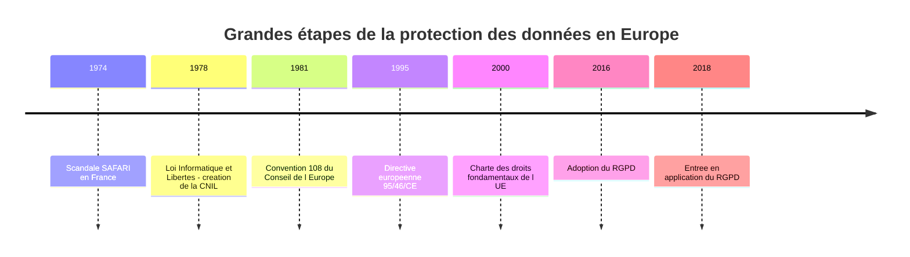
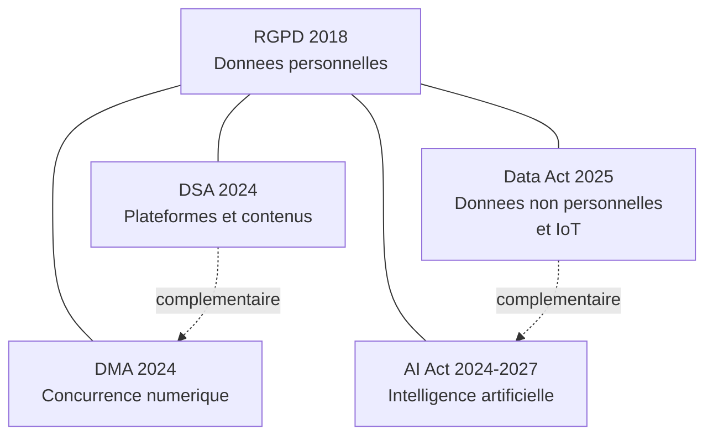

# Histoire et évolution de la protection des données

## Introduction

Saviez-vous que le premier texte français de protection des données
personnelles est plus ancien que le World Wide Web, plus ancien que
Windows, et même plus ancien que la plupart des entreprises de la tech
actuelles ? La protection des données n'est pas née avec Internet. Elle
est née d'un scandale d'État, dans les années 1970, à une époque où les
ordinateurs occupaient des pièces entières et où le mot « cloud »
désignait encore un simple nuage dans le ciel.

Comprendre cette histoire, ce n'est pas faire un cours d'histoire pour
faire joli. C'est saisir la logique profonde du RGPD : pourquoi il est
si protecteur, pourquoi il accorde tant d'importance à la finalité d'un
traitement, pourquoi il sanctionne aussi durement. Cette partie vous
emmène des cartes perforées des années 1970 jusqu'aux dernières
régulations du paquet numérique européen, en passant par le moment-clé
du 25 mai 2018.

### Des fichiers manuels au scandale SAFARI

Imaginez la France de 1974. Les ordinateurs centraux remplissent des
salles climatisées, leurs disques durs pèsent plusieurs kilos et
stockent quelques mégaoctets seulement. Pourtant, le gouvernement
français lance un projet ambitieux : interconnecter tous les fichiers
administratifs grâce à un identifiant unique, le numéro de sécurité
sociale. Le projet s'appelle SAFARI, pour « Système Automatisé pour les
Fichiers Administratifs et le Répertoire des Individus ». Ce que peu
de citoyens savent, c'est que SAFARI permettrait à l'administration de
croiser instantanément des informations sur la santé, la fiscalité,
l'emploi, et même les opinions politiques de chaque Français.

Le 21 mars 1974, le journal *Le Monde* publie un article au titre
saisissant : « SAFARI ou la chasse aux Français ». L'émoi est
considérable. Le gouvernement recule. Une commission est créée. Quatre
ans plus tard, le 6 janvier 1978, la loi Informatique et Libertés est
promulguée. Elle crée la CNIL, première autorité de protection des
données au monde, et pose un principe simple mais révolutionnaire :
*l'informatique doit être au service de chaque citoyen, et ne peut
porter atteinte ni à l'identité humaine, ni aux droits de l'homme, ni à
la vie privée, ni aux libertés individuelles et publiques.*

Cette phrase, encore présente à l'article 1er de la loi actuelle,
constitue le socle philosophique de toute la protection des données
européenne. Le RGPD en est l'héritier direct. Au cours des décennies
suivantes, d'autres textes viendront enrichir l'édifice : la
Convention 108 du Conseil de l'Europe en 1981 (premier traité
international en la matière), la directive européenne 95/46/CE en 1995
(qui harmonise partiellement les législations des États membres), puis
enfin le RGPD en 2016, applicable à partir de 2018.

L'apport décisif du RGPD par rapport à la directive de 1995 tient en
trois points : il est directement applicable dans tous les États
membres (un règlement, contrairement à une directive, n'a pas besoin
d'être transposé), il harmonise réellement les règles à l'échelle
européenne, et surtout il introduit des sanctions financières
proportionnées au chiffre d'affaires mondial. Une amende potentielle de
4 % du chiffre d'affaires d'un géant comme Google ou Meta change
radicalement la donne par rapport aux amendes plafonnées à quelques
centaines de milliers d'euros qui existaient auparavant.

#### Exemple pratique {id="exemple-pratique-1-1"}

Comparons concrètement les trois grands textes français et européens
qui se sont succédé. Cette comparaison vous aidera à comprendre
pourquoi, lorsque vous parlez RGPD avec un client, certains réflexes
anciens persistent parfois (« il faut faire une déclaration à la CNIL »
par exemple, qui n'est plus la règle depuis 2018).

| Critère | Loi 78 (avant 2018) | Directive 95/46 | RGPD (depuis 2018) |
|---------|--------------------|-----------------| -------------------|
| Portée  | France uniquement  | UE, transposée  | UE, directement    |
| Logique | Déclarative        | Déclarative     | Responsabilisante  |
| Sanctions max | 150 000 €    | Variables       | 20 M€ ou 4 % CA    |
| Préalable | Déclaration CNIL | Déclaration     | Aucune en général  |
| Acteur clé | CNIL            | CNIL nationales | CNIL + CEPD + DPO  |

Le passage d'une logique déclarative (« j'informe l'autorité, elle me
dit oui ou non ») à une logique de responsabilisation
(*accountability*) est sans doute le changement culturel le plus
important pour les développeurs. Aujourd'hui, vous n'avez plus besoin
de demander l'autorisation pour la plupart des traitements, mais vous
devez être en mesure de prouver à tout moment que vous respectez les
règles.

#### Exercice 1

Une responsable juridique d'une PME vous dit : « Pour notre nouvelle
application, on va faire une déclaration à la CNIL comme on faisait
avant, ce sera plus tranquille. » En vous appuyant sur ce que vous
venez de lire, formulez en quelques phrases une réponse pédagogique
expliquant pourquoi cette démarche n'est plus pertinente et ce qu'il
convient désormais de faire à la place.

##### Correction exercice 1 {collapsible="true"}

Vous pouvez répondre en trois temps :

1. **Rappel du changement de logique** : depuis le 25 mai 2018, le RGPD
   a remplacé le régime déclaratif par un régime de responsabilisation.
   Sauf cas très particuliers (autorisations préalables pour certaines
   données de santé par exemple), il n'y a plus de déclaration générale
   à effectuer auprès de la CNIL.

2. **Présentation des nouvelles obligations** : à la place, le
   responsable de traitement doit tenir un registre des activités de
   traitement (article 30 du RGPD), évaluer le besoin d'une AIPD pour
   les traitements à risque élevé, et être capable de démontrer sa
   conformité à tout moment.

3. **Conclusion rassurante** : cette nouvelle logique est en réalité
   plus souple, car elle n'implique pas d'attente d'autorisation, mais
   elle exige une documentation rigoureuse et continue. Le rôle de la
   CNIL devient davantage un rôle de contrôle a posteriori et de
   conseil que d'autorisation préalable.

### L'écosystème normatif post-RGPD

Le RGPD n'est pas un texte isolé. Depuis 2018, l'Union européenne a
poursuivi sa stratégie de régulation du numérique avec une intensité
remarquable. Plusieurs règlements complémentaires sont entrés en
vigueur ou sont en cours d'application, formant ce qu'on appelle
parfois le *paquet numérique européen*. En tant que développeur, vous
devez au moins en connaître l'existence et les périmètres respectifs.

Le **Digital Services Act** (DSA), entré pleinement en application en
février 2024, encadre les obligations des plateformes en ligne en
matière de modération des contenus, de transparence des algorithmes,
et de lutte contre la désinformation. Il ne remplace pas le RGPD : il
le complète sur le volet des contenus illicites et des services
intermédiaires.

Le **Digital Markets Act** (DMA), applicable depuis mars 2024, cible
les très grands acteurs du numérique qualifiés de « gatekeepers » et
leur impose des obligations spécifiques pour favoriser la concurrence
et l'interopérabilité. Il interagit fortement avec le RGPD sur les
questions de portabilité et de combinaison de données entre services.

Le **Data Act**, applicable à partir de septembre 2025, organise le
partage et l'accès aux données générées par les objets connectés et
les services associés, qu'elles soient personnelles ou non. Il
complète le RGPD côté Internet des objets et économie de la donnée.

Le **règlement sur l'intelligence artificielle** (AI Act), adopté en
2024, introduit une classification des systèmes d'IA par niveau de
risque et impose des obligations renforcées pour les systèmes à haut
risque, particulièrement lorsqu'ils traitent des données personnelles.
Sa mise en application est progressive jusqu'en 2027.

> **Note** : ces textes se cumulent, ils ne se remplacent pas. Une
> plateforme sociale française devra respecter à la fois le RGPD pour
> les données de ses utilisateurs, le DSA pour la modération, et
> potentiellement le DMA si elle atteint un certain seuil. Le travail
> de conformité devient ainsi pluridisciplinaire.

#### Exemple pratique {id="exemple-pratique-1-2"}

Prenons une application fictive : *FitCoach*, une app mobile qui
propose un coach sportif basé sur l'IA, recueille des données de
géolocalisation et de santé, propose un fil d'actualité avec
recommandations entre utilisateurs, et intègre une boutique en ligne
pour vendre des programmes premium. Voici comment chaque règlement
s'applique :

- **RGPD** : intégralité du traitement des données utilisateurs
  (inscription, profil, géolocalisation, santé, paiement).
- **DSA** : si le fil d'actualité permet aux utilisateurs de publier
  du contenu, des obligations de modération s'appliquent.
- **AI Act** : le coach IA, s'il propose des recommandations
  personnalisées de santé, peut être classé comme système à risque
  élevé et soumis à des obligations spécifiques.
- **Data Act** : si l'application se connecte à des objets connectés
  (montres, capteurs), des obligations d'accès et de portabilité des
  données générées par ces objets s'ajoutent.

#### Exercice 2

Pour chacun des scénarios suivants, indiquez quel(s) texte(s)
européen(s) pourraient s'appliquer en plus du RGPD : (a) un site de
petites annonces entre particuliers, (b) un service de streaming
musical doté d'un algorithme de recommandation, (c) une trottinette
électrique connectée à une application mobile, (d) un robot
conversationnel d'aide médicale en ligne.

##### Correction exercice 2 {collapsible="true"}

(a) **Site de petites annonces** : le DSA s'applique en plus du RGPD,
car le site héberge des contenus produits par ses utilisateurs et joue
un rôle d'intermédiaire. Si le service atteint un certain seuil
d'utilisateurs en Europe, des obligations supplémentaires s'ajoutent.

(b) **Service de streaming musical** : le RGPD pour les données des
abonnés, le DMA si le service appartient à un gatekeeper, l'AI Act
potentiellement pour l'algorithme de recommandation (généralement à
risque limité, donc peu d'obligations renforcées).

(c) **Trottinette électrique connectée** : le RGPD pour les données
utilisateur et de géolocalisation, le Data Act pour l'accès aux
données générées par l'objet connecté lui-même (statistiques d'usage,
diagnostic, etc.).

(d) **Robot conversationnel d'aide médicale** : le RGPD avec un
régime renforcé en raison des données de santé (article 9), l'AI Act
avec une classification probable en système à haut risque puisqu'il
intervient dans le domaine de la santé.

## Exercice final

Vous êtes développeur dans une jeune entreprise française qui projette
de lancer une plateforme de cours en ligne avec correcteur automatique
basé sur l'intelligence artificielle. Lors d'une réunion stratégique,
le directeur déclare : « Le RGPD c'est dépassé, il y a tellement de
nouveaux textes maintenant qu'on s'en passera bien. » Préparez une
intervention argumentée de quelques paragraphes pour expliquer (a) le
positionnement historique et fondamental du RGPD, (b) son articulation
avec les textes plus récents, et (c) pourquoi sa connaissance reste
indispensable y compris pour les développeurs qui travaillent sur des
projets intégrant de l'intelligence artificielle.

### Correction exercice final {collapsible="true"}

Votre intervention pourrait s'articuler ainsi :

**(a) Positionnement historique et fondamental**

Le RGPD est l'aboutissement de plus de quarante années de construction
juridique européenne sur la protection des données. Né de l'esprit de
la loi française Informatique et Libertés de 1978 et de la Convention
108 du Conseil de l'Europe de 1981, il a remplacé la directive
européenne de 1995 pour harmoniser réellement les règles à l'échelle
européenne. Il a transformé le rapport entre les organisations et la
protection des données : du régime déclaratif vers la
responsabilisation. C'est le socle juridique sur lequel reposent
toutes les autres régulations numériques européennes.

**(b) Articulation avec les textes récents**

Loin d'être dépassé, le RGPD est expressément cité comme référence
dans la plupart des règlements récents. Le DSA, le DMA, le Data Act et
l'AI Act ne se substituent pas au RGPD : ils le complètent sur des
volets spécifiques. Quand un traitement de données personnelles est en
jeu (et c'est le cas dès qu'on identifie un utilisateur, qu'on suit
son comportement ou qu'on traite une adresse IP), c'est le RGPD qui
s'applique en premier lieu. L'AI Act, par exemple, prévoit
explicitement que ses obligations s'ajoutent à celles du RGPD lorsque
le système d'IA traite des données personnelles.

**(c) Pertinence pour notre projet d'IA**

Notre plateforme va manipuler des données personnelles des apprenants
(identité, parcours, productions écrites). Le correcteur automatique,
en tant que système d'IA appliqué à l'éducation, est qualifié de
système à haut risque par l'AI Act, ce qui impose des obligations
supplémentaires. Mais le cœur du sujet, c'est le respect du RGPD :
base légale, information, minimisation, sécurité, conservation. Sans
maîtrise du RGPD, nous nous exposons à des amendes pouvant atteindre
4 % de notre chiffre d'affaires mondial, soit potentiellement des
millions d'euros pour une entreprise qui réussit. Maîtriser le RGPD,
ce n'est donc pas un frein à l'innovation : c'est la condition même
de la viabilité commerciale et juridique de notre projet.

## Conclusion de la partie

Vous comprenez désormais que le RGPD n'est pas tombé du ciel en 2018 :
il est l'aboutissement de quarante ans de construction juridique
européenne, née d'un scandale d'État français et structurée autour
d'une idée simple, que l'informatique doit servir l'humain et non
l'inverse. Vous avez également découvert que le RGPD s'inscrit dans
un écosystème normatif plus large, le paquet numérique européen, où
chaque règlement traite d'une facette spécifique du numérique tout en
s'appuyant sur le socle commun du RGPD.

Cette mise en perspective historique vous sera utile à chaque fois
qu'on vous demandera de justifier une décision technique au regard du
droit : vous saurez expliquer non seulement ce que dit la règle, mais
aussi pourquoi elle dit cela et d'où elle vient. C'est cette
profondeur de compréhension qui distingue un développeur conscient
d'un simple exécutant.
