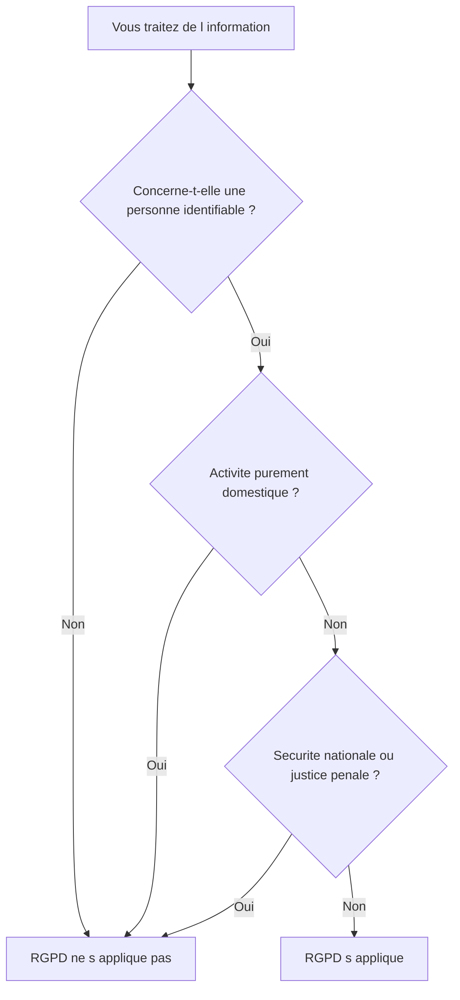
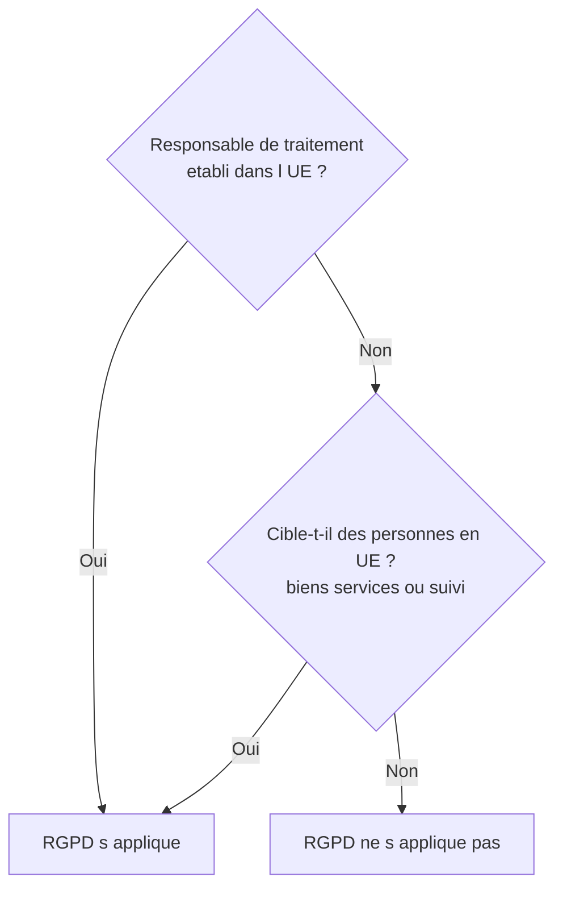
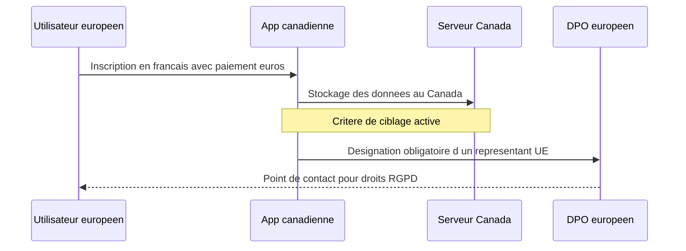

# Champ d'application du RGPD

## Introduction

Si votre client vous demande de développer une application mobile pour
une boulangerie de quartier qui ne fait que vendre du pain en
boutique, le RGPD s'applique-t-il ? Et si votre future startup
française vise exclusivement le marché japonais, en est-elle exemptée ?
Et si vous-même tenez un blog personnel sur lequel les visiteurs
peuvent laisser des commentaires ?

Ces questions paraissent simples à première vue, mais leurs réponses
sont essentielles pour tout projet d'application. Avant même de parler
de bases légales, de droits, ou de sécurité, il faut savoir si le
texte s'applique à votre situation. C'est ce qu'on appelle le *champ
d'application* du RGPD, et il comporte deux dimensions : matériel
(quel type d'activité) et territorial (où). Cette partie vous donne
les clés pour répondre vite et juste à ces questions, qui reviendront
dans presque tous vos projets professionnels.

### Le champ d'application matériel

À quoi pensez-vous quand on dit « données personnelles » ? Sans doute
à votre nom, votre adresse email, votre numéro de téléphone. Mais
saviez-vous que la couleur de vos chaussures, l'heure à laquelle vous
prenez votre café, ou la signature de votre clavier mécanique peuvent
aussi, dans certains contextes, être des données personnelles ? Le
champ d'application matériel du RGPD est étonnamment large, et c'est
souvent là que se nichent les pièges les plus subtils.

L'article 2 du RGPD précise que le règlement s'applique aux
traitements de données à caractère personnel, automatisés en tout ou
partie, ou non automatisés mais contenus dans un fichier structuré.
Cette définition recouvre la quasi-totalité des activités qu'un
développeur peut imaginer : application mobile, site web, logiciel
métier, API, base de données, fichier Excel partagé, et même
l'annuaire papier d'une association à condition qu'il soit structuré.

Quelques exclusions existent toutefois et méritent d'être connues.
Sont exclues du champ matériel du RGPD :

- les activités de la vie purement personnelle ou domestique (votre
  carnet d'adresses privé sur votre téléphone, par exemple) ;
- les activités relatives à la sécurité nationale et à la défense ;
- les traitements effectués dans le cadre de la coopération policière
  et judiciaire en matière pénale (qui relèvent d'une directive
  séparée, dite « directive police-justice ») ;
- les traitements de données concernant des personnes décédées,
  même si certains droits sont prévus par la loi française Informatique
  et Libertés.

Attention : la frontière de l'activité « personnelle ou domestique »
est plus étroite qu'on ne le croit. Si vous publiez sur un réseau
social ouvert au public, ce n'est plus une activité domestique. Si
votre carnet d'adresses est exposé à travers une API publique, idem.



Il faut aussi distinguer deux notions très proches mais juridiquement
différentes : la **pseudonymisation** et l'**anonymisation**. Une
donnée pseudonymisée (par exemple un identifiant remplacé par un
token) reste une donnée personnelle au sens du RGPD, parce qu'on
pourrait, avec une clé de correspondance ou des moyens raisonnables,
remonter à la personne. À l'inverse, une donnée véritablement
anonymisée (par exemple des statistiques agrégées sans possibilité de
ré-identification) sort du champ du RGPD. C'est une distinction
cruciale, car elle conditionne beaucoup de choix techniques :
hashage simple ne suffit pas à anonymiser, parce que c'est réversible
par dictionnaire ou par force brute.

#### Exemple pratique {id="exemple-pratique-2-1"}

Une équipe de data analystes vous demande de leur fournir un export
des données utilisateurs pour faire des statistiques de fréquentation.
Elle vous dit : « Pas besoin de RGPD, on va anonymiser ». Voici
plusieurs niveaux possibles d'export, du plus risqué au plus sûr :

```sql
-- Niveau 1 : pseudonymisation legere (RGPD s applique)
-- L identifiant et le mail sont remplaces par un hash
SELECT
    MD5(email) AS user_hash,
    age,
    city,
    last_login
FROM users;

-- Niveau 2 : pseudonymisation renforcee (RGPD s applique toujours)
-- Hash sale, age regroupe en tranches, ville generalisee
SELECT
    MD5(CONCAT(email, 'secret_salt')) AS user_hash,
    CASE
        WHEN age < 25 THEN '18-24'
        WHEN age < 35 THEN '25-34'
        ELSE '35+'
    END AS age_range,
    LEFT(postal_code, 2) AS department
FROM users;

-- Niveau 3 : anonymisation par agregation (sort du RGPD)
-- Seuls des indicateurs globaux sont fournis
SELECT
    department,
    age_range,
    COUNT(*) AS user_count
FROM (
    SELECT
        LEFT(postal_code, 2) AS department,
        CASE
            WHEN age < 25 THEN '18-24'
            WHEN age < 35 THEN '25-34'
            ELSE '35+'
        END AS age_range
    FROM users
) sub
GROUP BY department, age_range
HAVING COUNT(*) >= 10;
```

> **Note** : seul le niveau 3, agrégé avec un seuil minimal
> (`HAVING COUNT(*) >= 10`) pour empêcher l'identification de petits
> groupes, peut prétendre à l'anonymisation. Les niveaux 1 et 2,
> malgré le hash, restent dans le champ du RGPD.

#### Exercice 1

Pour chacun des cas suivants, déterminez si le RGPD s'applique et
justifiez en une ou deux phrases :

a) Un fichier Excel sur votre poste personnel listant les anniversaires
de vos cousins.
b) Le même fichier, partagé sur le Drive d'entreprise.
c) Un log applicatif qui enregistre les adresses IP de connexion.
d) Une table de statistiques agrégées indiquant « 1 245 visiteurs ce
mois ».
e) Un annuaire papier ordonné alphabétiquement, conservé dans un
classeur dans le bureau du chef.

##### Correction exercice 1 {collapsible="true"}

a) **Non applicable** : activité purement domestique au sens de
l'article 2 du RGPD. Votre carnet personnel reste dans la sphère
privée.

b) **Applicable** : dès lors que le fichier est partagé dans un
contexte professionnel, on sort de la sphère domestique. Les données
des cousins deviennent traitées dans un cadre qui engage l'entreprise.

c) **Applicable** : une adresse IP est considérée comme une donnée
personnelle dès lors qu'elle peut être rattachée à une personne, ce
qui est le cas dans un log applicatif. Cette qualification a été
confirmée par la Cour de justice de l'Union européenne en 2016.

d) **Non applicable** : il s'agit de données véritablement agrégées
sans possibilité de ré-identification, donc anonymes au sens du RGPD,
à condition que l'échantillon soit suffisamment large pour empêcher
toute ré-identification indirecte.

e) **Applicable** : l'article 2 du RGPD couvre aussi les fichiers non
automatisés à condition qu'ils soient structurés. Un annuaire papier
ordonné alphabétiquement satisfait à cette condition.

### Le champ d'application territorial

Vous lancez une startup à Paris, vos serveurs sont à Francfort, vos
utilisateurs sont en majorité au Brésil et au Canada, et votre équipe
technique est répartie entre la France, le Portugal et l'Inde. Le
RGPD s'applique-t-il ? Et si oui, à qui ? Cette question, banale dans
le contexte de la mondialisation numérique, illustre la complexité
nouvelle du champ d'application territorial introduit par le RGPD.

L'article 3 prévoit deux critères principaux : le critère de
l'**établissement** et le critère du **ciblage**.

Le critère de l'établissement signifie que le RGPD s'applique aux
traitements effectués dans le cadre des activités d'un établissement
d'un responsable de traitement ou d'un sous-traitant sur le territoire
de l'Union européenne, peu importe que le traitement lui-même ait
lieu en Europe ou non. Un bureau, une filiale, une activité
économique stable suffisent à constituer un établissement. Concrètement,
votre startup parisienne, même si elle héberge sur le cloud
américain, est soumise au RGPD pour tous ses traitements.

Le critère du ciblage, plus innovant, étend le RGPD aux organisations
non européennes qui visent expressément des personnes situées sur le
territoire de l'Union européenne, soit en leur proposant des biens et
services, soit en suivant leur comportement. C'est ce critère qui
soumet au RGPD les géants américains, asiatiques ou ailleurs dès lors
qu'ils ont des utilisateurs en Europe.



Comment savoir si une organisation non européenne « cible » des
personnes dans l'UE ? Plusieurs indices, énoncés par le considérant 23
du RGPD et précisés par les lignes directrices du CEPD : utilisation
de la langue ou de la monnaie d'un État membre, livraison possible
dans l'UE, mention explicite d'utilisateurs européens dans la
communication, référencement payant ciblant l'Europe, etc. Le simple
fait qu'un site américain en anglais soit accessible depuis la France
ne suffit pas. En revanche, si le site est traduit en français,
propose des paiements en euros et fait de la publicité en France, il
cible bel et bien des Européens.

#### Exemple pratique {id="exemple-pratique-2-2"}

Imaginons un schéma de décision pour qualifier une situation
typique : une startup canadienne propose une application de yoga en
ligne. Elle est accessible dans le monde entier. Sa version française
permet de payer en euros et propose des cours adaptés au fuseau
horaire européen.



Cette startup canadienne, bien qu'établie hors UE, est soumise au
RGPD pour tous ses utilisateurs européens. Elle doit notamment :

- désigner un représentant établi dans l'Union européenne
  (article 27 du RGPD) ;
- respecter tous les droits des personnes (information, accès,
  effacement, etc.) ;
- répondre à la CNIL ou à toute autre autorité de contrôle
  européenne compétente en cas de plainte.

#### Exercice 2

Pour chacune de ces situations, indiquez si le RGPD s'applique et sur
quel fondement (établissement ou ciblage) :

a) Une PME française fabrique des tartes salées et tient un fichier
clients exclusivement en France.
b) Une entreprise japonaise vend des accessoires de cosplay sur un
site uniquement en japonais, mais ses produits sont expédiés
mondialement.
c) Une startup américaine propose une plateforme SaaS en anglais avec
prix en dollars, accessible dans le monde.
d) Une entreprise marocaine propose un site en français avec paiement
en euros et livraison gratuite dans toute l'UE.
e) Le bureau parisien d'une multinationale chinoise traite les CV des
candidats locaux.

##### Correction exercice 2 {collapsible="true"}

a) **RGPD applicable** au titre de l'établissement (entreprise
française, donc UE). Le critère est rempli même sans clientèle
internationale.

b) **RGPD non applicable** par défaut. Le site en japonais
exclusivement, sans signaux de ciblage de l'UE, n'entre pas dans le
critère du ciblage. Le simple fait d'expédier mondialement ne suffit
pas si rien n'indique l'intention de viser des Européens.

c) **Situation grise**. Si le site est purement en anglais avec
tarification en dollars et qu'il n'y a pas d'autre signal de ciblage
de l'UE (publicité, support en langues européennes, mentions
d'utilisateurs européens), le RGPD pourrait ne pas s'appliquer. Mais
en pratique, dès que la base utilisateurs comprend des Européens
identifiés et marketés, le RGPD s'applique au titre du ciblage.

d) **RGPD applicable** au titre du ciblage. Tous les indices
caractéristiques sont réunis : langue d'un État membre, monnaie
européenne, livraison dans l'UE. L'entreprise marocaine doit désigner
un représentant en UE.

e) **RGPD applicable** au titre de l'établissement. Le bureau
parisien constitue un établissement stable sur le territoire de l'UE,
peu importe la nationalité du groupe.

## Exercice final

Votre client *NomadicMind*, une startup américaine basée à San
Francisco, vous a missionné pour développer son application de
méditation. L'application est traduite en français, allemand,
espagnol, italien et néerlandais. Les utilisateurs européens peuvent
payer en euros et sont géolocalisés pour leur proposer des séances
adaptées à leur fuseau horaire. Les serveurs sont hébergés aux
États-Unis. L'équipe technique est répartie entre San Francisco et
Lisbonne, où *NomadicMind* a ouvert un bureau de cinq développeurs.
Votre tâche : rédiger une note synthétique d'une vingtaine de lignes
à destination du CEO américain, lui expliquant si le RGPD s'applique
à *NomadicMind*, à quel titre, et quelles sont les principales
conséquences pratiques pour l'organisation.

### Correction exercice final {collapsible="true"}

Voici une proposition de note de synthèse :

---

**À l'attention du CEO de NomadicMind**
**Objet : Applicabilité du RGPD à notre activité européenne**

Cher CEO,

L'analyse de la situation de NomadicMind au regard du RGPD conduit à
deux conclusions concordantes qui rendent l'application du règlement
incontournable pour notre activité.

**Premièrement, au titre de l'établissement (article 3.1)** : notre
bureau de Lisbonne, où sont employés cinq développeurs sous contrat
local, constitue un établissement stable sur le territoire de l'Union
européenne. À ce titre, toute activité de traitement effectuée dans
le cadre des activités de cet établissement est soumise au RGPD, y
compris lorsque les serveurs physiques sont aux États-Unis.

**Deuxièmement, au titre du ciblage (article 3.2)** : indépendamment
de l'établissement portugais, notre application présente tous les
indices caractéristiques d'un ciblage actif des utilisateurs européens.
La traduction dans cinq langues d'États membres, le paiement en
euros, la géolocalisation et l'adaptation au fuseau horaire européen
constituent des éléments concordants d'intention de proposer des
services à des personnes situées dans l'Union européenne.

**Conséquences pratiques principales** :

1. Désignation d'un délégué à la protection des données (DPO) si nos
traitements remplissent les critères d'obligation, ce qui est
probable compte tenu de la nature des données traitées (santé,
géolocalisation, profilage).
2. Mise en conformité de l'ensemble du parcours utilisateur :
information préalable, consentement, droits des personnes
(accès, rectification, effacement, portabilité), durées de
conservation.
3. Encadrement contractuel des transferts de données entre Lisbonne et
nos serveurs américains, en s'appuyant sur les clauses contractuelles
types ou le *Data Privacy Framework*.
4. Tenue d'un registre des activités de traitement, et réalisation
d'une analyse d'impact (AIPD) si la nature des données traitées le
justifie.
5. Préparation à répondre, dans les délais légaux, à toute demande
d'utilisateur européen ou à toute autorité de contrôle (CNIL en
France, CNPD au Portugal, etc.).

L'amende encourue en cas de non-conformité pouvant atteindre 4 % du
chiffre d'affaires mondial annuel, l'investissement en conformité
représente un enjeu stratégique majeur.

---

Cette note remplit son objectif en restant accessible à un dirigeant
non juriste, en hiérarchisant les fondements légaux et en pointant
les actions concrètes à engager.

## Conclusion de la partie

Vous savez maintenant que le RGPD s'applique très largement à toute
activité économique, dès lors qu'elle implique des données
personnelles et qu'elle a un lien avec l'Union européenne. Le champ
d'application matériel couvre quasiment toutes les activités d'un
développeur, à quelques exceptions très précises. Le champ
d'application territorial repose sur deux critères, l'établissement
et le ciblage, qui rendent le RGPD applicable à de nombreuses
organisations extra-européennes.

Cette compétence d'identification est la première à mobiliser sur
tout nouveau projet. Avant de réfléchir à l'architecture, aux
bibliothèques ou aux frameworks, posez-vous toujours la question :
« Le RGPD s'applique-t-il ici, et à qui ? ». La réponse conditionne
toute la suite, et elle est souvent moins évidente qu'il n'y paraît.
