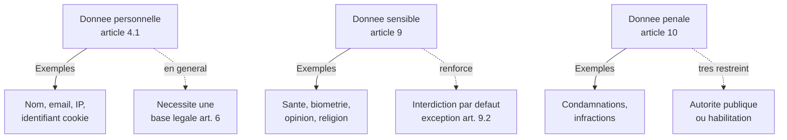
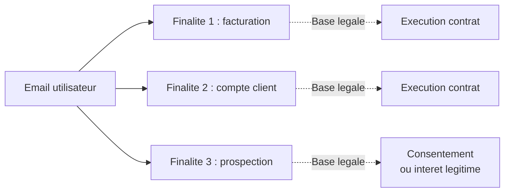
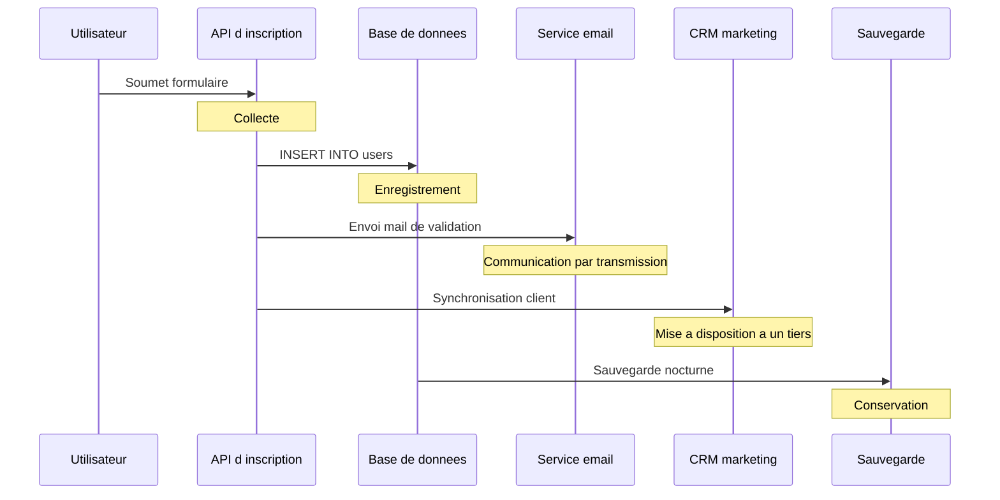
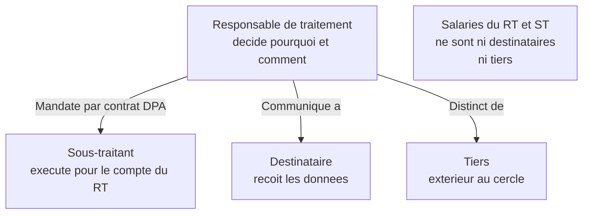
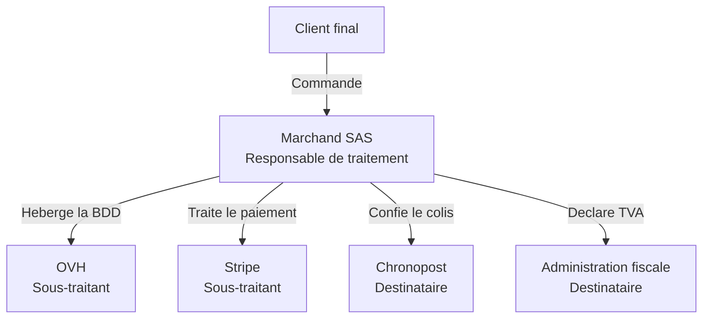
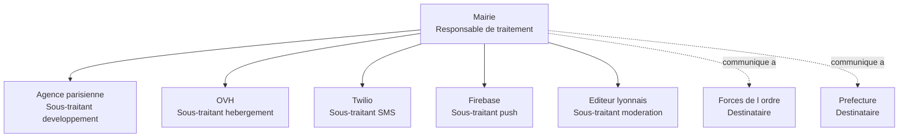

# Vocabulaire et définitions clés du RGPD

## Introduction

Avez-vous déjà eu la sensation, en entrant dans un nouveau métier, de
ne pas comprendre la moitié de ce que disent vos collègues ? Quand on
parle de « responsable de traitement », de « finalité » ou de
« destinataire », on a parfois l'impression que les juristes ont
inventé un dialecte exprès pour qu'on ne s'y retrouve pas. Pourtant,
ces mots ne sont pas du jargon gratuit : chacun désigne un concept
précis, juridiquement défini à l'article 4 du RGPD, et essentiel pour
raisonner correctement sur la conformité d'une application.

Cette partie est un mini-dictionnaire pratique du RGPD pour
développeurs. Maîtriser ce vocabulaire, c'est gagner en crédibilité
auprès des juristes, des DPO et des clients, mais aussi et surtout
développer une grille de lecture mentale qui transforme la façon de
concevoir les applications. Vous verrez : une fois ces notions
intégrées, vous repérerez instantanément les zones à risque dans une
architecture.

### La donnée personnelle et la donnée sensible

Quelle différence faites-vous entre votre adresse mail et votre groupe
sanguin ? Intuitivement, on sent bien que la divulgation publique de
l'un et de l'autre n'a pas les mêmes conséquences. Le RGPD formalise
cette intuition à travers deux concepts distincts mais articulés : la
donnée à caractère personnel, qui constitue le périmètre général du
règlement, et la donnée sensible, qui bénéficie d'une protection
renforcée.

L'article 4.1 définit la **donnée à caractère personnel** comme toute
information se rapportant à une personne physique identifiée ou
identifiable. Une personne est identifiable lorsqu'elle peut être
identifiée, directement ou indirectement, notamment par référence à un
identifiant, tel qu'un nom, un numéro d'identification, des données de
localisation, un identifiant en ligne, ou un ou plusieurs éléments
spécifiques propres à son identité physique, physiologique, génétique,
psychique, économique, culturelle ou sociale.

Cette définition est intentionnellement très large. Elle couvre
évidemment les données usuelles (nom, prénom, mail, téléphone), mais
aussi des données moins évidentes : adresse IP, identifiant
publicitaire, cookie, voix, photographie, plaque d'immatriculation,
empreinte digitale, ADN, mais également des combinaisons qui, prises
séparément, ne suffiraient pas à identifier une personne. Par exemple,
« femme, 38 ans, vit à Cergy, travaille dans la sécurité informatique
chez l'éditeur X » peut très bien constituer une donnée personnelle
même sans nom, dès lors qu'on peut, par recoupement, remonter à une
personne unique.

L'article 9 définit ensuite une catégorie spéciale : les **données
sensibles**, dont le traitement est en principe interdit, sauf cas
exceptionnels. Cette catégorie regroupe :

- l'origine raciale ou ethnique ;
- les opinions politiques ;
- les convictions religieuses ou philosophiques ;
- l'appartenance syndicale ;
- les données génétiques et biométriques d'identification unique ;
- les données de santé ;
- les données concernant la vie ou l'orientation sexuelle.

À ces données s'ajoutent les **données pénales** (article 10), dont
le traitement est strictement encadré : condamnations, mesures de
sûreté, infractions.



#### Exemple pratique {id="exemple-pratique-3-1"}

Voici un schéma de données typique pour une application de santé
connectée. Notons précisément ce qui relève de chaque catégorie :

```sql
-- Base de donnees d une app de suivi medical
CREATE TABLE patients (
    -- Donnees personnelles classiques (article 4.1)
    id              BIGINT PRIMARY KEY,
    email           VARCHAR(255) NOT NULL UNIQUE,
    last_name       VARCHAR(100) NOT NULL,
    first_name      VARCHAR(100) NOT NULL,
    date_of_birth   DATE NOT NULL,
    phone           VARCHAR(20),

    -- Donnees sensibles - sante (article 9)
    blood_type      VARCHAR(3),
    allergies       TEXT,
    chronic_conditions TEXT,

    -- Donnees sensibles - biometrie (article 9)
    fingerprint_hash VARCHAR(255),

    -- Donnees personnelles techniques
    -- (sensibles si elles revelent un comportement intime)
    last_ip_address VARCHAR(45),
    last_login_at   TIMESTAMP,

    -- Metadonnees
    created_at      TIMESTAMP NOT NULL DEFAULT CURRENT_TIMESTAMP,
    updated_at      TIMESTAMP NOT NULL DEFAULT CURRENT_TIMESTAMP
);
```

Dans cette table, les colonnes `blood_type`, `allergies`,
`chronic_conditions` et `fingerprint_hash` relèvent des données
sensibles. Le traitement n'est licite que dans des cas précis prévus
par l'article 9.2 : consentement explicite du patient, médecine
préventive ou diagnostic, intérêt public dans le domaine de la santé
publique, etc. Concrètement, conserver ces données impose des mesures
techniques renforcées : chiffrement, séparation de la base, journaux
d'accès détaillés, contrôle d'accès strict.

#### Exercice 1

Pour chacune des informations suivantes, indiquez s'il s'agit d'une
donnée personnelle, d'une donnée sensible, d'une donnée pénale, ou
d'une donnée non personnelle :

a) Le nom de votre boulangerie préférée
b) Votre adresse IP
c) Votre orientation sexuelle
d) La marque de votre voiture
e) Votre numéro de plaque d'immatriculation
f) Votre numéro de sécurité sociale
g) Une amende de stationnement à votre nom
h) La consommation électrique annuelle moyenne en France

##### Correction exercice 1 {collapsible="true"}

a) **Non personnelle** : il s'agit du nom d'un établissement
commercial, sauf s'il révèle l'identité d'une personne (boulangerie
familiale au nom du gérant, par exemple).

b) **Personnelle** : l'adresse IP a été reconnue comme donnée
personnelle par la jurisprudence européenne dès lors qu'elle peut
permettre, directement ou indirectement, l'identification d'une
personne. C'est presque toujours le cas dans un contexte applicatif.

c) **Sensible** : l'article 9 vise explicitement l'orientation
sexuelle. Le traitement est interdit sauf cas dérogatoires.

d) **Personnelle ou non, selon le contexte** : la marque seule est
non personnelle, mais associée à un propriétaire identifié ou
identifiable, elle devient personnelle.

e) **Personnelle** : la plaque d'immatriculation permet, par
recoupement avec le SIV, d'identifier le propriétaire du véhicule.

f) **Personnelle** : le numéro de sécurité sociale est en France un
identifiant national qui appelle une vigilance particulière (cadre
spécifique loi Informatique et Libertés). Il n'est cependant pas
sensible au sens de l'article 9.

g) **Pénale** : une contravention relève des infractions au sens de
l'article 10, dont le traitement est strictement encadré.

h) **Non personnelle** : il s'agit d'une statistique agrégée qui ne
permet d'identifier personne.

### Le traitement de données

Quand vous écrivez `SELECT * FROM users WHERE city = 'Paris'` pour
votre client, faites-vous un « traitement de données » ? La réponse
peut paraître évidente, mais ce mot recouvre en réalité un éventail
bien plus large que ce qu'on imagine. Le RGPD considère qu'une simple
consultation, voire un stockage passif, est déjà un traitement.
Comprendre cette définition est essentiel pour ne pas négliger des
opérations apparemment anodines.

L'article 4.2 définit le **traitement** comme toute opération ou tout
ensemble d'opérations effectuées sur des données à caractère
personnel, qu'il soit ou non automatisé. Le règlement énumère ensuite,
à titre d'exemples non limitatifs : la collecte, l'enregistrement,
l'organisation, la structuration, la conservation, l'adaptation ou la
modification, l'extraction, la consultation, l'utilisation, la
communication par transmission, la diffusion ou toute autre forme de
mise à disposition, le rapprochement ou l'interconnexion, la
limitation, l'effacement, ou la destruction.

Concrètement, cela signifie que pratiquement toute action effectuée
sur une donnée personnelle est un traitement : ouvrir un fichier
clients, exporter une table, envoyer une newsletter, faire une
sauvegarde, supprimer un compte, lire un log applicatif, archiver
des données sur bande magnétique. Tout cela est juridiquement
encadré.

Chaque traitement doit avoir une **finalité** déterminée, explicite et
légitime. La finalité, c'est l'objectif poursuivi par le traitement.
Pour la même donnée (par exemple une adresse mail), plusieurs
finalités peuvent coexister : envoyer la facture, faire de la
prospection commerciale, gérer le compte utilisateur. Chacune de ces
finalités est juridiquement traitée séparément, avec sa propre base
légale et ses propres modalités.



#### Exemple pratique {id="exemple-pratique-3-2"}

Identifions les traitements impliqués par une simple inscription d'un
utilisateur sur une plateforme :



Une seule inscription utilisateur déclenche au moins cinq traitements
juridiquement distincts : collecte, enregistrement, transmission,
mise à disposition à un tiers (le CRM), conservation. Chacun doit
avoir une finalité claire, une base légale appropriée et des mesures
de sécurité adaptées. Ce simple exemple suffit à mesurer l'enjeu :
un projet d'application contient typiquement plusieurs dizaines de
traitements distincts.

#### Exercice 2

Pour le scénario suivant, identifiez tous les traitements juridiques
distincts impliqués et la finalité associée à chacun. Une boutique en
ligne reçoit une commande, envoie une confirmation par email, prépare
le colis, le confie à un transporteur, archive la facture pendant
dix ans, et utilise plus tard ces données pour relancer le client
l'année suivante.

##### Correction exercice 2 {collapsible="true"}

On peut identifier les traitements et finalités suivants :

1. **Collecte** des données de commande lors du panier (finalité :
   exécution du contrat de vente).
2. **Enregistrement** en base de la commande et des données client
   (finalité : gestion de la commande).
3. **Communication par transmission** d'un email de confirmation
   (finalité : information du client, exécution du contrat).
4. **Mise à disposition à un tiers** des coordonnées au transporteur
   (finalité : livraison).
5. **Conservation** de la facture en archivage (finalité : obligation
   légale comptable et fiscale, conservation dix ans).
6. **Utilisation ultérieure** à des fins de prospection (finalité :
   prospection commerciale, base légale distincte, généralement
   intérêt légitime ou consentement).

Notons que la dernière finalité est juridiquement la plus délicate :
elle ne peut pas se justifier par l'exécution du contrat initial,
puisqu'elle vient un an après. Elle exige une base légale propre, et
le client doit pouvoir s'y opposer facilement.

### Les rôles : responsable de traitement, sous-traitant, destinataire

Imaginez une cuisine de restaurant : il y a le chef qui décide du
menu, les commis qui exécutent les recettes, les fournisseurs qui
livrent les ingrédients, et les serveurs qui apportent les plats aux
clients. Tous touchent à la nourriture, mais leurs responsabilités
sont radicalement différentes. Il en va de même pour le traitement
des données personnelles : plusieurs acteurs interviennent, chacun
avec un rôle spécifique défini par le RGPD, et la qualification de
ces rôles conditionne les obligations et la responsabilité juridique
de chacun.

Le **responsable de traitement** (article 4.7) est la personne
physique ou morale, l'autorité publique, le service ou tout autre
organisme qui, seul ou conjointement avec d'autres, détermine les
finalités et les moyens du traitement. C'est lui qui décide pourquoi
et comment les données sont traitées. Dans une entreprise, c'est en
général la société elle-même (personne morale), pas son DSI ni son
développeur. Le responsable de traitement porte la responsabilité
juridique principale.

Le **sous-traitant** (article 4.8) est la personne physique ou morale,
l'autorité publique, le service ou tout autre organisme qui traite
des données pour le compte du responsable de traitement. Il agit sur
instruction écrite, ne détermine pas la finalité, et est lié au
responsable par un contrat spécifique appelé DPA (*Data Processing
Agreement*) qui formalise les obligations imposées par l'article 28.
Les hébergeurs cloud (AWS, OVH, Scaleway), les services SaaS
(Mailchimp pour les emails, Stripe pour les paiements) sont
typiquement des sous-traitants.

Le **destinataire** (article 4.9) est toute personne physique ou
morale, autorité publique, service ou autre organisme qui reçoit
communication de données à caractère personnel, qu'il s'agisse ou
non d'un tiers. Le destinataire est une notion plus large qui inclut
les sous-traitants, mais aussi des organismes auxquels les données
sont régulièrement transmises (par exemple, l'administration fiscale,
les services de l'État).

Le **tiers** (article 4.10) désigne toute personne physique ou
morale, autorité publique, service ou organisme autre que la personne
concernée, le responsable de traitement, le sous-traitant et les
personnes qui, placées sous l'autorité directe du responsable ou du
sous-traitant, sont autorisées à traiter les données.



Dans la pratique du développeur, ces qualifications soulèvent parfois
des questions difficiles. Quand vous êtes développeur freelance et
que votre client vous donne accès à sa base de production, êtes-vous
sous-traitant ou simple prestataire technique ? La réponse dépend du
contrat et de la nature de votre intervention. Si vous accédez à des
données personnelles pour le compte du client, vous êtes
sous-traitant et un DPA doit encadrer votre intervention.

#### Exemple pratique {id="exemple-pratique-3-3"}

Représentons les rôles dans une chaîne typique de e-commerce :



Le marchand est responsable de traitement : c'est lui qui définit
les finalités (vendre, livrer, fidéliser) et les moyens. OVH et
Stripe sont sous-traitants : ils traitent pour le compte du
marchand selon ses instructions, et doivent être encadrés par un
DPA. Chronopost et l'administration fiscale sont destinataires :
ils reçoivent les données nécessaires à leur propre activité, mais
ne sont pas mandatés par le marchand pour traiter pour son compte.

À noter : Stripe et Chronopost peuvent dans certains cas être
considérés comme responsables de traitement pour leurs propres
finalités. Par exemple, Stripe est responsable de traitement pour
la lutte anti-fraude et la conformité bancaire, et sous-traitant pour
le simple encaissement. On parle alors de *traitement à double
casquette*, qui implique de bien distinguer les deux périmètres
dans la documentation.

#### Exercice 3

Une PME française gère un site web sur lequel sont vendues des
plantes vertes. Elle utilise les services suivants : Google Analytics
pour le suivi d'audience, Mailchimp pour ses campagnes mailing,
Hubspot comme CRM, Stripe pour les paiements, et OVH comme hébergeur.
La société a un comptable externe, et utilise Google Workspace pour
sa messagerie interne. Pour chacun de ces acteurs, indiquez s'il est
responsable de traitement, sous-traitant, ou destinataire, en
justifiant brièvement.

##### Correction exercice 3 {collapsible="true"}

- **La PME elle-même** : responsable de traitement pour l'ensemble
  des données de ses clients et prospects.
- **Google Analytics** : sous-traitant pour le compte de la PME
  (mesure d'audience selon ses instructions). Attention, depuis les
  décisions CNIL de 2022, l'utilisation de Google Analytics dans sa
  version standard pose problème en raison des transferts vers les
  États-Unis ; une configuration en mode *server-side* ou l'usage
  d'alternatives (Matomo, Plausible) est recommandée.
- **Mailchimp** : sous-traitant. Il traite les données pour
  l'envoi de campagnes selon les instructions de la PME.
- **Hubspot** : sous-traitant pour la gestion du CRM.
- **Stripe** : situation à double casquette. Sous-traitant pour le
  simple encaissement, responsable de traitement pour la lutte
  anti-fraude et la conformité bancaire.
- **OVH** : sous-traitant pour l'hébergement.
- **Comptable externe** : destinataire des données comptables, mais
  également responsable de traitement pour sa propre activité
  d'expertise comptable. Il a sa propre conformité à assurer.
- **Google Workspace** : sous-traitant pour la messagerie interne et
  les outils bureautiques de la PME.

## Exercice final

Une mairie française projette de mettre en place une nouvelle
application mobile pour ses administrés. Cette application permettra
de :

- créer un compte avec mail, téléphone, adresse et date de naissance ;
- signaler des incidents sur la voie publique avec photo et
  géolocalisation ;
- réserver des créneaux dans les services municipaux (mairie, école,
  centre médico-social) ;
- recevoir des notifications de sécurité publique (alerte météo,
  pollution).

L'application sera développée par une agence parisienne, hébergée
chez OVH, et utilisera Twilio pour l'envoi de SMS et Push Notifications
via Firebase. Un éditeur lyonnais fournira la couche de modération
automatique des photos signalées.

Établissez la liste de toutes les données personnelles traitées
(en distinguant les sensibles), identifiez le responsable de
traitement et les sous-traitants, et listez au moins trois traitements
distincts avec leur finalité. Une représentation tableau ou
diagramme est appréciée.

### Correction exercice final {collapsible="true"}

**1. Données personnelles traitées**

Données personnelles classiques :

- Identité : nom, prénom, mail, téléphone, adresse, date de naissance.
- Données d'utilisation : identifiant de connexion, IP, identifiant
  d'appareil mobile, jetons de notifications push.
- Photos d'incidents (peuvent contenir des visages, plaques
  d'immatriculation : données personnelles supplémentaires des tiers
  photographiés).
- Données de géolocalisation associées aux signalements.

Données potentiellement sensibles :

- Réservations au centre médico-social peuvent révéler indirectement
  des données de santé (article 9). Vigilance particulière.

**2. Acteurs**

- **Responsable de traitement** : la mairie (personne morale de
  droit public).
- **Sous-traitants** : l'agence parisienne (développement et
  maintenance), OVH (hébergement), Twilio (envoi SMS), Firebase
  (push notifications), l'éditeur lyonnais (modération automatique
  des photos).

**3. Liste de traitements et finalités**

| Traitement | Finalité | Base légale |
|------------|----------|-------------|
| Inscription d'un compte | Permettre l'accès aux services | Exécution d'une mission d'intérêt public |
| Stockage des signalements | Gestion des services municipaux | Mission d'intérêt public |
| Géolocalisation au signalement | Localiser un incident | Mission d'intérêt public (avec consentement préférable) |
| Modération automatique des photos | Sécuriser la diffusion publique | Intérêt légitime, mission d'intérêt public |
| Envoi de notifications de sécurité | Information sur danger public | Mission d'intérêt public |
| Réservation au CMS | Gestion des services médico-sociaux | Mission d'intérêt public, vigilance article 9 |
| Conservation pour archivage | Obligation légale d'archivage public | Obligation légale |



Cette correction n'épuise pas l'analyse mais constitue une bonne
base. Sur ce projet réel, une AIPD serait probablement obligatoire,
notamment en raison de la géolocalisation à grande échelle et des
réservations potentiellement liées à la santé.

## Conclusion de la partie

Vous disposez désormais d'une grille de lecture solide pour identifier,
dans n'importe quelle situation, ce qui constitue une donnée
personnelle, ce qui est sensible, ce qui est un traitement, et qui
joue quel rôle. Ces notions paraissent abstraites au départ, mais
elles deviennent vite des réflexes dès qu'on les manipule sur
plusieurs cas. Elles structurent toute la suite de votre apprentissage
du RGPD.

Retenez surtout deux principes : la qualification ne dépend pas de
ce qu'on déclare mais de ce qu'on fait réellement, et un même acteur
peut cumuler plusieurs casquettes selon les traitements. Cette
rigueur d'analyse est ce qui fait la différence entre un développeur
qui « connaît le RGPD » et un développeur qui sait l'appliquer.
