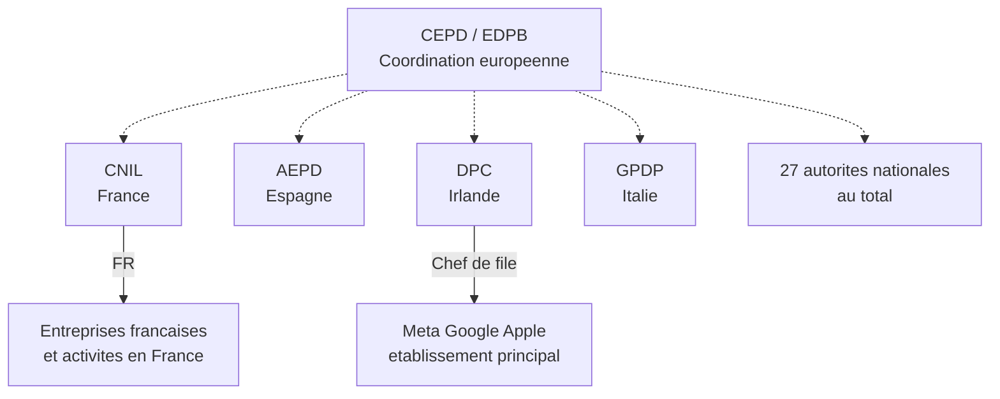
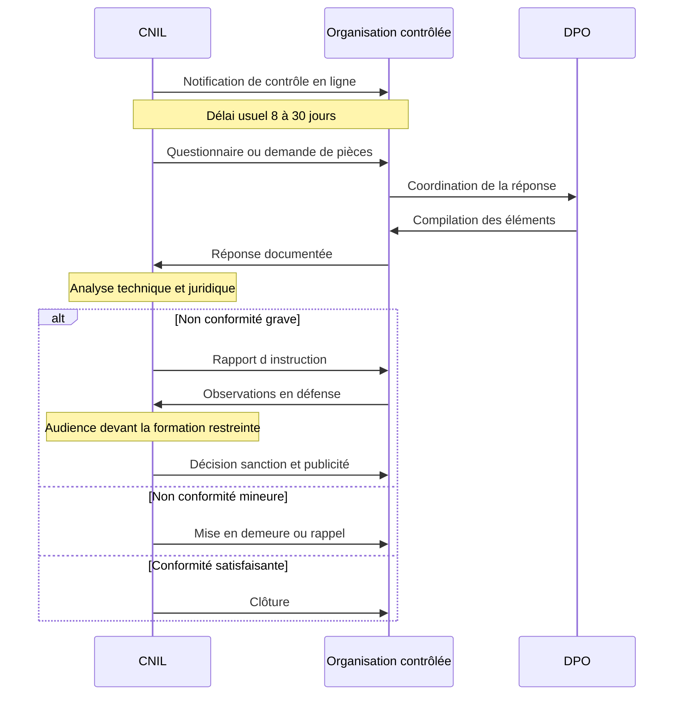
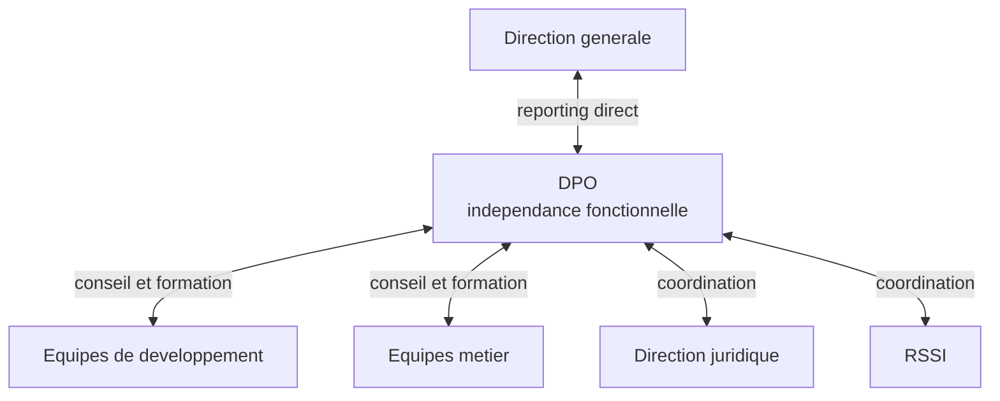
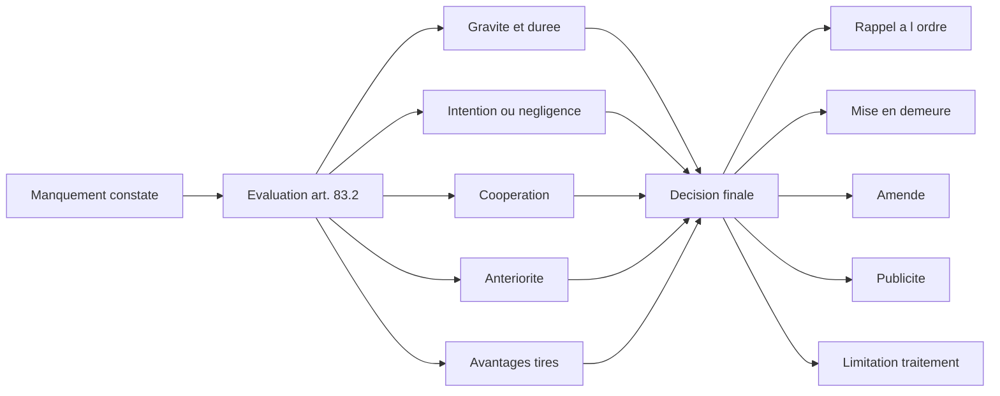

# Les acteurs institutionnels et les sanctions

## Introduction

Si demain, votre client reçoit une lettre de la CNIL, sauriez-vous lui
expliquer qui est cet interlocuteur, ce qu'il peut lui faire, et qui
peut l'aider à répondre ? À l'inverse, si un utilisateur de votre
application vous écrit qu'il va « porter plainte au CEPD », sauriez-vous
décoder cette menace et y répondre avec sérénité ? Pour beaucoup de
développeurs, ces acronymes restent flous, et c'est dommage car
comprendre l'écosystème institutionnel du RGPD est une clé essentielle
pour bien dialoguer avec son client, son DPO ou son juriste.

Cette partie présente les principaux acteurs institutionnels de la
protection des données (CNIL, CEPD, DPO), puis examine les sanctions
encourues par les organisations non conformes, à travers des exemples
récents et marquants. À la fin de cette partie, vous saurez à qui
s'adresser, qui peut vous sanctionner, et combien cela peut coûter.

### La CNIL et le CEPD

Avez-vous déjà reçu un courrier officiel d'une autorité administrative
indépendante ? L'effet est saisissant : papier en-tête, signature,
ton solennel. La CNIL est l'une de ces autorités. Créée en 1978, elle
est l'une des plus anciennes autorités de protection des données au
monde, et elle dispose de pouvoirs très étendus, à la fois de conseil,
de contrôle et de sanction. Comprendre son fonctionnement, c'est se
préparer sereinement à toutes les éventualités, du conseil au contrôle.

La **Commission Nationale de l'Informatique et des Libertés** (CNIL)
est l'autorité française de contrôle au sens du RGPD. Elle remplit
plusieurs missions complémentaires :

- une **mission de conseil et d'accompagnement** : guides
  thématiques (le fameux *Guide du développeur*), MOOC, outils
  comme PIA, fiches pratiques, accompagnement des innovations
  (*sandbox*) ;
- une **mission de contrôle** : enquêtes sur pièces, contrôles sur
  place, contrôles en ligne ;
- un **pouvoir de sanction** administrative pouvant aller, depuis
  le RGPD, jusqu'à 20 millions d'euros ou 4 % du chiffre d'affaires
  mondial annuel selon les cas ;
- une **mission de représentation** : la CNIL siège au CEPD et
  participe à la coopération européenne entre autorités.

La CNIL est dirigée par une présidente, désignée par décret du
Président de la République, et fonctionne avec un collège de
commissaires et des services techniques et juridiques. Sa formation
restreinte est chargée de prononcer les sanctions, à l'issue d'une
procédure contradictoire dans laquelle l'organisation contrôlée peut
faire valoir ses arguments. La plupart des décisions sont publiées,
ce qui contribue à la pédagogie collective.

À l'échelle européenne, le **Comité Européen de la Protection des
Données** (CEPD ou EDPB en anglais) est l'organe qui réunit
l'ensemble des autorités de contrôle des États membres. Son rôle est
d'assurer la cohérence d'application du RGPD à travers l'Europe. Il
publie des lignes directrices, qui clarifient certaines notions
floues du règlement, et il intervient lorsque plusieurs autorités
nationales doivent coordonner leurs décisions pour un même acteur
transnational.

> **Note** : on parle souvent de l'autorité « chef de file », qui est
> celle de l'État membre où le responsable de traitement a son
> établissement principal. Pour les géants du numérique, c'est
> souvent l'Irlande (Meta, Google) ou le Luxembourg (Amazon). Ce
> mécanisme dit du *guichet unique* est censé simplifier la
> coordination, mais il fait régulièrement l'objet de critiques pour
> lenteur ou complaisance.

#### Exemple pratique {id="exemple-pratique-4-1"}

Voyons concrètement comment se déroule un contrôle CNIL en ligne, à
travers une procédure type :

La phase de réponse est cruciale : une coopération diligente, des
documents bien préparés et un dialogue de qualité peuvent faire
toute la différence entre une simple clôture, un rappel à l'ordre, ou
une sanction publique. C'est dans cette phase que la qualité du
travail de documentation du développeur (registre, AIPD, journaux
techniques) prend toute sa valeur.

#### Exercice 1

Pour chaque situation, indiquez quel(s) acteur(s) institutionnel(s)
sont concernés (CNIL, CEPD, autres) et quel pourrait être leur rôle :

a) Un utilisateur français se plaint que sa banque française refuse
de supprimer ses données.
b) Plusieurs ONG européennes contestent ensemble une pratique de Meta
en matière de cookies.
c) Un développeur français cherche un guide officiel pour rédiger ses
mentions d'information.
d) Une PME française veut savoir si une nouvelle fonctionnalité
nécessite une AIPD.

##### Correction exercice 1 {collapsible="true"}

a) La **CNIL** est compétente, car la banque est française et
l'utilisateur réside en France. Il peut déposer plainte en ligne via
le site cnil.fr.

b) La situation relève de l'**autorité chef de file** (en l'occurrence
la DPC irlandaise pour Meta, dont l'établissement principal européen
est en Irlande), avec coordination potentielle au sein du **CEPD**.
Plusieurs autorités nationales peuvent être saisies par les ONG, et
le mécanisme de coopération s'enclenche.

c) Le développeur doit se tourner vers la **CNIL**, qui publie un
*Guide du développeur* régulièrement mis à jour ainsi que de
nombreuses fiches pratiques sur cnil.fr.

d) La PME peut consulter les guides CNIL, et notamment la liste
publiée par la CNIL des traitements nécessitant une AIPD (ainsi que
la liste de ceux qui ne le nécessitent pas). En cas de doute
persistant, elle peut interroger son **DPO** ou solliciter un avis
informel des services de la CNIL.

### Le DPO : un acteur clé du quotidien

Avez-vous déjà entendu vos collègues parler du « DPO » avec un mélange
de respect, de méfiance, et parfois de moquerie ? Le délégué à la
protection des données est l'une des innovations majeures du RGPD,
et c'est très souvent votre interlocuteur principal en matière de
conformité. Apprendre à dialoguer avec lui est l'un des savoirs les
plus utiles que vous puissiez acquérir en tant que développeur.

Le **délégué à la protection des données** (DPO en anglais : *Data
Protection Officer*) est défini aux articles 37 à 39 du RGPD. Sa
désignation est obligatoire pour :

- les autorités et organismes publics ;
- les organisations dont l'activité principale consiste en un suivi
  régulier et systématique à grande échelle des personnes ;
- les organisations dont l'activité principale est le traitement à
  grande échelle de données sensibles ou pénales.

Pour les autres organisations, la désignation est facultative mais
souvent recommandée. Le DPO peut être interne (salarié) ou externe
(prestataire), et un même DPO peut être mutualisé entre plusieurs
organisations, surtout dans les groupes ou les administrations.

Les **missions** principales du DPO sont :

- conseiller et informer le responsable de traitement et ses salariés ;
- vérifier le respect du RGPD au sein de l'organisation ;
- conseiller et superviser la réalisation des AIPD ;
- coopérer avec l'autorité de contrôle et être son point de contact ;
- former et sensibiliser les équipes.

Le DPO bénéficie d'une **indépendance fonctionnelle** : il ne reçoit
aucune instruction sur la manière d'exercer ses missions, il ne peut
être sanctionné pour l'exercice de ses fonctions, et il rend compte
directement au plus haut niveau de la direction.

Il est essentiel pour un développeur de comprendre que le DPO **n'est
pas un censeur** : son rôle est de vous aider à faire conforme, pas
de vous interdire d'agir. Plus tôt vous le sollicitez dans un projet,
plus il pourra vous proposer des solutions techniques compatibles
avec le RGPD. Trop souvent, le DPO est appelé en fin de projet, quand
tout est figé : il en résulte des conflits inutiles, alors qu'un
appel précoce aurait permis d'éviter les écueils.

#### Exemple pratique {id="exemple-pratique-4-2"}

Voici une procédure type pour solliciter votre DPO dès le démarrage
d'un projet, à intégrer dans votre méthodologie agile :

<procedure>
<step>

Au moment où la fonctionnalité est inscrite au backlog, identifier
si elle implique des données personnelles. Si oui, ajouter un label
« privacy » au ticket.

</step>
<step>

Pour les fonctionnalités étiquetées « privacy », inviter le DPO au
*refinement* de l'épopée concernée, pour qu'il puisse identifier
les enjeux en amont.

</step>
<step>

Lors du *sprint planning*, vérifier que les *user stories*
« privacy » comportent des critères d'acceptation explicites
(consentement, information, durée de conservation).

</step>
<step>

Pendant le développement, solliciter le DPO sur les choix
techniques sensibles (hashage, chiffrement, journalisation).

</step>
<step>

Avant la mise en production, faire valider par le DPO la mise à
jour du registre et, le cas échéant, l'AIPD.

</step>
<step>

Après mise en production, intégrer un point régulier avec le DPO
dans les rétrospectives ou les revues trimestrielles.

</step>
</procedure>

#### Exercice 2

Vous êtes développeur dans une startup. Votre product manager veut
ajouter une nouvelle fonctionnalité : une recommandation personnalisée
basée sur l'historique de navigation. Le projet doit être livré dans
trois semaines. Comment positionnez-vous l'intervention du DPO dans
cette situation, en justifiant votre démarche ?

##### Correction exercice 2 {collapsible="true"}

Votre démarche idéale serait :

1. **Solliciter le DPO immédiatement**, dès la confirmation de la
   fonctionnalité, et non quelques jours avant la mise en production.
   Une recommandation personnalisée basée sur l'historique de
   navigation pose plusieurs questions sensibles : base légale du
   traitement (consentement préférable), durée de conservation,
   profilage automatisé (article 22 du RGPD), information préalable
   des utilisateurs.

2. **Préparer une note synthétique** pour le DPO décrivant : la
   finalité, les données traitées, l'architecture envisagée, les
   destinataires, la durée de conservation envisagée.

3. **Proposer une réunion de cadrage** courte (30-45 minutes) avec
   le product manager et le DPO, afin de définir ensemble les
   exigences fonctionnelles incluant les aspects conformité
   (bannière de consentement, paramètre de désactivation, message
   d'information).

4. **Intégrer les retours du DPO** dans les user stories sous forme
   de critères d'acceptation testables.

5. **Si nécessaire**, faire arbitrer par la direction le calendrier
   de mise en production : il vaut mieux décaler de quelques jours
   qu'engager la responsabilité juridique de l'entreprise sur une
   fonctionnalité non conforme.

### Sanctions et jurisprudence marquante

Imaginez recevoir une amende de plusieurs millions d'euros pour avoir
mal paramétré un consentement cookies. Cela vous paraît impensable ?
C'est pourtant exactement ce qui est arrivé à plusieurs géants du
numérique. Comprendre les sanctions et leurs critères d'application,
ce n'est pas faire peur : c'est mesurer le poids des décisions
techniques quotidiennes.

Le RGPD prévoit deux niveaux de sanctions financières maximales :

- jusqu'à **10 millions d'euros ou 2 % du chiffre d'affaires mondial
  annuel**, le montant le plus élevé étant retenu, pour les
  manquements aux obligations du responsable de traitement et du
  sous-traitant (registre, sécurité, notification de violation, etc.) ;
- jusqu'à **20 millions d'euros ou 4 % du chiffre d'affaires mondial
  annuel**, pour les manquements aux principes fondamentaux,
  conditions de consentement, droits des personnes, transferts hors
  UE, etc.

À ces sanctions financières peuvent s'ajouter des mesures
correctrices non financières : rappel à l'ordre, mise en demeure,
limitation temporaire ou définitive d'un traitement, suspension de
flux de données vers un pays tiers. La publication de la décision est
une sanction supplémentaire fréquente, qui touche durement la
réputation des organisations.

Les **critères** retenus pour fixer le montant de la sanction
(article 83.2) sont notamment : la nature, la gravité et la durée du
manquement, le caractère intentionnel ou négligent, les mesures
prises pour atténuer le dommage, le degré de coopération avec
l'autorité, les antécédents éventuels, et les avantages financiers
tirés du manquement.

Quelques **sanctions marquantes** prononcées contre de grands acteurs
illustrent la rigueur croissante des autorités de contrôle :

- **Amazon Europe Core** (Luxembourg, 2021) : 746 millions d'euros
  pour non-conformité de son traitement publicitaire au regard du
  RGPD.
- **Meta / Instagram** (Irlande, 2022) : 405 millions d'euros pour
  traitement non conforme des données de mineurs.
- **Meta / Facebook** (Irlande, 2023) : 1,2 milliard d'euros pour
  transferts de données illégaux vers les États-Unis, dans le sillage
  de la décision Schrems II.
- **Google** (France, 2019, puis 2020, 2021) : sanctions cumulées
  pour plusieurs centaines de millions d'euros, notamment sur les
  cookies et l'information des utilisateurs.
- **Clearview AI** (plusieurs pays européens, 2022-2023) : sanctions
  multiples pour collecte massive de photographies en ligne destinée
  à la reconnaissance faciale.
- **TikTok** (Irlande, 2023) : 345 millions d'euros pour traitement
  des données de mineurs.

Au-delà des montants spectaculaires, ces décisions ont une **valeur
pédagogique** considérable : elles clarifient les attentes des
autorités sur des sujets précis (consentement cookies, transferts
internationaux, traitement des mineurs). Lire les décisions de la
CNIL ou de ses homologues européens, c'est se constituer
progressivement un référentiel de bonnes pratiques.

#### Exemple pratique {id="exemple-pratique-4-3"}

Analysons une sanction CNIL emblématique. En 2022, la CNIL a
sanctionné un acteur français du secteur du marketing en ligne pour
de multiples manquements en matière de cookies. Les éléments
factuels reprochés étaient les suivants :

- les cookies de traçage étaient déposés avant tout consentement, dès
  l'arrivée sur le site ;
- le bouton « tout refuser » n'apparaissait pas au même niveau que
  le bouton « tout accepter » ;
- l'information préalable sur les finalités précises de chaque
  cookie n'était pas accessible facilement ;
- les utilisateurs ne pouvaient pas retirer leur consentement aussi
  simplement qu'ils l'avaient donné.

La CNIL a prononcé une amende, en tenant compte :

- du nombre de personnes concernées (plusieurs millions
  d'utilisateurs) ;
- de la durée du manquement (plusieurs mois) ;
- des bénéfices commerciaux tirés du traçage non conforme ;
- de la coopération relative de la société pendant la procédure.

Cette décision illustre que la conformité technique du parcours
utilisateur (positionnement des boutons, hiérarchie des choix,
clarté de l'information) a des conséquences juridiques directes,
mesurables en millions d'euros.

#### Exercice 3

Une startup vous demande votre avis sur sa bannière cookies. Elle
présente le design suivant : un bandeau en bas de page indique
« Nous utilisons des cookies pour améliorer votre expérience » avec
un seul bouton « OK ». L'utilisation continue du site vaut
acceptation. Énumérez les risques RGPD de cette implémentation et
proposez les corrections concrètes.

##### Correction exercice 3 {collapsible="true"}

Risques identifiés :

1. **Consentement non valide** : selon le RGPD, le consentement doit
   être libre, spécifique, éclairé et univoque. Ici, il n'est ni
   spécifique (pas de différenciation des finalités), ni éclairé
   (information minimaliste), ni univoque (acceptation implicite par
   continuation de la navigation, ce qui a été expressément exclu
   par les autorités).

2. **Absence d'alternative équivalente** : il manque un bouton
   « refuser » de visibilité équivalente au bouton « accepter ».

3. **Information insuffisante** : pas de détail sur les finalités,
   les destinataires, les durées de conservation, les transferts
   éventuels.

4. **Acceptation par poursuite de la navigation** : pratique
   condamnée tant par la CNIL que par les juridictions européennes.

Corrections proposées :

- Mettre en place une bannière comportant trois boutons de visibilité
  équivalente : « Tout accepter », « Tout refuser », « Personnaliser
  mes choix ».
- Détailler dans une seconde page accessible depuis la bannière les
  finalités, durées et destinataires de chaque catégorie de cookie.
- Bloquer le dépôt des cookies non essentiels tant que l'utilisateur
  n'a pas exprimé son choix.
- Permettre à l'utilisateur de retirer son consentement aussi
  facilement qu'il l'a donné, via un lien permanent en pied de page.
- Conserver une preuve technique du consentement (date, version,
  choix) pour pouvoir la produire en cas de contrôle.

## Exercice final

Vous travaillez chez *FlamingoTech*, éditeur d'une plateforme SaaS de
RH utilisée par plusieurs centaines d'entreprises clientes. Votre
direction vous demande de préparer une note interne d'analyse de
risque RGPD à destination du COMEX, à la suite d'un incident : un
développeur stagiaire a accidentellement déployé en production un
endpoint d'API non protégé qui exposait, pendant huit heures, les
données personnelles (nom, mail, salaire, évaluations) de plusieurs
milliers de salariés des entreprises clientes.

Préparez cette note en structurant votre réflexion autour de quatre
axes :

1. Qualification juridique de l'incident.
2. Acteurs institutionnels concernés et obligations associées.
3. Sanctions encourues.
4. Recommandations immédiates et de moyen terme.

### Correction exercice final {collapsible="true"}

**Note interne — Analyse de risque RGPD**
**Incident d'exposition de données — Plateforme RH FlamingoTech**

**1. Qualification juridique de l'incident**

L'événement constitue une **violation de données à caractère
personnel** au sens de l'article 4.12 du RGPD : il y a eu accès non
autorisé à des données personnelles, du fait d'un défaut de
sécurisation technique. L'incident est aggravé par plusieurs facteurs :

- des données sensibles au regard de leur nature professionnelle
  (salaire, évaluations) qui, sans relever de l'article 9, ont un
  impact direct sur la vie professionnelle des personnes concernées ;
- un nombre élevé de personnes concernées (plusieurs milliers) ;
- une durée d'exposition de huit heures ;
- une exposition publique (endpoint accessible sans authentification).

Par ailleurs, FlamingoTech intervient comme **sous-traitant** au sens
de l'article 28 vis-à-vis de ses entreprises clientes, qui sont
elles-mêmes responsables de traitement pour leurs salariés. Cette
qualification a des conséquences importantes sur les obligations
respectives.

**2. Acteurs institutionnels concernés**

Plusieurs interlocuteurs doivent être mobilisés :

- **Le DPO de FlamingoTech** doit coordonner la réponse à
  l'incident et préparer la documentation.
- **Les entreprises clientes** doivent être informées dans les
  meilleurs délais, conformément à l'article 33.2 du RGPD (le
  sous-traitant doit notifier toute violation au responsable de
  traitement). Cette notification doit être faite sans retard injustifié
  dès que le sous-traitant en a connaissance.
- **La CNIL** doit être notifiée par chaque entreprise cliente
  concernée si la violation présente un risque pour les droits et
  libertés des personnes, dans un délai de **72 heures** après prise
  de connaissance (article 33.1). Cette notification incombe au
  responsable de traitement, mais le sous-traitant doit fournir
  toutes les informations nécessaires.
- **Les personnes concernées** doivent être informées par leur
  employeur si la violation présente un risque élevé pour leurs
  droits et libertés (article 34).

**3. Sanctions encourues**

Les sanctions potentielles sont multiples :

- Sanctions administratives de la CNIL pouvant aller jusqu'à
  **10 millions d'euros ou 2 % du chiffre d'affaires mondial** pour
  les manquements à l'obligation de sécurité (article 32) et à
  l'obligation de notification.
- Sanctions contractuelles : les contrats DPA avec les clients
  prévoient en général des clauses de responsabilité et d'indemnisation
  en cas de violation imputable au sous-traitant.
- Risque de **résiliation** de contrats par les clients et atteinte
  durable à la réputation commerciale de FlamingoTech.
- **Recours individuels** des salariés concernés en réparation du
  préjudice subi, sur le fondement de l'article 82 du RGPD.

**4. Recommandations**

Actions immédiates (premières 24 heures) :

- Confirmer la fermeture définitive de l'endpoint et lancer un audit
  de sécurité complet.
- Documenter précisément l'incident : chronologie, données
  exposées, nombre de personnes touchées, mesures de remédiation.
- Notifier immédiatement les clients concernés en leur fournissant
  toutes les informations utiles pour leur propre notification CNIL.
- Saisir le DPO et la direction juridique pour coordination.

Actions à court terme (semaine suivante) :

- Mettre en place un canal dédié de support pour les clients et
  préparer une communication transparente.
- Réaliser une revue de sécurité de l'ensemble des endpoints API.
- Conduire un retour d'expérience interne (sans recherche de bouc
  émissaire) pour identifier les causes systémiques.

Actions de moyen terme :

- Renforcer les revues de code obligatoires sur les endpoints
  exposant des données personnelles.
- Mettre en place une politique d'environnements stricte interdisant
  les déploiements directs de stagiaires en production.
- Réviser la formation des nouveaux entrants, y compris les
  stagiaires, sur les enjeux RGPD.
- Documenter ces mesures correctives dans le registre et la
  documentation contractuelle, ce qui sera utile en cas de contrôle
  ultérieur.

Cette analyse permet au COMEX de mesurer l'enjeu et de prendre les
décisions stratégiques qui s'imposent. Un manquement à ces
obligations exposerait FlamingoTech à des sanctions
disproportionnées par rapport au coût de la mise en conformité.

## Conclusion de la partie

Vous avez désormais une vision claire de l'écosystème institutionnel
du RGPD : la CNIL en France, le CEPD au niveau européen, le DPO au
plus près du quotidien des projets. Vous avez aussi compris que les
sanctions ne sont pas théoriques : elles atteignent régulièrement les
centaines de millions d'euros pour les grands acteurs, mais aussi
les amendes plus modestes mais bien réelles pour les PME et les
ETI françaises.

Au-delà de la peur que peuvent inspirer ces chiffres, retenez le
message essentiel : le DPO est votre allié au quotidien, et la CNIL,
malgré son pouvoir de sanction, joue aussi un rôle de conseil et
d'accompagnement. Travailler étroitement avec ces acteurs en amont,
documenter ses choix, dialoguer ouvertement : voilà la posture qui
protège votre client, vos utilisateurs, et votre propre crédibilité
professionnelle.
