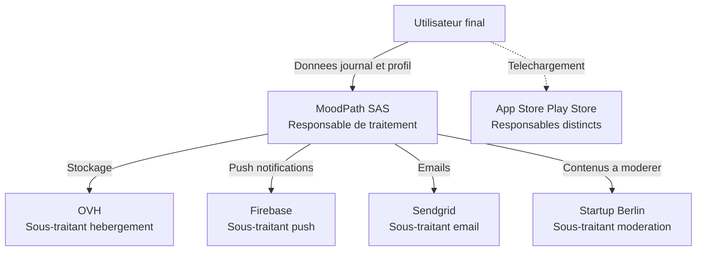

# TP : Audit RGPD préliminaire d'une application

## Introduction

### Contexte du TP

Une jeune entreprise française du nom de *MoodPath* vient de finaliser
son projet d'application mobile : une plateforme communautaire de
bien-être psychologique destinée aux jeunes actifs, qui combine
journal d'humeur quotidien, échanges entre pairs anonymisés, et
recommandations personnalisées générées par une intelligence
artificielle. L'application sera disponible en France, en Belgique,
en Espagne et au Royaume-Uni. Les serveurs sont hébergés chez OVH à
Roubaix, les notifications push transitent par Firebase (Google), les
emails sont envoyés via Sendgrid (basé aux États-Unis), et la
modération automatique des contenus communautaires est déléguée à une
startup berlinoise.

L'application doit être lancée dans six semaines. La direction de
*MoodPath* vient de prendre conscience qu'aucune réflexion RGPD
sérieuse n'a été menée pendant les six premiers mois de
développement. La CTO vous mandate, en tant que développeuse ou
développeur expert sur les enjeux de conformité, pour réaliser un
audit préliminaire et lui remettre un document de synthèse qu'elle
pourra présenter au COMEX. Vous disposez de cinq journées de travail
pour produire ce livrable.

### Objectifs du TP

À l'issue de ce TP, vous serez capable de :

1. Qualifier juridiquement les acteurs impliqués dans un projet
   d'application réel.
2. Inventorier de manière exhaustive les données personnelles
   traitées, en distinguant les données sensibles.
3. Vérifier l'applicabilité territoriale et matérielle du RGPD.
4. Identifier les zones de risque majeur et chiffrer les sanctions
   potentielles.
5. Rédiger une note d'audit professionnelle et structurée à
   destination d'un comité exécutif.

### Durée estimée

Environ **3 heures** (peut être étendu à 4 heures avec restitution
orale).

### Prérequis techniques

- Avoir lu intégralement les parties 1 à 4 du module.
- Connaître les notions clés : donnée personnelle, donnée sensible,
  traitement, finalité, base légale, responsable de traitement,
  sous-traitant, destinataire.
- Disposer d'un éditeur Markdown ou d'un traitement de texte.
- Connexion internet pour consulter le site cnil.fr si besoin.

## Étape 1 : Cartographie des acteurs et qualification de leurs rôles

### 1.1 Inventaire des acteurs

Identifiez l'ensemble des acteurs intervenant dans le projet
*MoodPath*. Pour chaque acteur listé dans le contexte du TP (et tout
autre acteur que vous jugerez utile d'ajouter), créez une fiche
synthétique structurée comme suit :

```markdown
- Nom de l acteur
- Pays d etablissement
- Role dans le projet (technique et fonctionnel)
- Qualification RGPD (responsable de traitement,
  sous-traitant, destinataire, tiers)
- Justification de la qualification
- Documents contractuels necessaires
```

Vous devez identifier au minimum sept acteurs distincts.

### 1.2 Représentation graphique

Réalisez un diagramme Mermaid (ou PlantUML, si vous préférez)
représentant la chaîne de traitement des données et les rôles
respectifs. Le diagramme doit faire apparaître clairement :

- l'utilisateur final ;
- l'entité responsable de traitement ;
- les sous-traitants ;
- les destinataires éventuels ;
- les flux de données entre acteurs.

## Étape 2 : Inventaire des données traitées

### 2.1 Liste exhaustive des données

Pour chaque fonctionnalité de l'application, listez toutes les
données personnelles susceptibles d'être collectées. Présentez votre
inventaire sous forme de tableau :

| Fonctionnalité | Donnée | Catégorie | Source de collecte | Stockage |
|----------------|--------|-----------|---------------------|----------|

Pour la colonne « Catégorie », distinguez :

- donnée personnelle classique (art. 4.1) ;
- donnée sensible (art. 9) ;
- donnée d'identifiant national (NIR, etc.) ;
- donnée pénale (art. 10) ;
- donnée non personnelle ou anonymisée.

### 2.2 Schéma de base de données

Proposez un schéma SQL minimaliste pour les principales tables
implicites du projet (utilisateurs, entrées de journal, échanges
entre pairs, recommandations). Le schéma doit être compatible MySQL
et PostgreSQL, et chaque colonne contenant des données personnelles
doit faire l'objet d'un commentaire SQL indiquant sa catégorie.

```sql
-- Exemple attendu (partiel)
CREATE TABLE users (
    id BIGINT PRIMARY KEY,
    -- Donnee personnelle classique (art. 4.1)
    email VARCHAR(255) NOT NULL UNIQUE,
    -- A completer ...
);
```

Le schéma doit comporter au moins quatre tables et au moins une table
qui inclut des données potentiellement sensibles.

## Étape 3 : Applicabilité du RGPD

### 3.1 Champ d'application territorial

Analysez l'applicabilité territoriale du RGPD pour *MoodPath* en
répondant aux questions suivantes :

- Sur quel(s) fondement(s) le RGPD s'applique-t-il (établissement,
  ciblage, ou les deux) ? Justifiez votre réponse en vous référant
  aux articles 3.1 et 3.2.
- Quelles autorités de contrôle sont compétentes pour les
  utilisateurs français, belges, espagnols et britanniques ?
- Le Royaume-Uni étant sorti de l'Union européenne, son régime de
  protection est-il toujours équivalent au RGPD ? Quelle conséquence
  pour les transferts de données ?
- Quels transferts de données hors UE sont identifiables dans le
  projet, et quel encadrement juridique faut-il prévoir ?

### 3.2 Champ d'application matériel

Vérifiez que l'ensemble des traitements envisagés relève bien du
champ matériel du RGPD. Indiquez si certains traitements pourraient
faire l'objet d'une exclusion ou d'un encadrement particulier
(notamment : recherche scientifique, journalisme, sécurité nationale,
domestique).

## Étape 4 : Identification des zones de risque

### 4.1 Zones de risque techniques et juridiques

Identifiez au moins **cinq zones de risque RGPD majeur** dans le
projet *MoodPath*. Pour chacune, structurez votre analyse comme
suit :

```markdown
- Description du risque
- Article(s) du RGPD concernes
- Niveau de risque (faible / moyen / eleve)
- Decision CNIL ou jurisprudence europeenne pertinente
- Recommandation de remediation
```

Pensez en particulier aux thématiques suivantes (la liste n'est pas
exhaustive) :

- traitement de données potentiellement sensibles (santé mentale) ;
- transferts internationaux de données ;
- consentement et information préalable ;
- protection des mineurs (âge des « jeunes actifs ») ;
- décisions automatisées et profilage par l'IA ;
- sécurité des échanges entre pairs.

### 4.2 Estimation des sanctions potentielles

Pour les trois zones de risque jugées les plus critiques, estimez
l'ampleur de la sanction potentielle en cas de non-conformité, en
vous appuyant sur :

- les plafonds prévus aux articles 83.4 et 83.5 du RGPD ;
- des décisions CNIL ou européennes comparables (citez-en au moins
  deux par zone de risque) ;
- les critères de modulation de l'article 83.2.

## Étape 5 : Note d'audit pour le COMEX

Rédigez une **note de synthèse de 2 à 3 pages** à destination du
COMEX de *MoodPath*. La note doit être structurée, professionnelle,
et accessible à des dirigeants non juristes. Elle doit comporter :

1. Un résumé exécutif (10 lignes maximum).
2. Une description synthétique du projet et de ses enjeux RGPD.
3. La cartographie des acteurs avec qualifications RGPD.
4. Les zones de risque majeur identifiées.
5. Une feuille de route de mise en conformité, hiérarchisée en
   trois priorités (avant le lancement, dans les trois mois après,
   dans l'année).
6. Une estimation des coûts et des risques financiers.

La note doit être rédigée dans un style **clair, factuel, et
constructif**. Évitez le jargon juridique excessif. Privilégiez les
phrases courtes et les listes synthétiques.

## Correction du TP {collapsible="true"}

Cette correction présente une réponse type. D'autres analyses
peuvent être légitimes : l'essentiel est la rigueur du raisonnement
et la pertinence des justifications.

### Étape 1 : Acteurs et rôles

| Acteur | Pays | Rôle | Qualification | Document |
|--------|------|------|---------------|----------|
| MoodPath SAS | France | Éditeur de l'application | Responsable de traitement | Registre, politique de confidentialité |
| OVH | France | Hébergeur | Sous-traitant | DPA |
| Firebase (Google) | États-Unis / Irlande | Notifications push | Sous-traitant | DPA + clauses contractuelles types |
| Sendgrid | États-Unis | Envoi d'emails | Sous-traitant | DPA + clauses contractuelles types |
| Startup berlinoise | Allemagne | Modération automatique | Sous-traitant | DPA |
| Apple / Google | États-Unis / Irlande | Magasins d'applications | Responsable de traitement distinct | À mentionner dans politique |
| Utilisateurs | UE | Personnes concernées | Personnes concernées | Information préalable |



### Étape 2 : Inventaire des données

Les principales données traitées comprennent :

- **Données d'identité** : email, mot de passe haché, prénom (ou
  pseudo), date de naissance.
- **Données techniques** : identifiant d'appareil, adresse IP, jeton
  de notification push, version d'OS.
- **Données sensibles** : entrées de journal sur l'humeur,
  description d'états émotionnels, ressentis sur la santé mentale.
  Ces données relèvent de la **santé mentale**, donc des données
  sensibles au sens de l'article 9. Vigilance maximale.
- **Données d'usage** : fréquence de connexion, durée, fonctions
  utilisées (peuvent révéler indirectement des éléments de santé).
- **Données d'interaction communautaire** : contenus partagés,
  réactions, signalements.
- **Données dérivées de l'IA** : recommandations personnalisées,
  scores de bien-être, alertes de risque (potentiellement
  particulièrement sensibles si elles tendent à un diagnostic).

Schéma SQL partiel :

```sql
-- Table des utilisateurs
CREATE TABLE users (
    id BIGINT PRIMARY KEY,
    -- Donnees personnelles classiques
    email VARCHAR(255) NOT NULL UNIQUE,
    password_hash VARCHAR(255) NOT NULL,
    pseudo VARCHAR(100) NOT NULL,
    date_of_birth DATE NOT NULL,
    -- Donnees personnelles techniques
    locale VARCHAR(10),
    country_code VARCHAR(2),
    -- Metadonnees
    created_at TIMESTAMP NOT NULL DEFAULT CURRENT_TIMESTAMP,
    last_login_at TIMESTAMP,
    -- Statut
    consent_version VARCHAR(20),
    consent_given_at TIMESTAMP
);

-- Table du journal d humeur (donnees sensibles)
CREATE TABLE mood_entries (
    id BIGINT PRIMARY KEY,
    user_id BIGINT NOT NULL REFERENCES users(id),
    -- Donnee sensible : etat emotionnel (art. 9 sante mentale)
    mood_score INT NOT NULL CHECK (mood_score BETWEEN 1 AND 10),
    -- Donnee sensible : description textuelle libre
    note TEXT,
    -- Donnees contextuelles
    entry_date DATE NOT NULL,
    created_at TIMESTAMP NOT NULL DEFAULT CURRENT_TIMESTAMP
);

-- Table des recommandations generees par IA
CREATE TABLE ai_recommendations (
    id BIGINT PRIMARY KEY,
    user_id BIGINT NOT NULL REFERENCES users(id),
    -- Decision automatisee : alerte sur l etat mental
    risk_level VARCHAR(20),
    recommendation_text TEXT,
    model_version VARCHAR(50),
    created_at TIMESTAMP NOT NULL DEFAULT CURRENT_TIMESTAMP
);

-- Table des echanges entre pairs (contenus moderes)
CREATE TABLE peer_messages (
    id BIGINT PRIMARY KEY,
    sender_id BIGINT NOT NULL REFERENCES users(id),
    receiver_id BIGINT NOT NULL REFERENCES users(id),
    content TEXT NOT NULL,
    moderation_status VARCHAR(20),
    sent_at TIMESTAMP NOT NULL DEFAULT CURRENT_TIMESTAMP
);
```

### Étape 3 : Applicabilité

- **Champ territorial** : le RGPD s'applique au titre de
  l'établissement (MoodPath SAS étant française), ainsi qu'au titre
  du ciblage pour les utilisateurs des autres États membres. La
  Belgique et l'Espagne relèvent du RGPD avec leurs autorités
  nationales (APD belge et AEPD espagnole). Le Royaume-Uni applique
  désormais le **UK GDPR**, équivalent du RGPD européen. Les
  transferts de données entre l'UE et le UK bénéficient d'une
  **décision d'adéquation** prise par la Commission européenne, ce
  qui simplifie l'encadrement.

- **Champ matériel** : tous les traitements envisagés relèvent
  pleinement du RGPD. Aucune exclusion n'est applicable.

- **Transferts hors UE** : ils concernent principalement Firebase et
  Sendgrid, basés aux États-Unis. L'encadrement repose sur le **Data
  Privacy Framework** (DPF) si les sous-traitants y sont certifiés,
  à défaut sur des **clauses contractuelles types** complétées par
  une analyse de risque (TIA, *Transfer Impact Assessment*) à la
  suite de la jurisprudence Schrems II.

### Étape 4 : Zones de risque

Cinq zones de risque majeur identifiées :

1. **Traitement de données de santé mentale sans encadrement
   article 9** — risque élevé. Base légale à sécuriser, AIPD
   obligatoire, mesures de sécurité renforcées (chiffrement,
   pseudonymisation).

2. **Transferts vers les États-Unis (Firebase, Sendgrid)** — risque
   élevé. Vérification du statut DPF, mise en place de clauses
   contractuelles types le cas échéant, TIA documenté.

3. **Profilage et décisions automatisées par l'IA** — risque élevé.
   Article 22 du RGPD : information renforcée des personnes,
   possibilité d'obtenir une intervention humaine, AIPD
   indispensable.

4. **Consentement et information préalable** — risque moyen à élevé.
   Au vu des décisions récentes sur les cookies et le consentement,
   une attention particulière doit être portée à la bannière
   d'accueil et à la politique de confidentialité.

5. **Protection des mineurs** — risque moyen à élevé selon l'âge
   minimum d'inscription. En France, le consentement parental est
   requis en dessous de 15 ans. Vigilance sur la communication
   ciblant les jeunes actifs.

### Étape 5 : Note de synthèse

La note remise au COMEX doit être professionnelle, structurée et
hiérarchisée. Voici un exemple de plan détaillé :

1. **Résumé exécutif** : application sensible (santé mentale),
   conformité RGPD non amorcée, risques majeurs identifiés, plan
   d'action prioritaire avant lancement.

2. **Description du projet et enjeux** : nature des données,
   public cible, contexte concurrentiel, exigences réglementaires.

3. **Cartographie des acteurs** : tableau synthétique avec
   qualifications et documents contractuels à signer.

4. **Risques principaux** : top 5 avec niveau, articles concernés,
   sanctions potentielles (références à des amendes existantes).

5. **Feuille de route** :

   - **Priorité 1 (avant lancement)** : AIPD complète, signature
     des DPA, mise en place du registre, consentement valide,
     politique de confidentialité, sécurité renforcée des données
     sensibles, désignation d'un DPO (si non encore fait).

   - **Priorité 2 (3 mois après lancement)** : audit de sécurité
     externe, mise en place d'un processus de gestion des droits,
     formation des équipes.

   - **Priorité 3 (1 an)** : revue annuelle de conformité,
     adaptation aux évolutions de l'AI Act.

6. **Coûts et risques** : estimation des coûts de mise en conformité
   (audit, AIPD, DPO, sécurité) face au risque maximal de sanction
   (plusieurs millions d'euros théoriques compte tenu de la
   sensibilité des données).

Le TP est considéré comme réussi si l'apprenant a produit un travail
cohérent, exhaustif sur les acteurs et les données, et structuré
dans la note finale. Les divergences d'interprétation sont
acceptables tant qu'elles sont argumentées.
