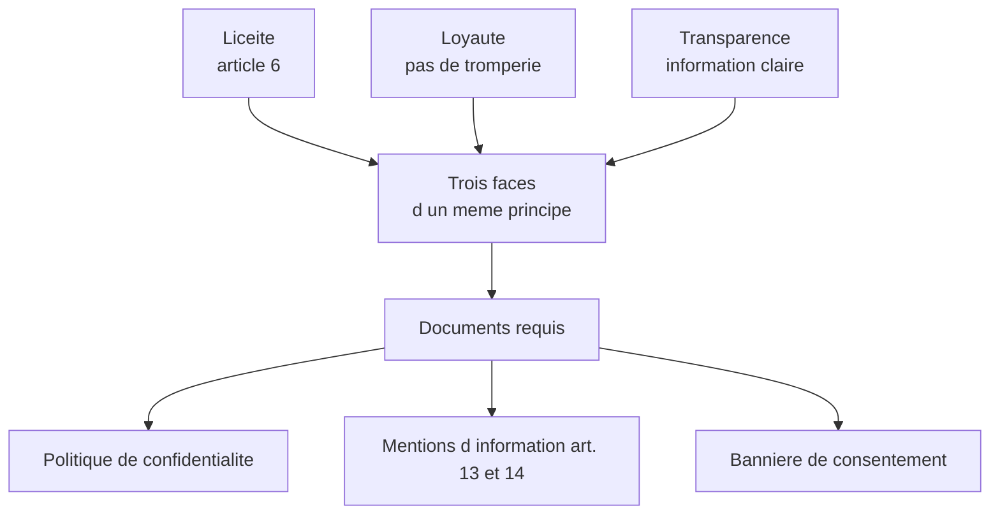
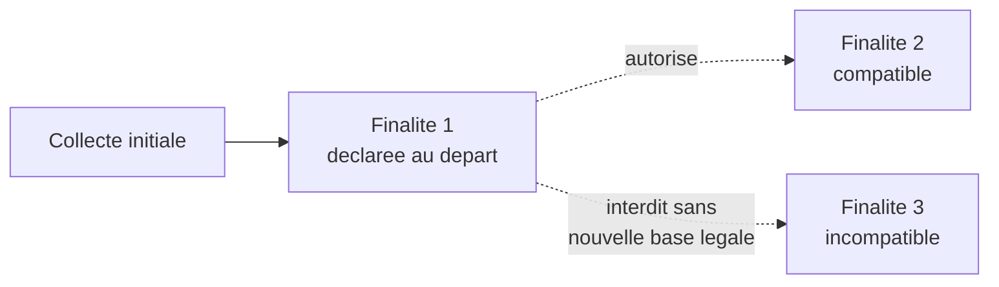
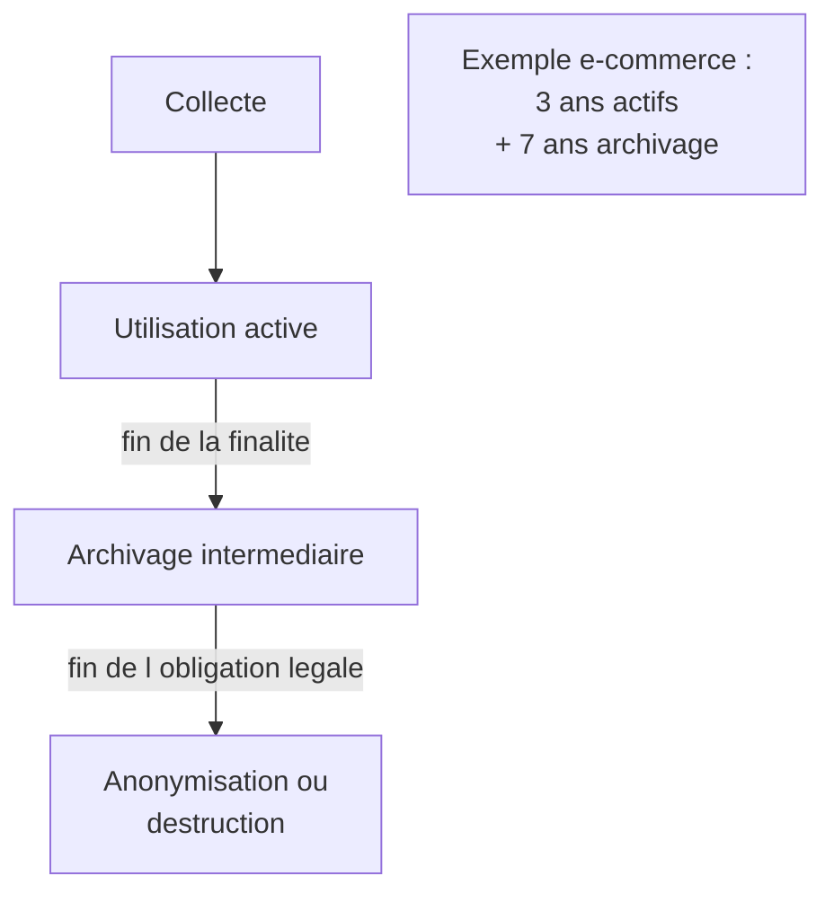
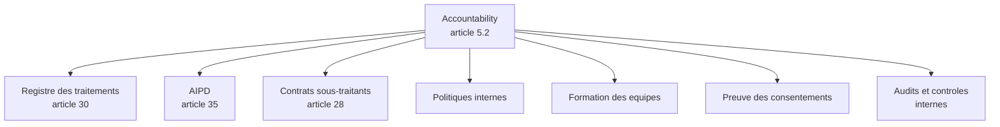

# Les sept principes fondamentaux de l'article 5

## Introduction

Vous est-il déjà arrivé de feuilleter une recette de cuisine et de
vous dire « il y a tellement d'étapes que je ne saurai jamais où
commencer » ? Pourtant, en regardant de plus près, vous découvrez
qu'il y a une logique simple : préparer les ingrédients, les cuire
dans le bon ordre, assaisonner avec mesure, dresser proprement. Le
RGPD est exactement pareil : ses 99 articles peuvent paraître
intimidants, mais ils découlent tous, plus ou moins directement, de
sept principes fondamentaux énoncés à l'article 5. Ces sept principes
sont la recette de base de la conformité.

Cette partie va vous présenter chacun de ces principes avec un même
schéma : énoncé, sens concret, exemple de mise en œuvre dans le code,
et piège à éviter. À la fin, vous saurez les énumérer de mémoire et,
plus important encore, les reconnaître dans une situation
professionnelle. Quand un juriste vous parlera de « finalité » ou de
« minimisation », vous saurez exactement de quoi il s'agit et
comment y répondre techniquement.

### Premier principe : licéité, loyauté, transparence

Imaginez un magasin qui glisse subrepticement des articles dans votre
panier pendant que vous regardez ailleurs, et qui vous facture le
tout à la caisse. Vous protestez ? Le commerçant vous répond : « Vous
n'avez qu'à lire le règlement intérieur affiché au sous-sol. ». Ce
serait scandaleux, n'est-ce pas ? Pourtant, c'est exactement ce que
font, à leur insu, beaucoup de sites web et d'applications quand ils
collectent et utilisent des données personnelles sans information
claire ni consentement préalable. Le premier principe du RGPD vise
précisément à interdire ces pratiques.

Le principe de **licéité** signifie qu'un traitement de données ne
peut être mis en œuvre que s'il est appuyé sur l'une des six bases
légales prévues à l'article 6 (que nous étudierons dans la partie
suivante). Pas de base légale, pas de traitement, c'est aussi simple
que cela. Le principe de **loyauté** ajoute que la personne concernée
doit pouvoir comprendre ce que vous faites avec ses données : pas de
tromperie, pas de collecte cachée, pas de finalité déguisée. Enfin,
le principe de **transparence** exige que vous délivriez, dans un
langage clair et accessible, une information complète sur le
traitement.



Concrètement, pour un développeur, ce principe se traduit par
plusieurs exigences :

- chaque formulaire de collecte doit comporter, ou pointer vers, une
  information sur ce qui est fait des données ;
- les CGU et la politique de confidentialité doivent être
  accessibles avant la collecte, pas seulement après ;
- la rédaction doit être lisible pour le grand public (éviter le
  jargon juridique impénétrable).

#### Exemple pratique {id="exemple-pratique-1-1"}

Voici deux versions d'un même formulaire d'inscription, l'une non
conforme et l'autre conforme :

```html
<!-- Version NON conforme : pas d information -->
<form>
    <label>Email</label>
    <input type="email" name="email" required>
    <label>Mot de passe</label>
    <input type="password" name="password" required>
    <button type="submit">Je m inscris</button>
</form>

<!-- Version conforme : information visible -->
<form>
    <label>Email</label>
    <input type="email" name="email" required>
    <label>Mot de passe</label>
    <input type="password" name="password" required>

    <p class="privacy-info">
        Vos donnees sont collectees par Acme SAS pour la gestion
        de votre compte. Elles sont conservees 3 ans apres votre
        derniere connexion. Vous disposez de droits d acces, de
        rectification et d effacement. Plus d informations dans
        notre <a href="/privacy">politique de confidentialite</a>.
    </p>

    <button type="submit">Je m inscris</button>
</form>
```

> **Note** : l'information ne doit pas se contenter d'un lien renvoyant
> vers la politique de confidentialité. L'information essentielle
> (qui collecte, pourquoi, combien de temps, quels droits) doit être
> visible au moment de la collecte.

#### Exercice 1

Une PME française collecte les adresses email de ses prospects sur un
salon professionnel via un formulaire papier qui mentionne uniquement
« En remplissant ce formulaire, vous acceptez de recevoir nos
communications. ». Identifiez en quelques lignes ce qui pose problème
au regard du principe de licéité, loyauté, transparence et proposez
une version améliorée du formulaire.

##### Correction exercice 1 {collapsible="true"}

Problèmes identifiés :

- **Information insuffisante** : pas d'indication sur l'identité du
  responsable de traitement, sur les finalités précises, sur la
  durée de conservation, sur les destinataires éventuels, sur les
  droits de la personne.
- **Acceptation passive** : le simple fait de remplir un formulaire
  ne vaut pas consentement éclairé au sens du RGPD. Le consentement
  doit être actif et univoque.
- **Loyauté discutable** : « communications » est trop vague. S'agit-il
  de la newsletter, de la prospection commerciale, du suivi de
  navigation ?

Version améliorée :

> *Société Acme SAS collecte vos coordonnées sur ce formulaire pour
> vous adresser sa newsletter mensuelle d'actualité métier. Vos
> données seront conservées 3 ans après votre dernier contact. Elles
> ne sont communiquées à aucun tiers en dehors de notre prestataire
> d'envoi d'email Mailchimp. Vous disposez à tout moment des droits
> d'accès, de rectification, d'effacement et d'opposition que vous
> pouvez exercer auprès de dpo@acme.fr. Pour plus de précisions :
> acme.fr/confidentialite.*
>
> *[ ] Je souhaite recevoir la newsletter mensuelle d'Acme SAS.*

### Deuxième principe : limitation des finalités

Imaginez qu'un médecin vous demande votre adresse pour vous envoyer
votre ordonnance, puis qu'il revende votre adresse à une agence
immobilière pour faire de la prospection. Vous seriez stupéfait,
voire scandalisé. Pourtant, dans le monde numérique, ce genre de
pratique est tellement courant qu'on en oublie l'absurdité. Le RGPD
exige qu'une donnée collectée pour une finalité précise ne soit pas
ensuite utilisée pour une finalité radicalement différente et
incompatible.

Ce principe de **limitation des finalités** signifie que les données
doivent être collectées pour des finalités déterminées, explicites et
légitimes, et ne pas être traitées ultérieurement d'une manière
incompatible avec ces finalités. Ce principe contraint
particulièrement les architectures techniques : il faut savoir, dès
la conception, ce que l'on va faire de chaque donnée, et ne pas
inventer de nouvelles finalités en cours de route sans nouvelle base
légale et nouvelle information.



Pour évaluer si une finalité ultérieure est « compatible » avec la
finalité initiale, le RGPD prévoit plusieurs critères (article 6.4) :
le lien entre les finalités, le contexte de la collecte, la nature
des données, les conséquences pour la personne, et les garanties
mises en place (notamment la pseudonymisation). Une finalité de
recherche scientifique, statistique ou d'archivage est en principe
considérée comme compatible.

#### Exemple pratique {id="exemple-pratique-1-2"}

Prenons un cas typique : une application de livraison de repas. Voici
comment se déclinent les finalités potentielles, certaines
compatibles, d'autres non :

```sql
-- Donnees collectees lors de l inscription
CREATE TABLE users (
    id BIGINT PRIMARY KEY,
    email VARCHAR(255) NOT NULL,
    phone VARCHAR(20) NOT NULL,
    delivery_address VARCHAR(255) NOT NULL,
    first_name VARCHAR(100) NOT NULL,
    last_name VARCHAR(100) NOT NULL,
    -- Finalite declaree : gestion du compte et livraison
    purpose VARCHAR(50) DEFAULT 'account_and_delivery'
);

-- Utilisations envisageables :
-- 1. Livrer les commandes : compatible (finalite initiale)
-- 2. Statistiques anonymes sur les zones de livraison : compatible
-- 3. Newsletter promotionnelle de l app : compatible si information
-- 4. Revendre l adresse a une agence immobiliere : INCOMPATIBLE
-- 5. Profilage publicitaire detaille via tiers : INCOMPATIBLE
--    sans nouvelle base legale (consentement)
```

Le développeur doit s'assurer que chaque nouvelle utilisation envisagée
fait l'objet d'une analyse de compatibilité, voire d'un nouveau
consentement si l'utilisation est sensiblement différente. C'est
souvent dans le couplage avec un CRM ou un data warehouse que se
nichent les pièges : on extrait des données « pour analyse » et,
imperceptiblement, on les utilise pour de la prospection commerciale.

#### Exercice 2

Une application de covoiturage a collecté pendant deux ans les
positions GPS de ses utilisateurs pour les besoins du service de
trajet. Le directeur produit veut maintenant utiliser ces données
pour vendre des analyses de flux urbains à une régie publicitaire.
Cette nouvelle utilisation est-elle compatible avec la finalité
initiale ? Justifiez votre réponse en mobilisant les critères de
l'article 6.4.

##### Correction exercice 2 {collapsible="true"}

Cette nouvelle utilisation est **incompatible** avec la finalité
initiale, et ce pour plusieurs raisons :

- **Lien entre finalités** : la finalité initiale (mise en relation
  pour covoiturage) n'a pas de rapport direct avec la vente
  d'analyses commerciales à des tiers.
- **Contexte de la collecte** : l'utilisateur s'est inscrit sur une
  application de covoiturage, pas sur une plateforme de marketing.
- **Nature des données** : les positions GPS sont des données très
  sensibles car elles révèlent les habitudes, le domicile, le lieu
  de travail, parfois les pratiques religieuses ou de santé.
- **Conséquences** : la revente à des tiers expose l'utilisateur à
  des usages qu'il n'a pas anticipés.
- **Garanties** : la pseudonymisation pourrait atténuer certains
  risques, mais en l'espèce, des positions GPS continues sont
  ré-identifiables avec quelques points seulement.

Pour cette nouvelle finalité, il faudrait :

- Soit recueillir un **consentement spécifique** auprès de chaque
  utilisateur, avec information complète et possibilité de refus
  sans conséquence.
- Soit procéder à une **anonymisation effective** des données (par
  agrégation à un niveau suffisamment large) qui les ferait sortir
  du champ du RGPD.

### Troisième principe : minimisation des données

Quand on construit une maison, ne demanderait-on pas à un architecte
qui propose d'ajouter une dizaine de chambres « au cas où » alors
qu'on est une famille de trois ? Ce serait absurde, coûteux, et
finalement inutile. Le principe de minimisation des données est le
même réflexe appliqué aux données personnelles : ne collecter que
ce qui est strictement nécessaire à la finalité poursuivie, et rien
de plus. C'est l'un des principes les plus simples à comprendre et
pourtant l'un des plus systématiquement violés en pratique.

La **minimisation des données** exige que les données soient
adéquates, pertinentes et limitées à ce qui est nécessaire au regard
des finalités pour lesquelles elles sont traitées. Concrètement, si
votre finalité est l'envoi d'une newsletter mensuelle, vous n'avez
besoin que de l'email. Pas de la date de naissance, pas du genre,
pas du code postal. Ces informations supplémentaires, même
intéressantes pour vos statistiques, ne sont pas nécessaires à la
finalité affichée.

Ce principe est particulièrement contre-intuitif pour les équipes
marketing et data, dont la logique naturelle est d'accumuler le plus
de données possibles « parce qu'on ne sait jamais ce qu'on en fera ».
Le RGPD inverse cette logique : on ne collecte que ce dont on a
besoin, ici et maintenant, pour la finalité déclarée.

#### Exemple pratique {id="exemple-pratique-1-3"}

Comparons deux conceptions de base de données pour une simple
inscription à un événement gratuit en ligne :

```sql
-- Version NON minimisee : collecte tous azimuts
CREATE TABLE event_registrations (
    id BIGINT PRIMARY KEY,
    email VARCHAR(255) NOT NULL,
    first_name VARCHAR(100) NOT NULL,
    last_name VARCHAR(100) NOT NULL,
    phone VARCHAR(20) NOT NULL,
    company VARCHAR(255) NOT NULL,
    job_title VARCHAR(100) NOT NULL,
    company_size VARCHAR(20) NOT NULL,
    annual_revenue VARCHAR(20) NOT NULL,
    date_of_birth DATE NOT NULL,
    gender VARCHAR(20) NOT NULL,
    postal_code VARCHAR(10) NOT NULL,
    interests TEXT NOT NULL
);

-- Version minimisee : strict necessaire
CREATE TABLE event_registrations (
    id BIGINT PRIMARY KEY,
    email VARCHAR(255) NOT NULL,
    first_name VARCHAR(100) NOT NULL,
    -- Optionnel, declare comme tel dans le formulaire
    company VARCHAR(255)
);
```

Pour une inscription à un événement gratuit en ligne, l'email suffit
pour envoyer le lien de connexion, le prénom est utile pour
personnaliser l'accueil, et le nom de l'entreprise peut être
optionnel à des fins de statistiques. Tout le reste est superflu et
ne doit pas être demandé par défaut. Si vous voulez de la statistique
marketing, faites-le en option, transparent, et après l'inscription.

> **Note** : ce principe touche aussi à la conservation. Garder une
> donnée pendant 10 ans alors que la finalité est éteinte au bout de
> 2 ans, c'est aussi de la non-minimisation indirecte. Nous y
> reviendrons avec le principe de limitation de la conservation.

#### Exercice 3

Une boutique en ligne demande dans son formulaire de création de
compte : email, mot de passe, nom, prénom, date de naissance, sexe,
nationalité, adresse postale complète, profession, situation
familiale, et nombre d'enfants. Quelles informations conserveriez-vous
au minimum dans un objectif de minimisation, et pour quelles raisons ?

##### Correction exercice 3 {collapsible="true"}

Analyse champ par champ :

- **Email** : indispensable pour la communication et l'authentification.
- **Mot de passe** : indispensable pour l'authentification.
- **Nom et prénom** : nécessaires pour la livraison et la facturation.
- **Date de naissance** : non nécessaire en général, sauf vente de
  produits réservés aux majeurs (alcool, par exemple) où une simple
  case « j'atteste avoir plus de 18 ans » suffit.
- **Sexe** : non nécessaire, sauf si certains produits sont
  exclusivement destinés à un genre (et même là, c'est discutable).
- **Nationalité** : non nécessaire dans la grande majorité des cas.
- **Adresse postale** : nécessaire pour la livraison, mais peut
  n'être demandée qu'au moment du checkout.
- **Profession, situation familiale, nombre d'enfants** : ne sont
  pas nécessaires à la vente d'un produit. Ce sont des données de
  marketing comportemental qui n'ont pas leur place dans un
  formulaire d'inscription.

Au minimum, à l'inscription : email, mot de passe, nom, prénom. Le
reste peut être demandé au moment opportun (adresse à la commande)
ou jamais (statistiques marketing). C'est un excellent exemple de
l'écart entre la pratique courante et la vraie minimisation.

### Quatrième principe : exactitude

Avez-vous déjà reçu un courrier officiel adressé à votre ancien
domicile, à un autre prénom, ou avec une faute dans votre nom ? C'est
agaçant, parfois bloquant, parfois lourd de conséquences (refus
bancaire, retard administratif, courrier perdu). Le RGPD impose au
responsable de traitement de maintenir les données **exactes et, si
nécessaire, mises à jour**, et de prendre toutes les mesures
raisonnables pour effacer ou rectifier sans tarder les données
inexactes.

Ce principe a deux versants techniques : d'une part, il faut
permettre aux utilisateurs de rectifier eux-mêmes leurs données via
une interface dédiée ; d'autre part, il faut prévoir des mécanismes
de détection et de correction des erreurs (validation des saisies,
détection des doublons, mises à jour périodiques).

#### Exemple pratique {id="exemple-pratique-1-4"}

Une bonne implémentation de l'exactitude passe par plusieurs niveaux :

```sql
-- Trace des modifications pour assurer la traceabilite
CREATE TABLE users (
    id BIGINT PRIMARY KEY,
    email VARCHAR(255) NOT NULL UNIQUE,
    first_name VARCHAR(100) NOT NULL,
    last_name VARCHAR(100) NOT NULL,
    updated_at TIMESTAMP NOT NULL DEFAULT CURRENT_TIMESTAMP
);

-- Journal d audit pour suivre les modifications
CREATE TABLE user_changes (
    id BIGINT PRIMARY KEY,
    user_id BIGINT NOT NULL REFERENCES users(id),
    field_name VARCHAR(50) NOT NULL,
    old_value TEXT,
    new_value TEXT,
    changed_by VARCHAR(50),
    changed_at TIMESTAMP NOT NULL DEFAULT CURRENT_TIMESTAMP
);
```

Un bon principe : fournir un endpoint REST `PATCH /me` qui permet à
l'utilisateur de modifier ses propres données, doublé d'une interface
graphique claire. Toute correction effectuée par un administrateur
ou par le système doit également être tracée dans le journal d'audit
pour pouvoir reconstituer l'historique en cas de litige.

### Cinquième principe : limitation de la conservation

Garder une donnée toute sa vie « parce qu'on ne sait jamais », c'est
prendre un risque sans bénéfice. Si quelqu'un pirate votre base
demain, les données obsolètes seront tout aussi exposées que les
données actives. Et plus vous gardez longtemps, plus vous avez de
chances que survienne un incident. Le RGPD pose donc un principe
strict : les données ne doivent pas être conservées plus longtemps
que ce qui est nécessaire au regard des finalités.

La **limitation de la conservation** impose au responsable de
traitement de définir, dès la conception, une durée de conservation
pour chaque catégorie de données. Cette durée doit être proportionnée
à la finalité poursuivie et tenir compte des obligations légales
parfois contraignantes (par exemple, la facturation doit être
conservée 10 ans selon le Code de commerce, les bulletins de paie
5 ans selon le Code du travail).



> **Note** : il est crucial de distinguer la **base active** (données
> utilisées au quotidien), l'**archivage intermédiaire** (données
> conservées en cas de besoin contentieux ou légal, généralement
> dans une base séparée à accès restreint), et l'**archivage
> définitif** (données conservées pour des raisons historiques,
> scientifiques ou patrimoniales, généralement anonymisées).

#### Exemple pratique {id="exemple-pratique-1-5"}

Voici une politique de conservation type pour une application
e-commerce :

| Donnée | Base active | Archivage | Total |
|--------|-------------|-----------|-------|
| Compte inactif | 3 ans après dernière connexion | - | 3 ans |
| Commande | 3 ans (relation client) | 7 ans (compta) | 10 ans |
| Newsletter | Jusqu'au désabonnement | 3 ans (preuve) | 3 ans |
| Cookies pub | 13 mois max | - | 13 mois |
| Logs serveur | 6 mois | 1 an (sécurité) | 18 mois |
| Pièce d'identité KYC | Durée du contrat | 5 ans après | Variable |

L'implémentation technique passe par des **jobs automatisés**
(cron, tâches planifiées) qui appliquent ces durées sans intervention
humaine. Par exemple, un job mensuel qui supprime les comptes
inactifs depuis plus de 3 ans après avoir envoyé un email de
prévenance.

### Sixième principe : intégrité et confidentialité (sécurité)

Imaginez la bibliothèque la mieux dotée du monde, mais sans porte ni
serrures : n'importe qui peut entrer, voler, modifier, brûler les
livres. Vos données les plus précieuses méritent au moins autant de
protection que les ouvrages d'une bibliothèque. C'est le sens du
sixième principe du RGPD.

Le principe d'**intégrité et de confidentialité** exige que les
données soient traitées de façon à garantir une sécurité appropriée,
y compris la protection contre le traitement non autorisé ou illicite
et contre la perte, la destruction ou les dégâts d'origine
accidentelle. Ce principe est développé plus précisément à
l'article 32 du RGPD, qui sera étudié en détail dans un module
ultérieur. Pour l'instant, retenez que la sécurité n'est pas un
plus, c'est une obligation légale dont le non-respect est lourdement
sanctionné.

Concrètement, le principe impose : le chiffrement, l'authentification
forte, la gestion fine des droits d'accès, la sauvegarde, la
résilience des systèmes, la capacité à rétablir rapidement
l'accessibilité et la disponibilité des données en cas d'incident,
et l'évaluation régulière de l'efficacité des mesures de sécurité.

### Septième principe : responsabilité (accountability)

Le dernier principe est sans doute le plus structurant pour la
pratique professionnelle, et c'est aussi le plus mal compris. Le
principe de **responsabilité**, en anglais *accountability*, signifie
que le responsable de traitement est non seulement tenu de respecter
les six principes précédents, mais aussi d'être en mesure de
**démontrer** ce respect. C'est ce qu'on appelle parfois le « principe
des principes » : tout l'édifice du RGPD repose sur cette obligation
de rendre des comptes.

En pratique, cela se traduit par une exigence documentaire
permanente : registre des activités de traitement, AIPD pour les
traitements à risque, conservation des consentements, documentation
des décisions techniques, traçabilité des accès aux données. Si vous
ne pouvez pas prouver que vous respectez le RGPD, c'est comme si
vous ne le respectiez pas, du point de vue de l'autorité de contrôle.



Pour un développeur, l'*accountability* se traduit par : commenter
les choix techniques liés au RGPD dans le code, tenir à jour les
parties techniques du registre, fournir au DPO les éléments dont il
a besoin pour les AIPD, documenter les architectures de chiffrement
et de gestion des accès.

## Exercice final

Vous êtes développeur lead dans une PME française qui édite un
logiciel de gestion de fidélité pour boutiques de proximité. Lors
d'une réunion produit, la direction propose la fonctionnalité
suivante : « Permettre aux clients de scanner leur ticket de caisse
avec leur smartphone pour cumuler automatiquement des points sur
toutes leurs achats, même ceux effectués dans d'autres boutiques du
réseau. Et puisqu'on aura ces données, on pourrait aussi les
analyser pour vendre des études de comportement aux marques de la
grande consommation. ».

Analysez cette proposition au regard des 7 principes de l'article 5
et rédigez une note interne d'une page indiquant pour chaque principe
quel est l'impact, les points de vigilance et les recommandations.
Concluez sur la faisabilité du projet sous une forme synthétique.

### Correction exercice final {collapsible="true"}

**Note interne — Analyse RGPD de la fonctionnalité ScanTicket**

**1. Licéité, loyauté, transparence**

La double finalité (cumul de points pour le client / vente d'études
aux marques) doit être présentée avec clarté à l'utilisateur dès le
moment où il scanne son premier ticket. Une présentation trompeuse
ou minimisée de la seconde finalité serait déloyale. **Recommandation** :
information explicite avec deux finalités distinctes et choix
indépendants.

**2. Limitation des finalités**

Les deux finalités sont **incompatibles entre elles** : le cumul de
points pour le client est une finalité de service, tandis que la
revente à des marques est une finalité commerciale très différente.
Elles doivent donc faire l'objet d'une déclaration séparée et,
probablement, de bases légales différentes. **Recommandation** :
ne pas mélanger les deux dans le même consentement, prévoir deux
cases distinctes.

**3. Minimisation**

Un ticket de caisse contient beaucoup plus d'informations que le
montant total : produits achetés un à un, marques, prix, horaire,
moyen de paiement. La revente d'études aux marques tend à pousser
vers la collecte maximaliste. **Recommandation** : pour le cumul de
points, seul le montant total et la date suffisent. Pour la seconde
finalité, anonymisation par agrégation préférable.

**4. Exactitude**

Permettre à l'utilisateur de contester un cumul erroné ou un produit
mal reconnu par OCR. **Recommandation** : interface de correction
des points et historique consultable.

**5. Limitation de la conservation**

Définir des durées distinctes : points actifs jusqu'à utilisation,
historique des tickets pendant 3 ans pour la gestion de fidélité,
puis anonymisation pour les statistiques. **Recommandation** :
politique de conservation explicite et automatisée.

**6. Intégrité et confidentialité**

Les données de consommation alimentaire et de comportement d'achat
sont sensibles (révèlent des habitudes religieuses, de santé, etc.).
Chiffrement nécessaire, et séparation stricte entre la base de
fidélité et les exports vers les marques. **Recommandation** :
data vault dédié, chiffrement applicatif, journalisation renforcée.

**7. Responsabilité**

Toute la documentation doit être prête : AIPD compte tenu de la
sensibilité (probablement obligatoire), registre, DPA avec les
sous-traitants, contrats commerciaux avec les marques. **Recommandation** :
AIPD à conduire avant lancement, et ouverture d'un dialogue précoce
avec le DPO.

**Conclusion** : la première finalité (cumul de points) est viable
sous réserve de bonnes pratiques. La seconde (revente d'études) est
réalisable mais exige soit un consentement spécifique distinct, soit
une véritable anonymisation préalable. Le mélange des deux dans une
expérience opaque serait probablement sanctionné par la CNIL au
regard des décisions récentes sur le marketing en ligne.

## Conclusion de la partie

Vous connaissez maintenant les sept principes fondamentaux qui
structurent l'ensemble du RGPD. Licéité, loyauté, transparence ;
limitation des finalités ; minimisation ; exactitude ; limitation
de la conservation ; intégrité et confidentialité ; responsabilité.
Sept piliers, simples à énoncer, mais dont l'application demande
rigueur et pratique.

Le principe de responsabilité (accountability) mérite une attention
particulière car il transforme votre quotidien de développeur :
chaque décision technique peut, et doit, être justifiée et
documentée. C'est exigeant, mais c'est aussi ce qui distingue un
professionnel d'un simple exécutant. La partie suivante vous donnera
les six bases légales pour ancrer concrètement chaque traitement
dans le droit.
