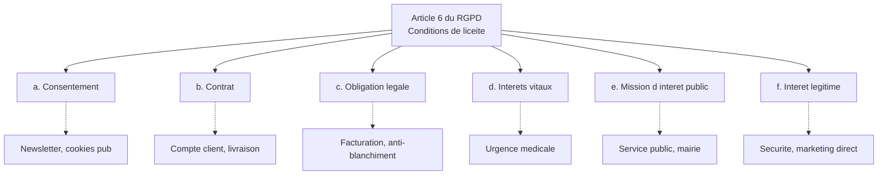
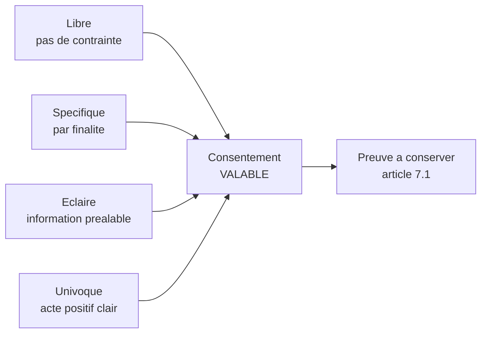
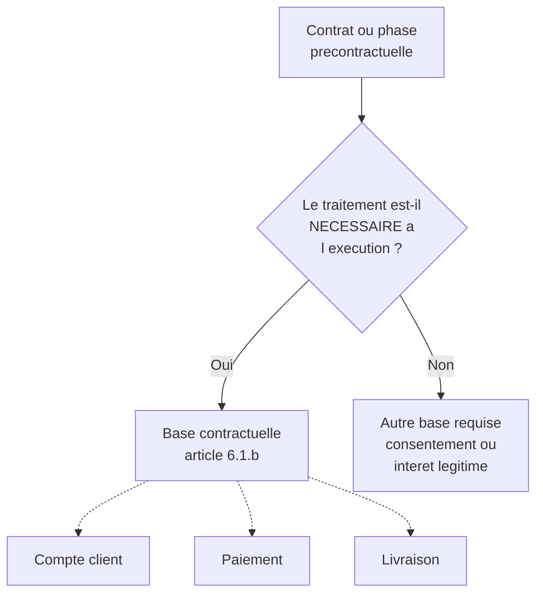
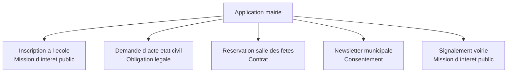
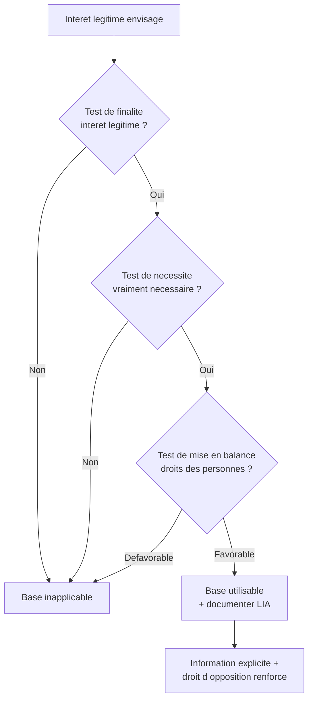
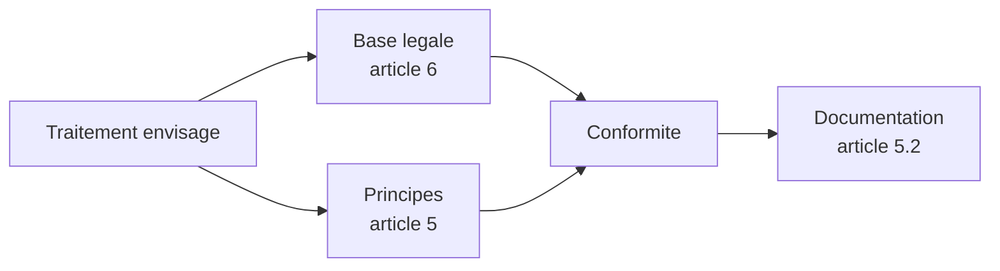

# Les six bases légales de l'article 6

## Introduction

Avez-vous remarqué qu'au restaurant, la même bouteille de vin peut
être servie pour des raisons très différentes ? Le sommelier vous
l'offre parce que c'est votre anniversaire (cadeau) ; un client la
commande à la carte (achat) ; le propriétaire la sert à des amis en
back-office (privé) ; un journaliste y goûte pour son article
(travail) ; les pompiers la confisquent à un mineur (obligation).
Cinq usages, cinq raisons légitimes différentes. Pour chacune, on
peut justifier pourquoi cette bouteille circule. En droit du RGPD,
c'est pareil : pour chaque traitement de données personnelles, il
faut être capable d'invoquer une raison légitime, appelée « base
légale ».

L'article 6 du RGPD énumère **six bases légales** possibles, et une
seule suffit pour rendre un traitement licite. Cette partie vous
présente chacune d'elles, avec leurs critères, leurs forces, leurs
limites, et surtout les pièges à éviter. À la fin, vous serez
capable de désigner avec certitude la base légale appropriée pour
n'importe quel traitement, et de la défendre devant un DPO. C'est
une compétence quotidienne pour tout développeur d'applications
qui touche aux données personnelles.

### Vue d'ensemble des six bases légales

Avant d'entrer dans le détail de chaque base, prenons un instant
pour les visualiser ensemble. Cela vous donnera une boussole pour
naviguer dans les situations concrètes : quand vous devrez trancher
entre deux bases possibles, vous reviendrez à cette vue d'ensemble.



> **Note** : ces six bases sont **alternatives**. Pour un même
> traitement, il faut en choisir une et une seule, et cette base
> doit être identifiée et documentée dès la conception. On ne peut
> pas « hésiter » ou « choisir plus tard ».

#### Exemple pratique {id="exemple-pratique-2-1"}

Voyons comment ces bases se répartissent typiquement dans une
application de e-commerce classique :

| Traitement | Base légale recommandée |
|------------|-------------------------|
| Création de compte client | Contrat (b) |
| Traitement de la commande | Contrat (b) |
| Facturation et comptabilité | Obligation légale (c) |
| Lutte anti-fraude | Intérêt légitime (f) |
| Newsletter promotionnelle | Consentement (a) |
| Cookies de publicité ciblée | Consentement (a) |
| Suivi de la qualité de service | Intérêt légitime (f) |
| Réponse à une demande de la justice | Obligation légale (c) |

Vous voyez qu'un site banal mobilise déjà au moins quatre bases
légales différentes. C'est cette diversité qu'il faut savoir
qualifier au cas par cas.

### Première base : le consentement (article 6.1.a)

Quand un ami vous propose une boisson et que vous répondez « oui,
volontiers ! », c'est un consentement éclatant. Mais s'il vous tend
le verre sans rien demander, c'est différent. Et s'il vous le tend
en murmurant « c'est de l'eau » alors que c'est du sirop ? Encore
différent. Le RGPD encadre très précisément ce qu'est un consentement
**valable**, et la barre est haute, parce que le consentement est
l'expression la plus directe de la volonté de la personne.

L'article 4.11 du RGPD définit le consentement comme « toute
manifestation de volonté, libre, spécifique, éclairée et univoque
par laquelle la personne concernée accepte, par une déclaration ou
par un acte positif clair, que des données à caractère personnel la
concernant fassent l'objet d'un traitement ». Quatre adjectifs
qualifient le consentement valable, et chacun a un sens technique
précis :

- **Libre** : la personne doit pouvoir refuser sans subir de
  conséquence négative. Un consentement forcé n'est pas un
  consentement.
- **Spécifique** : un consentement par finalité, pas un consentement
  global. Si vous proposez à la fois newsletter et publicité ciblée,
  deux cases distinctes sont nécessaires.
- **Éclairé** : la personne doit savoir à quoi elle consent. Cela
  implique une information préalable sur les finalités, les
  destinataires, la durée.
- **Univoque** : le consentement doit s'exprimer par un acte positif
  clair. Les cases pré-cochées, le silence, l'inaction ou la simple
  poursuite de la navigation ne valent pas consentement.



Le consentement doit pouvoir être **retiré aussi facilement qu'il a
été donné** (article 7.3). Cela impose techniquement un lien de
désinscription dans chaque email, un paramètre clair dans
l'application, ou une fonctionnalité de gestion des préférences
accessible en permanence. Le retrait n'a pas d'effet rétroactif :
les traitements effectués avant restent licites, mais doivent cesser
après.

Un point essentiel : **conserver la preuve** du consentement
(article 7.1). En cas de contrôle CNIL ou de litige, vous devez
pouvoir démontrer qu'une personne donnée a consenti à un traitement
donné, à une date donnée, avec une version donnée des conditions.
Cela impose une architecture technique de traçabilité du
consentement.

#### Exemple pratique {id="exemple-pratique-2-2"}

Voici un modèle de table pour conserver la preuve des consentements :

```sql
CREATE TABLE user_consents (
    id BIGINT PRIMARY KEY,
    user_id BIGINT NOT NULL REFERENCES users(id),
    -- Finalite specifique : un consentement par finalite
    purpose VARCHAR(100) NOT NULL,
    -- Statut : actif, retire, expire
    status VARCHAR(20) NOT NULL,
    -- Tracabilite
    consent_text_version VARCHAR(20) NOT NULL,
    given_at TIMESTAMP,
    withdrawn_at TIMESTAMP,
    -- Preuve technique
    ip_address VARCHAR(45),
    user_agent VARCHAR(500),
    -- Source du consentement
    source VARCHAR(100)
);

-- Index pour retrouver rapidement l etat actuel
CREATE INDEX idx_user_consents_active
    ON user_consents(user_id, purpose, status);
```

Cette table permet de répondre à toute question d'audit : qui a
consenti à quoi, quand, à quelle version des conditions, depuis
quelle IP. La conservation de l'IP est elle-même un traitement qui
doit être justifié et limité dans le temps, mais elle constitue un
élément de preuve crucial.

#### Exercice 1

Analysez ces situations et indiquez si le consentement recueilli
est valable au sens du RGPD. Justifiez en quelques lignes.

a) Lors de l'inscription, une case pré-cochée indique « J'accepte de
recevoir des offres commerciales de nos partenaires ».
b) Pour créer un compte sur un site, l'utilisateur doit cocher une
case « J'accepte que mes données soient utilisées à des fins
publicitaires », sinon il ne peut pas s'inscrire.
c) Une bannière cookies affiche « En continuant la navigation, vous
acceptez l'utilisation des cookies ».
d) Un formulaire propose « J'accepte de recevoir la newsletter ET
les offres partenaires », en une seule case.
e) Sur un site, un bouton « Tout accepter » est très visible et un
lien « Refuser » est en petits caractères gris.

##### Correction exercice 1 {collapsible="true"}

a) **Non valable**. La case pré-cochée n'est pas un acte positif
clair (critère d'univocité). La CNIL et la CJUE ont confirmé à
plusieurs reprises que les cases pré-cochées ne valent pas
consentement.

b) **Non valable**. Le consentement n'est pas libre : l'utilisateur
ne peut pas refuser sans subir de conséquence (impossibilité de
s'inscrire). Or la finalité publicitaire n'est pas nécessaire à la
création du compte. Il y a couplage abusif, sanctionné par le RGPD.

c) **Non valable**. La poursuite de la navigation n'est pas un acte
positif clair. C'est précisément la pratique condamnée par la CJUE
dans l'arrêt Planet49 et par la CNIL à plusieurs reprises depuis
2020.

d) **Non valable**. Le consentement n'est pas spécifique : la
newsletter et les offres partenaires sont deux finalités distinctes
qui exigent deux cases distinctes.

e) **Probablement non valable**. Le déséquilibre visuel rend le
consentement non libre : l'utilisateur n'a pas une véritable
alternative équivalente. La CNIL a sanctionné Google et Facebook
notamment pour cette pratique en 2022.

### Deuxième base : l'exécution d'un contrat (article 6.1.b)

Quand vous commandez une pizza par téléphone, le restaurant a
besoin de votre adresse pour vous la livrer. Vous ne lui « consentez »
pas à recevoir votre adresse : vous la donnez parce que c'est
nécessaire à l'exécution de votre commande. C'est la logique de la
base contractuelle. Pour beaucoup de traitements, c'est la base la
plus simple et la plus solide, à condition de ne pas en abuser.

L'article 6.1.b prévoit que le traitement est licite s'il est
nécessaire à l'exécution d'un contrat auquel la personne concernée
est partie, ou à l'exécution de mesures précontractuelles prises à
sa demande. Concrètement, cela couvre tous les traitements qui sont
indispensables pour fournir le service que l'utilisateur a souscrit.

Le mot-clé est **nécessaire** : seules les données strictement
nécessaires à l'exécution du contrat peuvent reposer sur cette base.
Pour livrer un colis, j'ai besoin de l'adresse, du nom et d'un moyen
de contact. Mais je n'ai pas besoin de la date de naissance, du
genre, ou des préférences politiques. Si je collecte ces données, je
dois invoquer une autre base légale (consentement par exemple).



La CNIL et le CEPD ont précisé que la base contractuelle ne peut pas
être invoquée abusivement. Par exemple, la personnalisation
publicitaire n'est pas « nécessaire » à l'exécution du contrat de
fourniture d'un service, même si l'éditeur prétend qu'elle finance
le service. C'est le sens des décisions récentes contre Meta : la
publicité ciblée doit reposer sur le consentement, pas sur le
contrat.

#### Exemple pratique {id="exemple-pratique-2-3"}

Distinguons clairement, pour une app de livraison de repas, ce qui
relève du contrat et ce qui n'en relève pas :

```sql
-- Tableau de justification base par base
-- Base contractuelle :
--   email, mot de passe (acces au compte)
--   prenom (interaction avec le livreur)
--   adresse de livraison (livraison)
--   moyen de paiement (paiement)
--   numero de telephone (contact livreur)
--   historique des commandes (suivi de la prestation)

-- Pas contractuel - autre base :
--   date de naissance (consentement, sauf produits 18+)
--   preferences alimentaires generales (consentement)
--   localisation continue (consentement)
--   profil publicitaire (consentement)
```

Cette discipline est essentielle. Beaucoup d'entreprises tombent
dans le piège du « tout-contrat » : elles invoquent la base
contractuelle pour tout, parce qu'elle est plus simple à gérer que
le consentement. C'est une erreur sanctionnée régulièrement.

### Troisième base : l'obligation légale (article 6.1.c)

Quand le fisc vous demande votre déclaration de revenus, vous ne
pouvez pas dire « je ne consens pas ». Quand votre banque doit
signaler une opération suspecte à TRACFIN, elle ne demande pas votre
avis. Quand un employeur conserve les bulletins de paie pendant
cinq ans, c'est imposé par la loi. Toutes ces situations relèvent
de la base de l'**obligation légale**.

L'article 6.1.c prévoit que le traitement est licite s'il est
nécessaire au respect d'une obligation légale à laquelle le
responsable de traitement est soumis. Cette base s'applique
typiquement à :

- la facturation et la comptabilité (Code de commerce) ;
- les obligations fiscales (déclarations, conservation) ;
- les bulletins de paie (Code du travail) ;
- la lutte anti-blanchiment (Code monétaire et financier) ;
- les réquisitions judiciaires ;
- certaines obligations RH et sociales.

Le critère central est qu'il doit exister un **texte légal européen
ou national** qui impose le traitement. Une « bonne pratique »
sectorielle ou une convention collective ne suffisent pas en
général. Et l'obligation doit être suffisamment claire et
précise : un texte vague comme « les entreprises doivent assurer
leur sécurité » ne justifie pas en soi un traitement précis.

#### Exemple pratique {id="exemple-pratique-2-4"}

Voici une matrice des principales obligations légales de conservation
en France, utile pour paramétrer un système d'archivage automatique :

| Document | Durée | Texte applicable |
|----------|-------|------------------|
| Factures | 10 ans | Article L123-22 Code de commerce |
| Bulletins de paie | 5 ans | Article L3243-4 Code du travail |
| Contrats commerciaux | 5 ans | Article 2224 Code civil |
| Contrats de travail | 5 ans après départ | Code du travail |
| Documents fiscaux | 6 à 10 ans | Livre des procédures fiscales |
| Justificatifs KYC | 5 ans | Code monétaire et financier |

Ces durées ne sont **pas négociables** : elles s'imposent au
responsable de traitement et l'utilisateur ne peut pas demander la
suppression de ces données pendant la durée légale. C'est l'un des
points qui surprennent souvent les utilisateurs qui demandent
l'effacement.

### Quatrième base : la sauvegarde d'intérêts vitaux (article 6.1.d)

Imaginez qu'un randonneur s'évanouisse au sommet du Mont-Blanc. Les
secours arrivent, lui prennent du sang, accèdent à son téléphone
pour appeler ses proches, consultent son dossier médical en urgence.
Il ne peut pas consentir, mais sa vie est en jeu. C'est exactement
le cas couvert par la base des intérêts vitaux.

L'article 6.1.d prévoit que le traitement est licite s'il est
nécessaire à la sauvegarde des intérêts vitaux de la personne
concernée ou d'une autre personne physique. Cette base est
**exceptionnelle** et ne s'applique que dans des situations
d'urgence où il est impossible d'obtenir un autre fondement
(consentement notamment). Elle vise typiquement les urgences
médicales, les situations de catastrophe naturelle, les
épidémies.

Le considérant 46 du RGPD précise que cette base ne devrait être
mobilisée qu'en dernier recours, lorsqu'aucune autre base ne peut
manifestement servir de fondement juridique. Dans la pratique du
développeur, cette base est rarement mobilisée : elle concerne
surtout les applications de santé d'urgence, de protection civile,
ou de sécurité.

### Cinquième base : la mission d'intérêt public (article 6.1.e)

Quand votre mairie vous adresse votre carte d'électeur, quand la
préfecture traite votre demande de permis, quand un hôpital public
vous soigne, ils n'ont pas besoin de votre consentement : ils
remplissent une mission d'intérêt public confiée par la loi. C'est
la cinquième base légale, propre au secteur public et à certaines
missions de service public.

L'article 6.1.e prévoit que le traitement est licite s'il est
nécessaire à l'exécution d'une mission d'intérêt public ou relevant
de l'exercice de l'autorité publique dont est investi le responsable
de traitement. Cette base concerne :

- l'État, les collectivités territoriales et leurs établissements ;
- les organismes de sécurité sociale ;
- les autorités administratives indépendantes ;
- les délégataires de service public (transports publics, eau,
  etc.) pour leurs missions de service public.

Une attention particulière s'impose : si une mairie gère un service
public, elle utilise cette base ; mais si la même mairie organise
un événement payant, elle peut être dans une logique contractuelle
pour la billetterie. Il faut bien distinguer les périmètres.

#### Exemple pratique {id="exemple-pratique-2-5"}

Voici comment se répartissent les bases légales dans une application
municipale typique :



### Sixième base : l'intérêt légitime (article 6.1.f)

Vous êtes dans la rue, vous voyez quelqu'un en train de forcer la
serrure d'une voiture. Vous n'avez pas son consentement pour
mémoriser sa description, mais vous le faites quand même parce que
c'est dans votre intérêt légitime (et celui du propriétaire). Sur le
plan numérique, c'est un peu la logique de la base de l'**intérêt
légitime** : permettre des traitements raisonnables pour le bon
fonctionnement de l'organisation, à condition qu'ils ne portent pas
atteinte aux droits des personnes.

L'article 6.1.f prévoit que le traitement est licite s'il est
nécessaire aux fins des intérêts légitimes poursuivis par le
responsable de traitement ou par un tiers, à moins que ne prévalent
les intérêts ou les libertés et droits fondamentaux de la personne
concernée. Cette base ne peut **pas** être utilisée par les
autorités publiques dans l'exercice de leurs missions.

C'est la base la plus souple, mais aussi la plus exigeante en
documentation. Pour l'invoquer, vous devez réaliser et conserver
une **balance des intérêts** (souvent appelée *Legitimate Interest
Assessment* ou LIA) qui examine trois questions :

1. **Test de finalité** : l'intérêt poursuivi est-il légitime,
   précis, explicite, réel ?
2. **Test de nécessité** : le traitement est-il vraiment nécessaire
   à cet intérêt ? N'existe-t-il pas un moyen moins intrusif ?
3. **Test de mise en balance** : les droits et libertés des personnes
   ne prévalent-ils pas sur cet intérêt ?



Exemples typiques de finalités relevant de l'intérêt légitime :

- la sécurité du système d'information (lutte contre les attaques) ;
- la prévention de la fraude (lutte anti-fraude commerciale) ;
- la prospection commerciale auprès des clients existants (sous
  réserve d'opt-out facile) ;
- l'amélioration des produits via des statistiques d'usage internes.

Attention : la prospection commerciale auprès de **prospects non
clients** relève en revanche du consentement, conformément à la
directive ePrivacy.

#### Exercice 2

Pour chacune des situations suivantes, indiquez la base légale la
plus appropriée et justifiez en deux ou trois lignes :

a) Une banque vérifie l'identité de ses clients selon les règles
anti-blanchiment.
b) Une plateforme SaaS envoie un email mensuel aux clients pour leur
indiquer les nouveautés du produit.
c) Une mairie publie en open data les délibérations du conseil
municipal (anonymisées).
d) Une appli de fitness propose à ses utilisateurs d'activer un
suivi de leur fréquence cardiaque pendant l'effort.
e) Un site marchand utilise un système anti-fraude pour détecter
les paiements suspects.

##### Correction exercice 2 {collapsible="true"}

a) **Obligation légale** (article 6.1.c). Le contrôle KYC découle
du Code monétaire et financier. La banque n'a pas le choix.

b) **Intérêt légitime** (article 6.1.f). La communication d'information
sur le produit auprès de clients existants est une finalité
légitime, peu intrusive, et conforme à leurs attentes raisonnables.
Un opt-out facile doit toutefois être prévu. Note : si la newsletter
contient des éléments purement commerciaux dépassant le cadre des
mises à jour produit, on rebascule sur du consentement.

c) **Mission d'intérêt public** (article 6.1.e). La publication des
délibérations municipales découle d'une mission de transparence
démocratique. L'anonymisation préalable des données personnelles
allège le régime.

d) **Consentement** (article 6.1.a). Le suivi de la fréquence
cardiaque est une donnée sensible (santé, article 9) et exige un
consentement explicite, en plus d'une activation volontaire par
l'utilisateur.

e) **Intérêt légitime** (article 6.1.f). La prévention de la fraude
est un intérêt légitime expressément reconnu par le considérant 47
du RGPD. Documentation de la balance des intérêts requise.

### Le couplage entre principes et bases légales

Maintenant que vous connaissez les sept principes et les six bases
légales, vous pouvez les articuler. Chaque traitement doit
**simultanément** respecter les sept principes et reposer sur une
base légale identifiée. Ce double critère est ce qui distingue une
analyse RGPD professionnelle d'une analyse approximative.



Pour chaque nouveau traitement, posez-vous donc cette double
question :

- Quelle base légale parmi les six ?
- Comment chacun des sept principes est-il respecté ?

C'est la grille d'analyse mentale qui vous protégera durablement.

## Exercice final

Vous êtes développeur en mission au sein d'une startup parisienne qui
vient de lever des fonds pour lancer une application mobile de
gestion du sommeil. L'application propose : un suivi quotidien des
cycles de sommeil grâce à l'accéléromètre du smartphone, un journal
de bord personnel pour noter ses ressentis, des conseils
personnalisés générés par un coach IA, une fonctionnalité de partage
avec son médecin traitant, et un mode communauté avec des défis
collectifs entre utilisateurs. La startup envisage également de
revendre des analyses agrégées à des laboratoires pharmaceutiques.

Pour chacune des fonctionnalités ci-dessus, identifiez la base légale
appropriée et justifiez-la en mobilisant les notions du module.
Indiquez également quels principes de l'article 5 demandent une
vigilance particulière. Présentez votre travail sous la forme d'un
tableau de synthèse suivi d'un commentaire global.

### Correction exercice final {collapsible="true"}

**Tableau de synthèse**

| Fonctionnalité | Base légale | Justification | Vigilance |
|----------------|-------------|---------------|-----------|
| Suivi des cycles de sommeil | Consentement (a) + art. 9 explicite | Donnée de santé, consentement spécifique requis | Minimisation, sécurité |
| Journal de ressentis | Consentement (a) + art. 9 | Données très intimes, état émotionnel | Sécurité, conservation |
| Coach IA personnalisé | Consentement (a) | Décision automatisée (art. 22) | Information renforcée |
| Partage avec médecin | Consentement (a) explicite | Donnée de santé, destinataire externe | Loyauté, transparence |
| Mode communauté | Consentement (a) | Diffusion à des tiers utilisateurs | Minimisation, sécurité |
| Revente aux labos | Consentement (a) ou anonymisation | Finalité distincte, à déclarer | Limitation des finalités |
| Création de compte | Contrat (b) | Nécessaire à la fourniture du service | Minimisation |
| Facturation premium | Obligation légale (c) | Comptabilité, conservation 10 ans | Limitation conservation |
| Lutte anti-fraude | Intérêt légitime (f) | Reconnu par le considérant 47 | Documentation LIA |

**Commentaire global**

Cette application est particulièrement sensible parce qu'elle
manipule à très grande échelle des données de santé (cycles de
sommeil, état émotionnel), qui relèvent de l'article 9 du RGPD.
Plusieurs points de vigilance ressortent :

1. **Le consentement est central** : la quasi-totalité des
   fonctionnalités principales repose sur un consentement explicite,
   ce qui impose une architecture d'accueil claire, granulaire, et
   réversible. L'utilisateur doit pouvoir refuser la communauté
   sans perdre l'accès au suivi, par exemple. Couplage abusif à
   éviter absolument.

2. **L'article 9 impose des consentements explicites distincts**
   pour les traitements de données de santé. Une AIPD est
   obligatoire, et la sécurité doit être renforcée (chiffrement
   applicatif, pseudonymisation, journalisation détaillée).

3. **La revente aux laboratoires ne peut pas reposer sur le contrat
   ni sur l'intérêt légitime** : c'est une finalité distincte qui
   exige soit un consentement spécifique explicite, soit une
   anonymisation préalable robuste (agrégation, suppression des
   identifiants directs et indirects).

4. **Le coach IA personnalisé** peut soulever l'article 22 du RGPD
   (décisions automatisées). Il faut prévoir une information
   renforcée et la possibilité d'obtenir une intervention humaine.

5. **Le principe de minimisation** demande de ne collecter via
   l'accéléromètre que ce qui est nécessaire au suivi du sommeil,
   sans dériver vers d'autres usages (suivi de l'activité sportive,
   géolocalisation, etc.) sans nouvelle base et nouveau consentement.

6. **Le principe de limitation de la conservation** demande des
   durées différenciées : suivi récent (12 à 24 mois), journal
   (durée d'utilisation du compte), facturation (10 ans). Une
   politique automatisée doit être mise en place.

La feuille de route prioritaire : conduite d'une AIPD, désignation
formelle d'un DPO compte tenu de la nature des données, signature
de DPA avec les sous-traitants techniques, architecture de
consentement granulaire, séparation logique entre les données
identifiantes et les données de santé.

## Conclusion de la partie

Vous savez désormais énumérer les six bases légales du RGPD,
identifier celle qui s'applique à un traitement donné, et défendre
votre choix face à un DPO ou un juriste. Vous avez compris que ces
bases ne sont pas interchangeables et que choisir la mauvaise base
peut entraîner une non-conformité durable.

Retenez ces réflexes de tri qui vous serviront au quotidien :

- pour les traitements **nécessaires** au service souscrit, c'est
  le contrat ;
- pour les obligations **imposées par la loi**, c'est l'obligation
  légale ;
- pour les traitements **utiles mais non nécessaires**, c'est
  souvent l'intérêt légitime avec balance documentée ;
- pour la **publicité ciblée, les cookies non essentiels, le
  partage à des tiers** marketing, c'est presque toujours le
  consentement ;
- pour les **services publics**, c'est la mission d'intérêt public.

La partie suivante affinera ces choix en explorant le régime
particulier des données sensibles et les conditions de validité
techniques d'un consentement.
