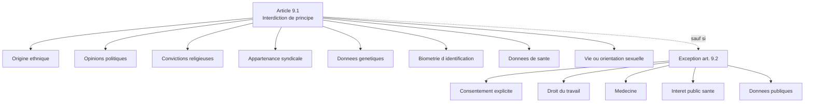
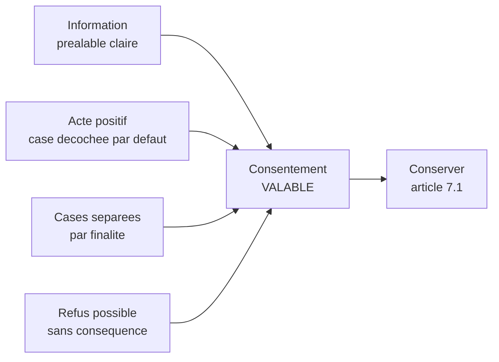

# Données sensibles et consentement valide

## Introduction

Connaissez-vous le concept de « cercle de confiance » ? Vous racontez
votre journée à vos collègues, vos joies et vos peines à vos amis,
vos questionnements profonds à votre conjoint ou conjointe, et
certaines choses, vous ne les confiez qu'à vous-même. Chaque cercle
correspond à un degré d'intimité différent, et la divulgation hors
du cercle peut faire mal. Le RGPD reconnaît cette intuition humaine
en distinguant les données ordinaires des données dites
« sensibles », pour lesquelles il prévoit une protection renforcée.
De la même manière, lorsque l'on demande à quelqu'un d'ouvrir son
cercle de confiance, on ne le fait pas n'importe comment : le RGPD
impose des conditions précises pour qu'un consentement soit
réellement valable.

Cette partie est cruciale parce qu'elle concentre deux sources de
risques majeurs dans les applications modernes : la manipulation
imprudente de données sensibles, et le recueil bâclé de consentements
qui ne tiennent pas devant un audit. Vous allez apprendre à
identifier les zones à très haut risque et à concevoir des interfaces
de consentement qui passent l'épreuve d'un contrôle CNIL.

### Le régime particulier des données sensibles (article 9)

Avez-vous déjà eu cette expérience de remplir un questionnaire en
ligne et de tomber sur une question gênante : « Quelle est votre
religion ? Êtes-vous engagé politiquement ? Quel est votre état de
santé ? ». Vous hésitez, vous vous demandez pourquoi on vous le
demande, vous craignez les conséquences. Cette hésitation, le RGPD
la prend très au sérieux. Pour ces données particulièrement
intimes, il pose un principe simple : **leur traitement est
interdit**, sauf exception strictement encadrée.

L'article 9.1 énonce une **interdiction de principe** du traitement
de plusieurs catégories de données :

- l'origine raciale ou ethnique ;
- les opinions politiques ;
- les convictions religieuses ou philosophiques ;
- l'appartenance syndicale ;
- les données génétiques ;
- les données biométriques aux fins d'identifier une personne ;
- les données concernant la santé ;
- les données concernant la vie ou l'orientation sexuelle.

Cette interdiction n'est levée que dans dix cas exceptionnels prévus
à l'article 9.2. Les plus utiles pour un développeur sont :

- le **consentement explicite** de la personne (art. 9.2.a) ;
- la nécessité pour exécuter des obligations en matière de **droit
  du travail** ou de protection sociale (art. 9.2.b) ;
- la **médecine préventive** ou la médecine du travail
  (art. 9.2.h) ;
- l'**intérêt public** dans le domaine de la santé publique
  (art. 9.2.i) ;
- le fait que les données soient **manifestement rendues publiques**
  par la personne (art. 9.2.e).



Trois précisions importantes pour le développeur :

1. **Le consentement pour les données sensibles doit être explicite**.
   Cette exigence est plus stricte que pour le consentement
   « ordinaire ». Une case à cocher explicite, accompagnée d'un texte
   clair indiquant qu'on consent au traitement d'une donnée
   sensible, est nécessaire.

2. **La biométrie n'est sensible que lorsqu'elle vise à identifier
   une personne**. Une photo de profil n'est pas sensible en
   elle-même, mais devient sensible si elle est traitée par un
   algorithme de reconnaissance faciale. Cette distinction est
   importante pour les applications de comparaison photo.

3. **Les données qui révèlent indirectement** une donnée sensible
   peuvent être traitées comme sensibles. Par exemple, une liste de
   participants à une manifestation politique, même sans mention
   explicite de l'opinion, révèle des opinions politiques.

#### Exemple pratique {id="exemple-pratique-3-1"}

Voici un schéma de base de données pour une application de santé
qui distingue clairement les données sensibles, avec les
préoccupations techniques associées :

```sql
-- Table principale : separation des donnees sensibles
CREATE TABLE patients (
    id BIGINT PRIMARY KEY,
    -- Donnees personnelles classiques (art. 4.1)
    email VARCHAR(255) NOT NULL UNIQUE,
    pseudo VARCHAR(100) NOT NULL,
    last_name_encrypted VARBINARY(512),
    first_name_encrypted VARBINARY(512),
    created_at TIMESTAMP NOT NULL DEFAULT CURRENT_TIMESTAMP
);

-- Table separee pour les donnees sensibles (art. 9)
-- Stockage dans un schema dedie avec controle d acces strict
CREATE TABLE patient_health_data (
    id BIGINT PRIMARY KEY,
    patient_id BIGINT NOT NULL REFERENCES patients(id),
    -- Donnees sensibles : chiffrement obligatoire
    blood_type_encrypted VARBINARY(512),
    allergies_encrypted TEXT,
    chronic_conditions_encrypted TEXT,
    -- Tracabilite renforcee
    last_accessed_by VARCHAR(100),
    last_accessed_at TIMESTAMP,
    consent_id BIGINT NOT NULL REFERENCES user_consents(id)
);

-- Journal d acces aux donnees sensibles
CREATE TABLE health_access_log (
    id BIGINT PRIMARY KEY,
    patient_id BIGINT NOT NULL,
    accessed_by VARCHAR(100) NOT NULL,
    access_type VARCHAR(50) NOT NULL,
    access_reason VARCHAR(255),
    accessed_at TIMESTAMP NOT NULL DEFAULT CURRENT_TIMESTAMP
);
```

Trois points clés dans cette architecture :

- **Séparation logique** entre données identifiantes et données
  sensibles dans deux tables distinctes ;
- **Chiffrement applicatif** des données sensibles, pas seulement
  au niveau du SGBD ;
- **Journalisation systématique** des accès aux données sensibles,
  pour permettre l'audit en cas de contrôle ou d'incident.

> **Note** : ces mesures sont des minima. Pour une application de
> santé réelle, il faut également envisager : pseudonymisation des
> données dans les bases de test, chiffrement de bout en bout pour
> les échanges, hébergement HDS (Hébergeur de Données de Santé)
> certifié.

#### Exercice 1

Pour chacune des données suivantes, indiquez s'il s'agit d'une
donnée sensible au sens de l'article 9, et justifiez en une phrase.

a) Le nom de l'association à laquelle vous adhérez (« Club de
randonnée du Lac »).  
b) Le nom de votre syndicat (« CGT-Métallurgie »).  
c) Votre signature manuscrite scannée pour authentifier un document.   
d) Votre empreinte digitale utilisée pour déverrouiller votre
téléphone.  
e) La photo de votre carte vitale.  
f) Votre commentaire public sur un blog politique relayant un
discours politique précis.  

##### Correction exercice 1 {collapsible="true"}

a) **Non sensible**. Le nom d'une association de loisirs ne révèle
rien sur les opinions, la religion ou l'orientation politique. C'est
une donnée personnelle classique.

b) **Sensible**. Le nom du syndicat révèle l'appartenance
syndicale, expressément visée à l'article 9.

c) **Non sensible en général**. La signature manuscrite n'est pas
considérée comme une donnée biométrique d'identification au sens de
l'article 9 sauf si elle est traitée par un algorithme
d'identification automatique unique.

d) **Sensible**. L'empreinte digitale est une donnée biométrique
utilisée pour identifier la personne, donc sensible. Notez que pour
le déverrouillage du téléphone, l'empreinte est généralement traitée
localement et stockée dans une enclave sécurisée, ce qui change le
régime applicable.

e) **Sensible**. La carte vitale contient à la fois le NIR
(identifiant national) et des informations relatives à la couverture
médicale qui révèlent indirectement des données de santé.

f) **Sensible**. La donnée a été manifestement rendue publique par
la personne, mais elle reste sensible (opinion politique). L'article
9.2.e prévoit toutefois une exception qui permet son traitement,
moyennant des garanties.

### Conditions de validité d'un consentement

Quand un site vous affiche une bannière cookies avec un bouton « Tout
accepter » géant et un lien « Refuser » microscopique en gris pâle,
votre consentement, même si vous cliquez sur « Tout accepter », n'est
pas vraiment libre. Et la CNIL le sait. Et elle sanctionne. Cette
sous-partie va vous donner les critères techniques pour concevoir une
expérience de consentement qui résiste à un contrôle.

Le consentement est défini à l'article 4.11, et son régime est
développé à l'article 7. Les conditions de validité sont au nombre
de quatre, déjà évoquées dans la partie précédente, qu'on va
décliner ici sur le plan opérationnel.

#### Libre : pas de contrainte ni de couplage

Le consentement n'est libre que si la personne peut refuser sans
subir de conséquence négative. Ce critère élimine plusieurs
pratiques courantes :

- **Couplage abusif** : conditionner l'accès à un service à un
  consentement non nécessaire à ce service. Exemple : « Pour vous
  inscrire, vous devez consentir à la publicité personnalisée ».
- **Pression hiérarchique** : un employeur qui demande un
  consentement à son salarié se trouve en situation de déséquilibre,
  rendant le consentement difficilement libre.
- **Pression contextuelle** : un bouton « OK » immédiatement
  accessible et un bouton « Refuser » caché dans plusieurs niveaux
  de menu n'offrent pas un choix réellement libre.

#### Spécifique : un consentement par finalité

Chaque finalité distincte exige un consentement distinct. On ne
peut pas demander d'un seul geste à la fois :

- la souscription à la newsletter ;
- la personnalisation publicitaire ;
- le partage avec des partenaires commerciaux.

Ce sont trois finalités séparées, qui exigent trois cases à cocher
indépendantes, chacune avec une description claire.

#### Éclairé : information préalable suffisante

Pour consentir, encore faut-il savoir à quoi. L'information préalable
doit comporter, au minimum :

- l'identité du responsable de traitement ;
- les finalités du traitement ;
- les destinataires ou catégories de destinataires ;
- l'existence du droit de retirer le consentement ;
- les autres droits (accès, rectification, effacement, etc.) ;
- la durée de conservation ou les critères pour la déterminer.

Cette information doit être délivrée dans un langage clair, sans
jargon juridique, et accessible avant l'expression du consentement.

#### Univoque : un acte positif clair

Le consentement doit s'exprimer par un acte positif clair, qui
indique sans ambiguïté la volonté de consentir. Sont **exclus** :

- les cases pré-cochées ;
- le silence ou l'inaction ;
- la poursuite de la navigation sur un site ;
- l'acceptation des CGU comme valant consentement aux traitements
  marketing.



#### Exemple pratique {id="exemple-pratique-3-2"}

Voici un exemple de bannière de consentement conforme aux exigences
CNIL pour les cookies, présentée en HTML simplifié :

```html
<div class="cookie-banner" role="dialog" aria-label="Cookies">
    <h2>Vos cookies, votre choix</h2>

    <p>
        Nous utilisons des cookies pour assurer le fonctionnement
        du site (necessaires) et, avec votre accord, pour mesurer
        l audience et personnaliser les publicites.
    </p>

    <p>
        Vous pouvez accepter, refuser ou personnaliser vos choix.
        Vous pourrez modifier votre choix a tout moment via le lien
        en pied de page.
    </p>

    <div class="buttons-equal-weight">
        <button id="accept-all" type="button">
            Tout accepter
        </button>
        <button id="reject-all" type="button">
            Tout refuser
        </button>
        <button id="customize" type="button">
            Personnaliser
        </button>
    </div>

    <p class="small">
        <a href="/cookies">En savoir plus sur les cookies</a>
    </p>
</div>
```

Les points cruciaux dans cet exemple :

- les **trois boutons** ont la même importance visuelle ;
- le **bouton « Refuser »** est aussi visible que le bouton
  « Accepter » ;
- l'**information préalable** mentionne les finalités principales
  avant tout dépôt ;
- un **lien permanent** pour modifier les choix est prévu ;
- aucun cookie non essentiel n'est déposé tant que l'utilisateur
  n'a pas choisi.

> **Note** : la mise en œuvre technique exige également : un
> blocage effectif des cookies avant choix, une persistance du choix
> raisonnable (13 mois maximum recommandés), et la possibilité de
> retirer le consentement aussi facilement qu'il a été donné.

#### Exercice 2

Vous auditez une bannière de consentement présentant les
caractéristiques suivantes : titre « Nous utilisons des cookies »,
texte explicatif court, deux boutons « OK » (vert vif, taille
grande) et « Paramétrer » (gris pâle, petite taille). Au clic sur
« Paramétrer », l'utilisateur arrive sur une page avec quatre
cases pré-cochées (analytique, publicité, personnalisation, partage
réseaux sociaux) et un bouton « Enregistrer mes préférences ». Le
bouton « Tout refuser » n'existe pas.

Identifiez les non-conformités au regard des conditions de validité
du consentement et proposez les corrections nécessaires.

##### Correction exercice 2 {collapsible="true"}

Non-conformités identifiées :

1. **Absence de bouton « Tout refuser » au premier niveau** : le
   refus doit être aussi facile que l'acceptation. La CNIL exige
   depuis 2020 que ce bouton soit présent et de visibilité
   équivalente au bouton d'acceptation.

2. **Déséquilibre visuel entre les options** : le bouton « OK »
   vert vif et grand contre un « Paramétrer » gris et petit n'offre
   pas un choix libre. C'est précisément ce type de design qui a
   été sanctionné par la CNIL dans plusieurs décisions.

3. **Cases pré-cochées** : sur la page de paramétrage, les cases
   pré-cochées sont expressément exclues par le RGPD et la CJUE
   (arrêt Planet49). Le consentement n'est pas univoque.

4. **Information insuffisante au premier niveau** : un texte « court »
   ne suffit pas si les finalités précises ne sont pas mentionnées.
   L'utilisateur doit pouvoir comprendre, dès la première vue, à
   quoi il consentirait.

Corrections proposées :

- Ajouter un bouton « Tout refuser » au premier niveau, de
  visibilité et d'accessibilité équivalentes aux boutons « Tout
  accepter » et « Personnaliser ».
- Harmoniser les styles visuels des trois boutons (même couleur de
  fond, même taille, même typographie).
- Décocher toutes les cases sur la page de paramétrage. L'utilisateur
  doit faire le choix actif de cocher chaque catégorie.
- Étoffer l'information préalable : finalités précises, durée de
  conservation, destinataires, droits de la personne, lien vers la
  politique cookies complète.
- Bloquer techniquement le dépôt de tout cookie non essentiel tant
  qu'aucun choix n'a été exprimé.
- Prévoir un mécanisme de réaffichage de la bannière (lien permanent
  en pied de page) pour permettre le retrait du consentement.

### Le cas particulier des mineurs

Quand un enfant de 11 ans s'inscrit sur un réseau social en
mentant sur son âge, le réseau social est-il en règle ? Quand une
plateforme de jeux récolte les données d'un adolescent de 14 ans,
peut-elle se contenter d'un clic ? Le RGPD prévoit un régime
spécifique pour les mineurs, qui est particulièrement strict en
France.

L'article 8 du RGPD prévoit que, pour les services de la société de
l'information offerts directement à un enfant, le traitement fondé
sur le consentement n'est licite que si l'enfant a au moins **16 ans**.
En dessous de cet âge, le consentement doit être donné ou autorisé
par le titulaire de la responsabilité parentale. Le RGPD permet aux
États membres d'abaisser ce seuil jusqu'à 13 ans.

En France, le seuil a été fixé à **15 ans** par la loi Informatique
et Libertés. Au-dessous de 15 ans, le consentement doit être
recueilli conjointement auprès du mineur et de ses parents.

Pour le développeur, cela soulève des questions techniques
non triviales :

- Comment vérifier l'âge réel d'un utilisateur ?
- Comment recueillir le consentement parental sans collecter
  excessivement des données ?
- Comment articuler ce double consentement dans une UX fluide ?

Plusieurs pistes existent : déclaration d'âge avec contrôle de
cohérence, demande d'un justificatif de l'identité parentale par
email, recours à des solutions tierces de vérification d'âge,
limitation de l'inscription aux 15 ans et plus avec des contrôles
d'usage. Aucune solution n'est parfaite, et la CNIL admet une
approche par les risques, pour autant que l'on documente sa
démarche.

## Exercice final

Vous êtes développeur indépendant, mandaté par une association
française qui veut lancer une application destinée à mettre en
relation des familles cherchant un soutien scolaire avec des
étudiants tuteurs. L'application devra collecter : pour les familles,
les coordonnées du parent inscripteur, l'âge et le prénom de l'enfant,
ses difficultés scolaires (matières concernées, éventuels troubles
diagnostiqués comme la dyslexie) ; pour les tuteurs, l'identité, le
parcours d'études, une photo de profil, parfois la situation
familiale, et un casier judiciaire à jour comme garantie.

Préparez une note d'analyse RGPD de cette future application en
abordant : (1) la qualification des données collectées (sensibles ou
non), (2) la base légale appropriée pour chaque traitement, (3) les
conditions de validité du consentement à mettre en place, (4) les
mesures techniques spécifiques pour les données sensibles, (5) le
régime applicable aux mineurs. Concluez sur les risques majeurs et
les recommandations prioritaires.

### Correction exercice final {collapsible="true"}

**Note d'analyse RGPD — Application de soutien scolaire**

**1. Qualification des données collectées**

Données personnelles classiques :

- Coordonnées du parent et du tuteur (nom, prénom, email, téléphone,
  adresse) ;
- Prénom et âge de l'enfant ;
- Parcours d'études du tuteur ;
- Photo de profil du tuteur (donnée personnelle, non sensible sauf
  reconnaissance faciale) ;
- Situation familiale du tuteur (sensible si elle révèle l'orientation
  sexuelle, sinon personnelle).

Données sensibles (article 9) :

- **Difficultés scolaires** : si elles incluent des troubles
  diagnostiqués (dyslexie, dyspraxie, TDAH, etc.), il s'agit de
  données de santé. Traitement strictement encadré.
- **Casier judiciaire du tuteur** : donnée pénale au sens de
  l'article 10. Son traitement est extrêmement restreint en droit
  français et nécessite généralement une habilitation légale
  spécifique.

**2. Bases légales recommandées**

| Traitement | Base légale |
|------------|-------------|
| Création du compte famille / tuteur | Contrat (b) |
| Coordonnées pour la mise en relation | Contrat (b) |
| Difficultés scolaires (matières uniquement) | Consentement (a) |
| Troubles diagnostiqués | Consentement explicite (9.2.a) |
| Photo de profil tuteur | Consentement (a) |
| Casier judiciaire | Problématique : pas de base évidente |
| Statistiques sur l usage | Intérêt légitime (f) |

**3. Le cas du casier judiciaire**

C'est le point le plus délicat. L'article 10 du RGPD prévoit que le
traitement des données pénales ne peut être effectué que sous le
contrôle de l'autorité publique ou si le traitement est autorisé
par le droit de l'Union ou d'un État membre. Une association privée
ne dispose pas, en principe, de cette habilitation.

Solutions à explorer :

- Demander au tuteur de **fournir lui-même** le justificatif au
  moment du recrutement, sans le stocker durablement (consultation
  seulement, puis destruction) ;
- Utiliser une attestation de bonne moralité sans information
  pénale détaillée ;
- Se conformer aux dispositions spécifiques pour le travail auprès
  des mineurs (extrait du bulletin n°2 à demander, mais avec des
  conditions strictes) ;
- Solliciter un avis juridique préalable de la CNIL si besoin.

**4. Conditions de validité du consentement**

Pour les difficultés scolaires et les troubles :

- consentement **explicite** (article 9.2.a) ;
- case décochée par défaut ;
- texte spécifique sur le traitement de données de santé ;
- information sur l'objectif précis (mise en relation avec un tuteur
  spécialisé, et non pas marketing) ;
- conservation de la preuve du consentement.

**5. Régime applicable aux mineurs**

Les enfants suivis sont par définition mineurs. En droit français
(loi Informatique et Libertés), le seuil est de **15 ans**. Pour
les enfants de moins de 15 ans, le consentement doit être recueilli
auprès du titulaire de la responsabilité parentale. Pour les enfants
de 15 à 17 ans, leur propre consentement suffit en théorie, mais
il est recommandé d'associer les parents pour les services
sensibles comme le soutien scolaire.

Techniquement :

- inscription effectuée **par le parent**, qui consent au nom de
  l'enfant pour les moins de 15 ans ;
- mention claire dans le formulaire de l'identité et de la qualité
  du parent ;
- information adaptée à l'enfant lui-même (langue claire, simplifiée).

**6. Mesures techniques spécifiques**

- **Séparation logique** : table dédiée pour les difficultés
  scolaires et troubles, séparée de la table des comptes.
- **Chiffrement applicatif** des données de santé.
- **Journalisation des accès** aux données sensibles.
- **Contrôle d'accès strict** : seuls les tuteurs sélectionnés
  doivent voir les difficultés des élèves qu'ils encadrent.
- **Hébergement français ou européen** au minimum, idéalement
  agréé pour les données scolaires.
- **AIPD obligatoire** : traitement à grande échelle de données
  sensibles concernant des mineurs.

**7. Risques majeurs et recommandations prioritaires**

- **Risque 1** : la collecte du casier judiciaire est juridiquement
  fragile. **Recommandation** : revoir la procédure de vérification
  pour éviter le stockage du casier ; consulter un juriste spécialisé
  ou demander un cadrage de la CNIL.
- **Risque 2** : la collecte de troubles diagnostiqués sans
  consentement explicite valide exposerait à des sanctions lourdes.
  **Recommandation** : interface de consentement adaptée et
  archivage rigoureux de la preuve.
- **Risque 3** : la sécurité technique insuffisante face à des
  données sensibles concernant des mineurs serait particulièrement
  grave en cas de violation. **Recommandation** : audit de
  sécurité avant lancement, chiffrement de bout en bout.

**Feuille de route prioritaire** : (a) AIPD avant lancement, (b)
clarification juridique sur le casier judiciaire, (c) architecture
de consentement granulaire, (d) sécurité renforcée, (e) désignation
d'un DPO compte tenu de la sensibilité.

## Conclusion de la partie

Vous avez désormais une compréhension fine du régime particulier
applicable aux données sensibles, et des conditions techniques et
juridiques d'un consentement valide. Ces deux notions sont au cœur
de la pratique professionnelle, parce qu'elles concentrent les
risques les plus élevés et les sanctions les plus lourdes.

Retenez ce double réflexe : (1) dès qu'une donnée touche à la
santé, l'orientation, les opinions, l'origine ou la religion,
considérez-la comme sensible jusqu'à preuve du contraire ; (2) dès
qu'un traitement repose sur le consentement, vérifiez que les
quatre conditions (libre, spécifique, éclairé, univoque) sont
réellement respectées, pas seulement formellement.

La rigueur sur ces deux sujets est ce qui distingue une application
sérieuse d'une application à haut risque. Et c'est ce que les
autorités de contrôle examinent en priorité lors d'un contrôle.
