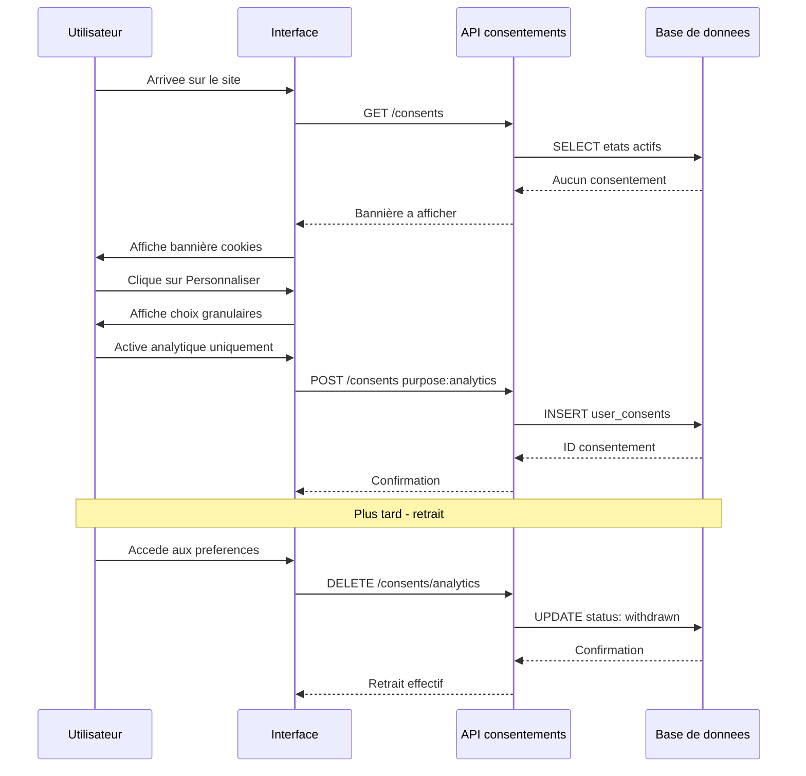

# TP : Analyse RGPD d'une plateforme e-commerce et conception d'un module de consentement

## Introduction

### Contexte du TP

Vous venez d'être recruté comme développeur full-stack dans une jeune
entreprise française nommée *ZenBoutique*, qui prépare le lancement
d'une plateforme e-commerce dédiée aux produits de bien-être :
compléments alimentaires, accessoires de yoga, livres de
développement personnel, et programmes d'accompagnement en ligne
animés par des coachs certifiés. La plateforme proposera également
un blog communautaire où les utilisateurs pourront partager leurs
expériences et leurs ressentis sur les produits.

Lors de votre première semaine, vous découvrez que le projet a été
développé pendant huit mois sans aucune réflexion structurée sur le
RGPD. La CTO, qui vient de prendre ses fonctions, est consciente du
problème et vous mandate pour réaliser deux livrables : (1) une
analyse RGPD complète des traitements envisagés, articulant les
sept principes et les six bases légales, et (2) la conception
technique d'un module de consentement qui passera l'épreuve d'un
contrôle CNIL. Le lancement commercial est prévu dans **quatre
semaines**.

### Objectifs du TP

À l'issue de ce TP, vous serez capable de :

1. Inventorier les fonctionnalités d'une application et qualifier
   chaque traitement de données associé.
2. Choisir et justifier la base légale pertinente pour chaque
   traitement.
3. Vérifier la conformité de chaque traitement aux sept principes de
   l'article 5.
4. Concevoir techniquement un système de gestion du consentement,
   incluant le modèle de données, l'interface utilisateur et les
   API associées.
5. Rédiger une politique de confidentialité claire et conforme.

### Durée estimée

Environ **4 heures** (peut être étendu à 5 heures avec restitution
orale ou démo technique).

### Prérequis techniques

- Avoir lu intégralement les parties 1 à 3 du module.
- Connaître les sept principes et les six bases légales du RGPD.
- Maîtriser les bases du SQL (compatible MySQL et PostgreSQL).
- Connaître les bases du HTML / CSS et des API REST.
- Disposer d'un éditeur Markdown ou d'un traitement de texte pour
  les livrables documentaires.

## Étape 1 : Cartographie des fonctionnalités et des traitements

### 1.1 Inventaire des fonctionnalités

À partir du contexte de *ZenBoutique*, listez l'ensemble des
fonctionnalités prévues. Vous devez en identifier au minimum dix.
Présentez votre inventaire sous forme de liste numérotée, en
indiquant pour chacune une description courte.

Quelques fonctionnalités évidentes pour vous guider :

- création de compte utilisateur ;
- recherche et achat de produits ;
- paiement en ligne ;
- gestion du blog communautaire ;
- coaching en ligne en visioconférence ;
- newsletter promotionnelle ;
- publicité ciblée et retargeting ;
- statistiques d'audience.

Complétez cette liste avec les fonctionnalités implicites du contexte.

### 1.2 Tableau d'analyse des traitements

Pour chaque fonctionnalité identifiée, remplissez le tableau
suivant. Vous obtiendrez au minimum quinze lignes (plusieurs
traitements peuvent être nécessaires pour une même fonctionnalité).

| Fonctionnalité | Traitement | Finalité | Données collectées | Base légale | Article RGPD |
|----------------|------------|----------|---------------------|-------------|--------------|

Pour la colonne « Base légale », utilisez l'une des six valeurs
suivantes : consentement, contrat, obligation légale, intérêts
vitaux, mission d'intérêt public, intérêt légitime.

Identifiez clairement les traitements impliquant des **données
sensibles** au sens de l'article 9 et les indiquer par un marqueur
visible.

## Étape 2 : Analyse au regard des sept principes

### 2.1 Grille d'analyse

Pour les **cinq traitements** que vous jugez les plus sensibles ou
les plus complexes, réalisez une analyse principe par principe.
Utilisez la grille suivante pour chacun :

```markdown
**Traitement X : [nom]**

- Liceite, loyaute, transparence :
  [respect ou points d amelioration]
- Limitation des finalites :
  [...]
- Minimisation :
  [...]
- Exactitude :
  [...]
- Limitation de la conservation :
  [...]
- Integrite et confidentialite :
  [...]
- Responsabilite :
  [...]
```

### 2.2 Politique de conservation

Sur la base de votre analyse, proposez une politique de conservation
documentée pour l'ensemble des données de la plateforme. Présentez-la
sous forme de tableau :

| Catégorie de données | Base active | Archivage | Total | Justification |
|----------------------|-------------|-----------|-------|---------------|

Couvrez au minimum : compte utilisateur, commande, facture, message
de blog, données de paiement, journaux applicatifs, données du
coaching, newsletter.

## Étape 3 : Conception technique du module de consentement

### 3.1 Modèle de données

Concevez le schéma SQL de la table (ou des tables) qui stockera les
consentements des utilisateurs. Le schéma doit permettre :

- la traçabilité (date, IP, user agent, version du texte) ;
- la granularité par finalité ;
- le retrait du consentement avec conservation de l'historique ;
- la requête rapide de l'état actuel du consentement pour une finalité
  donnée.

Le SQL doit être compatible **MySQL et PostgreSQL**, dans la limite
de 80 caractères par ligne. Si les syntaxes diffèrent, présentez
les deux versions.

### 3.2 Endpoints REST

Définissez la spécification de quatre endpoints REST minimum pour
gérer le cycle de vie du consentement. Pour chacun, indiquez :

- la méthode HTTP et l'URL ;
- le format du payload (request body) ;
- le format de la réponse (response body) ;
- les codes HTTP de succès et d'erreur attendus ;
- les exigences d'authentification.

Au minimum :

- recueil du consentement initial ;
- consultation des consentements actifs ;
- retrait d'un consentement ;
- historique des consentements.

### 3.3 Diagramme de séquence

Réalisez un diagramme de séquence (Mermaid ou PlantUML) illustrant
le parcours d'un utilisateur qui s'inscrit sur la plateforme et
manipule ses consentements (donner, modifier, retirer). Le diagramme
doit faire apparaître : l'utilisateur, l'interface, l'API, la base
de données.

### 3.4 Interface utilisateur

Rédigez le code HTML/CSS d'une bannière de consentement cookies
conforme aux exigences CNIL, et d'un écran de gestion des
consentements accessible depuis le compte utilisateur. Veillez en
particulier à :

- l'équilibre visuel des boutons d'acceptation et de refus ;
- la granularité du choix (par finalité) ;
- l'absence de case pré-cochée ;
- la lisibilité de l'information préalable ;
- l'accessibilité (attributs ARIA, contraste).

## Étape 4 : Politique de confidentialité

Rédigez une politique de confidentialité complète pour *ZenBoutique*.
Elle doit comporter au minimum les rubriques suivantes :

1. Identité du responsable de traitement et coordonnées du DPO.
2. Finalités et bases légales des traitements (tableau de synthèse).
3. Catégories de données traitées et leur source.
4. Destinataires des données (incluant les sous-traitants).
5. Transferts de données hors UE éventuels et garanties associées.
6. Durées de conservation.
7. Droits des personnes et modalités d'exercice.
8. Modalités de retrait du consentement.
9. Possibilité d'introduire une réclamation auprès de la CNIL.

La politique doit être rédigée dans un langage **clair**, accessible
au grand public. Évitez le jargon juridique excessif. Visez une
longueur d'environ deux à trois pages.

## Étape 5 : Note de synthèse pour le COMEX

Rédigez une note de synthèse d'**une page** à destination du COMEX
de *ZenBoutique*, présentant :

1. Les principaux risques RGPD identifiés et leur criticité.
2. Les actions correctives prioritaires à mener avant le lancement.
3. Une estimation de l'effort technique requis.
4. Les coûts évités par cette mise en conformité préventive.

La note doit être structurée, professionnelle, et accessible à des
dirigeants non techniques.

## Correction du TP {collapsible="true"}

Cette correction présente une réponse type. D'autres analyses sont
légitimes : ce qui compte est la cohérence du raisonnement et le
respect des principes étudiés.

### Étape 1 : Cartographie

Fonctionnalités identifiées (liste non exhaustive) :

1. Inscription et gestion de compte
2. Navigation produits et recherche
3. Panier et commande
4. Paiement en ligne
5. Livraison
6. Facturation et historique
7. Blog communautaire (publication, commentaire)
8. Coaching en ligne en visioconférence
9. Newsletter promotionnelle
10. Publicité ciblée et retargeting
11. Statistiques d'audience
12. Service client et support
13. Programme de fidélité
14. Avis et notation des produits

Tableau d'analyse partiel :

| Fonctionnalité | Traitement | Finalité | Base légale |
|----------------|------------|----------|-------------|
| Inscription | Création compte | Accès au service | Contrat |
| Panier | Stockage panier | Gestion commande | Contrat |
| Paiement | Traitement carte | Encaissement | Contrat |
| Facturation | Émission facture | Comptabilité | Obligation légale |
| Blog | Publication contenu | Animation communauté | Contrat ou consentement |
| Coaching | Suivi de progression | Prestation de service | Contrat |
| Coaching | Notes de coach (santé) | Personnalisation | Consentement explicite art. 9 |
| Newsletter | Envoi promotionnel | Marketing | Consentement |
| Pub ciblée | Cookies traceurs | Personnalisation pub | Consentement |
| Audience | Mesure d'audience | Optimisation | Intérêt légitime ou consentement selon les outils |
| Anti-fraude | Détection paiements | Sécurité | Intérêt légitime |
| Service client | Réponse aux demandes | Support | Contrat |

Données sensibles potentielles : ressentis dans le blog (santé
mentale), notes de coaching (santé), produits achetés (peuvent
révéler des données de santé indirectement, par exemple compléments
spécifiques à une pathologie).

### Étape 2 : Analyse au regard des principes

Pour le traitement « Notes de coaching » (exemple) :

- **Licéité, loyauté, transparence** : information explicite à
  l'utilisateur sur le fait que des notes sont prises, sur leur
  finalité (suivi personnalisé), sur les destinataires (le coach
  uniquement), sur la durée de conservation.
- **Limitation des finalités** : les notes ne doivent pas servir
  au marketing ou à des analyses commerciales sans nouveau
  consentement.
- **Minimisation** : ne pas prendre de notes excessivement
  détaillées. Le coach doit s'en tenir à ce qui est utile au suivi.
- **Exactitude** : permettre à l'utilisateur de demander la
  rectification de notes inexactes.
- **Limitation de la conservation** : conservation pendant la durée
  de l'abonnement et 1 an après (preuve contractuelle), puis
  destruction.
- **Intégrité et confidentialité** : chiffrement, accès limité au
  coach assigné, journalisation des consultations.
- **Responsabilité** : tout cela doit être documenté, et le
  consentement explicite (art. 9.2.a) tracé.

Politique de conservation type :

| Catégorie | Base active | Archivage | Total |
|-----------|-------------|-----------|-------|
| Compte inactif | 3 ans après dernière connexion | - | 3 ans |
| Commande | 3 ans | 7 ans (compta) | 10 ans |
| Facture | 3 ans | 7 ans | 10 ans |
| Message de blog | Tant que le compte est actif | 6 mois après suppression | Variable |
| Newsletter | Jusqu'au désabonnement | 3 ans (preuve) | 3 ans |
| Cookies pub | 13 mois max | - | 13 mois |
| Notes de coaching | Durée du contrat | 1 an | Variable |
| Logs applicatifs | 6 mois | 1 an | 18 mois |

### Étape 3 : Conception technique

Modèle de données :

```sql
-- Table des consentements (compatible MySQL et PostgreSQL)
CREATE TABLE user_consents (
    id BIGINT PRIMARY KEY,
    user_id BIGINT NOT NULL,
    purpose VARCHAR(100) NOT NULL,
    status VARCHAR(20) NOT NULL,
    -- 'given', 'withdrawn', 'expired'
    consent_text_version VARCHAR(20) NOT NULL,
    given_at TIMESTAMP,
    withdrawn_at TIMESTAMP,
    expires_at TIMESTAMP,
    ip_address VARCHAR(45),
    user_agent VARCHAR(500),
    source VARCHAR(50),
    -- 'inscription', 'banner', 'settings'
    created_at TIMESTAMP NOT NULL DEFAULT CURRENT_TIMESTAMP
);

-- Index pour retrouver rapidement l etat actuel
CREATE INDEX idx_consents_user_purpose
    ON user_consents(user_id, purpose);

-- Table des versions de texte de consentement (historisation)
CREATE TABLE consent_text_versions (
    version VARCHAR(20) PRIMARY KEY,
    purpose VARCHAR(100) NOT NULL,
    text_content TEXT NOT NULL,
    effective_from TIMESTAMP NOT NULL,
    effective_until TIMESTAMP
);
```

Endpoints REST :

```text
POST /api/v1/consents
Body : { purpose, status: 'given', text_version }
Auth : utilisateur authentifié ou session anonyme (cookies)
Response 201 : { id, purpose, status, given_at }

GET /api/v1/consents
Auth : utilisateur authentifié
Response 200 : [ { purpose, status, given_at } ]

DELETE /api/v1/consents/{purpose}
Auth : utilisateur authentifié
Response 200 : { purpose, status: 'withdrawn', withdrawn_at }

GET /api/v1/consents/history
Auth : utilisateur authentifié
Response 200 : [ historique chronologique avec versions ]
```

Diagramme de séquence :



Interface utilisateur (extrait) :

```html
<div class="cookie-banner" role="dialog" aria-label="Cookies">
    <h2>Vos cookies, votre choix</h2>

    <p>
        Nous utilisons des cookies pour le fonctionnement du site
        (necessaires) et, avec votre accord, pour mesurer l audience
        et personnaliser nos contenus.
    </p>

    <div class="actions-equal">
        <button class="btn-primary" data-action="accept-all">
            Tout accepter
        </button>
        <button class="btn-primary" data-action="reject-all">
            Tout refuser
        </button>
        <button class="btn-primary" data-action="customize">
            Personnaliser
        </button>
    </div>

    <p>
        <a href="/politique-confidentialite">En savoir plus</a>
    </p>
</div>
```

```css
.actions-equal {
    display: flex;
    gap: 1rem;
    flex-wrap: wrap;
}

.btn-primary {
    flex: 1;
    min-width: 140px;
    padding: 0.75rem 1.5rem;
    background-color: #2c5f5d;
    color: white;
    border: none;
    border-radius: 4px;
    font-size: 1rem;
    cursor: pointer;
}

.btn-primary:hover {
    background-color: #1f4543;
}

.btn-primary:focus {
    outline: 3px solid #fbbf24;
    outline-offset: 2px;
}
```

### Étape 4 : Politique de confidentialité {id="tape-4-politique-de-confidentialit_1"}

Rubriques attendues (squelette) :

1. **Identité du responsable** : ZenBoutique SAS, adresse, email
   de contact DPO.
2. **Finalités et bases légales** : tableau récapitulatif clair.
3. **Catégories de données** : liste exhaustive et lisible.
4. **Destinataires** : OVH, Stripe, La Poste, etc.
5. **Transferts hors UE** : préciser si transferts vers USA via
   sous-traitants, garanties (DPF, clauses types).
6. **Durées de conservation** : tableau récapitulatif.
7. **Droits des personnes** : énumération et modalités.
8. **Retrait du consentement** : lien permanent en pied de page +
   email DPO.
9. **Réclamation CNIL** : mention obligatoire avec lien cnil.fr.

### Étape 5 : Note pour le COMEX

Plan attendu :

- **Risques identifiés** : non-conformité actuelle, exposition à des
  amendes (rappeler les plafonds), risque réputationnel,
  bloquant pour le lancement.
- **Actions prioritaires** : (a) module de consentement, (b)
  politique de confidentialité, (c) registre des traitements, (d)
  signature des DPA avec sous-traitants, (e) information utilisateur.
- **Effort technique** : estimation par sprint (par exemple 2 sprints
  de 2 semaines).
- **Bénéfices** : éviter une amende potentielle, sécuriser le
  lancement, construire la confiance des utilisateurs.

Le TP est considéré comme réussi si l'apprenant démontre une capacité
à articuler bases légales et principes, à concevoir un système de
consentement techniquement robuste, et à communiquer ses analyses de
façon professionnelle.
