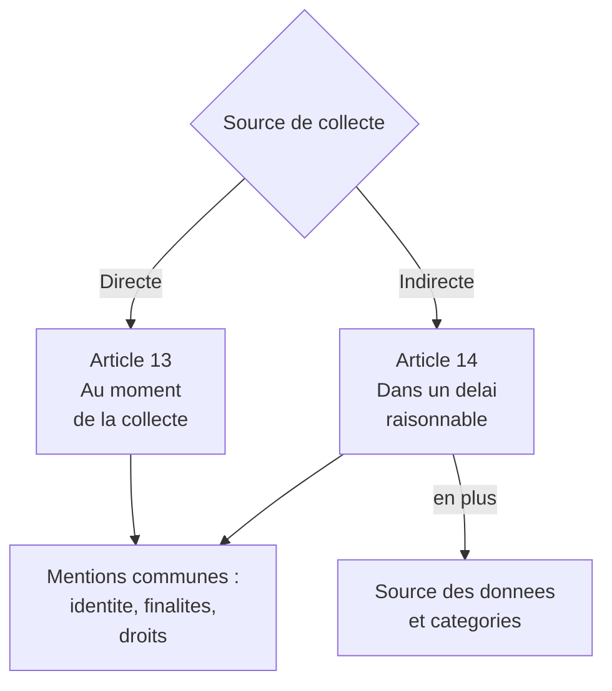
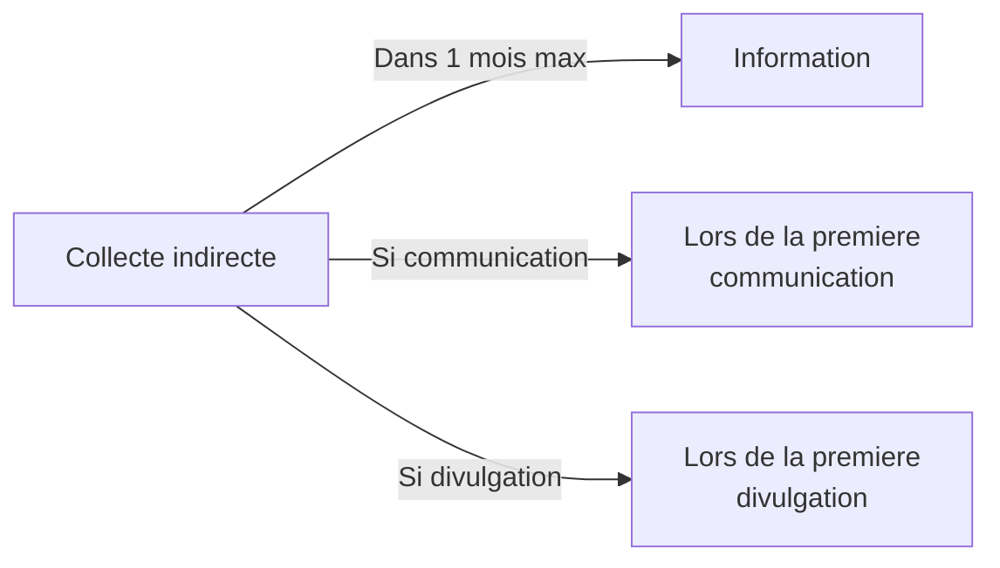
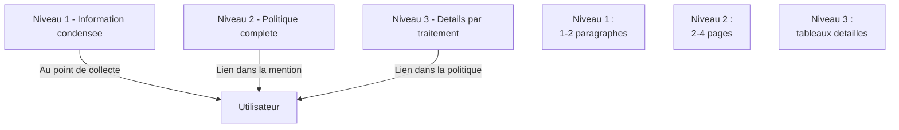

# L'information préalable des personnes concernées

## Introduction

Vous est-il déjà arrivé d'acheter un produit en magasin et de
découvrir, en rentrant chez vous, qu'il ne correspond pas du tout à
ce que vous attendiez ? Pas la même taille, pas la même couleur, pas
les mêmes fonctionnalités. Vous vous sentez floué, parce que
l'information n'était pas claire avant l'achat. La frustration est
légitime : un bon achat suppose une bonne information préalable.
Pour les données personnelles, c'est la même chose. Avant que
l'utilisateur ne donne ses données, il a le droit de savoir
exactement ce qui va en être fait. Et ce droit, c'est l'obligation
d'information préalable, fondement de tous les autres droits.

Cette partie présente les obligations d'information posées par les
articles 13 et 14 du RGPD. Sans information préalable conforme, il
est impossible de prouver le consentement, impossible de respecter
les principes de loyauté et de transparence, impossible d'éviter une
sanction lors d'un contrôle. C'est le tout premier rempart de la
conformité, et celui que les autorités examinent en priorité.

### Quand et comment informer

Quelle différence faites-vous entre une étiquette de prix bien
visible en rayon, et un prix caché qui n'apparaît qu'au passage en
caisse ? Le RGPD impose, pour les données personnelles, l'équivalent
d'une étiquette de prix : l'information doit être délivrée **au
moment de la collecte**, pas après. Cette règle simple a des
conséquences techniques immédiates sur la conception de vos
formulaires, de vos applications mobiles, et de vos workflows.

L'article 13 du RGPD s'applique lorsque les données sont collectées
**directement auprès de la personne concernée** (formulaire
d'inscription, achat, abonnement, prise de rendez-vous). L'article 14
s'applique lorsque les données sont collectées **indirectement**,
c'est-à-dire auprès d'un tiers (un partenaire commercial, une
agence de notation, des sources publiques). Les obligations sont
similaires mais avec quelques nuances.



Les modalités sont fixées par l'article 12 : l'information doit
être délivrée de façon **concise, transparente, compréhensible,
aisément accessible**, en des termes clairs et simples, par écrit
ou par voie électronique. Le langage doit être adapté au public,
particulièrement si le service vise des mineurs.

#### Exemple pratique {id="exemple-pratique-info-1"}

Voici une mention d'information condensée que vous pouvez placer
sous un formulaire d'inscription. Elle est rédigée en langage
clair, sans jargon, et renvoie à une politique de confidentialité
complète pour les détails :

```html
<form class="signup-form">
    <label for="email">Adresse email</label>
    <input type="email" id="email" name="email" required>

    <label for="password">Mot de passe</label>
    <input type="password" id="password" name="password" required>

    <details class="privacy-notice">
        <summary>
            Vos donnees personnelles
        </summary>
        <p>
            <strong>Acme SAS</strong> collecte vos donnees pour creer
            et gerer votre compte. Elles sont conservees 3 ans apres
            votre derniere connexion, et transmises uniquement a nos
            sous-traitants techniques (OVH pour l hebergement).
        </p>
        <p>
            Vous disposez des droits d acces, de rectification,
            d effacement, de portabilite et d opposition que vous
            pouvez exercer a tout moment via votre espace compte ou
            par email a dpo@acme.fr.
        </p>
        <p>
            <a href="/confidentialite">Politique complete</a> -
            <a href="https://www.cnil.fr/fr/plaintes">Reclamation CNIL</a>
        </p>
    </details>

    <button type="submit">Creer mon compte</button>
</form>
```

L'usage de la balise `<details>` permet de présenter une information
concise par défaut, tout en donnant accès au détail au clic. C'est
un bon compromis entre transparence et lisibilité, sans surcharger
visuellement le formulaire.

#### Exercice 1

Une PME française collecte les coordonnées de ses clients lors d'un
salon professionnel via un formulaire papier. Quelles informations
doit-elle mentionner sur ce formulaire pour respecter l'article 13 ?
Listez les éléments essentiels, et rédigez un texte court (5 à 8
lignes) à imprimer sous le formulaire.

##### Correction exercice 1 {collapsible="true"}

Éléments à mentionner (article 13) :

1. Identité et coordonnées du responsable de traitement
2. Coordonnées du DPO (le cas échéant)
3. Finalités du traitement et base légale
4. Destinataires ou catégories de destinataires
5. Durée de conservation ou critères pour la déterminer
6. Droits des personnes (accès, rectification, effacement,
   limitation, portabilité, opposition)
7. Droit d'introduire une réclamation auprès de la CNIL
8. Caractère obligatoire ou facultatif des informations demandées
9. Existence d'un transfert hors UE (le cas échéant)
10. Existence d'une décision automatisée (le cas échéant)

Texte type :

> *Acme SAS (adresse, dirigeant) collecte vos coordonnées sur ce
> formulaire pour vous envoyer notre newsletter professionnelle
> (base légale : consentement). Vos données sont conservées 3 ans
> après votre dernier contact et ne sont communiquées qu'à notre
> prestataire d'envoi Mailchimp. Vous disposez à tout moment des
> droits d'accès, de rectification, d'effacement, de portabilité et
> d'opposition, que vous pouvez exercer à l'adresse dpo@acme.fr.
> Vous pouvez également introduire une réclamation auprès de la
> CNIL (cnil.fr).*

### Les mentions obligatoires en détail

Avez-vous déjà essayé de lire en entier une politique de
confidentialité ? Beaucoup d'utilisateurs abandonnent à la deuxième
ligne, et c'est précisément parce que ces politiques sont mal
rédigées. Le RGPD ne se contente pas d'exiger des informations : il
exige qu'elles soient **lisibles**. C'est un travail de design
d'information autant que de juridique.

L'article 13 énumère treize éléments à fournir au moment de la
collecte directe. Voici le contenu à présenter à l'utilisateur, en
distinguant les éléments toujours obligatoires et les éléments
conditionnels :

| Élément | Toujours requis ? | Source |
|---------|-------------------|--------|
| Identité du responsable | Oui | art. 13.1.a |
| Coordonnées du DPO | Si DPO existe | art. 13.1.b |
| Finalités et bases légales | Oui | art. 13.1.c |
| Intérêts légitimes invoqués | Si base 6.1.f | art. 13.1.d |
| Destinataires des données | Oui | art. 13.1.e |
| Transferts hors UE et garanties | Si applicable | art. 13.1.f |
| Durée de conservation | Oui | art. 13.2.a |
| Droits des personnes | Oui | art. 13.2.b |
| Droit de retrait du consentement | Si consentement | art. 13.2.c |
| Droit de réclamation à la CNIL | Oui | art. 13.2.d |
| Caractère obligatoire des données | Oui | art. 13.2.e |
| Existence d'une décision automatisée | Si applicable | art. 13.2.f |

Pour la collecte indirecte (article 14), s'ajoutent :

- la **source** d'où proviennent les données (notamment si elles
  proviennent de sources accessibles au public) ;
- les **catégories** de données concernées.

L'information doit être fournie dans un délai raisonnable, et au
plus tard dans un mois après la collecte, ou bien lors de la
première communication avec la personne concernée, ou bien au plus
tard lors de la première divulgation des données à un tiers.



#### Exemple pratique {id="exemple-pratique-info-2"}

Voyons comment construire une politique de confidentialité en
plusieurs niveaux d'information, conformément à l'approche
recommandée par la CNIL et le CEPD :



Cette approche graduée présente plusieurs avantages : elle ne
surcharge pas le point de collecte, elle reste accessible aux
utilisateurs curieux, et elle satisfait l'exigence d'exhaustivité
en cas de contrôle. C'est aujourd'hui le standard adopté par les
grandes plateformes conformes.

#### Exercice 2

Vous devez rédiger une mention d'information pour une application
mobile qui collecte indirectement, auprès d'un partenaire commercial,
les coordonnées de prospects potentiels en vue de leur envoyer une
proposition commerciale. Quels éléments spécifiques de l'article 14
devez-vous inclure en plus de l'article 13 ? Rédigez un projet de
texte de prise de contact respectueux des obligations.

##### Correction exercice 2 {collapsible="true"}

Éléments spécifiques de l'article 14 :

- la **source** des données (nom du partenaire qui les a
  transmises) ;
- les **catégories** de données reçues du partenaire (nom, prénom,
  email, secteur d'activité, etc.).

Projet de texte de prise de contact :

> *Bonjour,*
>
> *Vous recevez ce message car la société PartenaireCorp nous a
> transmis vos coordonnées (nom, email professionnel, fonction)
> en juin 2026, dans le cadre d'un partenariat commercial avec
> votre accord auprès de cette société. Acme SAS souhaite vous
> présenter ses solutions de gestion de projet.*
>
> *Vos données sont traitées par Acme SAS pour une prise de contact
> commerciale unique. Elles seront conservées 6 mois en cas
> d'absence de réponse, ou jusqu'à votre opposition. Elles ne sont
> communiquées à aucun tiers.*
>
> *Vous disposez à tout moment des droits d'accès, de rectification,
> d'effacement, de portabilité et d'opposition, que vous pouvez
> exercer à dpo@acme.fr. Vous pouvez également introduire une
> réclamation auprès de la CNIL (cnil.fr).*
>
> *Pour vous opposer à toute communication future, cliquez ici :
> [lien d'opposition]. Vous serez retiré immédiatement de notre base.*

Ce texte combine : identification claire du partenaire source, des
données reçues, des finalités, des durées, des droits, et un
mécanisme d'opposition immédiat. Il respecte aussi l'esprit de la
prospection conforme aux règles BtoB françaises (opt-out pour les
emails professionnels adressés à des personnes physiques).

### Cas particuliers d'exemption d'information

Toutes les situations n'imposent pas une information préalable
complète. Les articles 13.4 et 14.5 prévoient des **exemptions**
limitées. Pour la collecte indirecte (article 14), les exemptions
sont plus larges, mais doivent être maniées avec prudence.

L'information n'est pas obligatoire :

- si la personne **dispose déjà** de l'information ;
- si la fourniture s'avère **impossible** ou exige des efforts
  disproportionnés (rare, à documenter rigoureusement) ;
- si la collecte ou la communication est **expressément prévue par
  le droit** européen ou national ;
- si les données doivent rester **confidentielles** en vertu du
  secret professionnel ou d'une obligation de confidentialité.

L'exemption pour « efforts disproportionnés » est tentante, mais
elle est interprétée strictement par les autorités de contrôle. Si
vous pouvez identifier la personne et la contacter, vous devez
généralement l'informer.

## Exercice final

Vous êtes développeur freelance, mandaté par une fondation française
qui prépare le lancement d'une application de mise en relation
entre bénévoles et associations caritatives. L'application devra
collecter, sur formulaire d'inscription : nom, prénom, email,
téléphone, ville, compétences disponibles, et disponibilités
hebdomadaires. Elle utilisera également une API d'enrichissement
externe pour récupérer la fonction et l'employeur des bénévoles
inscrits sur la base de leur email. La fondation collabore avec une
agence locale pour le suivi terrain des bénévoles.

Rédigez :

1. Une mention d'information condensée (niveau 1) à placer sous le
   formulaire d'inscription, conforme à l'article 13.
2. Une mention d'information à envoyer par email aux bénévoles dont
   les données ont été enrichies par l'API externe, conforme à
   l'article 14.

Les deux textes doivent être rédigés en langage clair, et inclure
toutes les mentions requises.

### Correction exercice final {collapsible="true"}

**1. Mention d'information condensée (article 13)**

> *La Fondation SolidarityFR (siège : Paris) collecte vos données
> sur ce formulaire pour vous mettre en relation avec des
> associations caritatives correspondant à vos disponibilités et
> compétences. Le traitement repose sur votre consentement.*
>
> *Vos données sont conservées tant que votre compte est actif, et
> sont communiquées aux associations partenaires que vous
> sélectionnerez, ainsi qu'à notre agence locale chargée du suivi
> terrain. Aucun transfert n'a lieu hors de l'Union européenne.*
>
> *Vous disposez des droits d'accès, de rectification, d'effacement,
> de portabilité, d'opposition et de retrait du consentement, à
> exercer à dpo@solidarityfr.org. Vous pouvez également introduire
> une réclamation auprès de la CNIL (cnil.fr).*
>
> *Politique complète : solidarityfr.org/confidentialite.*

**2. Mention d'information à envoyer après enrichissement
(article 14)**

> *Bonjour [Prénom],*
>
> *Suite à votre inscription sur la plateforme SolidarityFR, nous
> avons complété votre profil avec votre fonction professionnelle
> et votre employeur, obtenus auprès de notre prestataire
> d'enrichissement DataBoost (databoost.fr). Cet enrichissement
> nous permet d'orienter votre profil vers les missions de bénévolat
> les plus pertinentes au regard de vos compétences professionnelles.*
>
> *Ces données complémentaires sont conservées dans les mêmes
> conditions que votre compte (tant qu'il est actif) et ne sont
> communiquées qu'aux associations partenaires que vous
> sélectionnerez vous-même.*
>
> *Vous disposez à tout moment des droits suivants : accès aux
> données enrichies, rectification, effacement, opposition à
> l'enrichissement (qui désactivera la suggestion de missions ciblées),
> portabilité. Pour les exercer, écrivez à dpo@solidarityfr.org.*
>
> *Si vous ne souhaitez pas que ces données complémentaires soient
> conservées, cliquez ici pour les supprimer immédiatement : [lien].*
>
> *Cordialement,*
> *L'équipe SolidarityFR*

Cette correction démontre la maîtrise de la double obligation
information directe / information indirecte, avec mention explicite
de la source des données, des catégories enrichies, et d'un mécanisme
d'opposition immédiat.

## Conclusion de la partie

Vous avez désormais une compréhension claire des obligations
d'information préalable des articles 13 et 14, ainsi que des moyens
techniques de les mettre en œuvre. Cette information est le
**fondement** sur lequel reposent tous les autres droits : sans une
information claire en amont, comment l'utilisateur peut-il
sérieusement exercer son droit d'accès, sa demande d'effacement, ou
sa portabilité ?

Retenez la règle pratique : à chaque point de collecte de données
personnelles, posez-vous la question « l'utilisateur sait-il
exactement ce qui va se passer ? ». Si la réponse n'est pas
évidente, une mention d'information est à ajouter. Et adoptez la
logique de l'information en plusieurs niveaux : un résumé au point
de collecte, un détail dans une politique complète accessible en
permanence.

La partie suivante explorera la moitié « active » des droits :
accès, rectification, effacement, portabilité, qui permettent à
l'utilisateur d'agir directement sur ses données.
