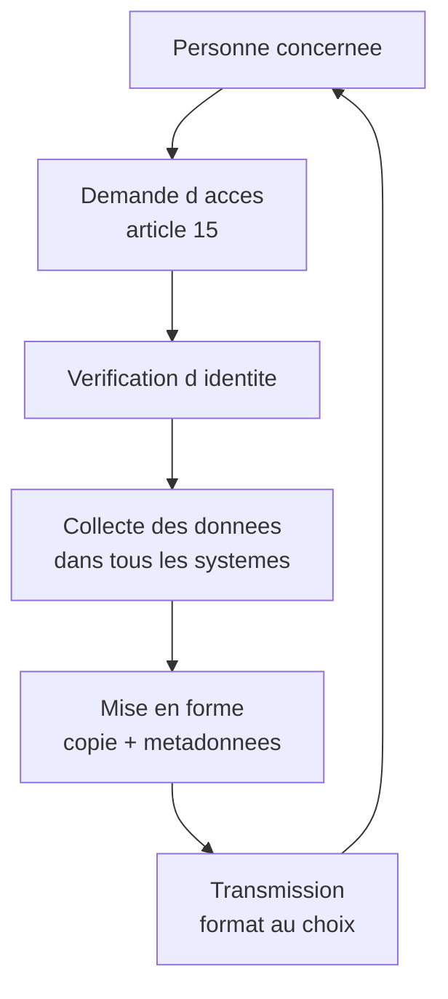
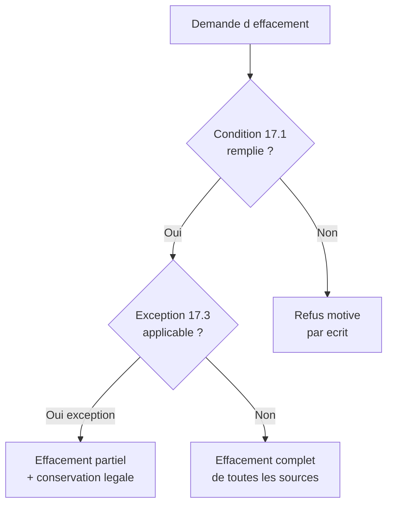

# Les droits actifs : accès, rectification, effacement, portabilité

## Introduction

Imaginez que vous ayez confié vos affaires personnelles à un service
de garde-meubles. Logiquement, vous voulez pouvoir aller voir ce qui
est stocké, déménager certains objets, en jeter d'autres, ou
récupérer le tout pour le déposer ailleurs. Ce sont vos affaires,
vous en êtes propriétaire, et le garde-meubles n'est que dépositaire.
Le RGPD adopte la même philosophie pour les données personnelles : la
personne concernée garde un droit de regard et d'action sur ses
données, même quand elles sont détenues par un tiers.

Cette partie présente les quatre droits que nous appelons « actifs »
parce qu'ils permettent à la personne d'**agir** directement sur ses
données : consulter (accès), corriger (rectification), supprimer
(effacement), récupérer pour transférer ailleurs (portabilité). Pour
le développeur, ce sont les quatre fonctionnalités qu'il faudra
implémenter techniquement dans la plupart des projets. Nous allons
voir non seulement le contenu juridique de chaque droit, mais aussi
les patterns techniques de mise en œuvre.

### Le droit d'accès (article 15)

Quand vous demandez à votre banque un relevé annuel détaillé de
toutes vos opérations, la banque ne peut pas vous répondre « non,
trop compliqué ». Elle est tenue de vous le fournir. Le droit
d'accès aux données personnelles est exactement de cette nature :
quand l'utilisateur demande à voir ses données, vous devez les lui
montrer, gratuitement et dans un délai court.

L'article 15 du RGPD confère à la personne concernée le droit
d'obtenir du responsable de traitement la **confirmation** que des
données la concernant sont traitées, et le cas échéant, l'**accès**
à ces données ainsi qu'à un ensemble d'informations
contextuelles. Concrètement, vous devez fournir :

- une **copie** des données personnelles traitées ;
- les **finalités** du traitement ;
- les **catégories** de données concernées ;
- les **destinataires** ou catégories de destinataires ;
- la **durée de conservation** prévue ou les critères pour la
  déterminer ;
- les **droits** disponibles (rectification, effacement, etc.) ;
- la **source** des données si elles n'ont pas été collectées
  directement auprès de la personne ;
- l'existence éventuelle d'une **décision automatisée** et la
  logique sous-jacente.



Quelques points pratiques :

- La demande est **gratuite** en principe. Une copie payante peut
  être facturée à un coût raisonnable seulement en cas de demandes
  manifestement infondées, excessives ou répétitives.
- Le **format** est au choix de la personne (le plus souvent un
  format électronique courant : PDF, JSON, CSV).
- Le délai de réponse est d'**un mois**, prorogeable de deux mois
  supplémentaires en cas de complexité, avec information préalable
  de la personne.

#### Exemple pratique {id="exemple-pratique-acces-1"}

Voici une implémentation d'endpoint REST pour fournir un accès aux
données d'un utilisateur authentifié :

```javascript
// GET /api/v1/me/data-access
// Authentification : utilisateur connecte (JWT)
// Reponse : 200 avec donnees + metadonnees

async function handleDataAccessRequest(req, res) {
    const userId = req.user.id;

    // Collecte des donnees dans toutes les tables liees
    const userData = await db.users.findById(userId);
    const orders = await db.orders.findByUserId(userId);
    const messages = await db.messages.findByUserId(userId);
    const consents = await db.consents.findByUserId(userId);
    const logs = await db.accessLogs.findByUserId(userId);

    // Construction de la reponse complete
    const response = {
        metadata: {
            generated_at: new Date().toISOString(),
            controller: 'Acme SAS',
            controller_address: '10 rue Example, 75001 Paris',
            dpo_email: 'dpo@acme.fr',
            retention_policy: 'Voir politique de confidentialite',
            data_sources: ['Inscription utilisateur'],
            recipients: ['OVH (hebergement)', 'Stripe (paiement)']
        },
        personal_data: {
            account: userData,
            orders: orders,
            messages: messages,
            consents: consents,
            access_logs: logs
        },
        rights_reminder: {
            rectification: 'PATCH /api/v1/me',
            erasure: 'DELETE /api/v1/me',
            portability: 'GET /api/v1/me/export',
            opposition: 'POST /api/v1/me/object',
            complaint: 'https://www.cnil.fr/fr/plaintes'
        }
    };

    res.status(200).json(response);
}
```

Cet endpoint a plusieurs vertus : il rassemble en un seul appel
toutes les données détenues sur l'utilisateur, il fournit le
contexte (métadonnées) exigé par l'article 15, et il rappelle les
autres droits disponibles. C'est bien plus qu'un simple `SELECT *
FROM users` : c'est une vraie réponse RGPD-compliant.

> **Note** : un piège fréquent est d'oublier les données stockées
> hors de la base principale : logs, sauvegardes, services externes
> (CRM, plateforme d'envoi d'emails, outils analytiques). Pour être
> complet, l'accès doit couvrir l'**ensemble** des sources, ce qui
> impose une cartographie préalable.

#### Exercice 1

Vous devez implémenter le droit d'accès pour une application de
livraison de repas. Les données utilisateur sont réparties entre :
la base principale, un CRM Hubspot, une plateforme d'envoi d'emails
(Sendgrid), des logs applicatifs Datadog, et des sauvegardes
quotidiennes chez OVH. Décrivez en quelques paragraphes comment vous
allez procéder pour fournir une réponse complète à un utilisateur
qui demande à consulter ses données.

##### Correction exercice 1 {collapsible="true"}

Démarche en quatre étapes :

1. **Cartographier les sources** : identifier précisément, pour
   chaque source, quelles données sur l'utilisateur sont conservées.
   La base principale contient le compte, les commandes, les
   adresses. Hubspot peut contenir des informations marketing
   (notes, interactions). Sendgrid garde l'historique des emails
   envoyés et des ouvertures/clics. Datadog enregistre des logs
   techniques (IP, user agent, parcours). Les sauvegardes contiennent
   l'état historique de la base.

2. **Implémenter les connecteurs** : développer une routine qui,
   pour un userId donné, interroge automatiquement chacune des
   sources. Pour la base principale : requêtes SQL. Pour Hubspot et
   Sendgrid : appels d'API officiels. Pour Datadog : appel à l'API
   de recherche par identifiant utilisateur. Pour les sauvegardes :
   l'accès est plus complexe, mais doit être possible si nécessaire
   (en pratique, on documente leur existence sans extraire le
   contenu individuel, sauf demande spécifique).

3. **Agréger et présenter** : rassembler toutes ces données dans un
   format unifié (JSON ou archive ZIP avec sous-dossiers par
   source). Fournir un document récapitulatif expliquant ce que
   l'utilisateur trouvera dans chaque sous-partie. Ajouter les
   métadonnées requises par l'article 15 (finalités, destinataires,
   durées, etc.).

4. **Vérifier l'identité** : avant de fournir ces données sensibles,
   s'assurer qu'il s'agit bien de l'utilisateur concerné (envoi du
   lien sur l'email du compte, authentification renforcée, etc.).

Délai de réponse : un mois maximum. Prévoir un processus formel,
idéalement automatisé partiellement, et une supervision par le DPO
pour les cas complexes.

### Le droit de rectification (article 16)

Vous avez sans doute déjà signalé à un commerçant : « Mon nom est
Dupont, pas Dupond ! ». Vous attendez qu'il corrige l'erreur dans
ses fichiers. Le droit de rectification du RGPD est exactement cela,
appliqué aux données personnelles. Il est probablement le plus
simple à implémenter, mais aussi l'un des plus souvent négligés
dans les applications, où l'utilisateur ne peut parfois pas modifier
ses propres données sans contacter le support.

L'article 16 prévoit que la personne concernée a le droit d'obtenir,
sans tarder, la rectification des données la concernant qui sont
inexactes, ainsi que le **droit de compléter** les données
incomplètes, y compris par une déclaration supplémentaire.

Pour le développeur, cela se traduit par :

- une **interface** permettant à l'utilisateur de modifier
  lui-même ses données ;
- un **endpoint** correspondant côté backend, avec validation des
  entrées ;
- une **propagation** des modifications dans tous les systèmes où
  les données sont copiées (CRM, services externes, etc.) ;
- une **traçabilité** des modifications, utile en cas de litige.

#### Exemple pratique {id="exemple-pratique-rectif-1"}

Voici un endpoint REST de rectification, avec validation et
journalisation :

```javascript
// PATCH /api/v1/me
// Body : { first_name?, last_name?, phone?, address? }
// Auth : utilisateur authentifie

async function handleRectification(req, res) {
    const userId = req.user.id;
    const updates = req.body;

    // Validation des champs autorises
    const allowed = ['first_name', 'last_name', 'phone', 'address'];
    const sanitized = {};
    for (const key of allowed) {
        if (updates[key] !== undefined) {
            sanitized[key] = sanitizeInput(updates[key]);
        }
    }

    // Recuperation de l etat avant modification
    const before = await db.users.findById(userId);

    // Application de la modification
    await db.users.update(userId, sanitized);

    // Journalisation des changements (audit trail)
    for (const [field, newValue] of Object.entries(sanitized)) {
        await db.userChanges.insert({
            user_id: userId,
            field_name: field,
            old_value: before[field],
            new_value: newValue,
            changed_by: 'self',
            changed_at: new Date()
        });
    }

    // Propagation aux systemes externes
    await Promise.all([
        crm.updateContact(userId, sanitized),
        emailService.updateSubscriber(userId, sanitized)
    ]);

    res.status(200).json({
        message: 'Modifications enregistrees',
        updated_fields: Object.keys(sanitized)
    });
}
```

Trois bonnes pratiques visibles dans ce code :

- **Validation explicite** des champs autorisés (pas de mass
  assignment) ;
- **Journalisation** de chaque changement pour traçabilité ;
- **Propagation** vers les systèmes externes (CRM, email).

### Le droit à l'effacement (article 17)

« Faites en sorte que ça disparaisse ». Combien de fois avez-vous eu
envie de prononcer ces mots après avoir laissé une trace numérique
embarrassante ? Le RGPD donne à chacun, dans certaines conditions,
le droit d'obtenir l'effacement de ses données. C'est ce qu'on
appelle aussi le « droit à l'oubli », bien que cette expression soit
juridiquement imprécise.

L'article 17 prévoit que la personne concernée a le droit d'obtenir
l'effacement des données la concernant lorsque l'une des conditions
suivantes est remplie :

- les données ne sont plus **nécessaires** à la finalité initiale ;
- la personne **retire son consentement** et il n'existe pas
  d'autre base légale ;
- la personne s'**oppose** au traitement et il n'existe pas de
  motif légitime impérieux ;
- le traitement est **illicite** ;
- l'effacement est imposé par une **obligation légale** ;
- les données ont été collectées dans le cadre de **services en
  ligne offerts à des enfants**.

**Attention** : ce droit n'est pas absolu. L'article 17.3 prévoit
plusieurs cas où l'effacement ne s'applique pas, notamment lorsque
le traitement est nécessaire :

- à l'exercice du droit à la liberté d'expression et d'information ;
- au respect d'une obligation légale (comptabilité, archivage) ;
- pour des motifs d'intérêt public dans le domaine de la santé
  publique ;
- à des fins d'archivage dans l'intérêt public ;
- à la constatation, à l'exercice ou à la défense de droits en
  justice.



L'effacement partiel est fréquent : par exemple, on supprime le
compte utilisateur mais on conserve les factures pendant 10 ans en
raison de l'obligation comptable. Il faut alors documenter ce qui
a été effacé et ce qui ne l'a pas été, et préciser pourquoi.

#### Exemple pratique {id="exemple-pratique-effacement-1"}

Voici une procédure d'effacement multi-tables, en SQL compatible
MySQL et PostgreSQL :

```sql
-- Procedure : effacement d un compte utilisateur
-- avec conservation des donnees comptables obligatoires

BEGIN;

-- 1. Anonymisation des commandes (conservees pour la comptabilite)
UPDATE orders
SET
    user_email = 'deleted@anonymous.local',
    user_first_name = 'DELETED',
    user_last_name = 'USER'
WHERE user_id = :user_id;

-- 2. Suppression des messages personnels
DELETE FROM messages WHERE user_id = :user_id;

-- 3. Suppression des preferences et consentements
DELETE FROM user_consents WHERE user_id = :user_id;
DELETE FROM user_preferences WHERE user_id = :user_id;

-- 4. Suppression des logs personnels recents (>1 an : conserves)
DELETE FROM access_logs
WHERE user_id = :user_id
    AND created_at > CURRENT_DATE - INTERVAL '1 year';

-- 5. Suppression du compte principal
DELETE FROM users WHERE id = :user_id;

-- 6. Tracabilite de l effacement (registre des effacements)
INSERT INTO erasure_log (
    user_id_hash,
    erased_at,
    reason,
    retained_data
) VALUES (
    -- Hash pour pouvoir prouver l effacement sans
    -- conserver l identifiant en clair
    :user_id_hash,
    CURRENT_TIMESTAMP,
    :reason,
    'orders (compta 10 ans), logs > 1 an (securite)'
);

COMMIT;
```

> **Note** : la transaction garantit que l'effacement est atomique,
> soit tout est effacé, soit rien ne l'est. La table
> `erasure_log` permet de prouver l'effacement en cas de contrôle,
> sans conserver l'identité de la personne (on hashe l'identifiant).

### Le droit à la portabilité (article 20)

Si vous changez de banque, vous voulez pouvoir emporter votre
historique vers la nouvelle. Si vous changez de fournisseur d'email,
vous voulez exporter vos contacts. Si vous changez de réseau social,
vous voulez emporter vos publications. C'est exactement l'esprit du
droit à la portabilité : permettre à l'utilisateur de récupérer ses
données dans un format réutilisable, et éventuellement de les
transférer directement à un autre service.

L'article 20 prévoit que la personne concernée a le droit de
recevoir les données qu'elle a fournies, dans un **format structuré,
couramment utilisé et lisible par machine**, et a le droit de les
transmettre à un autre responsable de traitement.

Trois conditions pour que ce droit s'applique :

1. Le traitement repose sur le **consentement** ou sur l'**exécution
   d'un contrat** (pas sur l'intérêt légitime ou l'obligation
   légale) ;
2. Le traitement est effectué à l'aide de **procédés automatisés** ;
3. Les données ont été **fournies** par la personne concernée
   (directement ou indirectement par son activité, mais pas les
   données dérivées par l'organisation).

Ce droit est plus limité que le droit d'accès : seules certaines
données sont concernées. Mais il impose un format particulier :
JSON, XML, CSV, ou tout autre format lisible par une machine
(et non un simple PDF).

#### Exemple pratique {id="exemple-pratique-portabilite-1"}

Voici l'endpoint d'export attendu, produisant un JSON structuré
réutilisable :

```javascript
// GET /api/v1/me/export?format=json
// Auth : utilisateur authentifie
// Reponse : 200 avec attachment

async function handleDataExport(req, res) {
    const userId = req.user.id;
    const format = req.query.format || 'json';

    // Donnees fournies par l utilisateur
    const profile = await db.users.findById(userId);
    const orders = await db.orders.findByUserId(userId);
    const reviews = await db.reviews.findByUserId(userId);
    const consents = await db.consents.findByUserId(userId);

    const exportData = {
        export_metadata: {
            version: '1.0',
            generated_at: new Date().toISOString(),
            schema: 'https://acme.fr/schemas/user-export-v1.json',
            article: 'RGPD article 20'
        },
        profile: {
            email: profile.email,
            first_name: profile.first_name,
            last_name: profile.last_name,
            created_at: profile.created_at
        },
        orders: orders.map(o => ({
            id: o.id,
            date: o.created_at,
            total: o.total_amount,
            items: o.items
        })),
        reviews: reviews,
        consents: consents
    };

    if (format === 'json') {
        res.setHeader('Content-Type', 'application/json');
        res.setHeader(
            'Content-Disposition',
            'attachment; filename="my-data-export.json"'
        );
        res.status(200).json(exportData);
    } else if (format === 'csv') {
        // Conversion en CSV multi-feuilles (archive ZIP)
        const archive = await buildCsvArchive(exportData);
        res.setHeader('Content-Type', 'application/zip');
        res.setHeader(
            'Content-Disposition',
            'attachment; filename="my-data-export.zip"'
        );
        res.status(200).send(archive);
    }
}
```

Quelques bonnes pratiques :

- **Versionner le schéma** d'export pour permettre l'évolution du
  format dans le temps ;
- **Inclure les métadonnées** : date, version, contexte légal ;
- **Proposer plusieurs formats** (JSON par défaut, CSV en option) ;
- **Ne pas inclure les données dérivées** par l'organisation
  (scoring, segments marketing, recommandations IA), qui ne
  relèvent pas du droit à la portabilité.

#### Exercice 2

Une utilisatrice d'une application de fitness vous écrit pour
demander une copie de ses données « pour les transférer à une
autre application ». Décrivez le contenu de l'export que vous lui
fournirez, en distinguant ce qui relève du droit à la portabilité
de ce qui n'en relève pas. Précisez le format que vous proposerez.

##### Correction exercice 2 {collapsible="true"}

**Données relevant du droit à la portabilité** :

- profil renseigné par l'utilisatrice : nom, prénom, email, date de
  naissance, taille, poids (auto-déclarés) ;
- objectifs définis manuellement par l'utilisatrice ;
- séances saisies manuellement dans le journal ;
- préférences explicites (notifications, unités, langue).

**Données générées passivement par l'utilisateur via l'appareil** :

- données issues des capteurs (cardio, GPS, accéléromètre) :
  généralement portables car liées à l'activité fournie ;
- photos téléversées par l'utilisatrice.

**Données dérivées par l'organisation (NON portables)** :

- scores et indicateurs calculés par les algorithmes maison ;
- recommandations personnalisées générées par IA ;
- segmentations marketing internes ;
- prédictions de risque ou de performance.

**Format proposé** :

- **JSON principal** structuré pour les données chiffrables ;
- **Archive ZIP** complémentaire pour les fichiers binaires
  (photos, exports GPX pour les trajets) ;
- **Schéma documenté** (URL pointant vers la description JSON
  Schema) pour faciliter la réutilisation par une autre application.

L'utilisatrice doit recevoir le tout dans un délai d'un mois, par un
lien sécurisé qui expire après quelques jours. L'authentification
préalable doit être renforcée (envoi du lien sur l'email du compte
+ confirmation par mot de passe).

## Exercice final

Vous travaillez sur une application de gestion de patrimoine,
*Argentum*, qui aide ses utilisateurs à suivre leurs comptes
bancaires, leurs investissements et leur épargne. Les données
incluent : profil utilisateur, soldes des comptes connectés, mouvements
agrégés, objectifs financiers personnels, et scores de profil
investisseur calculés par algorithme. *Argentum* utilise OVH pour
l'hébergement, un agrégateur bancaire (Budget Insight) comme
sous-traitant, et un outil d'envoi d'emails (Mailjet).

Une utilisatrice vous écrit : « Bonjour, je quitte votre service
pour passer à un concurrent. Je souhaite récupérer toutes mes
données et que vous supprimiez ensuite mon compte. ». Préparez un
plan d'action technique structuré couvrant :

1. La vérification d'identité préalable.
2. L'inventaire des données à fournir au titre du droit d'accès
   (article 15) et du droit à la portabilité (article 20). Identifiez
   ce qui relève de chaque droit.
3. Le format des exports proposés.
4. La procédure d'effacement, en distinguant ce qui peut être
   effacé immédiatement et ce qui doit être conservé.
5. La traçabilité de l'opération côté *Argentum*.

### Correction exercice final {collapsible="true"}

**1. Vérification d'identité préalable**

- Confirmation de la demande via un lien envoyé à l'email du compte
  (token à usage unique, valable 24 h).
- Authentification renforcée à la connexion : mot de passe + code
  envoyé par SMS si MFA activé.
- Pour une demande aussi sensible (données financières), prévoir
  un appel téléphonique de vérification ou un justificatif
  d'identité supplémentaire si le compte présente des montants
  importants.

**2. Inventaire des données à fournir**

*Article 15 - Droit d'accès (tout doit être communiqué)* :

- profil complet : nom, prénom, email, date de naissance, adresse ;
- coordonnées bancaires (RIB, IBAN partiel) ;
- mouvements financiers agrégés ;
- objectifs financiers saisis ;
- score de profil investisseur calculé ;
- métadonnées : finalités, destinataires (Budget Insight, Mailjet),
  durées, source, droits.

*Article 20 - Portabilité (ce qui a été fourni par l'utilisateur)* :

- profil utilisateur saisi manuellement ;
- objectifs financiers définis par elle ;
- coordonnées bancaires renseignées par elle ;
- préférences explicites.

*Non portable (dérivé par Argentum)* :

- score de profil investisseur algorithmique ;
- catégorisation automatique des mouvements ;
- alertes générées par les algorithmes maison.

**3. Format des exports proposés**

- Pour l'**accès** : PDF synthétique avec toutes les informations
  contextuelles (lisible par humain), accompagné des données brutes
  en JSON.
- Pour la **portabilité** : JSON structuré avec schéma documenté +
  CSV pour les mouvements (réutilisables dans Excel ou par un
  concurrent).
- Livraison via un lien sécurisé expirant après 7 jours, après
  authentification renforcée.

**4. Procédure d'effacement**

*À effacer immédiatement* :

- profil utilisateur ;
- objectifs financiers ;
- préférences ;
- consentements ;
- liaison avec Budget Insight (révoquer le token d'accès) ;
- inscription à la newsletter chez Mailjet.

*À conserver (obligations légales)* :

- selon la nature de l'activité d'Argentum, certaines obligations
  peuvent imposer la conservation de traces (anti-blanchiment,
  obligations sectorielles) : conservation 5 ans en archivage
  intermédiaire à accès très restreint, hors environnement de
  production.

*À anonymiser* :

- les mouvements agrégés peuvent être anonymisés pour les
  statistiques internes de l'application si leur conservation
  présente un intérêt (sortie du champ RGPD après anonymisation
  effective).

**5. Traçabilité de l'opération**

- inscription d'un événement dans un registre d'effacement :
  identifiant haché de la personne, date, motif, données conservées
  et raisons légales ;
- conservation d'une copie de la demande (mail initial, vérification
  d'identité) ;
- notification aux sous-traitants (Budget Insight, Mailjet) pour
  qu'ils effacent également les données ;
- mise à jour du registre des activités de traitement (volume
  d'utilisateurs traités, durée moyenne de réponse).

Confirmation à l'utilisatrice par email récapitulatif détaillant
les actions menées et celles qui ne peuvent l'être (avec justification
légale). Délai total : un mois maximum.

## Conclusion de la partie

Vous avez maintenant une vision claire des quatre droits actifs :
accès, rectification, effacement, portabilité. Pour chacun, vous
savez ce que la loi exige, comment l'implémenter techniquement, et
quels pièges éviter (oubli des sources externes, effacement partiel
mal documenté, format d'export non portable, etc.).

Retenez ce réflexe technique : pour chaque table contenant des
données personnelles, posez-vous quatre questions :

- Comment l'utilisateur peut-il les **consulter** ?
- Comment peut-il les **rectifier** ?
- Comment peut-il les **effacer**, et que faut-il conserver ?
- Comment peut-il les **emporter** dans un format réutilisable ?

Si vous ne savez pas répondre à l'une de ces questions, c'est qu'il
y a un trou dans votre architecture. La partie suivante explorera
les droits « défensifs » : limitation, opposition, et le régime
particulier des décisions automatisées.
