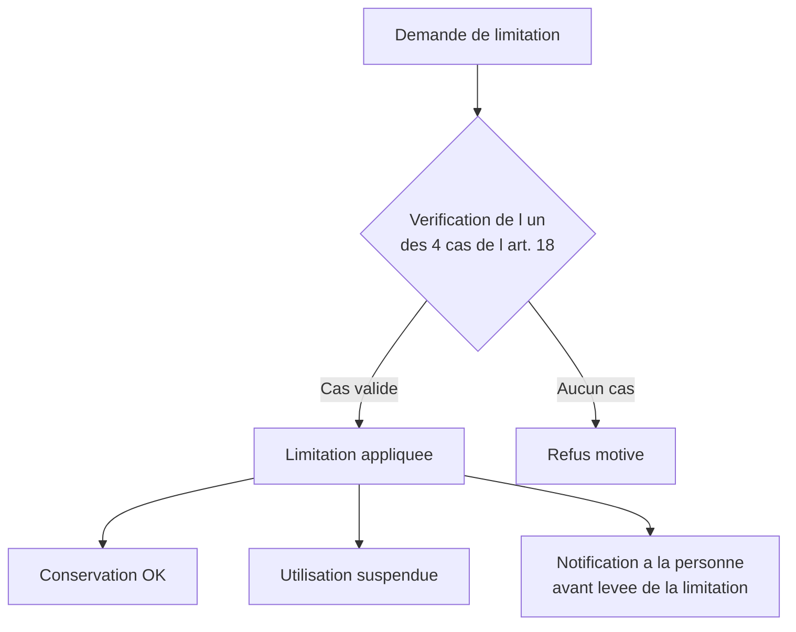
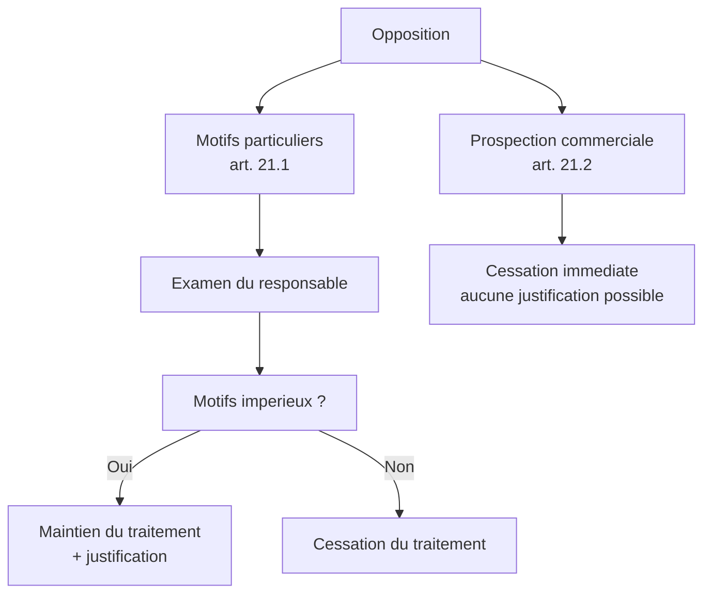
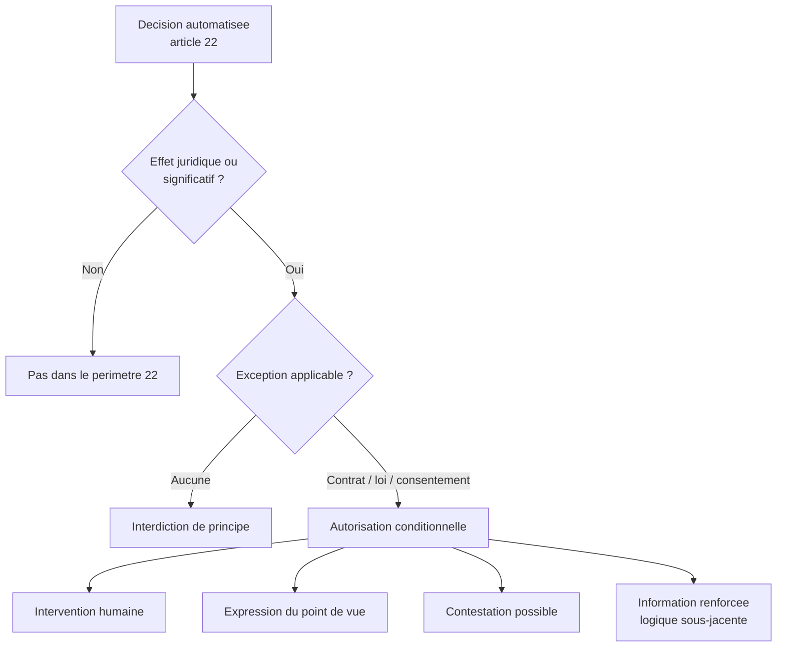
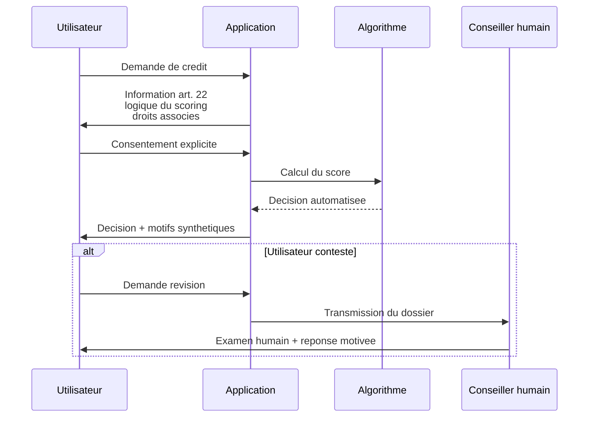
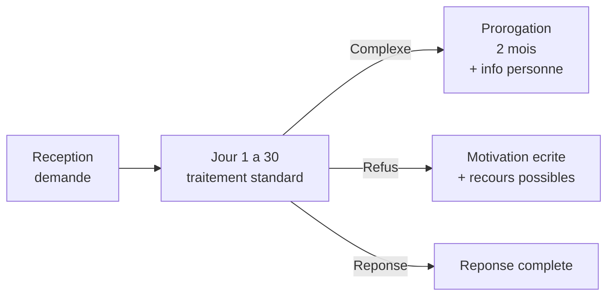

# Les droits défensifs : limitation, opposition et décisions automatisées

## Introduction

Imaginez que vous soyez en désaccord avec votre banque sur une
opération suspecte. Vous ne voulez pas fermer le compte (vous en
avez besoin), vous ne voulez pas tout supprimer (vous voudrez
peut-être les opérations plus tard), mais vous voulez que la banque
**arrête temporairement** d'agir sur cette opération tant que le
litige n'est pas résolu. C'est exactement le sens du droit à la
limitation du traitement. Et si vous découvrez que la même banque
utilise vos données pour des fins qui vous déplaisent (publicité
ciblée, scoring agressif), vous voulez pouvoir vous y **opposer**
sans renoncer au service. C'est le droit d'opposition.

Cette partie présente les trois droits que nous appelons « défensifs »
parce qu'ils permettent à la personne de se **protéger** sans
nécessairement rompre la relation avec le responsable de traitement.
Ils sont moins connus que l'accès ou l'effacement, mais leur mauvaise
implémentation est régulièrement sanctionnée. À l'issue de cette
partie, vous saurez les distinguer, les implémenter, et comprendre
le régime particulièrement strict des décisions automatisées.

### Le droit à la limitation du traitement (article 18)

À mi-chemin entre le maintien du traitement et son effacement, la
limitation est une mesure conservatoire. Elle dit : « gardez les
données, mais ne les utilisez plus pour l'instant ». Ce droit est
souvent invoqué dans des situations transitoires : contestation
d'exactitude, vérification d'une opposition, gestion de litiges.

L'article 18 du RGPD prévoit quatre cas dans lesquels la personne
peut demander la limitation :

1. l'**exactitude** des données est contestée, le temps de la
   vérifier ;
2. le traitement est **illicite** mais la personne préfère la
   limitation à l'effacement ;
3. le responsable n'a plus besoin des données mais la personne en a
   besoin pour la **constatation, l'exercice ou la défense de droits
   en justice** ;
4. la personne s'est **opposée** au traitement (article 21) le temps
   de vérifier si les motifs légitimes du responsable prévalent.

Lorsque le traitement est limité, les données peuvent toujours être
**conservées** mais ne peuvent plus être **utilisées**, à
l'exception du consentement de la personne, de la défense en justice,
de la protection des droits d'un tiers, ou de motifs importants
d'intérêt public.



Pour le développeur, la limitation se traduit par un **statut
spécifique** appliqué aux données concernées. Il s'agit de marquer
les enregistrements comme « limités » et d'empêcher techniquement
toute opération de traitement sur ces données, hormis leur
conservation.

#### Exemple pratique {id="exemple-pratique-lim-1"}

Voici une implémentation simple basée sur un flag de statut au
niveau de la table utilisateur :

```sql
-- Ajout d un champ de statut sur la table users
ALTER TABLE users
ADD COLUMN processing_status VARCHAR(20) NOT NULL DEFAULT 'active';
-- Valeurs possibles : 'active', 'limited', 'pending_deletion'

-- Table dediee a l historique des limitations
CREATE TABLE processing_limitations (
    id BIGINT PRIMARY KEY,
    user_id BIGINT NOT NULL REFERENCES users(id),
    reason VARCHAR(255) NOT NULL,
    status VARCHAR(20) NOT NULL,
    -- 'active' ou 'resolved'
    requested_at TIMESTAMP NOT NULL,
    resolved_at TIMESTAMP,
    notes TEXT
);

-- Index pour retrouver rapidement les limitations actives
CREATE INDEX idx_limitations_active
    ON processing_limitations(user_id, status);
```

Côté applicatif, toutes les opérations de traitement doivent
vérifier ce flag avant d'agir :

```javascript
// Middleware bloquant les traitements sur compte limite
async function checkProcessingAllowed(req, res, next) {
    const user = await db.users.findById(req.user.id);

    if (user.processing_status === 'limited') {
        // Seules certaines operations sont autorisees
        const allowedRoutes = [
            'GET /api/v1/me',
            'GET /api/v1/me/data-access',
            'DELETE /api/v1/me'
        ];
        const currentRoute = `${req.method} ${req.path}`;

        if (!allowedRoutes.includes(currentRoute)) {
            return res.status(403).json({
                error: 'Traitement limite a la demande',
                code: 'PROCESSING_LIMITED',
                contact: 'dpo@acme.fr'
            });
        }
    }

    next();
}
```

Notez le principe : la limitation est strictement défensive. La
personne peut continuer à exercer ses autres droits (accès,
effacement), mais l'organisation ne peut plus effectuer de
traitement actif sur ses données.

### Le droit d'opposition (article 21)

Avez-vous déjà reçu trois fois la même newsletter de la même
entreprise dans la même semaine et eu envie de hurler « ARRÊTEZ ! » ?
Vous avez exercé, sans le savoir peut-être, votre droit d'opposition.
Le RGPD reconnaît à la personne concernée le droit de s'opposer à
certains traitements, et cette opposition doit pouvoir s'exercer
simplement, gratuitement, et de manière effective.

L'article 21 prévoit deux régimes d'opposition différents :

**Opposition pour motifs particuliers** : la personne peut s'opposer
à un traitement fondé sur l'**intérêt légitime** (art. 6.1.f) ou sur
la **mission d'intérêt public** (art. 6.1.e), en faisant valoir des
raisons tenant à sa situation particulière. Le responsable doit
alors cesser le traitement, **sauf** s'il démontre des motifs
légitimes et impérieux qui prévalent sur les intérêts, droits et
libertés de la personne, ou si le traitement est nécessaire à la
constatation, à l'exercice ou à la défense de droits en justice.

**Opposition à la prospection commerciale** : la personne peut
s'opposer à tout moment au traitement de ses données à des fins de
prospection, y compris au profilage à ces fins, **sans avoir à se
justifier**. Le droit est absolu : aucun motif légitime ne peut
prévaloir. C'est probablement l'opposition la plus fréquente, et
elle doit être implémentée de manière particulièrement fluide.



Pour le développeur, le droit d'opposition à la prospection se
traduit par un **mécanisme d'opt-out** simple et accessible. C'est
ce mécanisme qu'on retrouve sous forme de lien « se désinscrire » au
bas de chaque email marketing. La directive ePrivacy renforce cette
exigence : tout email commercial doit comporter un lien de
désinscription en un clic, fonctionnel et durable.

#### Exemple pratique {id="exemple-pratique-opp-1"}

Voici un modèle de gestion des oppositions, avec table dédiée et
endpoint de retrait :

```sql
-- Table de gestion des oppositions
CREATE TABLE user_objections (
    id BIGINT PRIMARY KEY,
    user_id BIGINT NOT NULL REFERENCES users(id),
    objection_type VARCHAR(50) NOT NULL,
    -- 'marketing', 'profiling', 'legitimate_interest'
    objection_scope VARCHAR(100),
    -- 'all', 'newsletter', 'partner_offers', etc.
    requested_at TIMESTAMP NOT NULL,
    status VARCHAR(20) NOT NULL DEFAULT 'active',
    -- 'active', 'rejected', 'expired'
    rejection_reason TEXT,
    notes TEXT
);

CREATE INDEX idx_objections_active
    ON user_objections(user_id, objection_type, status);
```

```javascript
// POST /api/v1/me/object
// Body : { type, scope }
// Auth : utilisateur authentifie OU token de desinscription

async function handleObjection(req, res) {
    const { type, scope } = req.body;
    let userId;

    if (req.user) {
        userId = req.user.id;
    } else if (req.query.token) {
        // Lien de desinscription : token signe sans login
        userId = await verifyUnsubscribeToken(req.query.token);
    } else {
        return res.status(401).json({ error: 'Authentification requise' });
    }

    // Enregistrement de l opposition
    await db.userObjections.insert({
        user_id: userId,
        objection_type: type,
        objection_scope: scope || 'all',
        requested_at: new Date(),
        status: 'active'
    });

    // Application immediate pour la prospection
    if (type === 'marketing') {
        await emailService.removeFromAllLists(userId);
        await db.users.update(userId, {
            marketing_enabled: false
        });
    }

    res.status(200).json({
        message: 'Votre opposition a ete enregistree',
        applied_at: new Date()
    });
}
```

Trois points cruciaux :

- L'opposition à la prospection s'applique **immédiatement**, sans
  examen possible ;
- L'opposition peut être exercée par un utilisateur connecté ou via
  un lien signé (cas typique du lien de désinscription dans un
  email) ;
- L'opposition doit être **propagée** à tous les outils marketing
  (CRM, ESP, plateformes publicitaires).

#### Exercice 1

Une utilisatrice de votre plateforme vous écrit : « Je m'oppose à
l'utilisation de mes données pour la newsletter et pour les
recommandations personnalisées de produits ». Comment traitez-vous
chacune de ces deux oppositions ? Indiquez la base légale probable
de chaque traitement, le régime d'opposition applicable, et la
réponse technique à apporter.

##### Correction exercice 1 {collapsible="true"}

**Opposition à la newsletter** :

- **Base légale probable** : consentement (article 6.1.a) ou intérêt
  légitime si clients existants.
- **Régime applicable** :
  - Si consentement : la personne peut retirer son consentement à
    tout moment, sans avoir à se justifier. Cessation immédiate.
  - Si intérêt légitime : il s'agit d'une opposition à la prospection
    commerciale (art. 21.2), absolue et sans justification. Cessation
    immédiate également.
- **Réponse technique** :
  - Désabonnement de toutes les listes d'envoi (ESP, CRM).
  - Marquage du compte avec `marketing_enabled = false`.
  - Enregistrement de l'opposition dans la table dédiée.
  - Confirmation écrite à l'utilisatrice par retour d'email.

**Opposition aux recommandations personnalisées** :

- **Base légale probable** : intérêt légitime (art. 6.1.f) si les
  recommandations sont basées sur l'historique d'achat dans la même
  application, ou consentement si elles relèvent d'un profilage
  étendu (article 22 ou cookies tiers).
- **Régime applicable** :
  - Si profilage à des fins de prospection : opposition absolue
    (art. 21.2).
  - Si intérêt légitime hors prospection : opposition pour motifs
    particuliers (art. 21.1). La personne doit invoquer sa situation
    particulière, et le responsable peut maintenir s'il démontre des
    motifs impérieux. En pratique, le respect de la volonté de
    l'utilisateur est presque toujours la bonne décision.
- **Réponse technique** :
  - Désactivation des recommandations personnalisées dans son espace.
  - Réorientation vers une logique de recommandation générique ou
    aléatoire.
  - Documentation interne de l'opposition.

Délai de réponse : opposition immédiate pour la prospection, un mois
maximum pour les autres cas.

### Le régime des décisions automatisées (article 22)

Imaginez qu'un algorithme refuse votre prêt immobilier sans qu'aucun
humain n'examine votre dossier, en se basant uniquement sur un score
calculé par une IA. Vous vous sentiriez impuissant, non ? Le RGPD
reconnaît cette inquiétude et pose un **principe d'interdiction**
des décisions purement automatisées ayant un effet juridique ou
significatif sur les personnes. C'est l'un des articles les plus
importants à l'ère de l'IA, et il interagit étroitement avec l'AI
Act européen.

L'article 22 prévoit que la personne concernée a le droit de ne pas
faire l'objet d'une décision fondée **exclusivement** sur un
traitement automatisé, y compris le profilage, produisant des effets
juridiques la concernant ou l'affectant de manière significative.

Trois exceptions à ce principe :

1. la décision est **nécessaire à la conclusion ou à l'exécution
   d'un contrat** entre la personne et le responsable (par exemple,
   un système anti-fraude automatique sur un paiement) ;
2. la décision est **autorisée par le droit** européen ou national
   (par exemple, certains contrôles fiscaux automatisés) ;
3. la décision est fondée sur le **consentement explicite** de la
   personne.

Même dans ces cas d'exception, la personne conserve trois droits
spécifiques :

- le droit d'**obtenir une intervention humaine** dans la décision ;
- le droit d'**exprimer son point de vue** ;
- le droit de **contester la décision**.



Quand l'article 22 s'applique, l'information préalable doit être
renforcée : la personne doit recevoir des informations utiles sur la
**logique sous-jacente**, l'**importance** et les **conséquences
prévues** du traitement. C'est ce que la jurisprudence européenne
commence à interpréter comme un véritable « droit à l'explication ».

#### Exemple pratique {id="exemple-pratique-art22-1"}

Voici un parcours utilisateur conforme pour un système de scoring
de crédit automatisé en ligne :



Sur le plan implémentation, cela suppose :

- une **interface d'information** claire avant la décision ;
- un **chemin d'escalade** documenté vers un examen humain ;
- une **journalisation** complète des décisions automatisées et de
  leurs justifications ;
- un **tableau de bord** pour le DPO permettant de superviser le
  fonctionnement de l'algorithme.

#### Exercice 2

Une plateforme de location entre particuliers utilise un algorithme
qui décide automatiquement, en moins de deux secondes, si un nouvel
inscrit est éligible à louer ou non. La décision est prise sur la
base de plusieurs critères : score de crédit récupéré chez un tiers,
historique sur d'autres plateformes, données déclarées par le
candidat. Aucune intervention humaine n'est prévue pour les refus.
Cette pratique est-elle conforme à l'article 22 ? Quelles
modifications proposeriez-vous pour la mettre en conformité ?

##### Correction exercice 2 {collapsible="true"}

**Analyse de conformité** :

La pratique relève manifestement de l'article 22 :

- décision exclusivement automatisée (pas d'intervention humaine) ;
- effet significatif sur la personne (refus d'accès à une plateforme
  économiquement importante).

Pour être conforme, elle doit reposer sur l'une des trois exceptions
prévues (contrat, loi, consentement explicite) ET prévoir les
garanties associées.

**Modifications recommandées** :

1. **Information renforcée** : avant la soumission, l'utilisateur
   doit recevoir une information claire indiquant :
   - qu'une décision automatisée est mise en œuvre ;
   - les critères généraux utilisés (sans révéler le détail
     algorithmique, mais avec les facteurs principaux) ;
   - les conséquences possibles (acceptation, refus, demande
     d'information complémentaire) ;
   - les droits dont il dispose en cas de refus.

2. **Base légale solide** : si la plateforme veut maintenir
   l'automatisation, la base la plus appropriée est la nécessité
   contractuelle (préparation du contrat de location). Documenter
   cette qualification.

3. **Voie de recours humaine** :
   - en cas de refus, l'utilisateur doit pouvoir demander une
     révision humaine de la décision ;
   - un délai raisonnable doit être prévu pour cette révision (15
     jours maximum recommandés) ;
   - la personne en charge doit avoir le pouvoir de modifier la
     décision.

4. **Possibilité d'exprimer son point de vue** : l'utilisateur doit
   pouvoir fournir des éléments complémentaires (justificatifs,
   explications) avant ou après la décision.

5. **Journalisation et audit** : conserver, pour chaque décision,
   les critères ayant conduit au résultat. Cela permet (a) de
   répondre à une demande d'explication, (b) de prouver l'absence
   de biais discriminatoire si l'algorithme est challengé.

6. **Évaluation périodique de l'algorithme** : auditer
   régulièrement les taux de refus selon les profils démographiques,
   pour détecter d'éventuels biais. Documenter ces audits.

7. **AIPD obligatoire** : pour un traitement de cette nature, une
   analyse d'impact relative à la protection des données est
   obligatoire au regard de l'article 35.

### Les délais et modalités de réponse

À quel délai un utilisateur peut-il s'attendre quand il exerce un de
ses droits ? Le RGPD impose une discipline temporelle stricte qui
contraint l'organisation à industrialiser ses processus.

L'article 12.3 prévoit que le responsable de traitement fournit à la
personne concernée des informations sur les mesures prises à la
suite d'une demande dans un délai d'**un mois** à compter de la
réception. Ce délai peut être prorogé de **deux mois supplémentaires**
si nécessaire, compte tenu de la complexité et du nombre de
demandes, mais la personne doit en être informée dans le mois
initial avec les raisons de la prorogation.

Si le responsable de traitement ne donne pas suite à la demande, il
doit informer la personne dans le délai d'un mois des **motifs de
l'inaction** et de la possibilité d'introduire une réclamation auprès
de l'autorité de contrôle et de former un recours juridictionnel.



Les demandes sont **gratuites** sauf cas exceptionnels (manifestement
infondées, excessives, répétitives) où des frais raisonnables
peuvent être facturés ou la demande refusée. La preuve du caractère
abusif incombe au responsable.

#### Exemple pratique {id="exemple-pratique-delai-1"}

Voici une structure type pour gérer un processus de réponse aux
demandes utilisateurs, qu'on appellera DSAR (*Data Subject Access
Request*) en anglais :

```sql
-- Table de suivi des demandes RGPD
CREATE TABLE dsar_requests (
    id BIGINT PRIMARY KEY,
    request_type VARCHAR(50) NOT NULL,
    -- 'access', 'rectification', 'erasure',
    -- 'portability', 'limitation', 'objection'
    requestor_email VARCHAR(255) NOT NULL,
    user_id BIGINT REFERENCES users(id),
    received_at TIMESTAMP NOT NULL,
    identity_verified_at TIMESTAMP,
    deadline_at TIMESTAMP NOT NULL,
    extended_deadline_at TIMESTAMP,
    status VARCHAR(20) NOT NULL DEFAULT 'received',
    -- 'received', 'in_progress', 'completed',
    -- 'rejected', 'extended'
    assigned_to VARCHAR(100),
    completed_at TIMESTAMP,
    response_summary TEXT
);

-- Vue pour alerter sur les echeances proches
CREATE VIEW dsar_alerts AS
SELECT
    id, request_type, requestor_email,
    received_at, deadline_at, status
FROM dsar_requests
WHERE status IN ('received', 'in_progress')
    AND deadline_at < CURRENT_TIMESTAMP + INTERVAL '7 days';
```

Un tel système permet de :

- centraliser toutes les demandes RGPD dans un outil unique ;
- alerter automatiquement le DPO sur les échéances approchant ;
- mesurer les temps de traitement moyens (KPI de conformité) ;
- prouver, en cas de contrôle, la rigueur de la gestion.

## Exercice final

Vous êtes développeur lead dans une fintech française, *PayWise*, qui
propose une carte bancaire prépayée pour les jeunes adultes (18-25
ans) avec coaching financier intégré par IA. Un utilisateur, refusé
par l'algorithme d'octroi de la carte, vous envoie le message
suivant :

> *Bonjour, ma demande de carte a été refusée sans aucune
> explication. Je m'oppose à toute utilisation de mes données pour
> du marketing ou du profilage. J'exige par ailleurs de connaître la
> logique de votre algorithme et d'obtenir une révision humaine de
> la décision. Si vous n'obtempérez pas dans les 7 jours, je saisirai
> la CNIL.*

Préparez une réponse structurée à cet utilisateur, en identifiant
pour chaque demande : le droit invoqué, le régime applicable, la
réponse opérationnelle à apporter, et le délai légal. Indiquez
également les éventuelles erreurs juridiques contenues dans la
demande de l'utilisateur.

### Correction exercice final {collapsible="true"}

**Note d'analyse et projet de réponse**

L'utilisateur invoque plusieurs droits, qu'il convient d'analyser
séparément.

**1. Demande d'explication de la décision (article 22)**

- **Droit invoqué** : information sur la logique sous-jacente d'une
  décision automatisée (art. 13.2.f et 15.1.h).
- **Régime** : *PayWise* étant manifestement dans le champ de
  l'article 22 (décision automatisée avec effet significatif), elle
  doit fournir des « informations utiles concernant la logique
  sous-jacente, ainsi que l'importance et les conséquences prévues
  de ce traitement ».
- **Réponse** : fournir une explication accessible des critères
  généraux utilisés (revenus, historique, données déclaratives),
  sans révéler les pondérations exactes (secret algorithmique
  préservé).

**2. Demande de révision humaine (article 22.3)**

- **Droit invoqué** : intervention humaine dans une décision
  automatisée.
- **Régime** : droit absolu si la décision relève de l'article 22.
- **Réponse** : transmettre le dossier à un analyste crédit pour
  examen humain dans un délai raisonnable. Le résultat de cet examen
  peut être différent de la décision automatique initiale.

**3. Opposition au marketing et au profilage**

- **Droit invoqué** : article 21.2 (opposition à la prospection
  commerciale, y compris au profilage à ces fins).
- **Régime** : droit absolu, sans justification possible.
- **Réponse** : désinscription immédiate de toutes les communications
  marketing et désactivation du profilage publicitaire. Confirmation
  écrite.

**4. Délai de 7 jours imposé par l'utilisateur**

- **Erreur juridique** : le RGPD prévoit un délai d'**un mois**
  (article 12.3), pas 7 jours. *PayWise* n'est donc pas tenue de
  répondre dans le délai exigé par l'utilisateur. En revanche, une
  réponse rapide est de bonne politique relationnelle.

**5. Menace de saisine de la CNIL**

- **Droit** : la personne a effectivement le droit de saisir la CNIL
  à tout moment. Pas de menace au sens péjoratif ; c'est un droit
  garanti par le RGPD lui-même.
- **Réponse** : ne pas le percevoir comme une menace mais comme un
  rappel des voies de recours, et rappeler ce droit dans la réponse
  (c'est une obligation).

**Projet de réponse à l'utilisateur** :

> *Bonjour,*
>
> *Nous avons bien reçu votre demande du [date] et nous vous
> remercions de l'avoir formulée clairement. Voici les actions que
> nous engageons :*
>
> *1. Explication de la décision : votre demande a été examinée par
> notre système automatique sur la base des critères suivants :
> ressources financières, données déclaratives au formulaire,
> historique de paiement public disponible. Le détail des
> pondérations relève du secret commercial protégé, mais nous vous
> indiquons que dans votre cas, les facteurs principaux ayant
> conduit au refus sont [exemples : insuffisance de ressources
> déclarées + dossier incomplet].*
>
> *2. Demande de révision humaine : votre dossier est transmis à
> notre équipe d'analyse crédit qui réexaminera votre demande sous
> 15 jours ouvrés. Cette analyse humaine pourra aboutir à une
> décision différente. Vous pouvez d'ici là nous transmettre tout
> élément complémentaire utile (justificatifs de revenus,
> attestations).*
>
> *3. Opposition au marketing et profilage : votre opposition est
> enregistrée à compter de ce jour. Vous ne recevrez plus aucune
> communication marketing de notre part, et votre profil ne sera
> plus utilisé pour de la personnalisation publicitaire.*
>
> *Le délai légal de réponse complète à votre demande est d'un mois,
> mais nous nous engageons à vous répondre dans les 15 jours.*
>
> *Vous disposez à tout moment du droit d'introduire une réclamation
> auprès de la CNIL (cnil.fr/fr/plaintes) si vous estimez vos droits
> insuffisamment respectés.*
>
> *Cordialement,*
> *Le service Protection des données de PayWise*

## Conclusion de la partie

Vous avez maintenant une compréhension complète des droits des
personnes concernées : information préalable, accès, rectification,
effacement, portabilité, limitation, opposition, et le régime
particulier des décisions automatisées. Vous savez les distinguer,
les implémenter techniquement, et gérer les délais.

Retenez cette grille de réflexes pour tout projet :

- prévoir un parcours **« Mes données personnelles »** dans l'espace
  utilisateur, qui regroupe l'accès, la rectification, l'effacement
  et la portabilité ;
- mettre en place un **mécanisme d'opposition** simple, en
  particulier un lien de désinscription dans tous les emails
  marketing ;
- gérer les **demandes par email** avec une boîte dédiée
  (dpo@... ou privacy@...) et un outil de suivi ;
- renforcer l'**information** et les **garanties** pour tout
  traitement relevant de l'article 22 ;
- mesurer les **délais de réponse** moyens comme un KPI de
  conformité.

Vous êtes désormais prêt pour le TP final, qui mettra en pratique
l'ensemble de ces notions dans la conception d'un module complet de
gestion des droits utilisateur.
