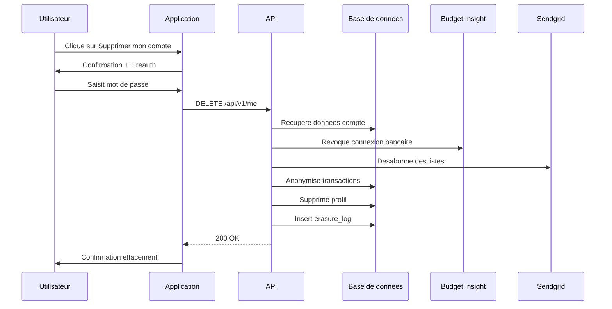
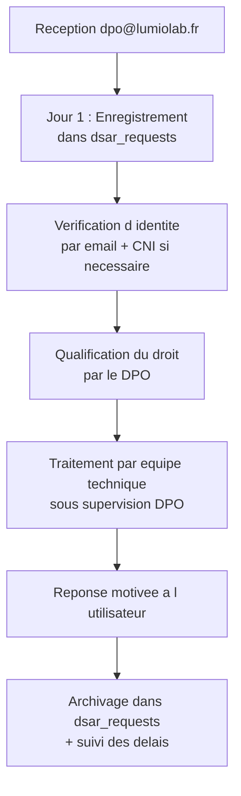

# TP : Conception et implémentation d'un module « Mes données personnelles »

## Introduction

### Contexte du TP

*Lumio Lab*, une startup française née il y a deux ans, édite une
application web et mobile de gestion budgétaire familiale. Le service
permet à ses utilisateurs de connecter leurs comptes bancaires
(via un agrégateur tiers), de catégoriser automatiquement leurs
dépenses, de définir des objectifs d'épargne, et de partager les
budgets familiaux avec leurs proches. L'application compte
aujourd'hui 80 000 utilisateurs actifs.

Au cours du dernier semestre, *Lumio Lab* a reçu une vingtaine de
demandes RGPD diverses (accès, suppression, portabilité, opposition),
gérées au cas par cas par le support client. Ces demandes prennent
beaucoup de temps, sont sources d'erreurs, et la CTO a constaté
qu'elles dépassaient parfois le délai légal d'un mois. Elle vous
mandate, en tant que développeur senior, pour concevoir et
implémenter un **module de gestion des droits utilisateur** complet,
intégré à l'application, qui permettra aux utilisateurs d'exercer
l'essentiel de leurs droits en toute autonomie.

Votre mission : produire la spécification technique, le modèle de
données, les endpoints REST, l'interface utilisateur et un texte
d'information, prêts à être implémentés par l'équipe technique.

### Objectifs du TP

À l'issue de ce TP, vous serez capable de :

1. Concevoir l'architecture technique d'un module de gestion des
   droits RGPD intégré à une application.
2. Modéliser les tables nécessaires au suivi des demandes RGPD et
   à leur traçabilité.
3. Spécifier des endpoints REST conformes aux articles 15 à 22.
4. Définir une interface utilisateur lisible, accessible et
   pédagogique pour l'exercice des droits.
5. Rédiger les textes d'information préalable conformes aux
   articles 13 et 14.

### Durée estimée

Environ **4 heures** (peut être étendu à 5 heures avec restitution
orale ou prototypage technique).

### Prérequis techniques

- Avoir lu intégralement les parties 1 à 3 du module.
- Connaître les huit droits des personnes concernées prévus par le
  RGPD.
- Maîtriser les bases du SQL (compatible MySQL et PostgreSQL).
- Connaître les fondamentaux des API REST et de l'authentification
  (JWT, tokens).
- Avoir une notion de la conception UX (wireframes, parcours
  utilisateur).

## Étape 1 : Cartographie préalable des données

### 1.1 Inventaire des sources de données

Avant de concevoir le module, il faut savoir ce qu'on devra traiter.
À partir du contexte de *Lumio Lab*, listez toutes les sources de
données personnelles potentielles. Pensez aux données stockées en
interne et aux données détenues par des tiers.

Présentez votre inventaire sous forme de tableau :

| Source | Type de données | Localisation | Rôle |
|--------|------------------|--------------|------|

Au minimum, identifiez : la base principale, l'agrégateur bancaire,
le service d'envoi d'emails, les outils analytiques, les
sauvegardes, les logs applicatifs, l'historique des supports
client.

### 1.2 Schéma de la base principale

Proposez le schéma SQL minimal de la base principale (compatible
MySQL et PostgreSQL), couvrant : utilisateurs, comptes bancaires
agrégés, transactions, catégories, budgets, objectifs d'épargne,
partages familiaux, consentements, journaux d'accès. Indiquez pour
chaque champ contenant des données personnelles ou sensibles un
commentaire approprié.

```sql
-- Exemple attendu
CREATE TABLE users (
    id BIGINT PRIMARY KEY,
    -- Donnee personnelle classique
    email VARCHAR(255) NOT NULL UNIQUE,
    -- A completer ...
);
```

Le schéma doit comporter au minimum sept tables.

## Étape 2 : Architecture du module de gestion des droits

### 2.1 Diagramme de séquence

Réalisez un diagramme de séquence (Mermaid) illustrant le parcours
utilisateur typique pour chaque droit majeur :

1. Demande d'accès complet à ses données.
2. Modification de données personnelles.
3. Suppression du compte.
4. Export des données pour portabilité.
5. Opposition au marketing.

Chaque diagramme doit faire apparaître : l'utilisateur, l'interface,
l'API, la base, et les éventuels systèmes tiers.

### 2.2 Tables techniques du module

Concevez les tables qui supportent le module : suivi des demandes
RGPD (DSAR), historique des modifications de données, traçabilité
des effacements, oppositions actives, registre des consentements.
SQL compatible MySQL et PostgreSQL, 80 caractères max par ligne.

Au minimum :

- `dsar_requests` : suivi de toutes les demandes RGPD ;
- `user_changes` : journal d'audit des modifications ;
- `erasure_log` : trace des effacements ;
- `user_objections` : oppositions actives.

## Étape 3 : Spécification des endpoints REST

### 3.1 Liste des endpoints

Spécifiez les endpoints REST suivants au minimum :

| Méthode | URL | Droit RGPD | Auth |
|---------|-----|-------------|------|
| GET | /api/v1/me | art. 15 (vue rapide) | JWT |
| GET | /api/v1/me/data-access | art. 15 (complet) | JWT renforce |
| PATCH | /api/v1/me | art. 16 | JWT |
| DELETE | /api/v1/me | art. 17 | JWT renforce |
| GET | /api/v1/me/export | art. 20 | JWT renforce |
| POST | /api/v1/me/object | art. 21 | JWT |
| POST | /api/v1/me/limit | art. 18 | JWT |

Pour chaque endpoint, fournissez la spécification détaillée :

- méthode et URL ;
- format du payload (request body) ;
- format de la réponse (response body) ;
- codes HTTP attendus ;
- exigences d'authentification.

### 3.2 Logique d'effacement

Détaillez la logique de l'endpoint `DELETE /api/v1/me`. En particulier :

- Que peut-on effacer immédiatement ?
- Que faut-il conserver et pourquoi (citez les bases légales) ?
- Quelle anonymisation appliquer ?
- Comment notifier les sous-traitants (agrégateur bancaire,
  service email) ?
- Comment tracer l'opération ?

Rédigez la procédure sous forme de pseudo-code ou de SQL commenté.

### 3.3 Endpoint de portabilité

Détaillez précisément le format de l'export produit par
`GET /api/v1/me/export?format=json`. Fournissez un exemple complet
de réponse JSON, en distinguant ce qui relève du droit à la
portabilité (données fournies par l'utilisateur) et ce qui n'en
relève pas (données dérivées par l'algorithme de catégorisation,
prédictions, scoring).

## Étape 4 : Interface utilisateur

### 4.1 Wireframe textuel ou HTML

Rédigez le HTML structurel d'une page « Mes données personnelles »
qui regroupe l'ensemble des droits. La page doit :

- présenter visuellement les six droits (accès, rectification,
  effacement, portabilité, limitation, opposition) ;
- expliquer chaque droit en langage clair ;
- proposer une action concrète pour chacun (bouton, lien) ;
- prévoir une zone d'historique des demandes précédentes ;
- inclure un lien vers la politique de confidentialité et vers la
  CNIL.

CSS minimal mais professionnel. Accessibilité respectée (attributs
ARIA, contraste, navigation au clavier).

### 4.2 Parcours d'effacement

Détaillez le parcours utilisateur de l'effacement de compte. Combien
d'étapes ? Quelles confirmations ? Quelles informations préalables ?
Comment éviter qu'un utilisateur supprime son compte par accident ?
Comment respecter la volonté de l'utilisateur sans le décourager
illégitimement (pas de *dark pattern*) ?

Décrivez chaque étape avec son contenu textuel et les actions
disponibles.

## Étape 5 : Textes d'information

### 5.1 Mention d'information du formulaire d'inscription (art. 13)

Rédigez la mention d'information à placer sous le formulaire
d'inscription de *Lumio Lab*. Elle doit comporter toutes les
mentions obligatoires de l'article 13 et rester lisible
(maximum 200 mots).

### 5.2 Email d'information indirecte (art. 14)

Lorsqu'un utilisateur partage un budget avec un membre de sa famille
non encore inscrit, *Lumio Lab* récupère ses coordonnées (nom,
email) pour lui envoyer une invitation. Cette personne reçoit donc
des données la concernant sans l'avoir choisi.

Rédigez le texte de l'email d'invitation qui inclut la mention
d'information indirecte conforme à l'article 14.

## Étape 6 : Procédure de gestion des demandes hors application

Toutes les demandes ne passeront pas par l'interface. Certaines
arriveront par email à `dpo@lumiolab.fr`. Décrivez la procédure
opérationnelle de gestion de ces demandes :

1. Réception et enregistrement.
2. Vérification d'identité (méthode proposée).
3. Qualification du droit invoqué.
4. Traitement opérationnel.
5. Réponse motivée à l'utilisateur.
6. Archivage.

Précisez les délais à chaque étape et qui est responsable. Une
représentation graphique (BPMN simplifié ou flowchart) est
appréciée.

## Correction du TP {collapsible="true"}

Cette correction présente une réponse type. D'autres approches sont
légitimes : ce qui compte est la cohérence du raisonnement, la
qualité de l'implémentation technique, et la prise en compte
effective des huit droits.

### Étape 1 : Cartographie

Sources de données identifiées :

| Source | Type | Localisation | Rôle |
|--------|------|--------------|------|
| Base principale | Compte, transactions, budgets | OVH | RT |
| Agrégateur bancaire | Identité bancaire, mouvements | Budget Insight | ST |
| Sendgrid | Emails envoyés et clics | USA | ST |
| Plausible | Statistiques anonymes | Allemagne | ST |
| Logs applicatifs | IP, user agent, parcours | Datadog | ST |
| Sauvegardes | État historique | OVH | ST |
| Support client | Tickets, échanges | Zendesk | ST |

Schéma de la base principale (extrait) :

```sql
-- Table des utilisateurs
CREATE TABLE users (
    id BIGINT PRIMARY KEY,
    email VARCHAR(255) NOT NULL UNIQUE,
    password_hash VARCHAR(255) NOT NULL,
    first_name VARCHAR(100) NOT NULL,
    last_name VARCHAR(100) NOT NULL,
    date_of_birth DATE,
    locale VARCHAR(10) DEFAULT 'fr',
    processing_status VARCHAR(20) NOT NULL DEFAULT 'active',
    marketing_enabled BOOLEAN NOT NULL DEFAULT FALSE,
    created_at TIMESTAMP NOT NULL DEFAULT CURRENT_TIMESTAMP,
    last_login_at TIMESTAMP
);

-- Table des comptes bancaires agreges
CREATE TABLE bank_accounts (
    id BIGINT PRIMARY KEY,
    user_id BIGINT NOT NULL REFERENCES users(id),
    bank_name VARCHAR(255) NOT NULL,
    account_label VARCHAR(255),
    iban_last4 VARCHAR(4),
    external_id VARCHAR(255) NOT NULL,
    connected_at TIMESTAMP NOT NULL DEFAULT CURRENT_TIMESTAMP
);

-- Table des transactions
CREATE TABLE transactions (
    id BIGINT PRIMARY KEY,
    account_id BIGINT NOT NULL REFERENCES bank_accounts(id),
    amount DECIMAL(12,2) NOT NULL,
    label VARCHAR(500),
    category_id BIGINT,
    transaction_date DATE NOT NULL,
    imported_at TIMESTAMP NOT NULL DEFAULT CURRENT_TIMESTAMP
);

-- Table des budgets et objectifs (donnees fournies par utilisateur)
CREATE TABLE budgets (
    id BIGINT PRIMARY KEY,
    user_id BIGINT NOT NULL REFERENCES users(id),
    name VARCHAR(255) NOT NULL,
    monthly_target DECIMAL(12,2) NOT NULL,
    created_at TIMESTAMP NOT NULL DEFAULT CURRENT_TIMESTAMP
);

-- Table des partages familiaux
CREATE TABLE family_shares (
    id BIGINT PRIMARY KEY,
    owner_user_id BIGINT NOT NULL REFERENCES users(id),
    shared_with_user_id BIGINT REFERENCES users(id),
    shared_with_email VARCHAR(255) NOT NULL,
    share_scope VARCHAR(50) NOT NULL,
    created_at TIMESTAMP NOT NULL DEFAULT CURRENT_TIMESTAMP
);

-- Table des consentements
CREATE TABLE user_consents (
    id BIGINT PRIMARY KEY,
    user_id BIGINT NOT NULL REFERENCES users(id),
    purpose VARCHAR(100) NOT NULL,
    status VARCHAR(20) NOT NULL,
    given_at TIMESTAMP,
    withdrawn_at TIMESTAMP,
    text_version VARCHAR(20) NOT NULL,
    ip_address VARCHAR(45),
    user_agent VARCHAR(500)
);

-- Table des journaux d acces
CREATE TABLE access_logs (
    id BIGINT PRIMARY KEY,
    user_id BIGINT REFERENCES users(id),
    ip_address VARCHAR(45),
    action VARCHAR(100) NOT NULL,
    created_at TIMESTAMP NOT NULL DEFAULT CURRENT_TIMESTAMP
);
```

### Étape 2 : Architecture du module

Tables techniques :

```sql
-- Suivi des demandes RGPD
CREATE TABLE dsar_requests (
    id BIGINT PRIMARY KEY,
    user_id BIGINT REFERENCES users(id),
    request_type VARCHAR(50) NOT NULL,
    requestor_email VARCHAR(255) NOT NULL,
    received_at TIMESTAMP NOT NULL,
    deadline_at TIMESTAMP NOT NULL,
    status VARCHAR(20) NOT NULL DEFAULT 'received',
    assigned_to VARCHAR(100),
    completed_at TIMESTAMP,
    response_summary TEXT
);

-- Audit des modifications utilisateurs
CREATE TABLE user_changes (
    id BIGINT PRIMARY KEY,
    user_id BIGINT NOT NULL REFERENCES users(id),
    field_name VARCHAR(50) NOT NULL,
    old_value TEXT,
    new_value TEXT,
    changed_by VARCHAR(50),
    changed_at TIMESTAMP NOT NULL DEFAULT CURRENT_TIMESTAMP
);

-- Trace des effacements (sans identification directe)
CREATE TABLE erasure_log (
    id BIGINT PRIMARY KEY,
    user_id_hash VARCHAR(64) NOT NULL,
    erased_at TIMESTAMP NOT NULL,
    reason VARCHAR(255),
    retained_data TEXT
);

-- Oppositions actives
CREATE TABLE user_objections (
    id BIGINT PRIMARY KEY,
    user_id BIGINT NOT NULL REFERENCES users(id),
    objection_type VARCHAR(50) NOT NULL,
    objection_scope VARCHAR(100),
    requested_at TIMESTAMP NOT NULL,
    status VARCHAR(20) NOT NULL DEFAULT 'active'
);
```

Exemple de diagramme de séquence pour l'effacement :



### Étape 3 : Endpoints

Spécification de `DELETE /api/v1/me` (extrait) :

```javascript
// DELETE /api/v1/me
// Auth : JWT + re-authentification par mot de passe
// Body : { password }
// Response 200 : { message, retained_data }

async function handleAccountDeletion(req, res) {
    const userId = req.user.id;

    // Re-authentification renforcee
    const valid = await verifyPassword(userId, req.body.password);
    if (!valid) {
        return res.status(401).json({
            error: 'Re-authentification requise'
        });
    }

    // Hash de l user_id pour tracabilite anonyme
    const userIdHash = await hashUserId(userId);

    await db.transaction(async (tx) => {
        // 1. Anonymisation des transactions
        //    (conservees pour comptabilite agregateur)
        await tx.transactions.anonymizeByUserId(userId);

        // 2. Suppression des donnees personnelles
        await tx.budgets.deleteByUserId(userId);
        await tx.familyShares.deleteByUserId(userId);
        await tx.userConsents.deleteByUserId(userId);
        await tx.userObjections.deleteByUserId(userId);

        // 3. Suppression de la liaison bancaire
        await externalApi.budgetInsight.disconnect(userId);
        await tx.bankAccounts.deleteByUserId(userId);

        // 4. Desabonnement marketing
        await externalApi.sendgrid.removeContact(userId);

        // 5. Anonymisation des logs (>1 an conserves)
        await tx.accessLogs.anonymizeOldByUserId(userId);
        await tx.accessLogs.deleteRecentByUserId(userId);

        // 6. Suppression du compte
        await tx.users.delete(userId);

        // 7. Tracabilite
        await tx.erasureLog.insert({
            user_id_hash: userIdHash,
            erased_at: new Date(),
            reason: 'user_request',
            retained_data: 'agregat anonymise transactions'
        });
    });

    res.status(200).json({
        message: 'Compte supprime',
        retained_data: {
            transactions: 'Anonymisees pour usage statistique',
            logs_anciens: 'Conserves 1 an pour securite'
        }
    });
}
```

### Étape 4 : Interface utilisateur {id="tape-4-interface-utilisateur_1"}

Squelette HTML simplifié de la page « Mes données » :

```html
<main class="my-data-page">
    <h1>Mes donnees personnelles</h1>

    <p class="intro">
        Vos donnees vous appartiennent. Cette page vous permet de
        consulter, corriger, exporter ou supprimer vos donnees a
        tout moment.
    </p>

    <section aria-labelledby="access-title">
        <h2 id="access-title">Consulter mes donnees</h2>
        <p>
            Visualisez toutes les donnees que nous detenons sur vous.
        </p>
        <button onclick="requestAccess()">Voir mes donnees</button>
    </section>

    <section aria-labelledby="modify-title">
        <h2 id="modify-title">Modifier mes informations</h2>
        <p>
            Mettez a jour votre profil, email, ou autres informations.
        </p>
        <a href="/account/profile">Modifier mon profil</a>
    </section>

    <section aria-labelledby="export-title">
        <h2 id="export-title">Exporter mes donnees</h2>
        <p>
            Telechargez vos donnees dans un format reutilisable.
        </p>
        <button onclick="requestExport()">Telecharger mes donnees</button>
    </section>

    <section aria-labelledby="object-title">
        <h2 id="object-title">M opposer au marketing</h2>
        <p>
            Ne plus recevoir de communications commerciales.
        </p>
        <button onclick="objectMarketing()">M opposer</button>
    </section>

    <section aria-labelledby="delete-title">
        <h2 id="delete-title">Supprimer mon compte</h2>
        <p>
            Suppression definitive de votre compte et de vos donnees.
        </p>
        <button class="danger" onclick="requestDeletion()">
            Supprimer mon compte
        </button>
    </section>

    <section aria-labelledby="history-title">
        <h2 id="history-title">Historique de mes demandes</h2>
        <ul class="dsar-history">
            <li>15/01/2026 - Export complet - Reception OK</li>
            <li>10/12/2025 - Modification email - Traite</li>
        </ul>
    </section>

    <footer class="legal-links">
        <a href="/confidentialite">Politique de confidentialite</a>
        <a href="https://www.cnil.fr/fr/plaintes">Reclamation CNIL</a>
    </footer>
</main>
```

Parcours d'effacement attendu :

1. **Page « Mes données »** : bouton « Supprimer mon compte » bien
   visible mais sans dark pattern.
2. **Page de confirmation** : explication claire de ce qui sera
   supprimé, conservé, et anonymisé. Lien vers la politique.
3. **Re-authentification** : saisie du mot de passe.
4. **Confirmation finale** : bouton « Supprimer définitivement » +
   bouton « Annuler ». Pas de bouton préférentiellement mis en
   avant.
5. **Email de confirmation** : récapitulatif de l'opération avec
   numéro de référence pour preuve.

### Étape 5 : Textes d'information {id="tape-5-textes-d-information_1"}

Mention article 13 (formulaire d'inscription) :

> *Lumio Lab SAS (siège : Paris) collecte vos données pour créer et
> gérer votre compte de gestion budgétaire (base légale : exécution
> du contrat). Vos données sont conservées tant que votre compte
> est actif, et 3 ans après votre dernière connexion. Elles sont
> communiquées à nos sous-traitants techniques : OVH (hébergement,
> France), Budget Insight (agrégation bancaire, France), Sendgrid
> (emails, États-Unis avec garanties contractuelles).*
>
> *Vous disposez à tout moment des droits d'accès, de rectification,
> d'effacement, de portabilité, de limitation et d'opposition,
> exerçables dans votre espace personnel ou auprès de
> dpo@lumiolab.fr. Réclamation possible auprès de la CNIL (cnil.fr).*
>
> *Politique complète : lumiolab.fr/confidentialite.*

Email d'invitation avec mention article 14 :

> *Bonjour,*
>
> *[Prenom de l'inviteur] vous invite à rejoindre son budget
> familial sur Lumio Lab.*
>
> *Vos coordonnées (nom, email) nous ont été transmises par
> [Prenom] dans le cadre de cette invitation, pour vous permettre
> de la recevoir. Nous ne conservons ces informations que jusqu'à
> votre acceptation ou refus (30 jours maximum).*
>
> *Si vous acceptez l'invitation, vous pourrez créer votre compte
> et accéder au budget partagé. Si vous refusez ou n'agissez pas,
> vos coordonnées seront supprimées à expiration du délai.*
>
> *Vous disposez des droits d'accès, d'effacement et d'opposition
> à tout moment via dpo@lumiolab.fr ou en cliquant ici pour refuser
> l'invitation : [lien].*
>
> *Plus d'informations : lumiolab.fr/confidentialite.*

### Étape 6 : Procédure DPO

Procédure de gestion des demandes hors application :



Délais et responsables :

- **Jour 1 à 2** : enregistrement (support), vérification d'identité.
- **Jour 3 à 7** : qualification du droit (DPO).
- **Jour 8 à 25** : traitement technique (équipe dev sous supervision).
- **Jour 26 à 30** : validation finale et envoi de la réponse (DPO).
- **Jour 30+** : archivage et reporting mensuel.

Si la complexité justifie une prorogation, information de
l'utilisateur dans le délai initial avec motifs.

Le TP est considéré comme réussi si l'apprenant démontre une vraie
maîtrise opérationnelle : architecture cohérente, modèle de données
complet, endpoints fonctionnels, interface accessible, textes
d'information conformes. Les détails secondaires peuvent varier,
mais l'essentiel doit être en place.
