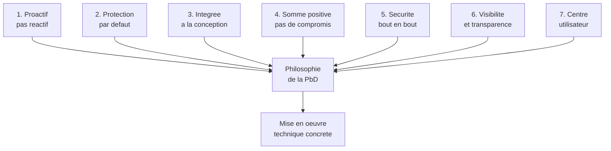
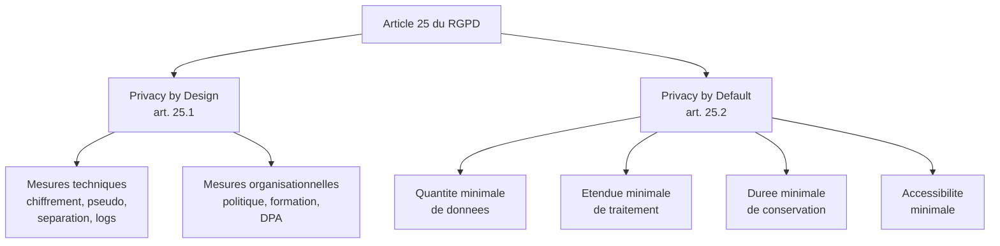
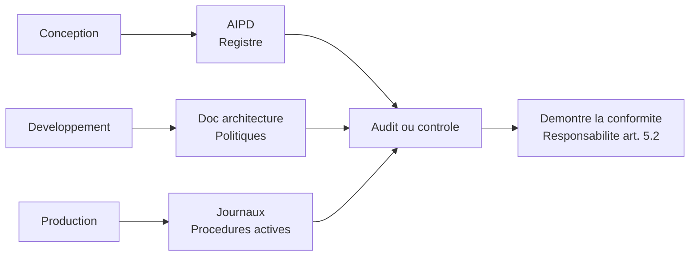

# Les fondements : Cavoukian et l'article 25

## Introduction

Vous est-il déjà arrivé d'acheter un appareil électronique qui
nécessite, pour fonctionner correctement, de fouiller dans cinq
menus différents pour activer toutes les protections de base ? Sans
mot de passe, les données sortent par défaut. Sans paramétrage, la
caméra envoie des images à des serveurs distants. Sans intervention,
l'historique est partagé avec des partenaires inconnus. Vous vous
sentez piégé par les défauts choisis par le fabricant, et même un
utilisateur averti finit par baisser les bras. La Privacy by
Design, et plus particulièrement la Privacy by Default, vise
précisément à inverser cette logique : **les paramètres par défaut
doivent être les plus protecteurs**, et les options moins
protectrices doivent demander un acte explicite de l'utilisateur.

Cette partie vous présente les fondements conceptuels et juridiques
de la protection des données dès la conception. D'abord les sept
principes formulés par Ann Cavoukian dans les années 1990, qui
restent une référence internationale. Ensuite l'article 25 du
RGPD, qui les transforme en obligation juridique européenne. À la
fin, vous aurez les outils intellectuels pour défendre une
architecture orientée vie privée face à votre équipe ou à votre
client.

### Les sept principes de Cavoukian

Connaissez-vous l'histoire du sapeur-pompier qui éteint un incendie ?
Tout le monde l'admire, et c'est mérité. Mais qui se souvient de
l'architecte qui a conçu un bâtiment ignifugé où l'incendie n'aurait
jamais démarré ? Personne, et c'est bien dommage. La Privacy by
Design, c'est l'art d'éviter l'incendie plutôt que d'attendre les
pompiers. Ann Cavoukian, en formalisant ses sept principes dans les
années 1990, a proposé un cadre conceptuel qui invite les
concepteurs à anticiper les risques plutôt qu'à les traiter en
catastrophe.

**Principe 1 : Proactif, pas réactif - préventif, pas correctif**

La Privacy by Design anticipe les atteintes à la vie privée et les
prévient avant qu'elles ne surviennent. Plutôt que de réparer après
coup, on conçoit dès le départ pour éviter le problème.
Concrètement, cela signifie : conduire une AIPD avant le
développement, lister les risques en amont, choisir les
architectures les moins risquées.

**Principe 2 : La protection de la vie privée comme paramètre par
défaut**

Aucune action de l'utilisateur ne devrait être nécessaire pour
protéger sa vie privée : tout doit être déjà protégé par défaut. Si
l'utilisateur veut renoncer à une protection, il doit le faire
volontairement (opt-in), pas l'inverse (opt-out). C'est ce principe
qui justifie les cases décochées par défaut pour la newsletter, ou
le mode privé par défaut sur les réseaux sociaux destinés aux
mineurs.

**Principe 3 : La protection de la vie privée intégrée à la
conception**

La vie privée n'est pas un module ajouté à la fin, c'est une
composante intégrée à l'architecture même du système. On ne « met »
pas de la vie privée dans un produit ; on conçoit le produit pour
qu'il protège la vie privée. Concrètement : la sécurité, la
journalisation, le contrôle d'accès, le chiffrement font partie
intégrante du design, pas d'un sprint « sécurité » ajouté plus tard.

**Principe 4 : Fonctionnalité complète - somme positive, pas somme
nulle**

La Privacy by Design refuse l'idée selon laquelle on doit choisir
entre vie privée et performance, vie privée et innovation, ou vie
privée et sécurité. Une bonne architecture concilie tous ces
objectifs simultanément. Si on vous présente la vie privée comme
un frein, c'est qu'on n'a pas suffisamment cherché.

**Principe 5 : Sécurité de bout en bout, sur l'ensemble du cycle de
vie des données**

La protection commence à la collecte et se poursuit jusqu'à la
destruction. À chaque étape (transfert, stockage, traitement,
archivage, suppression), des mesures appropriées doivent être en
place. Pas de maillon faible.

**Principe 6 : Visibilité et transparence - garder les portes
ouvertes**

Les pratiques doivent pouvoir être vérifiées, par les utilisateurs,
les régulateurs et les tiers indépendants. La transparence n'est
pas un signe de faiblesse, c'est un gage de qualité. Cela impose
notamment une documentation publique, des politiques de
confidentialité claires, et l'ouverture aux audits.

**Principe 7 : Respect de la vie privée des utilisateurs - centré
sur l'utilisateur**

Le système est conçu autour des intérêts de l'utilisateur, pas de
l'organisation. Les choix par défaut, les paramètres, les
informations délivrées, les options offertes doivent toujours
servir l'utilisateur en premier lieu.



Ces sept principes sont parfois critiqués pour leur caractère
général : ils n'indiquent pas comment faire, seulement quoi viser.
Mais c'est précisément leur force : ils constituent une boussole,
pas une carte. Chaque projet doit ensuite définir ses propres
implémentations techniques, adaptées à son contexte.

#### Exemple pratique {id="exemple-pratique-cav-1"}

Voyons comment ces principes se traduisent dans une fonctionnalité
banale : la photo de profil d'un réseau social. Une approche
classique pourrait consister à proposer une photo publique par
défaut, avec une option pour la rendre privée. Une approche
Privacy by Design inverse la logique :

```javascript
// Approche classique (non-PbD)
const defaultUserSettings = {
    profilePictureVisibility: 'public',
    allowFaceRecognition: true,
    allowPhotoIndexing: true,
    shareWithPartners: true
};

// Approche Privacy by Design (PbD)
const defaultUserSettings = {
    // Visibilite restreinte par defaut
    profilePictureVisibility: 'friends_only',
    // Reconnaissance faciale desactivee
    allowFaceRecognition: false,
    // Pas d indexation par les moteurs externes
    allowPhotoIndexing: false,
    // Pas de partage avec des tiers
    shareWithPartners: false
};
```

Les deux approches offrent les mêmes fonctionnalités à
l'utilisateur. La différence tient uniquement aux paramètres par
défaut. Mais cette différence change radicalement les implications
pour la vie privée. Dans le cas (a), un utilisateur non averti
expose sa photo à des risques sans le savoir. Dans le cas (b), il
faut un acte volontaire pour ouvrir progressivement la visibilité.

#### Exercice 1

Pour chacun des choix de conception suivants, indiquez si la
solution proposée respecte ou non la Privacy by Design, et
justifiez en mobilisant l'un des sept principes. Si non, proposez
une alternative conforme.

a) Une application de fitness active par défaut le partage des
performances sur les réseaux sociaux.
b) Une application de messagerie chiffrée affiche un message
explicatif clair sur la nature du chiffrement et permet à
l'utilisateur de consulter le code source.
c) Une plateforme de jeu en ligne stocke en clair les conversations
des joueurs, en se disant que cela permettra plus tard d'ajouter
une fonction de modération.
d) Un site web e-commerce demande, lors de la création de compte,
uniquement l'email et un mot de passe, et différe les autres
informations au moment où elles deviennent strictement nécessaires.
e) Une application bancaire impose une authentification forte (MFA)
dès la création du compte, sans option pour la désactiver.

##### Correction exercice 1 {collapsible="true"}

a) **Non conforme**. Viole le principe 2 (protection par défaut).
Le partage doit être désactivé par défaut, et l'utilisateur doit
faire un acte volontaire pour l'activer. **Alternative** :
paramètre désactivé par défaut, avec un assistant proposant
l'activation après quelques utilisations si l'utilisateur le
souhaite.

b) **Conforme**. Respecte le principe 6 (visibilité et
transparence). L'utilisateur peut comprendre et vérifier comment
ses données sont protégées. C'est exactement ce que prônent les
applications de messagerie sérieuses (Signal, par exemple).

c) **Non conforme**. Viole le principe 1 (proactif, pas réactif) et
le principe 5 (sécurité de bout en bout). On ne stocke pas en clair
des données par anticipation d'un usage futur. **Alternative** :
chiffrement systématique des conversations, avec déchiffrement
uniquement sur demande explicite pour modération, dans un
environnement sécurisé et journalisé.

d) **Conforme**. Respecte le principe 7 (centré utilisateur) et la
minimisation. On ne demande que le strict nécessaire à chaque
étape, on n'accumule pas en prévision.

e) **Cas nuancé**. L'authentification forte est une bonne pratique
de sécurité (principe 5), donc défensable. Toutefois, l'absence
totale d'option peut violer le principe 7 (centré utilisateur) si
elle exclut certains profils (personnes âgées, personnes sans
téléphone). **Alternative équilibrée** : MFA par défaut + options
alternatives (clé physique, application authenticator) sans
possibilité de désactivation complète, mais avec un parcours
d'accessibilité pour les cas particuliers.

### L'article 25 du RGPD : du concept à l'obligation

Le grand mérite du RGPD est d'avoir transformé une bonne pratique
philosophique en obligation juridique contraignante. L'article 25
intitulé « Protection des données dès la conception et protection
des données par défaut » est court, mais ses implications sont
considérables. Il fait peser sur le responsable de traitement une
double obligation que vous devez parfaitement comprendre.

L'article 25.1 (**Privacy by Design**) prévoit que, compte tenu de
l'état des connaissances, des coûts de mise en œuvre et des
risques, le responsable de traitement met en œuvre, tant au
moment de la détermination des moyens du traitement qu'au moment du
traitement lui-même, des **mesures techniques et organisationnelles
appropriées**. Ces mesures sont destinées à mettre en œuvre les
principes du RGPD et à protéger les droits des personnes.

L'article 25.2 (**Privacy by Default**) prévoit que le responsable
de traitement met en œuvre les mesures techniques et
organisationnelles appropriées pour garantir que, **par défaut**,
seules les données nécessaires au regard de chaque finalité
spécifique sont traitées. Cette obligation s'applique à la quantité
de données collectées, à leur étendue de traitement, à leur durée
de conservation, et à leur accessibilité.



Plusieurs notions clés méritent d'être commentées :

**« État des connaissances »** : le RGPD ne demande pas l'impossible.
Il s'agit d'appliquer ce que la profession sait faire à un moment
donné, ce qu'on appelle l'état de l'art. Chiffrer un mot de passe
en MD5 en 2026 n'est plus acceptable, alors que ça l'était dans
les années 1990. La règle évolue avec la technique.

**« Coûts de mise en œuvre »** : le règlement reconnaît qu'on ne
peut pas exiger d'une PME ce qu'on exige d'un GAFAM. La
proportionnalité des moyens est admise. Mais cela ne dispense pas
de mesures de base : un certain socle minimal est attendu de tous.

**« Risques »** : plus le traitement est risqué (données sensibles,
volumes importants, vulnérabilités particulières), plus les
mesures doivent être renforcées. C'est une approche par les
risques, pas une liste exhaustive de cases à cocher.

**« Mesures techniques et organisationnelles »** : il ne suffit pas
de faire du chiffrement, il faut aussi avoir une politique, des
formations, des procédures. Et inversement, une politique sans
implémentation technique ne suffit pas.

#### Exemple pratique {id="exemple-pratique-art25-1"}

Voyons une checklist concrète d'application de l'article 25 à un
projet web standard, à utiliser dès la phase de conception :

| Élément | Privacy by Design | Privacy by Default |
|---------|-------------------|---------------------|
| Inscription | Champ obligatoire = minimum requis | Pas de case marketing pré-cochée |
| Visibilité profil | Granularité fine | Mode privé par défaut |
| Conservation | Politique définie dès le départ | Durée minimale par défaut |
| Mots de passe | Algorithme Argon2 ou bcrypt | Complexité élevée requise |
| Logs | Pseudonymisation | Rétention courte par défaut |
| Cookies | Bannière granulaire | Non essentiels bloqués par défaut |
| Sauvegardes | Chiffrement systématique | Accès restreint |
| Tiers | DPA signé avant intégration | Hébergement UE préféré |

> **Note** : aucune de ces mesures n'est révolutionnaire prise
> individuellement. Ce qui fait la différence, c'est leur
> intégration systématique dans la conception, pas leur ajout
> ponctuel sous pression d'un audit.

#### Exercice 2

Vous démarrez la conception d'une application de gestion de
formations professionnelles. L'application permettra de : créer un
catalogue, inscrire des stagiaires, suivre leurs progressions,
émettre des certificats, communiquer avec les formateurs. Citez au
moins six mesures de Privacy by Design et de Privacy by Default que
vous intégrerez dès la conception, avec une justification courte
pour chacune.

##### Correction exercice 2 {collapsible="true"}

Six mesures avec justification :

1. **Minimisation à l'inscription** : ne demander que les
   informations strictement nécessaires (nom, prénom, email,
   parcours souhaité). Pas d'âge, de genre, de profession sauf si
   pertinents pour la formation. (PbDef sur la quantité)

2. **Chiffrement des données au repos et en transit** : TLS pour
   tous les échanges, chiffrement de la base de données avec
   gestion des clés sur HSM ou KMS. (PbD article 25.1)

3. **Séparation des bases identité/progression** : la base
   contenant l'identité des stagiaires est séparée logiquement
   (deux schémas ou deux services) de la base contenant les
   contenus de formation et progressions, pour limiter l'impact
   d'une intrusion. (PbD architecture)

4. **Politique de conservation automatisée** : les inscriptions
   sont supprimées trois ans après la fin de la formation, sauf
   pour les certificats qui doivent être conservés (obligation
   formation continue). Job nocturne d'archivage et de suppression.
   (PbDef sur la durée)

5. **Authentification forte par défaut** : pour les formateurs et
   administrateurs, MFA obligatoire. Pour les stagiaires, mot de
   passe robuste exigé, MFA proposée. (PbD article 25.1)

6. **Journalisation pseudonymisée** : les logs applicatifs
   utilisent un identifiant haché plutôt que l'email en clair, et
   sont conservés six mois maximum. Accès restreint aux
   administrateurs identifiés. (PbDef accessibilité)

7. **Bannière de consentement granulaire** : pour le site
   marketing, cookies non essentiels désactivés par défaut, choix
   « accepter / refuser / personnaliser » équivalents visuellement.
   (PbDef sur l'étendue)

8. **DPA signés avec tous les sous-traitants** : OVH (hébergement),
   service d'emailing, plateforme de visioconférence. Pas de
   sous-traitance silencieuse. (PbD organisationnel)

Cette liste illustre la diversité des mesures à mobiliser : aucune
n'est suffisante seule, c'est leur combinaison qui crée la
conformité.

### Documenter ses choix d'architecture

Avez-vous déjà essayé de retrouver, six mois après un projet,
pourquoi vous aviez choisi telle bibliothèque plutôt que telle
autre ? Sans documentation, impossible de remonter le fil. Pour la
Privacy by Design, c'est exactement pareil : si vous ne documentez
pas vos choix, vous ne pourrez pas les défendre lors d'un audit ou
d'un contrôle CNIL. La documentation n'est pas une corvée
optionnelle, c'est la matérialisation du principe de responsabilité
(article 5.2 du RGPD).

Plusieurs documents sont attendus, à différents niveaux de détail :

- **Le registre des activités de traitement** (article 30) :
  inventaire structuré de tous les traitements ;
- **L'AIPD** (article 35) : pour les traitements à risque élevé ;
- **La documentation d'architecture** : choix techniques, schémas,
  justifications ;
- **Les politiques internes** : sécurité, conservation, gestion
  des incidents ;
- **Les contrats** : DPA avec les sous-traitants.

Cette documentation s'enrichit tout au long du cycle de vie du
projet. Elle constitue votre meilleure défense en cas de contrôle :
si vous pouvez démontrer que vous avez réfléchi, mesuré, choisi
avec rigueur, l'autorité de contrôle vous traitera bien plus
favorablement que si vous n'avez rien à montrer.



## Exercice final

Vous êtes développeur dans une startup française qui prépare le
lancement d'une application web de coaching nutritionnel. Le
produit recueillera les habitudes alimentaires des utilisateurs,
proposera des analyses personnalisées par IA, et permettra
d'échanger avec des diététiciens diplômés. L'équipe technique est
prête à coder, le designer a livré ses maquettes, le marketing
prépare la communication. Avant le sprint zéro, on vous demande de
préparer une **note d'orientation Privacy by Design** à présenter
au COMEX, qui formalisera les choix architecturaux structurants du
projet.

Rédigez cette note en quatre sections :

1. **Application des sept principes de Cavoukian** à ce projet
   précis (un paragraphe par principe).
2. **Décisions de Privacy by Default** : pour cinq paramètres
   critiques, quel sera le défaut choisi et pourquoi ?
3. **Architecture technique** : trois ou quatre choix d'architecture
   majeurs qui en découlent.
4. **Plan de documentation** : quels documents seront produits,
   à quelle étape, par qui ?

### Correction exercice final {collapsible="true"}

**Note d'orientation Privacy by Design — Coaching nutritionnel**

**1. Application des sept principes de Cavoukian**

*Principe 1 - Proactif* : une AIPD sera conduite avant le sprint
zéro, compte tenu de la nature sensible des données (alimentation,
indirectement révélatrice de la santé). Les risques principaux
seront cartographiés et les mesures correctives priorisées avant
toute ligne de code.

*Principe 2 - Par défaut* : les paramètres les plus protecteurs
seront systématiquement choisis. Pas de partage des progressions
avec des tiers par défaut, pas d'utilisation des données à des fins
marketing externes, pas de profilage automatique sans opt-in.

*Principe 3 - Intégrée à la conception* : la sécurité, le contrôle
d'accès et le chiffrement sont inscrits au backlog initial, pas
ajoutés en fin de projet. Une *Definition of Done* explicite
intégrera les exigences RGPD.

*Principe 4 - Somme positive* : nous refusons l'argument selon
lequel la performance ou l'innovation devrait souffrir de la vie
privée. Nos benchmarks démontrent qu'un chiffrement applicatif
bien conçu coûte moins de 5 % en performance, et notre fonctionnalité
IA peut être conçue pour fonctionner sur données pseudonymisées.

*Principe 5 - Bout en bout* : le cycle de vie complet sera couvert.
TLS systématique, chiffrement au repos, journalisation des accès,
suppression effective en fin de cycle.

*Principe 6 - Visibilité* : politique de confidentialité claire,
publication d'un rapport annuel de transparence, ouverture aux
audits par des tiers indépendants. La complexité juridique sera
expliquée en langue accessible.

*Principe 7 - Centré utilisateur* : interface « Mes données »
prévue dès la première version. Tous les droits exerçables en
autonomie. Pas de *dark patterns* dans les parcours d'effacement.

**2. Décisions de Privacy by Default**

| Paramètre | Défaut retenu | Justification |
|-----------|----------------|---------------|
| Visibilité du profil | Privé | Aucune raison de l'exposer publiquement |
| Partage avec diététicien | Désactivé | Activation au choix de l'utilisateur |
| Notifications email | Hebdomadaire | Préférable au quotidien intrusif |
| Profilage IA pour pub | Désactivé | Sortie du champ marketing tiers |
| Géolocalisation | Désactivée | Non nécessaire à la finalité |

**3. Architecture technique**

*Choix 1 - Séparation logique des bases* : une base contiendra
l'identité des utilisateurs (nom, email, paiement), une autre
contiendra les données alimentaires et de progression
pseudonymisées (identifiant haché). Les deux bases ne sont
joignables qu'au niveau applicatif, avec journalisation. En cas
d'intrusion sur l'une, l'autre reste protégée.

*Choix 2 - Chiffrement applicatif des données sensibles* : les
champs « notes diététiques » et « historique alimentaire » sont
chiffrés au niveau applicatif avant insertion en base, avec
gestion des clés via un KMS dédié. L'administrateur de base ne
peut pas les lire en clair.

*Choix 3 - Hébergement en France ou UE* : OVH (Roubaix ou
Strasbourg) ou Scaleway (Paris) seront privilégiés. Aucun transfert
hors UE pour les données nominatives. Si nécessaire pour l'IA,
les modèles tournent en interne ou chez un prestataire européen.

*Choix 4 - Politique de conservation automatisée* : un job
nocturne anonymise les données alimentaires individuelles
trois ans après la dernière connexion, conserve les statistiques
agrégées, et supprime totalement le compte au bout de cinq ans
d'inactivité. Tracé dans un registre d'effacement.

**4. Plan de documentation**

| Document | Étape | Responsable |
|----------|-------|-------------|
| AIPD | Avant sprint zéro | DPO + lead technique |
| Registre des traitements | Sprint zéro | DPO |
| Doc architecture | Sprints 1 et 2 | Lead technique |
| Politiques internes | Sprint 3 | RSSI + DPO |
| DPA sous-traitants | Avant signature | DPO + juridique |
| Politique de confidentialité | Avant lancement | DPO + UX writer |
| Procédure DSAR | Avant lancement | Support + DPO |
| Rapport transparence | Trimestriel | DPO |

Cette note constituera la référence partagée par toute l'équipe et
pourra être présentée à un auditeur ou à la CNIL pour démontrer la
réflexion préalable et la responsabilité (article 5.2).

## Conclusion de la partie

Vous avez désormais une compréhension solide des fondements
théoriques et juridiques de la Privacy by Design. Les sept principes
de Cavoukian, vieux de plus de trente ans, restent une boussole
pertinente. L'article 25 du RGPD les transforme en obligation
contraignante pour toute organisation traitant des données
personnelles en lien avec l'Europe.

Retenez les deux idées-force : (1) la protection de la vie privée
se conçoit, elle ne se rajoute pas ; (2) les défauts comptent
énormément, car la majorité des utilisateurs ne change jamais les
paramètres initiaux. Ces deux idées doivent guider toutes vos
décisions de conception, sans exception.

La partie suivante descendra du niveau philosophique au niveau
opérationnel, en présentant les patterns techniques concrets qui
mettent en œuvre ces principes : pseudonymisation, anonymisation,
chiffrement, séparation des données, et data vault.
