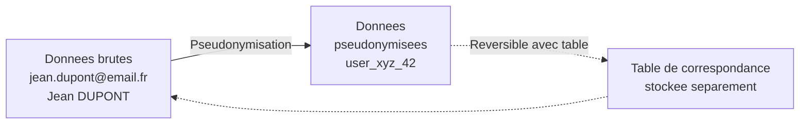
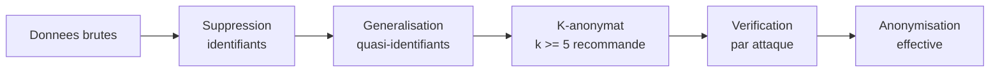
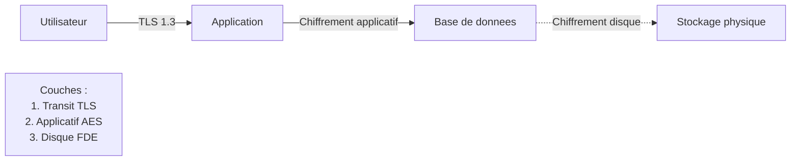
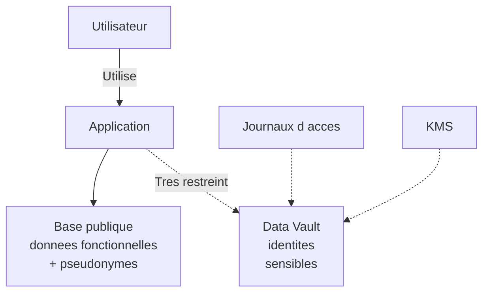
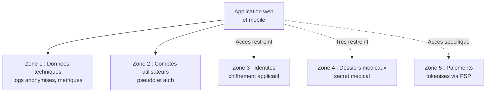

# Patterns techniques de protection des données

## Introduction

Quelle est la différence entre une voiture qui ferme à clé et une
voiture blindée ? Les deux protègent leur contenu, mais à des
niveaux radicalement différents, pour des risques différents, et à
des coûts différents. Le bon développeur n'utilise pas le même
niveau de protection pour tout : il choisit en fonction du contexte.
Les données personnelles n'échappent pas à cette règle. Selon leur
sensibilité, leur volume, leur exposition, on mobilisera des
techniques de protection variées : pseudonymisation, anonymisation,
chiffrement, séparation, data vault. Cette partie est votre boîte à
outils technique.

Nous allons explorer les principaux patterns d'architecture qui
incarnent concrètement la Privacy by Design. Pour chacun, vous
allez découvrir : ce qu'il fait, quand l'utiliser, comment
l'implémenter, et quelles sont ses limites. À la fin, vous saurez
choisir le bon pattern pour le bon contexte, et défendre votre
choix face à un DPO ou un client.

### La pseudonymisation

Imaginez un hôpital qui mène une étude clinique. Les chercheurs
n'ont pas besoin de connaître l'identité des patients, mais ils ont
besoin de suivre chaque patient individuellement à travers les
différentes étapes de l'étude. Comment faire ? On remplace les
identités par des codes : Patient 001, Patient 002, etc. Si jamais
on a besoin de retrouver une identité (en cas de complication, par
exemple), on dispose d'une table de correspondance gardée
séparément, sous haute sécurité. C'est exactement le principe de la
**pseudonymisation**.

L'article 4.5 du RGPD définit la pseudonymisation comme le
traitement de données personnelles de telle façon que celles-ci ne
puissent plus être attribuées à une personne concernée précise sans
avoir recours à des informations supplémentaires, à condition que
ces informations soient conservées séparément et soumises à des
mesures techniques et organisationnelles afin de garantir
l'absence d'attribution.

Trois caractéristiques essentielles :

1. La pseudonymisation est **réversible** : avec la table de
   correspondance, on peut remonter à la personne.
2. Les données pseudonymisées **restent des données personnelles**
   au sens du RGPD, donc soumises au règlement.
3. La pseudonymisation **réduit les risques** : elle est
   explicitement encouragée par le RGPD (article 25) comme mesure
   de protection.



Techniques courantes de pseudonymisation :

- **Hash** simple ou salé (rapide, mais attaque par dictionnaire si
  pas salé) ;
- **Tokens** générés aléatoirement (UUID, identifiants opaques) ;
- **Chiffrement** avec une clé conservée séparément ;
- **Substitution** par des valeurs cohérentes (mais factices) ;
- **Tokenisation** au sens strict (utilisée notamment pour les
  données de paiement).

#### Exemple pratique {id="exemple-pratique-pseudo-1"}

Voici une implémentation concrète d'une pseudonymisation utile pour
les analyses statistiques internes :

```sql
-- Table de correspondance : conservee dans un schema dedie
-- avec acces strictement limite
CREATE SCHEMA identity_vault;

CREATE TABLE identity_vault.user_pseudo_mapping (
    pseudo_id VARCHAR(64) PRIMARY KEY,
    real_user_id BIGINT NOT NULL,
    created_at TIMESTAMP NOT NULL DEFAULT CURRENT_TIMESTAMP
);

CREATE INDEX idx_pseudo_real
    ON identity_vault.user_pseudo_mapping(real_user_id);

-- Table d evenements analytiques utilisant le pseudo
CREATE TABLE analytics_events (
    id BIGINT PRIMARY KEY,
    pseudo_id VARCHAR(64) NOT NULL,
    event_type VARCHAR(100) NOT NULL,
    page_url VARCHAR(500),
    occurred_at TIMESTAMP NOT NULL DEFAULT CURRENT_TIMESTAMP
);

-- Aucune jointure directe avec users dans cette base
-- La jointure ne se fait que via le vault, sous controle
```

```javascript
// Generation d un pseudo cote application
const crypto = require('crypto');

function createPseudoForUser(userId) {
    // Pseudo aleatoire, pas un hash predictible
    const pseudo = crypto.randomUUID();

    // Stockage dans le vault (acces tres restreint)
    db.identityVault.userPseudoMapping.insert({
        pseudo_id: pseudo,
        real_user_id: userId
    });

    return pseudo;
}

// Utilisation pour les evenements analytiques
function trackEvent(userId, eventType, pageUrl) {
    // Recuperation du pseudo existant ou creation
    const pseudo = getOrCreatePseudo(userId);

    // Insertion d evenement SANS l identifiant reel
    db.analyticsEvents.insert({
        pseudo_id: pseudo,
        event_type: eventType,
        page_url: pageUrl
    });
}
```

> **Note** : la séparation des schémas n'est qu'un premier niveau.
> Pour une vraie protection, le vault devrait être hébergé sur un
> serveur séparé, avec un accès réseau différent, des journaux
> d'audit, et idéalement un chiffrement supplémentaire.

#### Exercice 1

Une entreprise française veut conduire une analyse statistique
mensuelle sur les comportements de ses utilisateurs en ligne. Elle
hésite entre trois approches : (a) extraire toutes les données
nominatives dans un fichier Excel partagé avec l'équipe analyse,
(b) pseudonymiser les données avec une table de correspondance
séparée, (c) anonymiser totalement les données. Pour chaque
approche, indiquez si elle relève du RGPD, ses avantages et
inconvénients, et formulez une recommandation.

##### Correction exercice 1 {collapsible="true"}

**(a) Fichier Excel nominatif partagé**

- **Cadre RGPD** : pleinement applicable. Les données restent
  identifiantes.
- **Avantages** : simple à mettre en place.
- **Inconvénients** : très risqué (fuite, perte, accès non
  contrôlé). Tous les principes de l'article 25 sont mal respectés.
  Aucune mesure de protection particulière. Probable violation des
  principes de minimisation et de sécurité.
- **Recommandation** : à proscrire.

**(b) Pseudonymisation**

- **Cadre RGPD** : applicable. Les données pseudonymisées restent
  personnelles, mais le risque est significativement réduit.
- **Avantages** : permet l'analyse sans exposer l'identité.
  Compatible avec une éventuelle ré-identification nécessaire
  (ex : nettoyage d'erreurs).
- **Inconvénients** : exige une infrastructure dédiée (vault), une
  politique d'accès stricte, et une gouvernance documentée.
- **Recommandation** : c'est la voie médiane, la plus souvent
  adaptée. Une AIPD documentera le choix.

**(c) Anonymisation complète**

- **Cadre RGPD** : non applicable, si l'anonymisation est
  effective.
- **Avantages** : sortie du RGPD, simplification juridique.
- **Inconvénients** : l'anonymisation est techniquement difficile
  à atteindre. Une vraie anonymisation suppose qu'on ne peut **plus
  jamais** ré-identifier, même par recoupement avec d'autres
  sources. Pour des comportements individuels, c'est presque
  impossible sans agrégation forte.
- **Recommandation** : possible si on accepte de perdre la
  granularité individuelle, par exemple en publiant uniquement
  des statistiques agrégées avec seuil minimal (HAVING COUNT >= n).

### L'anonymisation et le k-anonymat

Quand on dit qu'on a « anonymisé » des données, on a souvent en
réalité simplement masqué quelques identifiants directs. Mais c'est
souvent insuffisant : par recoupement, on peut retrouver les
identités. L'anonymisation véritable est un défi technique
beaucoup plus sérieux qu'il n'y paraît.

L'**anonymisation** consiste à transformer des données
personnelles de telle sorte qu'aucune ré-identification ne soit
possible, par aucun moyen raisonnable, ni par le détenteur des
données, ni par un tiers. Si on y parvient effectivement, les
données sortent du champ du RGPD (considérant 26). Mais cette
sortie est conditionnelle et révocable : si un nouveau moyen de
ré-identification apparaît, les données redeviennent personnelles.

Plusieurs techniques d'anonymisation existent, avec des niveaux de
robustesse différents :

- la **suppression** des identifiants directs et indirects ;
- l'**agrégation** : ne publier que des moyennes, totaux, sans
  individus ;
- le **k-anonymat** : garantir que chaque combinaison de quasi-
  identifiants concerne au moins k personnes ;
- la **l-diversité** : garantir une diversité de valeurs sensibles
  dans chaque groupe ;
- la **confidentialité différentielle** : ajouter un bruit
  statistique mathématiquement contrôlé.



Le **k-anonymat** mérite une attention particulière car c'est la
technique de référence pour de nombreux datasets. L'idée : chaque
ligne du dataset doit être indiscernable d'au moins (k-1) autres
lignes sur les quasi-identifiants (âge, code postal, genre,
profession, etc.). Un k de 5 ou 10 est généralement considéré
comme acceptable.

#### Exemple pratique {id="exemple-pratique-anon-1"}

Voyons une anonymisation progressive d'un même dataset, du moins
robuste au plus robuste :

```sql
-- Niveau 0 : donnees brutes (NON anonymes)
-- email | age | code_postal | maladie
-- j.dupont@.. | 42 | 75011 | hypertension

-- Niveau 1 : suppression identifiants directs
-- (pseudonymisation, pas anonymisation)
SELECT
    MD5(email) AS pseudo,
    age,
    postal_code,
    disease
FROM patients;

-- Niveau 2 : generalisation des quasi-identifiants
SELECT
    age_range,
    LEFT(postal_code, 2) AS department,
    disease,
    COUNT(*) AS occurrences
FROM (
    SELECT
        CASE
            WHEN age < 30 THEN '18-29'
            WHEN age < 50 THEN '30-49'
            WHEN age < 70 THEN '50-69'
            ELSE '70+'
        END AS age_range,
        postal_code,
        disease
    FROM patients
) sub
GROUP BY age_range, department, disease
-- K-anonymat : exclure les groupes trop petits
HAVING COUNT(*) >= 5;

-- Niveau 3 : agregation pure (sortie du RGPD)
SELECT
    department,
    disease,
    COUNT(*) AS patient_count
FROM (
    SELECT LEFT(postal_code, 2) AS department, disease
    FROM patients
) sub
GROUP BY department, disease
HAVING COUNT(*) >= 10;
```

> **Attention** : même un k-anonymat parfait peut être cassé si
> l'attaquant dispose d'informations auxiliaires (ce qu'on appelle
> une attaque par recoupement). Pour les données très sensibles
> (santé, finance), on préfère la confidentialité différentielle.

### Le chiffrement : en transit et au repos

Imaginez que vous envoyiez une carte postale à un proche : tout le
monde peut la lire en chemin. Imaginez maintenant que vous
l'enfermiez dans un coffre-fort à code, et que seul votre proche
connaisse le code. La carte postale, c'est l'absence de
chiffrement. Le coffre-fort à code, c'est le chiffrement. Le RGPD
exige des coffres-forts à code pour les données personnelles, en
particulier lorsqu'elles sont sensibles ou en transit.

On distingue trois grandes catégories de chiffrement :

**Chiffrement en transit** : protéger les données pendant leur
transmission. TLS (HTTPS) est devenu la norme absolue. Tout
échange de données personnelles sans TLS est aujourd'hui
considéré comme une faute caractérisée. Versions minimales
acceptables : TLS 1.2, idéalement TLS 1.3.

**Chiffrement au repos** : protéger les données stockées.
Plusieurs niveaux :

- chiffrement de **disque entier** (FDE) : protège en cas de vol
  physique ;
- chiffrement de **base de données** : transparent côté
  application ;
- chiffrement **applicatif** : déchiffrement uniquement par
  l'application avec ses propres clés.

**Chiffrement de bout en bout** : seuls l'expéditeur et le
destinataire peuvent déchiffrer. Le serveur intermédiaire ne peut
pas lire les données. C'est le standard pour les messageries
sérieuses (Signal, WhatsApp, ProtonMail).



#### Exemple pratique {id="exemple-pratique-chiff-1"}

Voici un exemple de chiffrement applicatif côté serveur, applicable
sur des champs sensibles comme les notes médicales d'un patient :

```javascript
// Chiffrement AES-256-GCM avec cle issue d un KMS
const crypto = require('crypto');

class FieldEncryption {
    constructor(kmsClient) {
        this.kms = kmsClient;
        this.algorithm = 'aes-256-gcm';
    }

    async encrypt(plaintext) {
        // Cle generee aleatoirement pour chaque chiffrement
        const dataKey = crypto.randomBytes(32);
        const iv = crypto.randomBytes(12);

        // Chiffrement des donnees avec la cle locale
        const cipher = crypto.createCipheriv(
            this.algorithm, dataKey, iv
        );
        const encrypted = Buffer.concat([
            cipher.update(plaintext, 'utf8'),
            cipher.final()
        ]);
        const authTag = cipher.getAuthTag();

        // Chiffrement de la cle locale par le KMS
        const encryptedKey = await this.kms.encryptKey(dataKey);

        return {
            ciphertext: encrypted.toString('base64'),
            iv: iv.toString('base64'),
            auth_tag: authTag.toString('base64'),
            encrypted_key: encryptedKey
        };
    }

    async decrypt(encryptedData) {
        // Dechiffrement de la cle locale par le KMS
        const dataKey = await this.kms.decryptKey(
            encryptedData.encrypted_key
        );

        // Dechiffrement des donnees
        const decipher = crypto.createDecipheriv(
            this.algorithm,
            dataKey,
            Buffer.from(encryptedData.iv, 'base64')
        );
        decipher.setAuthTag(
            Buffer.from(encryptedData.auth_tag, 'base64')
        );

        return Buffer.concat([
            decipher.update(
                Buffer.from(encryptedData.ciphertext, 'base64')
            ),
            decipher.final()
        ]).toString('utf8');
    }
}
```

Ce modèle d'**enveloppement de clés** (envelope encryption) est
considéré comme l'état de l'art : les données sont chiffrées avec
des clés uniques, qui sont elles-mêmes chiffrées par un KMS
centralisé. Cela permet la rotation des clés, l'audit des accès,
et la révocation rapide en cas de compromission.

#### Exercice 2

Vous devez stocker dans une base de données les coordonnées
bancaires (IBAN) de vos clients pour les prélèvements. Trois
options vous sont proposées : (a) stockage en clair en base, (b)
chiffrement de la colonne au niveau SGBD, (c) chiffrement
applicatif avec clé gérée par un KMS externe. Comparez les trois
options en termes de sécurité, performance, complexité de mise en
œuvre, et conformité RGPD.

##### Correction exercice 2 {collapsible="true"}

**(a) Stockage en clair**

- **Sécurité** : nulle. Toute fuite expose immédiatement les IBAN.
- **Performance** : maximale, aucun coût de chiffrement.
- **Complexité** : aucune.
- **Conformité RGPD** : non conforme. L'article 32 impose des
  mesures appropriées au risque, et les coordonnées bancaires sont
  manifestement à risque. Sanctionnable.

**(b) Chiffrement au niveau SGBD (TDE)**

- **Sécurité** : protège contre le vol physique des disques ou
  l'accès direct aux fichiers de base. Inefficace contre une
  intrusion applicative ou un accès administrateur de base.
- **Performance** : impact léger, transparent pour l'application.
- **Complexité** : simple à activer, mais la gestion des clés
  est cruciale.
- **Conformité RGPD** : minimum requis dans la plupart des
  contextes, suffisant pour des données moyennement sensibles.

**(c) Chiffrement applicatif avec KMS**

- **Sécurité** : très élevée. Même un administrateur de base ne
  peut pas lire les IBAN. Une intrusion en base sans accès au KMS
  ne livre rien d'exploitable.
- **Performance** : impact significatif (chiffrement/déchiffrement
  à chaque opération), à compenser par cache et architecture.
- **Complexité** : importante. Nécessite un KMS, des procédures
  de rotation, une gestion des accès, et adapte le code applicatif.
- **Conformité RGPD** : excellente. Recommandé pour des données
  bancaires et financières.

**Recommandation** : pour des IBAN, la solution (c) est la plus
appropriée compte tenu de la sensibilité financière. La solution
(b) peut être acceptable comme premier niveau dans une PME avec
budget limité, mais doit être complétée par d'autres mesures
(journalisation des accès, contrôle d'accès strict). La solution
(a) est inacceptable.

### La séparation des données et le data vault

Vous est-il déjà arrivé de mettre tous vos œufs dans le même panier
et de tout casser en faisant tomber le panier ? La même logique
s'applique aux données : si elles sont toutes au même endroit, une
seule intrusion compromet tout. La séparation des données est une
stratégie de défense en profondeur : on divise les informations en
plusieurs silos, de sorte qu'une intrusion partielle ne donne
qu'une vue partielle.

La **séparation des données** peut prendre plusieurs formes :

- **séparation logique** : différents schémas ou tables dans la
  même base, avec des accès restreints ;
- **séparation physique** : différentes bases sur différents
  serveurs ;
- **séparation par microservices** : chaque service possède sa
  propre base, sans accès direct aux autres ;
- **data vault** : pattern d'architecture spécifique pour les
  données les plus sensibles.

Le **data vault** dans son acception RGPD désigne une zone isolée
où sont stockées les données identifiantes ou sensibles, avec un
accès strictement contrôlé. Les autres bases ne contiennent que des
références opaques (tokens, pseudonymes) vers le vault.



Avantages du data vault :

- **réduction du périmètre** d'attaque : la majorité des données
  fonctionnelles peuvent être accédées sans toucher au vault ;
- **traçabilité accrue** : chaque accès au vault est journalisé
  et auditable ;
- **conformité simplifiée** : on sait exactement où sont les
  données sensibles ;
- **résilience** : une compromission de la base fonctionnelle
  n'expose pas les identités.

#### Exemple pratique {id="exemple-pratique-vault-1"}

Voici une architecture de data vault simplifiée pour une
application e-commerce :

```sql
-- ====================
-- Schema PUBLIQUE : fonctionnel
-- Accessible par l application
-- ====================
CREATE SCHEMA public_app;

CREATE TABLE public_app.customers (
    id BIGINT PRIMARY KEY,
    pseudo_token VARCHAR(64) NOT NULL UNIQUE,
    -- Pas d email ni de nom ici
    locale VARCHAR(10),
    created_at TIMESTAMP NOT NULL DEFAULT CURRENT_TIMESTAMP,
    last_login_at TIMESTAMP
);

CREATE TABLE public_app.orders (
    id BIGINT PRIMARY KEY,
    customer_id BIGINT NOT NULL REFERENCES public_app.customers(id),
    total_amount DECIMAL(12,2) NOT NULL,
    status VARCHAR(50) NOT NULL,
    created_at TIMESTAMP NOT NULL DEFAULT CURRENT_TIMESTAMP
);

-- ====================
-- Schema VAULT : identites et donnees sensibles
-- Accessible uniquement par un service dedie
-- ====================
CREATE SCHEMA identity_vault;

CREATE TABLE identity_vault.customer_identities (
    pseudo_token VARCHAR(64) PRIMARY KEY,
    -- Donnees chiffrees applicativement
    email_encrypted VARBINARY(512) NOT NULL,
    last_name_encrypted VARBINARY(512) NOT NULL,
    first_name_encrypted VARBINARY(512) NOT NULL,
    phone_encrypted VARBINARY(512),
    -- Cle de chiffrement enveloppee
    encryption_key_ref VARCHAR(255) NOT NULL,
    created_at TIMESTAMP NOT NULL DEFAULT CURRENT_TIMESTAMP
);

-- Journal d acces au vault
CREATE TABLE identity_vault.access_log (
    id BIGINT PRIMARY KEY,
    pseudo_token VARCHAR(64) NOT NULL,
    accessed_by VARCHAR(100) NOT NULL,
    access_type VARCHAR(50) NOT NULL,
    access_reason VARCHAR(255),
    accessed_at TIMESTAMP NOT NULL DEFAULT CURRENT_TIMESTAMP
);

-- Permissions strictes
REVOKE ALL ON SCHEMA identity_vault FROM PUBLIC;
GRANT USAGE ON SCHEMA identity_vault TO vault_service_user;
```

Côté applicatif, la séparation se traduit par deux services
distincts :

```javascript
// Service public : manipulation des donnees fonctionnelles
class PublicCustomerService {
    async getCustomer(customerId) {
        return await db.public_app.customers.findById(customerId);
    }

    async getOrders(customerId) {
        return await db.public_app.orders.findByCustomer(customerId);
    }
}

// Service vault : acces aux identites, tres restreint
class VaultIdentityService {
    async getIdentity(pseudoToken, accessReason, userPerforming) {
        // Verification d autorisation
        if (!this.isAuthorized(userPerforming)) {
            throw new Error('Acces refuse');
        }

        // Journalisation systematique
        await db.identity_vault.access_log.insert({
            pseudo_token: pseudoToken,
            accessed_by: userPerforming.id,
            access_type: 'read',
            access_reason: accessReason
        });

        // Lecture et dechiffrement
        const encrypted = await db.identity_vault
            .customer_identities.findByToken(pseudoToken);
        return await this.decrypt(encrypted);
    }
}
```

Ce pattern est exigeant à mettre en place mais offre une
protection considérable. C'est l'architecture recommandée pour les
applications manipulant beaucoup de données sensibles, ou
opérant dans des secteurs régulés (santé, finance, RH).

#### Exercice 3

Vous concevez une application de gestion des ressources humaines
(SIRH) qui manipulera : identité des salariés, fiches de paie,
évaluations annuelles, données médicales (visites médicales),
coordonnées bancaires. Proposez une architecture de séparation des
données en plusieurs zones (data vaults ou schémas distincts), en
justifiant les regroupements et les niveaux d'accès.

##### Correction exercice 3 {collapsible="true"}

Proposition d'architecture en quatre zones :

**Zone 1 - Données fonctionnelles (accès large)**

- identifiants pseudonymisés des salariés ;
- structure organisationnelle (services, rôles) ;
- références aux entités sans données nominatives.

Accessible par la quasi-totalité de l'application, notamment
les fonctionnalités de gestion des congés, des plannings, etc.

**Zone 2 - Identités (vault dédié, accès strict)**

- nom, prénom, email professionnel et personnel ;
- coordonnées personnelles (adresse, téléphone) ;
- données chiffrées applicativement.

Accessible uniquement par : RH habilités, manager direct pour les
informations limitées (nom/prénom), avec journalisation systématique.

**Zone 3 - Données financières (vault dédié, accès très strict)**

- fiches de paie ;
- coordonnées bancaires (chiffrées) ;
- éléments de rémunération.

Accessible uniquement par : équipe paie, contrôleur de gestion sur
demande motivée, avec journalisation et double validation pour
certaines actions sensibles (modification de RIB par exemple).

**Zone 4 - Données médicales (vault dédié, accès extrêmement strict)**

- comptes-rendus de visites médicales ;
- aptitudes/inaptitudes ;
- arrêts maladie justifiés.

Accessible uniquement par : médecin du travail, infirmier(e)
habilité(e). Aucun accès RH non médical aux données détaillées.
Chiffrement applicatif renforcé. Conformité au secret médical.

**Justifications** :

- Les **identités** sont séparées des fonctionnalités car ce sont
  les données les plus sensibles aux fuites globales.
- Les **données financières** ont leur propre vault car leur
  compromission est très dommageable, et les accès doivent être
  fortement journalisés (contrôle interne, anti-fraude).
- Les **données médicales** sont les plus protégées (article 9) et
  doivent être strictement séparées : le RGPD impose une
  organisation conforme au secret médical (article 9.3).

**Notes complémentaires** :

- Chiffrement applicatif pour les zones 2, 3, 4 ;
- Audit trail dans chaque zone, conservé 1 à 5 ans selon le
  contexte ;
- AIPD obligatoire compte tenu de la sensibilité des traitements ;
- Authentification forte (MFA) imposée pour tout accès à une zone
  protégée ;
- Politique de rotation des clés tous les 12 à 24 mois.

## Exercice final

Vous travaillez sur un projet de plateforme dédiée à la
**télémédecine** : consultations vidéo entre patients et médecins,
prescriptions électroniques, dossier médical partagé. Conception
technique attendue dans deux semaines, avant le premier sprint
de développement. Préparez un document d'architecture
**Privacy by Design** qui adresse :

1. La **pseudonymisation** : où, comment, pourquoi ?
2. L'**anonymisation** : quelles données pour quels usages
   internes ?
3. Le **chiffrement** : quels niveaux pour quelles données ?
4. La **séparation des données** : combien de zones, quels
   contenus, quels accès ?

Le document doit être suffisamment précis pour servir de référence
à l'équipe de développement, mais accessible à un dirigeant
non technique pour la validation.

### Correction exercice final {collapsible="true"}

**Document d'architecture Privacy by Design — Plateforme de
télémédecine**

**1. Pseudonymisation**

Tous les identifiants exposés dans les URL, dans les logs
applicatifs, et dans les analyses statistiques internes seront des
**tokens pseudonymisés** (UUID v4), jamais des identifiants
métier ni des données nominatives.

- *URL* : `/api/v1/consultations/{uuid}` plutôt que
  `/api/v1/consultations/patient-jean-dupont`.
- *Logs* : `user_xyz_42 a consulte page X` plutôt que
  `j.dupont@email.fr a consulte page X`.
- *Analytics* : événements rattachés à un pseudo, table de
  correspondance dans le vault.

Bénéfice : la majorité des bases techniques (logs, analytics)
n'expose aucune identité, même en cas d'intrusion partielle.

**2. Anonymisation**

Trois usages internes anonymisés :

- **Statistiques de fréquentation** : nombre de consultations par
  spécialité, par jour, par tranche d'âge. K-anonymat de 10 minimum.
- **Études épidémiologiques internes** : tendances pathologiques
  agrégées par région et tranche d'âge. K-anonymat de 20 minimum,
  ou confidentialité différentielle si publication externe.
- **Tableaux de bord d'usage** : KPI sans aucune donnée
  individuelle.

Tout traitement à des fins de recherche scientifique externe
nécessitera une AIPD spécifique et probablement une autorisation
de la CNIL ou de la commission scientifique compétente.

**3. Chiffrement**

| Couche | Type | Algorithme |
|--------|------|------------|
| Transit | TLS 1.3 | Obligatoire partout |
| Vidéo | SRTP + DTLS | Bout en bout patient-médecin |
| Stockage disque | LUKS / dm-crypt | Sur tous les serveurs |
| Données fonctionnelles | Chiffrement BDD | TDE PostgreSQL |
| Données médicales | Applicatif AES-256-GCM | Clés via HSM dédié |
| Sauvegardes | AES-256 | Clés séparées des données |

Les clés sont gérées par un HSM (Hardware Security Module) ou un
KMS cloud certifié, avec rotation annuelle. Aucune clé en clair
dans le code, dans Git, ou dans les configurations.

**4. Séparation des données**

Architecture en cinq zones :



**Zone 1 - Technique** : logs, métriques, analytique pseudonymisée.
Accès large pour l'équipe technique.

**Zone 2 - Comptes** : authentification, préférences, sessions.
Pseudo-identifiants uniquement. Accès applicatif standard.

**Zone 3 - Identités** : nom, prénom, email, téléphone, adresse.
Données chiffrées applicativement. Accès limité au service
d'identité avec journalisation systématique.

**Zone 4 - Dossiers médicaux** (hébergement HDS obligatoire en
France pour les données de santé) : prescriptions, comptes-rendus
de consultation, antécédents. Accès strictement limité aux
médecins habilités sur les dossiers de leurs patients. Audit
trail complet. Chiffrement applicatif avec clé spécifique par
patient.

**Zone 5 - Paiements** : tokenisation par le prestataire de
paiement (PSP). Aucune donnée de carte stockée chez nous.

**Autres mesures structurantes** :

- Authentification forte obligatoire pour tous les utilisateurs
  (patients : SMS + email + mot de passe ; médecins : carte CPS
  ou équivalent) ;
- Politique de conservation automatisée : dossiers médicaux
  conservés 20 ans après la dernière consultation (obligation
  Code de la santé publique), puis archivage long terme ou
  destruction selon le souhait du patient ;
- AIPD obligatoire avant lancement, à actualiser à chaque
  évolution majeure ;
- Hébergement HDS certifié en France (OVH HDS, Outscale, etc.) ;
- Pas de transfert de données médicales hors UE ;
- DPA signés avec tous les sous-traitants techniques avant
  intégration.

Ce document constitue le socle technique de la conformité du
projet et servira de référence pour les équipes de développement,
le DPO et le COMEX.

## Conclusion de la partie

Vous disposez désormais d'une boîte à outils technique complète
pour mettre en œuvre la Privacy by Design : pseudonymisation,
anonymisation, chiffrement à plusieurs niveaux, séparation des
données, data vault. Pour chaque pattern, vous savez quand
l'utiliser, comment l'implémenter, et quelles sont ses limites.

Retenez la règle pratique : on **combine** plusieurs patterns
plutôt que d'en utiliser un seul. La pseudonymisation seule ne
suffit pas, le chiffrement seul non plus. C'est la combinaison
intelligente, adaptée au risque, qui crée une vraie protection.

La partie suivante prolongera ces choix techniques vers les
décisions d'infrastructure : où héberger, avec qui sous-traiter, et
comment gérer les transferts internationaux dans le contexte
post-Schrems II.
