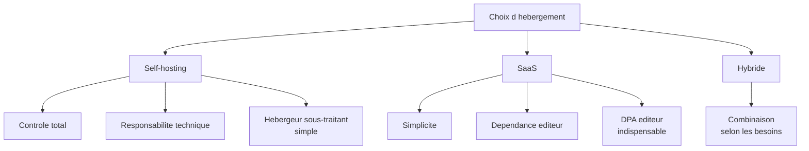
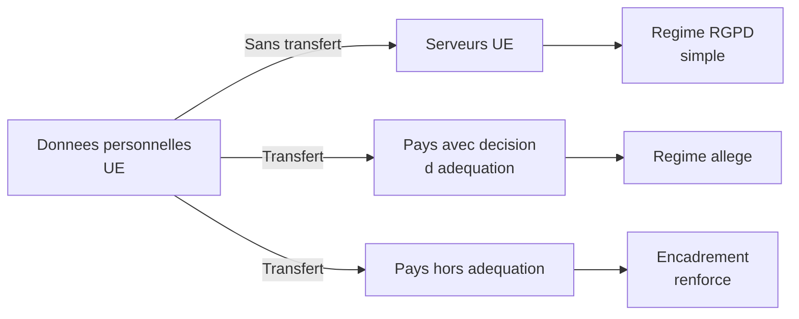
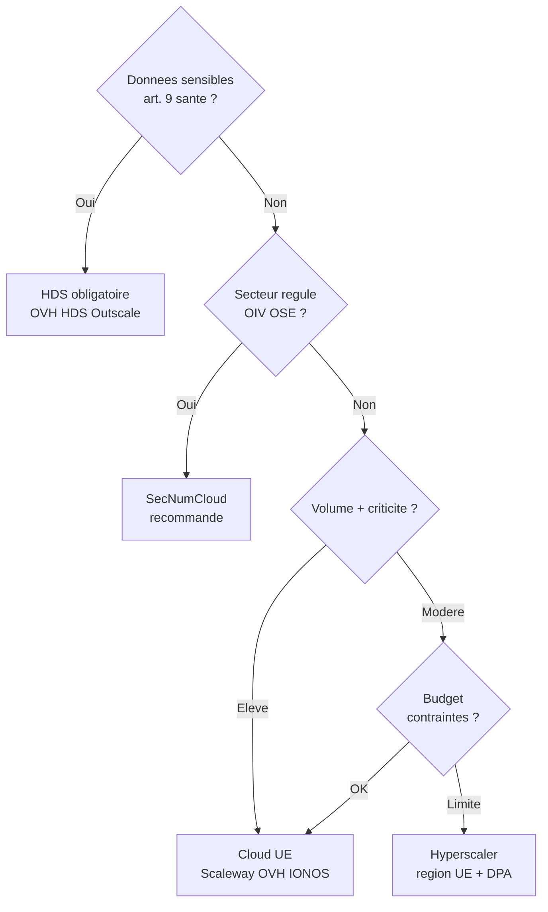
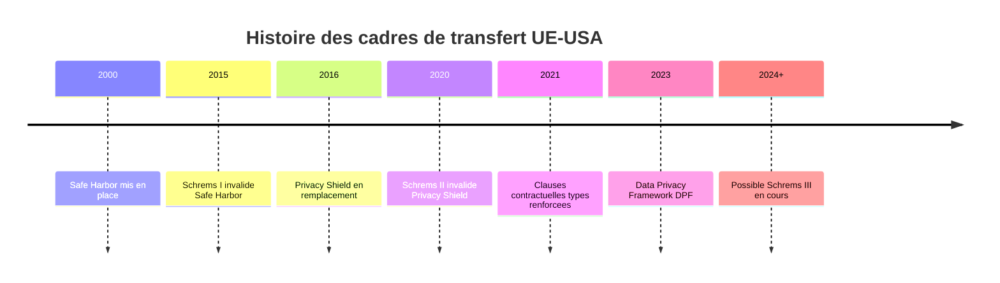
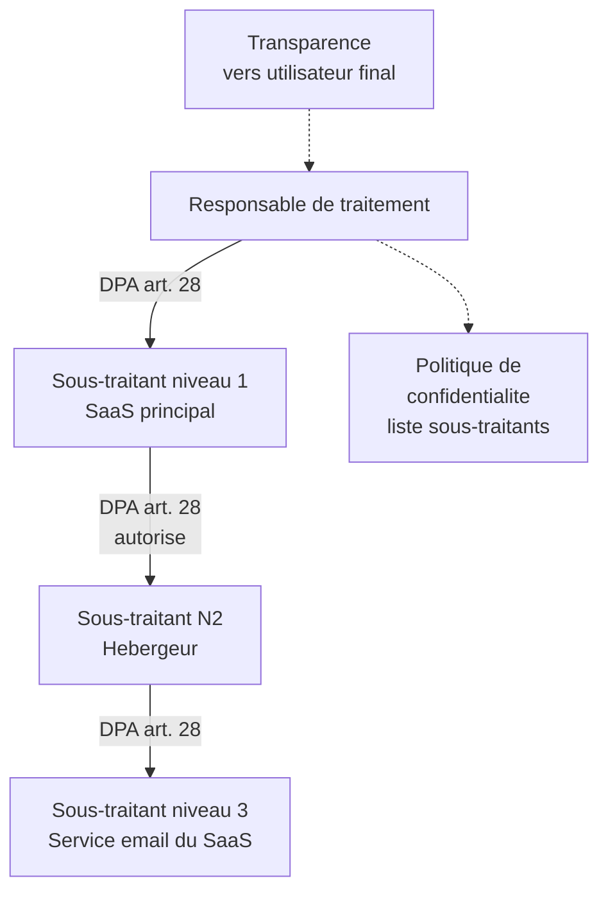
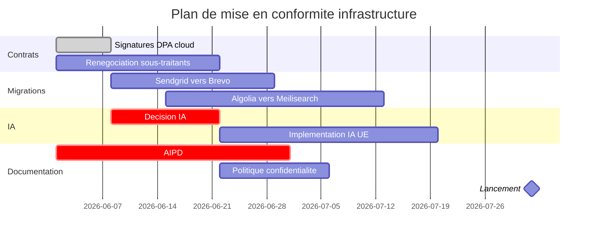

# Infrastructure et transferts internationaux

## Introduction

Imaginez que vous deviez confier vos archives familiales à un
service de stockage. Vous hésitez entre : un coffre-fort dans votre
banque (en France, régi par le droit français), un service en
ligne européen (en Allemagne, régi par le droit allemand), un
service américain (en Californie, régi par le droit américain), ou
un cloud chinois (en Asie, régi par le droit chinois). Chaque choix
a des implications profondes : qui peut accéder à vos documents ?
Que se passe-t-il en cas de demande des autorités locales ? Quelles
sont vos garanties juridiques en cas de fuite ? Pour les données
personnelles que vous manipulez dans vos applications, ces
questions sont rigoureusement les mêmes.

Cette partie aborde un sujet souvent négligé dans les formations
techniques : les conséquences juridiques des choix
d'infrastructure. Où vous hébergez vos données, quel SaaS vous
utilisez, quel sous-traitant vous choisissez, tout cela engage la
conformité de votre application. Avec la jurisprudence Schrems II
et l'instabilité chronique des cadres de transfert vers les
États-Unis, ces choix sont devenus délicats. Vous allez apprendre
à les arbitrer en connaissance de cause.

### Self-hosting versus SaaS

Avez-vous déjà arbitré entre cuisiner soi-même et commander chez un
traiteur ? Les deux ont leurs avantages : cuisiner soi-même donne
le contrôle total mais demande du temps et des compétences ;
commander est plus rapide mais vous dépendez de la qualité du
traiteur. Pour l'hébergement, c'est exactement la même tension :
self-hosting versus SaaS, contrôle versus délégation, autonomie
versus simplicité.

Le **self-hosting** consiste à héberger vous-même vos services,
sur vos propres serveurs ou sur une infrastructure cloud que vous
gérez (IaaS, PaaS). Vous avez le contrôle complet, mais vous
portez aussi l'entière responsabilité technique. Vos sous-traitants
sont des hébergeurs « bruts » (OVH, Scaleway, AWS) qui fournissent
de la puissance de calcul, du stockage, du réseau, sans manipuler
vos données métier.

Le **SaaS** (Software as a Service) consiste à utiliser un service
clé en main : Mailchimp pour les emails, Salesforce pour le CRM,
Slack pour la messagerie interne, Notion pour la documentation.
L'éditeur prend en charge l'hébergement, la maintenance, les
mises à jour. Mais vos données métier transitent et sont traitées
par ce prestataire, qui devient sous-traitant au sens du RGPD.

Sur le plan RGPD, les implications diffèrent :

| Critère | Self-hosting | SaaS |
|---------|--------------|------|
| Localisation données | Contrôlée | Selon le SaaS |
| Visibilité accès | Élevée | Limitée au DPA |
| Risque de transfert hors UE | Faible | Souvent élevé |
| Contrôle effacement | Total | Selon les API SaaS |
| Coût | Investissement initial | Récurrent |
| Effort RGPD | Concentré sur l'archi | Réparti sur DPA et choix |

Le bon choix dépend du contexte : un éditeur de logiciels SaaS qui
manipule beaucoup de données sensibles peut préférer le
self-hosting pour garder le contrôle ; une PME qui veut juste
envoyer des newsletters peut utiliser un SaaS sans hésiter, à
condition de bien choisir le prestataire.

### La localisation des serveurs

Le RGPD est neutre en théorie sur la localisation des serveurs :
ce qui compte, c'est la conformité du traitement, pas l'endroit où
les bits sont stockés. En pratique, la localisation a des
implications concrètes très fortes :

- les serveurs **dans l'UE** sont soumis directement au RGPD et au
  contrôle des autorités européennes ;
- les serveurs **hors UE** soulèvent la question des **transferts
  internationaux** (articles 44 à 50 du RGPD) ;
- les serveurs aux **États-Unis** sont par ailleurs exposés à des
  lois extraterritoriales (FISA, CLOUD Act) qui peuvent contraindre
  le sous-traitant à fournir des données aux autorités américaines,
  même sans information de l'utilisateur européen ;
- la **souveraineté numérique** est devenue un enjeu politique et
  économique : la France et l'UE poussent à privilégier des
  hébergeurs européens (Scaleway, OVH, Outscale, IONOS).

Pour certains secteurs, des **exigences sectorielles** vont au-delà
du RGPD :

- **données de santé** en France : hébergement HDS (Hébergeur de
  Données de Santé) obligatoire, ce qui restreint le choix à
  quelques prestataires certifiés ;
- **données bancaires** : exigences du superviseur (ACPR) sur la
  localisation et la sécurité ;
- **administrations publiques** : politique « cloud au centre » et
  référentiel SecNumCloud de l'ANSSI ;
- **OIV/OSE** (opérateurs d'importance vitale ou de services
  essentiels) : exigences renforcées de cybersécurité (NIS2).

#### Exemple pratique {id="exemple-pratique-loc-1"}

Voici une matrice de décision typique pour choisir l'hébergement :

> **Note** : choisir un hyperscaler américain (AWS, Azure, GCP) en
> région UE ne résout que partiellement les problématiques de
> souveraineté. Les sociétés mères américaines restent soumises au
> CLOUD Act, qui leur permet (théoriquement) d'être contraintes
> par leurs autorités à transmettre des données même stockées en
> Europe. C'est pourquoi les hébergeurs européens « souverains »
> connaissent un développement croissant.

#### Exercice 1

Vous êtes consulté sur le choix d'hébergement pour quatre projets :
(a) une plateforme de réservation pour un restaurant local français,
(b) une application de suivi de glycémie pour diabétiques, (c) un
outil de collaboration interne pour une ETI française avec des
filiales mondiales, (d) un système d'information pour un hôpital
public. Pour chacun, recommandez une solution d'hébergement en
justifiant votre choix.

##### Correction exercice 1 {collapsible="true"}

**(a) Plateforme de réservation restaurant**

- **Recommandation** : hyperscaler en région UE ou hébergeur
  européen, ou SaaS spécialisé en restauration européen.
- **Justification** : données non sensibles (nom, téléphone,
  préférences alimentaires marginales), volume modéré, criticité
  limitée. Le rapport coût/bénéfice ne justifie pas un hébergement
  souverain spécifique. Veiller toutefois à la signature d'un DPA
  et à la localisation des serveurs dans l'UE.

**(b) Application de suivi de glycémie**

- **Recommandation** : hébergeur HDS certifié (OVH HDS, Outscale
  HDS, Equinix HDS).
- **Justification** : données de santé au sens de l'article 9.
  L'hébergement HDS est obligatoire en France (article L1111-8 du
  Code de la santé publique). AIPD obligatoire. Chiffrement
  applicatif renforcé conseillé en complément.

**(c) Outil de collaboration interne pour ETI**

- **Recommandation** : SaaS européen (par exemple Whaller, Talkspirit,
  Yousign pour la signature) ou Microsoft 365 / Google Workspace
  en région UE avec DPA et configuration de sécurité renforcée.
- **Justification** : si les usages restent dans le domaine
  collaboratif standard sans données ultra-sensibles, un SaaS
  international avec DPA et configuration « entreprise » est
  acceptable. Si l'ETI manipule des projets stratégiques ou des
  données R&D sensibles, privilégier un SaaS européen pour des
  raisons de souveraineté économique.

**(d) Système d'information hospitalier**

- **Recommandation** : hébergement HDS + SecNumCloud si possible.
- **Justification** : cumul de plusieurs régimes. Données de santé
  (HDS obligatoire), opérateur de service essentiel (NIS2),
  hôpital public donc politique « cloud au centre » applicable.
  Les acteurs qui combinent les certifications HDS et SecNumCloud
  sont peu nombreux mais existent. Audit régulier obligatoire.

### Schrems II et le Data Privacy Framework

Connaissez-vous Maximilien Schrems ? Cet activiste autrichien a, à
lui seul, fait évoluer deux fois la jurisprudence européenne sur
les transferts de données vers les États-Unis. Ses deux décisions
de la CJUE (Schrems I en 2015, Schrems II en 2020) ont
successivement invalidé deux cadres juridiques qui permettaient
ces transferts. Aujourd'hui, le cadre en vigueur (Data Privacy
Framework) reste fragile et pourrait être à nouveau remis en cause.

L'**arrêt Schrems II** (juillet 2020) a invalidé le « Privacy
Shield » qui encadrait jusqu'alors les transferts UE-USA. La Cour a
considéré que la législation américaine (notamment FISA 702 et
Executive Order 12333) ne fournissait pas un niveau de protection
équivalent au RGPD : les services de renseignement américains
peuvent accéder aux données européennes sans recours effectif pour
les personnes concernées.

Cet arrêt a eu des conséquences considérables : du jour au
lendemain, des milliers d'entreprises européennes utilisant des
services américains ont dû revoir leurs contrats et leurs
analyses de risque.

Plusieurs mécanismes coexistent aujourd'hui pour encadrer un
transfert hors UE :

1. **Décision d'adéquation** (article 45) : la Commission
   européenne reconnaît qu'un pays tiers offre un niveau de
   protection équivalent. Exemples : Canada (partiellement),
   Japon, Royaume-Uni, Suisse, Argentine, Israël, États-Unis (via
   le DPF, voir ci-dessous).

2. **Clauses contractuelles types** (CCT, en anglais SCC) : modèles
   de clauses adoptés par la Commission, à intégrer dans les
   contrats avec les sous-traitants hors UE. Mises à jour
   importantes en juin 2021 suite à Schrems II.

3. **Règles d'entreprise contraignantes** (BCR) : adoptées par les
   groupes multinationaux pour les transferts intra-groupe.

4. **Cas particuliers** (article 49) : consentement explicite,
   exécution de contrat avec la personne, intérêts vitaux,
   exception strictement encadrée.

Le **Data Privacy Framework** (DPF), entré en vigueur en juillet
2023, est le nouveau cadre encadrant les transferts UE-USA. Les
entreprises américaines peuvent s'y certifier volontairement, ce
qui leur permet de recevoir des données européennes sans nécessiter
des CCT supplémentaires. Mais ce cadre reste fragile :

- il dépend d'un décret présidentiel américain (révocable) ;
- il fait déjà l'objet de recours européens ;
- une « Schrems III » est attendue dans les prochaines années.

Pour le développeur, cela impose une **vigilance permanente** :
vérifier que vos sous-traitants américains sont certifiés DPF, et
préparer un plan B au cas où le DPF serait invalidé.

#### Exemple pratique {id="exemple-pratique-dpf-1"}

Voici une checklist pratique pour évaluer un sous-traitant hors UE :

1. **Identifier la localisation effective** : où sont stockées les
   données, où sont traitées, par qui ?

2. **Vérifier le statut juridique** :
   - décision d'adéquation applicable ?
   - certification DPF (pour les USA) ?
   - signature de CCT à jour (Module 2 pour responsable vers
     sous-traitant) ?

3. **Conduire un Transfer Impact Assessment (TIA)** :
   - quelles lois locales s'appliquent au sous-traitant ?
   - quels risques d'accès par les autorités locales ?
   - quelles mesures supplémentaires possibles (chiffrement,
     pseudonymisation) ?

4. **Documenter la décision** : note motivée, signée par le DPO,
   à conserver dans le registre.

5. **Informer les utilisateurs** : mention dans la politique de
   confidentialité.

6. **Préparer un plan B** : si le cadre juridique devient instable,
   savoir comment migrer rapidement vers un prestataire UE.

#### Exercice 2

Votre startup utilise les services suivants : Stripe (paiement,
Irlande/USA), Sendgrid (email, USA), Cloudflare (CDN/CDN, USA),
Linear (suivi de tickets internes, USA), Notion (documentation,
USA), AWS (infrastructure, région eu-west-1 en Irlande), Plausible
(analytics, Allemagne). Évaluez chacun de ces services sous l'angle
des transferts internationaux, et indiquez les actions à mener
pour chaque service.

##### Correction exercice 2 {collapsible="true"}

**Stripe** : société irlandaise (Stripe Payments Europe Ltd) pour
l'UE, mais infrastructure partagée mondialement. Vérifier l'entité
contractante (Stripe Payments Europe Ltd = UE). CCT et certification
DPF par les entités américaines liées. Mention dans la politique
de confidentialité. **Risque modéré**, géré.

**Sendgrid** : société américaine (Twilio Inc., propriétaire).
Transfert hors UE manifeste. Vérifier la certification DPF de
Twilio. Sinon : CCT obligatoires + TIA. Alternative européenne :
Sendinblue (Brevo, France), Mailjet (France).

**Cloudflare** : société américaine. Transfert hors UE.
Certification DPF à vérifier. CCT + TIA. Cloudflare propose des
options de localisation géographique (Cloudflare for SaaS), à
configurer. Risque modéré sur les données de log/proxy.

**Linear** : société américaine. Transfert hors UE pour les tickets
internes. Vérifier DPF. Si les tickets contiennent peu de données
personnelles (bugs techniques principalement) le risque reste
acceptable. Sinon, alternative européenne : YouTrack, GitLab
auto-hébergé.

**Notion** : société américaine. Transfert hors UE pour la
documentation. Notion a fait des efforts de conformité européenne.
Vérifier DPF et CCT. Si la documentation contient des données
clients : à reconsidérer. Alternative : Confluence en Europe ou
Outline auto-hébergé.

**AWS eu-west-1** : hébergement physique en Irlande. **Pas de
transfert direct**, mais Amazon Web Services Inc. (USA) est la
société mère. Risque CLOUD Act résiduel. CCT signées par défaut
dans le DPA AWS. Pour des données très sensibles, considérer un
hébergeur européen pure souche.

**Plausible** : société allemande, serveurs UE. **Pas de transfert
hors UE**. C'est le bon choix. Aucune action particulière.

**Plan d'action global** :

- vérifier la certification DPF de chaque sous-traitant américain ;
- signer ou renouveler les CCT là où nécessaire ;
- conduire un TIA pour chaque service (priorité : ceux qui traitent
  beaucoup de données personnelles) ;
- mentionner précisément ces transferts dans la politique de
  confidentialité ;
- préparer un plan de migration vers des alternatives européennes
  pour les services critiques, au cas où le cadre juridique
  deviendrait instable.

### Chaîne de sous-traitance et DPA

Quand vous engagez un sous-traitant, qui sont les sous-traitants
de votre sous-traitant ? Question apparemment technique mais
juridiquement essentielle, car le RGPD impose une chaîne complète
de DPA et de transparence. Vous ne pouvez pas vous décharger sur
votre sous-traitant ; vous restez juridiquement responsable de la
sécurité de bout en bout.

L'article 28 du RGPD encadre la sous-traitance avec plusieurs
exigences :

- **DPA obligatoire** : un contrat écrit qui définit l'objet, la
  durée, la nature et la finalité du traitement, le type de
  données, les obligations du sous-traitant ;
- **Garanties suffisantes** : le sous-traitant doit présenter
  des garanties techniques et organisationnelles appropriées ;
- **Autorisation pour la sous-sous-traitance** : le sous-traitant
  ne peut pas engager d'autres sous-traitants sans autorisation
  préalable du responsable de traitement ;
- **Auditabilité** : le responsable doit pouvoir vérifier la
  conformité du sous-traitant (audit, certifications) ;
- **Obligation d'assistance** : le sous-traitant aide le responsable
  à répondre aux demandes des personnes concernées.

Pour un développeur, cela se traduit par :

- **maintenir une liste à jour** de tous les sous-traitants
  utilisés ;
- **lire et négocier** les DPA proposés par les éditeurs SaaS
  (souvent insuffisants dans leur version standard) ;
- **vérifier régulièrement** que les sous-traitants restent
  conformes (rotation, changements organisationnels) ;
- **anticiper les changements** : si un sous-traitant change de
  politique ou de localisation, il faut pouvoir migrer.

## Exercice final

Votre client *FinTechProConsult*, cabinet de conseil français en
finance, prépare une nouvelle application web destinée à ses
consultants pour produire des analyses financières à partir des
données de leurs clients (entreprises et particuliers). L'application
envisagée mobiliserait : un hébergement à choisir (vous êtes
consultés), Sendgrid pour les emails, Stripe pour les abonnements,
OpenAI (USA) pour l'analyse IA, Algolia (USA) pour la recherche
documentaire, Notion (USA) pour la documentation interne, et une
intégration future avec un agrégateur bancaire européen (Bridge,
France).

Rédigez une **note d'orientation Infrastructure et Transferts** à
destination du COMEX, couvrant :

1. La recommandation d'hébergement, avec arbitrage motivé entre
   SaaS et self-hosting.
2. L'évaluation de chaque sous-traitant proposé sous l'angle des
   transferts internationaux.
3. Le plan d'action contractuel (DPA, CCT, certifications à
   vérifier).
4. Les risques résiduels et les solutions d'atténuation.
5. Un calendrier d'implémentation des mesures.

### Correction exercice final {collapsible="true"}

**Note d'orientation Infrastructure et Transferts**
**FinTechProConsult — Nouvelle application d'analyse financière**

**1. Recommandation d'hébergement**

Compte tenu de la nature sensible de l'activité (analyses
financières, données d'entreprises et de particuliers), nous
recommandons un hébergement **self-hosting sur cloud souverain
européen**. Les candidats prioritaires sont : OVHcloud (Roubaix),
Scaleway (Paris), 3DS Outscale.

Arbitrage motivé :

- **Volume de données sensibles** : justifie un contrôle accru.
- **Confidentialité commerciale** : les analyses financières sont
  par nature très sensibles pour les clients ; un hébergement
  souverain rassure et protège.
- **Risque CLOUD Act** : exclu si on évite les hyperscalers
  américains.
- **Performance** : les cloud souverains européens ont rattrapé
  l'essentiel des capacités techniques nécessaires pour ce type
  de projet.

Une option **SaaS** spécialisé est écartée : il n'existe pas
d'éditeur européen offrant exactement la fonctionnalité visée,
et l'enjeu de confidentialité ne se prête pas à un SaaS
international.

**2. Évaluation des sous-traitants**

| Service | Pays | Transfert | Action requise |
|---------|------|-----------|----------------|
| Sendgrid | USA | Oui | DPF + CCT, alternative à étudier |
| Stripe | UE (Stripe Europe) | Limité | DPA standard suffit |
| OpenAI | USA | Oui critique | Évaluer Mistral AI ou Azure OpenAI UE |
| Algolia | USA | Oui | DPF + CCT, ou alternative |
| Notion | USA | Oui | DPF + CCT, vigilance contenu |
| Bridge | France | Non | DPA + sécurité renforcée |

Recommandations spécifiques :

- **Sendgrid** : envisager une migration vers Brevo (français) ou
  Mailjet (français). Coûts comparables, risque juridique nul.
- **OpenAI** : c'est le point le plus critique. Pour des données
  financières confidentielles, l'envoi à un service IA américain
  pose problème. Trois alternatives : (a) Mistral AI (français,
  hébergement européen), (b) Azure OpenAI Service en région UE
  avec DPA renforcé, (c) auto-hébergement de modèles open source
  type Llama. Option (a) recommandée pour la souveraineté.
- **Algolia** : la fonctionnalité de recherche peut être assurée
  par des alternatives comme Meilisearch (français, self-hosting)
  ou Typesense. Recommandation : migration.
- **Notion** : acceptable pour la documentation interne non
  client. Mais aucune donnée client réelle ne doit transiter par
  cet outil. Alternative possible : Outline (open source).
- **Bridge** : excellent choix. Acteur français, conforme RGPD,
  agréé DSP2. DPA et signature.

**3. Plan d'action contractuel**

| Action | Délai |
|--------|-------|
| Signature DPA cloud souverain choisi | Semaine 1 |
| Migration Sendgrid → Brevo | Semaine 2-4 |
| Décision IA (Mistral / Azure UE) + DPA | Semaine 2 |
| Migration Algolia → Meilisearch | Semaine 3-6 |
| DPA Notion (limité à doc interne) | Semaine 2 |
| DPA Bridge | Semaine 2 |
| Politique de confidentialité finalisée | Semaine 4 |
| AIPD complète (financier = risque élevé) | Avant lancement |

**4. Risques résiduels**

- **Risque IA** : si Mistral AI est retenu, dépendance sur un acteur
  jeune. Prévoir un plan de continuité technique.
- **Risque DPF** : si une « Schrems III » invalide le DPF, les
  sous-traitants américains résiduels (Stripe USA, Notion)
  devraient être réévalués. Préparer un plan de migration sous
  3 mois.
- **Risque conformité sectorielle** : si l'application accompagne
  des clients soumis à la régulation ACPR, des exigences
  complémentaires de localisation peuvent s'appliquer. À vérifier
  selon les profils de clients.

**Solutions d'atténuation** :

- chiffrement applicatif renforcé sur toutes les données client ;
- pseudonymisation systématique avant tout traitement IA (pas
  d'envoi de données identifiantes aux modèles IA, même en UE) ;
- audits internes trimestriels de la chaîne de sous-traitance ;
- mise à jour annuelle de la politique de confidentialité.

**5. Calendrier d'implémentation**

Cette note constitue le cadrage stratégique. L'équipe technique
peut désormais lancer les implémentations en suivant ce plan, avec
le DPO comme garant de la cohérence d'ensemble.

## Conclusion de la partie

Vous avez désormais une vision claire des enjeux d'infrastructure
sous l'angle RGPD. Vous savez arbitrer entre self-hosting et SaaS
selon le contexte, vous comprenez les implications juridiques de
la localisation des serveurs, et vous maîtrisez le contexte
post-Schrems II sur les transferts internationaux.

Retenez ces réflexes pour tout nouveau projet :

- privilégier l'**Union européenne** par défaut, sans dogme mais
  par bon sens juridique ;
- documenter rigoureusement les **transferts internationaux** par
  des CCT, du DPF si applicable, et un TIA motivé ;
- maintenir une **liste à jour** de tous les sous-traitants, avec
  une revue annuelle ;
- préparer des **plans B** pour les services critiques, au cas où
  un cadre juridique deviendrait instable ;
- privilégier les **alternatives européennes** quand elles existent
  et sont matures, pour des raisons à la fois juridiques et
  économiques (souveraineté).

La partie suivante explorera le **cycle de vie complet** d'une
donnée personnelle, de sa collecte initiale à sa destruction finale,
en mettant l'accent sur l'automatisation des durées de conservation.
