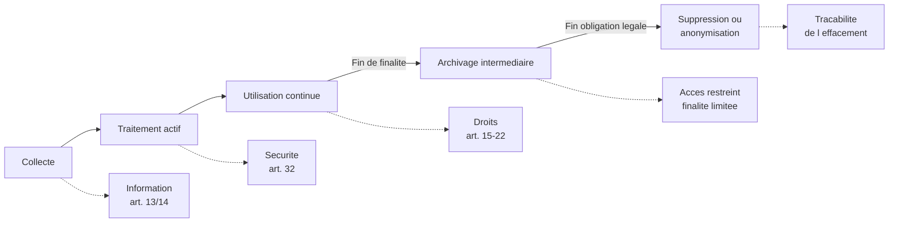
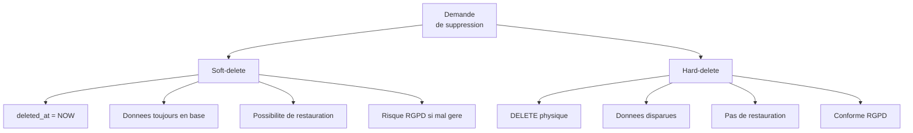
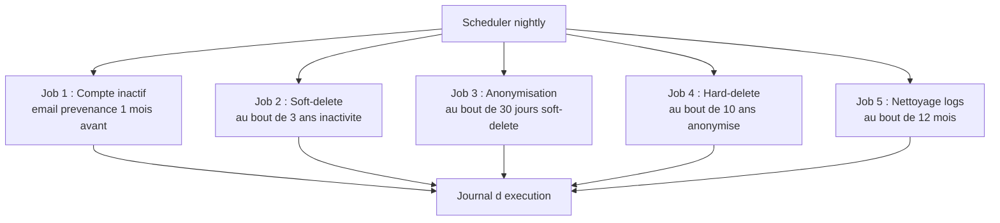
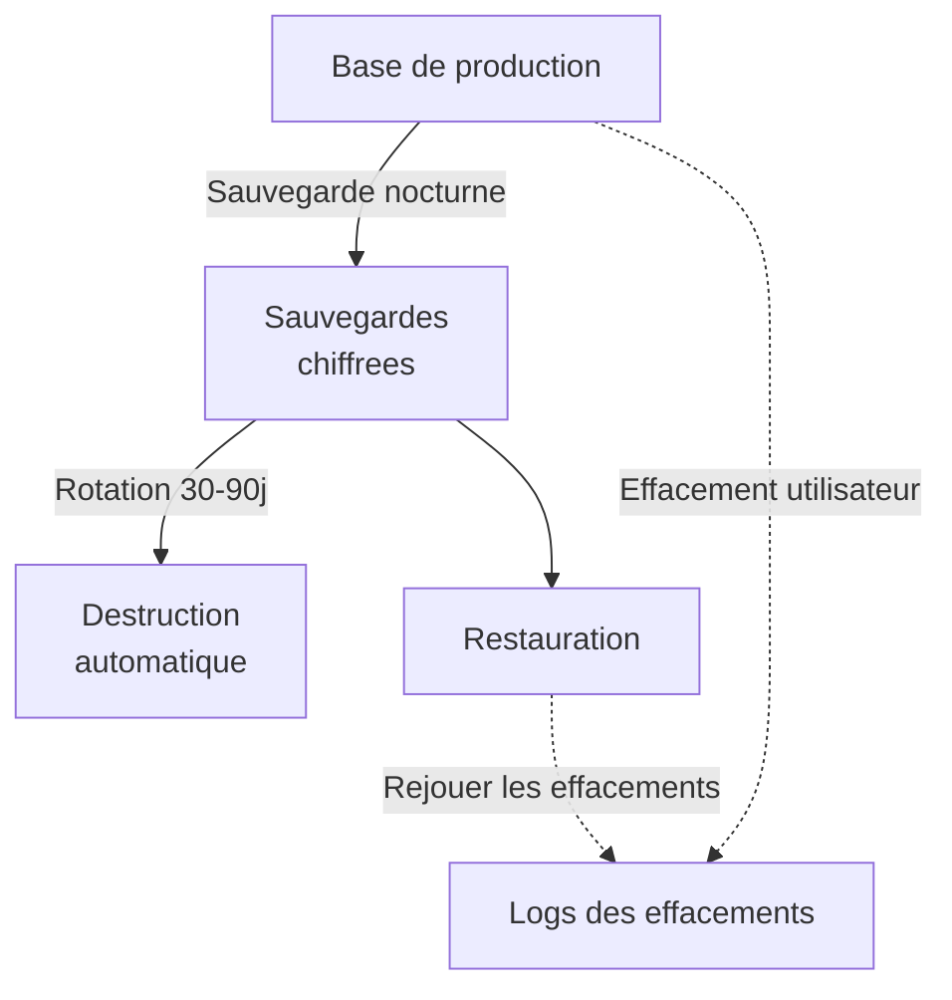
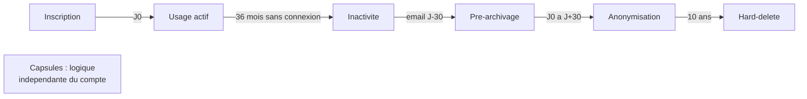

# Le cycle de vie de la donnée

## Introduction

Vous est-il déjà arrivé d'ouvrir un placard rempli d'objets que
vous n'utilisez plus depuis cinq ans ? Vieux téléphones, anciens
chargeurs, vêtements qui ne vous vont plus. Chacun a eu son
utilité, puis l'a perdue, et pourtant ils sont encore là. Ce
phénomène, parfaitement humain, devient juridiquement dangereux
quand il s'agit de données personnelles. Conserver indéfiniment
des données « parce qu'on ne sait jamais », c'est accumuler du
risque sans bénéfice. Le principe de limitation de la conservation
(article 5.1.e) impose une discipline : à chaque donnée, une
date limite. À chaque date limite, une action.

Cette partie présente le **cycle de vie complet** d'une donnée
personnelle, étape par étape, et les techniques d'automatisation
des durées de conservation. Vous allez découvrir comment passer
d'une politique théorique (« on conserve 3 ans ») à une mise en
œuvre technique réelle, avec cron jobs, soft-delete et
anonymisation différée. C'est la condition pour qu'une application
ne devienne pas une bombe juridique à retardement.

### Les étapes du cycle de vie

Imaginez un arbre. Il commence par une graine, devient une jeune
pousse, grandit en arbre adulte, vieillit, puis meurt et retourne
à la terre. À chaque étape, ses besoins, son entretien, et son
rôle dans l'écosystème changent. Une donnée personnelle suit un
cycle de vie analogue : elle naît (collecte), grandit (traitement
actif), mûrit (utilisation routinière), vieillit (archivage), et
meurt (suppression ou anonymisation). À chaque étape, le RGPD
impose des règles différentes.



**Étape 1 - La collecte**

C'est le moment d'or de la conformité. Si on échoue ici, tout le
reste sera bancal. La collecte doit respecter :

- une **base légale** identifiée ;
- une **finalité** explicite ;
- une **information préalable** complète ;
- une **minimisation** rigoureuse.

Pour le développeur, cela se traduit par des **formulaires
épurés**, des **mentions d'information visibles**, des **valeurs
par défaut protectrices**, et des **validations** qui empêchent
les collectes accidentelles.

**Étape 2 - Le traitement actif**

C'est la phase où la donnée est utilisée pour la finalité prévue :
livraison de service, communication, paiement, support. À cette
étape, les principes de **sécurité** et de **limitation des
finalités** sont centraux. La donnée ne doit être ni détournée, ni
exposée inutilement.

**Étape 3 - L'utilisation continue**

Les données vivent dans le système pendant la durée de la relation
avec la personne. Le développeur doit garantir :

- une **mise à jour facile** (droit de rectification) ;
- une **accessibilité** à la personne concernée ;
- une **sécurité maintenue** (mises à jour régulières des
  dépendances).

**Étape 4 - L'archivage intermédiaire**

Quand la finalité initiale est éteinte (par exemple, le client n'a
plus de relation active avec l'entreprise), mais qu'une obligation
légale impose la conservation (compta 10 ans, par exemple), on
passe en **archivage intermédiaire**. Caractéristiques :

- accès très restreint (besoin de connaître) ;
- finalité limitée (obligations légales, défense en justice) ;
- séparation logique ou physique de la base active ;
- journalisation des consultations.

**Étape 5 - La suppression ou anonymisation**

Au terme de la dernière obligation légale applicable, la donnée
doit être **effacée** ou **anonymisée** de manière effective. Cela
inclut :

- la base de production ;
- les sauvegardes (selon politique de rotation) ;
- les copies envoyées aux sous-traitants ;
- les logs (selon leur durée de conservation propre).

#### Exemple pratique {id="exemple-pratique-cycle-1"}

Voici un exemple complet de cycle de vie pour une donnée
d'utilisateur sur une boutique en ligne :

| Étape | Durée | Statut | Actions techniques |
|-------|-------|--------|---------------------|
| Collecte | Jour 0 | Active | Validation, hashage MdP, journalisation |
| Compte actif | 0 - 3 ans après dernière connexion | Active | Accès normal, rectification possible |
| Pré-archivage | À 3 ans inactivité | À archiver | Email de prévenance + délai 30 jours |
| Anonymisation profil | 3 ans + 30 jours | Anonyme | Nom/email remplacés, IDs conservés |
| Archivage compta | 3 ans + 30 jours à 10 ans | Archivé | Données comptables uniquement, accès tracé |
| Suppression finale | 10 ans | Supprimé | Suppression définitive avec log |

> **Note** : la politique de conservation doit être documentée dans
> le registre des traitements et reflétée dans la politique de
> confidentialité. Les utilisateurs doivent pouvoir comprendre
> combien de temps leurs données sont conservées et pourquoi.

#### Exercice 1

Pour chacune des catégories de données suivantes, indiquez la durée
de conservation typique en France, en distinguant la base active
et l'archivage intermédiaire le cas échéant. Justifiez en citant
l'obligation légale ou la pratique recommandée.

a) Données d'un compte client e-commerce (nom, email, adresse).
b) Factures émises par une entreprise.
c) Données d'un candidat non retenu après un processus de
recrutement.
d) Données bancaires (IBAN) après résiliation d'un contrat de
prélèvement.
e) Logs de connexion à une application web.
f) Vidéosurveillance d'un commerce.

##### Correction exercice 1 {collapsible="true"}

**a) Données d'un compte client e-commerce**

- Base active : 3 ans après la dernière connexion ou la dernière
  commande (recommandation CNIL).
- Justification : la finalité (gestion du compte) est éteinte après
  une longue inactivité. Pas d'obligation légale au-delà.
- À noter : si une commande est passée, les données associées à
  cette commande passent dans le régime de la facturation (voir b).

**b) Factures émises par une entreprise**

- Base active : pendant la relation commerciale.
- Archivage : 10 ans (article L123-22 du Code de commerce, livres
  comptables et pièces justificatives).
- Justification : obligation comptable et fiscale (livre des
  procédures fiscales).

**c) Données d'un candidat non retenu**

- Base active : pendant le processus de recrutement.
- Archivage : 2 ans après le dernier contact (recommandation CNIL,
  pour pouvoir relancer ou justifier une décision en cas de
  contentieux).
- Justification : besoin marketing ressources humaines + délais de
  prescription pour les contentieux discrimination.
- À noter : le candidat doit pouvoir s'opposer à cette conservation
  prolongée.

**d) IBAN après résiliation de prélèvement**

- Base active : durée du contrat.
- Archivage : 13 mois selon le Code monétaire et financier
  (article L133-24 sur les contestations de prélèvement).
- Justification : possibilité pour le client de contester un
  prélèvement.
- Au-delà : suppression sauf obligation autre.

**e) Logs de connexion**

- Conservation : 1 an maximum, en l'état actuel du droit français
  (article L34-1 du CPCE pour les logs de connexion à des fins de
  recherche d'auteurs d'infractions).
- En pratique : 6 mois à 1 an pour les besoins sécurité internes.
- Au-delà : nécessité d'une justification spécifique.

**f) Vidéosurveillance d'un commerce**

- Conservation : 1 mois maximum (recommandation CNIL, sauf
  événement particulier comme un vol justifiant une extraction).
- Justification : équilibre entre besoin de sécurité du commerce
  et droit à la vie privée des clients et employés.
- Au-delà : justification forte requise.

### Le soft-delete versus hard-delete

Quand un utilisateur clique sur « Supprimer mon compte », que se
passe-t-il réellement ? Deux philosophies s'opposent : le
**soft-delete** (suppression logique) et le **hard-delete**
(suppression physique). Chacune a ses avantages, ses inconvénients,
et ses implications RGPD à bien comprendre.

Le **soft-delete** consiste à marquer une ligne comme « supprimée »
sans la retirer physiquement de la base. Typiquement, on ajoute une
colonne `deleted_at` qui contient soit `NULL` (ligne active), soit
un timestamp (ligne supprimée). Les requêtes filtrent
automatiquement ces lignes.

Le **hard-delete** consiste à supprimer physiquement la ligne avec
un `DELETE` SQL classique. Une fois exécuté, plus moyen de la
récupérer, sauf à restaurer depuis une sauvegarde.



Du point de vue RGPD, **le soft-delete simple n'est pas un
effacement au sens de l'article 17**. La donnée est toujours là,
toujours lisible par les administrateurs et toujours dans le champ
du RGPD. Le soft-delete peut être utilisé comme **étape
intermédiaire** (par exemple, période de grâce de 30 jours pour
permettre à l'utilisateur de changer d'avis), mais doit être suivi
d'un vrai effacement.

Une bonne pratique consiste à combiner :

1. **Phase 1 - Soft-delete** : marquage `deleted_at`, période de
   grâce de 30 jours, email de confirmation à l'utilisateur.
2. **Phase 2 - Anonymisation** : remplacement des champs
   identifiants par des valeurs factices, conservation des données
   nécessaires aux obligations légales (factures par exemple).
3. **Phase 3 - Hard-delete** : suppression physique au terme des
   obligations légales.

#### Exemple pratique {id="exemple-pratique-soft-1"}

Voici une implémentation type avec les trois phases :

```sql
-- Schema avec support du cycle de vie
CREATE TABLE users (
    id BIGINT PRIMARY KEY,
    email VARCHAR(255) NOT NULL UNIQUE,
    first_name VARCHAR(100) NOT NULL,
    last_name VARCHAR(100) NOT NULL,
    -- Etat dans le cycle de vie
    deletion_status VARCHAR(20) NOT NULL DEFAULT 'active',
    -- Valeurs : 'active', 'pending_deletion',
    --          'anonymized', 'archived'
    deletion_requested_at TIMESTAMP,
    anonymized_at TIMESTAMP,
    created_at TIMESTAMP NOT NULL DEFAULT CURRENT_TIMESTAMP
);

-- Index pour les jobs cron
CREATE INDEX idx_users_pending_deletion
    ON users(deletion_status, deletion_requested_at);
```

```javascript
// Phase 1 : demande de suppression (soft-delete)
async function requestDeletion(userId) {
    await db.users.update(userId, {
        deletion_status: 'pending_deletion',
        deletion_requested_at: new Date()
    });

    // Email de confirmation avec lien d annulation
    await emailService.send(userId, 'deletion_confirmation', {
        cancel_link: `/account/cancel-deletion?token=...`,
        grace_period_days: 30
    });

    // Journalisation
    await db.dsarRequests.insert({
        user_id: userId,
        request_type: 'erasure',
        received_at: new Date(),
        deadline_at: addDays(new Date(), 30)
    });
}

// Phase 2 : anonymisation apres delai de grace (cron job)
async function anonymizeExpiredUsers() {
    const thirtyDaysAgo = subDays(new Date(), 30);

    const usersToAnonymize = await db.users.find({
        deletion_status: 'pending_deletion',
        deletion_requested_at: { '<': thirtyDaysAgo }
    });

    for (const user of usersToAnonymize) {
        await anonymizeUser(user.id);
    }
}

async function anonymizeUser(userId) {
    await db.transaction(async (tx) => {
        const userIdHash = await hashUserId(userId);

        // Anonymisation des champs identifiants
        await tx.users.update(userId, {
            email: `anonymized-${userIdHash}@local`,
            first_name: 'ANONYMIZED',
            last_name: 'USER',
            deletion_status: 'anonymized',
            anonymized_at: new Date()
        });

        // Conservation des commandes pour obligation comptable
        // (anonymisees par cascade en pratique)
        await tx.orders.anonymizeByUserId(userId);

        // Suppression des donnees non obligatoires
        await tx.userPreferences.deleteByUserId(userId);
        await tx.userConsents.deleteByUserId(userId);

        // Journalisation
        await tx.erasureLog.insert({
            user_id_hash: userIdHash,
            erased_at: new Date(),
            reason: 'user_request_after_grace',
            retained_data: 'orders (compta 10 ans)'
        });
    });
}

// Phase 3 : suppression definitive apres 10 ans (cron job)
async function hardDeleteOldRecords() {
    const tenYearsAgo = subYears(new Date(), 10);

    await db.users.delete({
        deletion_status: 'anonymized',
        anonymized_at: { '<': tenYearsAgo }
    });
}
```

### Automatisation des durées de conservation

Le RGPD impose la limitation de la conservation, mais il ne définit
pas comment l'implémenter. Pour passer d'une politique sur papier
à une mise en œuvre fiable, l'**automatisation** est indispensable.
Aucune entreprise ne peut espérer respecter manuellement, sur des
milliers d'utilisateurs, des centaines de catégories de données,
et des dizaines de durées différentes.

Plusieurs techniques d'automatisation se combinent :

**Cron jobs récurrents** : tâches planifiées qui exécutent les
opérations de maintenance (anonymisation, suppression, archivage).
Fréquence typique : quotidienne, idéalement nocturne pour ne pas
impacter le service.

**TTL au niveau du SGBD** : certaines bases (MongoDB, Redis,
PostgreSQL avec extensions) supportent nativement des TTL (Time
To Live) sur les enregistrements. Très efficace pour les données
de session, les caches, les tokens.

**Workflows orchestrés** : pour les processus complexes (multi-
étapes, multi-systèmes), on utilise des orchestrateurs (Temporal,
Airflow, AWS Step Functions) qui pilotent les opérations en
plusieurs jours ou semaines.

**Triggers SQL** : pour des actions immédiates au moment d'un
événement (insertion d'un log dans une table d'audit, par
exemple).



#### Exemple pratique {id="exemple-pratique-cron-1"}

Voici une organisation type de jobs cron pour la maintenance RGPD
d'une application e-commerce :

```javascript
// scheduler.js : declaration des jobs cron RGPD

const cron = require('node-cron');

// Tous les jours a 2h du matin
cron.schedule('0 2 * * *', async () => {
    await notifyInactiveUsers();
    await softDeleteInactiveAccounts();
    await anonymizeExpiredAccounts();
    await purgeOldLogs();
    await purgeExpiredSessions();
    await purgeExpiredConsentVersions();
});

// Toutes les heures pour les tokens d action
cron.schedule('0 * * * *', async () => {
    await purgeExpiredTokens();
});

// Premier du mois pour les operations lourdes
cron.schedule('0 3 1 * *', async () => {
    await archiveOldOrders();
    await hardDeleteAnonymizedAfter10Years();
    await reviewRetentionPolicy();
});
```

```sql
-- Exemple : detection des comptes inactifs prets pour soft-delete
SELECT id, email, last_login_at
FROM users
WHERE deletion_status = 'active'
    AND last_login_at < CURRENT_DATE - INTERVAL '3 years'
    AND last_login_at IS NOT NULL;

-- Exemple : purge des sessions expirees
DELETE FROM user_sessions
WHERE expires_at < CURRENT_TIMESTAMP;

-- Exemple : purge des consentements anciens
-- (versions plus utilisees apres 5 ans)
DELETE FROM user_consents
WHERE status = 'withdrawn'
    AND withdrawn_at < CURRENT_DATE - INTERVAL '5 years';
```

#### Exercice 2

Pour les catégories de données suivantes, proposez une stratégie
d'automatisation : fréquence du job, requête de détection, action
à effectuer.

a) Tokens de confirmation d'inscription par email (durée de vie 24h).
b) Sessions utilisateur (durée de vie 30 jours).
c) Logs applicatifs (conservation 6 mois).
d) Comptes inactifs depuis 3 ans (à pré-archiver).

##### Correction exercice 2 {collapsible="true"}

**a) Tokens de confirmation 24h**

- Fréquence : toutes les 15 minutes (jobs courts).
- Requête de détection :
  ```sql
  SELECT id FROM email_tokens
  WHERE expires_at < CURRENT_TIMESTAMP;
  ```
- Action : `DELETE FROM email_tokens WHERE expires_at < NOW()`.
- Alternative : utiliser un TTL natif (Redis par exemple) pour
  expiration automatique sans cron.

**b) Sessions utilisateur 30 jours**

- Fréquence : toutes les heures.
- Requête de détection :
  ```sql
  SELECT id FROM user_sessions
  WHERE expires_at < CURRENT_TIMESTAMP;
  ```
- Action : suppression. Notification optionnelle à l'utilisateur si
  session active brutalement coupée pour des raisons de sécurité.
- Indexation requise sur `expires_at` pour performance.

**c) Logs applicatifs 6 mois**

- Fréquence : quotidienne (nuit).
- Requête de détection :
  ```sql
  SELECT id FROM app_logs
  WHERE created_at < CURRENT_DATE - INTERVAL '6 months';
  ```
- Action : suppression par lots (par tranche de 10 000 lignes pour
  éviter les blocages de la base). Considérer un partitionnement
  par mois pour faciliter la purge (DROP PARTITION).

**d) Comptes inactifs depuis 3 ans**

- Fréquence : quotidienne (nuit).
- Plusieurs étapes :
  - **J-30 avant échéance** : envoi email de prévenance.
  - **J-0** : passage en `pending_deletion`.
  - **J+30** : anonymisation effective.
- Requête de détection pour la prévenance :
  ```sql
  SELECT id, email FROM users
  WHERE deletion_status = 'active'
      AND last_login_at < CURRENT_DATE
          - INTERVAL '3 years'
          + INTERVAL '30 days'
      AND last_login_at >= CURRENT_DATE
          - INTERVAL '3 years';
  ```
- Bonne pratique : système de notification multi-canal (email,
  notification in-app) pour maximiser les chances que l'utilisateur
  soit averti et puisse réagir.

### La gestion des sauvegardes

Avez-vous déjà songé que vos sauvegardes contiennent peut-être des
données que vous avez théoriquement supprimées ? Quand un
utilisateur exerce son droit à l'effacement, vous supprimez ses
données en production. Mais les sauvegardes nocturnes des
30 derniers jours contiennent encore son profil. Que faire ? Cette
question, en apparence technique, a des implications juridiques
profondes.

La doctrine de la CNIL est pragmatique : les sauvegardes peuvent
**conserver temporairement** les données effacées en production,
à condition que :

- ces sauvegardes aient une **finalité spécifique** (restauration
  technique uniquement) ;
- elles soient **inaccessibles pour les usages métier** ;
- elles soient **chiffrées et protégées** ;
- elles soient **purgées automatiquement** selon une politique de
  rotation (typiquement 30 à 90 jours) ;
- en cas de **restauration**, les effacements précédemment
  effectués soient **rejoués** sur la base restaurée.



Côté implémentation, cela impose :

- une **politique de rotation** stricte et automatisée ;
- un **chiffrement** des sauvegardes avec clés gérées ;
- une **procédure de restauration** documentée incluant le rejeu
  des effacements ;
- une **liste des effacements** conservée séparément, suffisamment
  longtemps pour couvrir la rotation des sauvegardes.

## Exercice final

Vous travaillez chez *MemoryBox*, plateforme française de
souvenirs numériques familiaux. Les utilisateurs y stockent des
photos, vidéos, textes, et créent des « capsules temporelles »
destinées à être lues par leurs proches dans plusieurs années.
L'application traite des données très personnelles, à forte
valeur émotionnelle.

Préparez un **document de politique de conservation et
d'effacement** complet, incluant :

1. Le tableau des durées de conservation pour chaque catégorie
   de données (compte, contenus, capsules, paiements, logs).
2. La logique de cycle de vie : à quel moment chaque action est
   déclenchée.
3. La gestion technique : soft-delete, anonymisation,
   hard-delete, sauvegardes.
4. Un plan d'implémentation des jobs cron correspondants.
5. La communication utilisateur autour de ces durées.

### Correction exercice final {collapsible="true"}

**Politique de conservation et d'effacement — MemoryBox**

**1. Tableau des durées de conservation**

| Catégorie | Base active | Archivage | Total | Justification |
|-----------|-------------|-----------|-------|---------------|
| Compte utilisateur | Tant qu'actif | - | Variable | Service souscrit |
| Compte inactif | 3 ans | - | 3 ans | Recommandation CNIL |
| Contenus média | Tant que compte actif | - | Variable | Service principal |
| Capsules futures | Jusqu'à date d'ouverture | - | Variable | Cœur du service |
| Capsules ouvertes | 1 an après ouverture | - | 1 an | Lecture par les destinataires |
| Factures | Pendant relation | 10 ans | 10 ans | Code de commerce |
| Logs connexion | 6 mois | - | 6 mois | Sécurité |
| Logs applicatifs | 1 an | - | 1 an | Débogage et audit |
| Tokens éphémères | TTL natif | - | < 24h | Aucune justification au-delà |
| Sauvegardes | - | 30 jours | 30 jours | Continuité technique |

**2. Logique de cycle de vie**



**Notes complémentaires** :

- **Capsules temporelles** : si l'utilisateur configure une capsule
  pour être lue dans 20 ans, ses données associées doivent être
  conservées indépendamment de l'inactivité du compte. Cas
  particulier à documenter dans la politique.
- **Décès de l'utilisateur** : en France, la loi Informatique et
  Libertés prévoit des dispositions sur les directives anticipées
  numériques. À intégrer dans le parcours utilisateur (désignation
  d'un héritier numérique, par exemple).

**3. Gestion technique**

*Soft-delete* :

- déclenché à la demande utilisateur ou par cron à 3 ans
  d'inactivité ;
- période de grâce de 30 jours avec email de confirmation et
  lien d'annulation ;
- compte rendu inaccessible (login impossible) pendant cette
  période.

*Anonymisation* (Phase 2) :

- nom, prénom, email remplacés par des valeurs hashées ;
- contenus média supprimés si la finalité initiale est éteinte ;
- capsules conservées si une date d'ouverture future est définie
  (avec destinataires informés de l'anonymisation de l'expéditeur) ;
- factures conservées 10 ans avec anonymisation partielle.

*Hard-delete* (Phase 3) :

- au terme de 10 ans après anonymisation pour les données
  comptables ;
- au terme de l'ouverture des capsules + 1 an pour les capsules
  associées.

*Sauvegardes* :

- chiffrement systématique avec clés indépendantes ;
- rotation 30 jours ;
- procédure de restauration incluant le rejeu des effacements ;
- registre des effacements conservé séparément pendant 1 an pour
  couvrir la rotation des sauvegardes.

**4. Plan d'implémentation des jobs cron**

```javascript
// Jobs quotidiens (2h du matin)
cron.schedule('0 2 * * *', async () => {
    // Detection inactivite
    await sendInactivityWarnings();
    await markAccountsForDeletion();

    // Anonymisation
    await anonymizeExpiredAccounts();

    // Nettoyage logs
    await purgeOldLogs();
    await purgeOldSessionLogs();
});

// Jobs horaires
cron.schedule('0 * * * *', async () => {
    await purgeExpiredTokens();
    await deliverDueCapsules();
});

// Jobs mensuels (1er du mois, 3h)
cron.schedule('0 3 1 * *', async () => {
    await hardDeleteAnonymizedAccounts();
    await rotateBackups();
    await reviewCapsuleSchedule();
});
```

**5. Communication utilisateur**

- **Politique de confidentialité** : tableau détaillé des durées de
  conservation, en langue claire et accessible.
- **Email de prévenance** à J-30 avant l'inactivité de 3 ans :
  rappel des contenus présents, lien pour se reconnecter, lien
  pour télécharger l'export, lien pour anticiper l'effacement.
- **Email de confirmation de suppression** : description précise
  de ce qui sera supprimé, conservé, anonymisé. Délai de
  rétractation de 30 jours rappelé clairement.
- **Page « Mes données »** dans le compte : visualisation
  permanente des durées appliquées à chaque catégorie, avec
  possibilité d'agir.

Cette politique permet d'allier conformité juridique stricte,
expérience utilisateur respectueuse, et capacité technique de
maintenance.

## Conclusion de la partie

Vous avez désormais une vision complète du cycle de vie d'une
donnée personnelle, de la collecte à la destruction finale, et
des techniques d'automatisation qui permettent de respecter le
principe de limitation de la conservation.

Retenez ces principes pratiques :

- chaque donnée doit avoir une **date de péremption** définie dès
  sa collecte ;
- l'**automatisation** est la condition de la fiabilité : pas de
  vérification manuelle sur des milliers d'utilisateurs ;
- la **distinction soft-delete / anonymisation / hard-delete** est
  cruciale : un soft-delete seul n'est pas un effacement au sens
  du RGPD ;
- les **sauvegardes** doivent avoir leur propre politique de
  rotation, sinon elles deviennent un point de fuite des
  effacements ;
- la **traçabilité** des opérations de maintenance permet de
  démontrer la conformité en cas de contrôle.

Vous êtes maintenant prêt pour le TP final, qui met en œuvre
l'ensemble des notions du module dans un cas concret de
conception d'architecture Privacy by Design.
