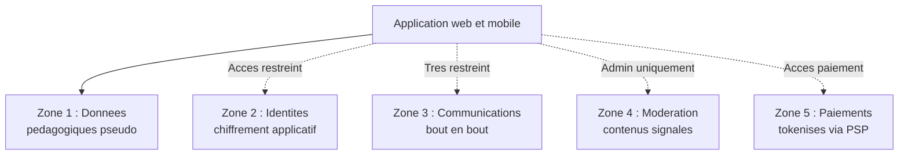

# TP : Conception d'une architecture Privacy by Design

## Introduction

### Contexte du TP

Vous venez d'être recruté comme architecte technique chez *EduPath*,
une startup française qui prépare le lancement d'une plateforme
d'apprentissage en ligne destinée aux collégiens et lycéens
(11-18 ans). La plateforme proposera :

- des cours et exercices interactifs ;
- un suivi personnalisé des progressions ;
- une messagerie privée pour échanger avec un tuteur agréé ;
- un module d'IA pour proposer des exercices adaptés au niveau ;
- une partie communautaire (forum modéré) entre élèves ;
- un espace parental pour suivre les progressions de l'enfant ;
- un système de visioconférence avec les tuteurs.

Le projet est dans sa phase de cadrage technique. L'équipe
développement compte huit personnes et démarrera dans trois
semaines. Le CTO souhaite que **toute la conception intègre
nativement la Privacy by Design**, plutôt que de la rattraper en
fin de projet. Il vous mandate pour produire le **dossier
d'architecture Privacy by Design** complet qui servira de
référence à l'ensemble des équipes.

Le projet présente des caractéristiques sensibles : public mineur
(article 8 RGPD), données scolaires potentiellement révélatrices
de difficultés cognitives, dimension communautaire à modérer,
intégration d'une IA, et communications avec des adultes (tuteurs)
qui exigent un encadrement strict.

### Objectifs du TP

À l'issue de ce TP, vous serez capable de :

1. Conduire une analyse Privacy by Design complète sur un projet
   réel et complexe.
2. Choisir et justifier les patterns techniques appropriés
   (pseudonymisation, chiffrement, séparation, data vault).
3. Arbitrer les choix d'infrastructure (hébergement, sous-traitants,
   transferts internationaux).
4. Modéliser le cycle de vie complet des données avec
   automatisation des durées de conservation.
5. Produire un livrable d'architecture exploitable par une équipe
   de développement.

### Durée estimée

Environ **5 heures** (peut être étendu à 6 heures avec une
restitution orale ou un prototypage).

### Prérequis techniques

- Avoir lu intégralement les parties 1 à 4 du module.
- Connaître les patterns d'architecture présentés (pseudonymisation,
  anonymisation, chiffrement, séparation, data vault).
- Maîtriser le SQL compatible MySQL et PostgreSQL.
- Connaître les fondamentaux des architectures microservices.
- Disposer d'un outil de diagramme (Mermaid ou équivalent).

## Étape 1 : Cartographie initiale et AIPD préliminaire

### 1.1 Inventaire des données personnelles

Listez toutes les catégories de données personnelles que la
plateforme manipulera. Pour chacune :

- nom de la catégorie ;
- nature (personnelle classique, sensible, identifiant national) ;
- finalité principale ;
- public concerné (élève, parent, tuteur) ;
- base légale envisagée.

Présentez votre inventaire sous forme de tableau. Vous devez
identifier au moins **dix** catégories distinctes.

### 1.2 Identification des risques

À partir de votre inventaire, identifiez les **cinq risques RGPD
majeurs** spécifiques à ce projet, en mobilisant les notions du
module. Pour chacun :

- description du risque ;
- public concerné en priorité (élève mineur, parent, tuteur) ;
- impact potentiel ;
- mesures de mitigation envisagées.

Cette analyse préfigure une AIPD complète qui devra être menée
formellement avant le développement.

### 1.3 Acteurs et qualifications

Cartographiez les acteurs du projet (responsable de traitement,
sous-traitants pressentis, destinataires). Pour chaque acteur,
indiquez sa qualification RGPD et son rôle.

## Étape 2 : Application des principes Cavoukian + article 25

### 2.1 Application des sept principes Cavoukian

Pour chacun des sept principes de Cavoukian, indiquez **comment**
*EduPath* l'intégrera dans sa conception. Soyez concret : pas de
formules creuses, mais des choix techniques ou organisationnels
précis.

Format attendu pour chaque principe :

```markdown
**Principe X : [nom]**

Application chez EduPath :
- Choix technique 1 : ...
- Choix technique 2 : ...
- Choix organisationnel : ...
```

### 2.2 Privacy by Default : tableau des défauts

Définissez les paramètres par défaut pour au moins **huit
paramètres** structurants de l'application. Présentez sous forme
de tableau :

| Paramètre | Défaut retenu | Justification PbDef |
|-----------|----------------|---------------------|

Pensez notamment : visibilité du profil, partage avec les pairs,
notifications, géolocalisation pour la visio, profilage IA,
contenus suggérés, cookies, recommandations.

## Étape 3 : Patterns d'architecture technique

### 3.1 Schéma de séparation des données

Concevez une architecture de séparation en **plusieurs zones
distinctes**. Pour chaque zone :

- nom et finalité ;
- types de données concernées ;
- niveau d'accès ;
- techniques de protection appliquées ;
- éventuelles certifications ou hébergements spécifiques.

Au minimum **quatre zones**. Justifiez chaque regroupement.

Représentez l'architecture sous forme de diagramme Mermaid avec
indication des flux entre zones.

### 3.2 Stratégie de pseudonymisation

Décrivez la stratégie de pseudonymisation employée par *EduPath* :

- Quels identifiants seront pseudonymisés et lesquels ne le seront
  pas ?
- Comment seront générés les pseudonymes ?
- Où sera stockée la table de correspondance ?
- Quels accès et journalisation pour cette table ?
- Comment la pseudonymisation se traduit-elle dans les URLs, les
  logs, les exports analytiques ?

Fournissez le schéma SQL des tables impliquées (compatible MySQL
et PostgreSQL).

### 3.3 Stratégie de chiffrement

Définissez la stratégie de chiffrement à plusieurs niveaux :

| Niveau | Technique | Algorithme | Gestion des clés |
|--------|-----------|------------|-------------------|
| Transit | TLS | TLS 1.3 | ... |
| Sauvegardes | ... | ... | ... |
| ... | ... | ... | ... |

Indiquez clairement quelles données justifient un chiffrement
applicatif (par opposition au chiffrement de base ou de disque).

### 3.4 Architecture du module IA

L'intégration de l'IA pose des questions spécifiques. Détaillez :

- quelle technologie d'IA envisager (modèle européen, hébergement
  UE, modèle auto-hébergé) ?
- comment éviter d'envoyer des données identifiantes aux modèles ?
- comment se conformer à l'article 22 (décisions automatisées) si
  applicable ?
- quelle articulation avec l'AI Act européen ?

## Étape 4 : Choix d'infrastructure et transferts

### 4.1 Recommandation d'hébergement

Recommandez un hébergement adapté en mobilisant les critères du
module : sensibilité des données, public mineur, secteur éducatif,
exigences sectorielles éventuelles. Comparez au moins **deux
options** (par exemple : OVH France vs Scaleway vs Outscale) en
indiquant avantages et limites.

### 4.2 Analyse des sous-traitants

Pour les sous-traitants suivants envisagés, indiquez s'ils sont
acceptables et sous quelles conditions. Si non, proposez une
alternative européenne :

- service de visioconférence (Zoom USA, Whaller France, Jitsi
  auto-hébergé) ;
- service d'envoi d'emails (Sendgrid USA, Brevo France, Mailjet
  France) ;
- outil d'analytique (Google Analytics, Plausible Allemagne,
  Matomo auto-hébergé) ;
- service d'IA (OpenAI USA, Mistral AI France, Azure OpenAI UE) ;
- support client (Zendesk USA, Crisp France).

### 4.3 Transfer Impact Assessment synthétique

Pour les sous-traitants nécessitant un transfert hors UE que vous
auriez maintenus, produisez une mini-analyse TIA (3-5 points
chacun) couvrant :

- lois locales applicables ;
- risques d'accès par les autorités ;
- mesures supplémentaires possibles ;
- alternative en cas d'invalidation du cadre juridique.

## Étape 5 : Cycle de vie des données et automatisation

### 5.1 Politique de conservation

Établissez la politique de conservation complète pour *EduPath*,
sous forme de tableau :

| Catégorie | Base active | Archivage | Total | Action terminale |
|-----------|-------------|-----------|-------|------------------|

Couvrez au minimum : compte élève, compte parent, compte tuteur,
contenus pédagogiques produits, échanges en messagerie privée,
contenus du forum, logs de visioconférence, factures.

### 5.2 Schéma de cycle de vie

Modélisez sous forme de diagramme le cycle de vie complet d'un
compte élève, en intégrant : inscription, période d'activité,
inactivité, suppression demandée par le mineur ou son parent,
pré-archivage, anonymisation, hard-delete. Indiquez les actions
techniques à chaque transition.

### 5.3 Implémentation des jobs automatisés

Spécifiez les jobs cron nécessaires pour automatiser la politique
de conservation. Pour chaque job :

- nom et finalité ;
- fréquence ;
- requête SQL principale (compatible MySQL et PostgreSQL) ;
- actions effectuées ;
- journalisation associée.

## Étape 6 : Document final d'architecture

Compilez l'ensemble de votre travail en un **document
d'architecture Privacy by Design** structuré, prêt à être partagé
avec l'équipe de développement. Le document doit comporter :

1. Synthèse exécutive (1 page).
2. Cartographie des données et risques.
3. Principes directeurs (Cavoukian + article 25).
4. Architecture technique (zones, pseudonymisation, chiffrement).
5. Infrastructure et sous-traitants.
6. Cycle de vie et automatisation.
7. Plan de mise en œuvre (jalons).
8. Liste des documents complémentaires à produire (AIPD,
   registre, politique de confidentialité).

## Correction du TP {collapsible="true"}

Cette correction présente une réponse type. D'autres choix sont
légitimes : ce qui compte est la cohérence du raisonnement et la
prise en compte des contraintes spécifiques (public mineur,
éducation, IA).

### Étape 1 : Cartographie

**Inventaire des données (extrait)** :

| Catégorie | Nature | Finalité | Public | Base légale |
|-----------|--------|----------|--------|-------------|
| Identité élève | Classique | Compte élève | Mineur | Consentement parental (<15) |
| Identité parent | Classique | Suivi parental | Adulte | Contrat |
| Identité tuteur | Classique | Prestation tutorat | Adulte | Contrat |
| Progressions scolaires | Sensible indirecte | Coaching adaptatif | Mineur | Consentement |
| Difficultés détectées | Sensible (santé indirecte) | IA adaptative | Mineur | Consentement explicite |
| Messages privés tuteur-élève | Confidentiel | Communication pédagogique | Mineur + adulte | Contrat |
| Contenus forum | Public + modéré | Communauté | Mineur | Consentement |
| Vidéos visio | Sensible | Cours en visio | Mineur + adulte | Consentement |
| Logs de connexion | Personnel | Sécurité | Tous | Intérêt légitime |
| Données paiement | Classique | Abonnement | Adulte | Contrat |
| Factures | Classique | Comptabilité | Adulte | Obligation légale |

**Risques majeurs identifiés** :

1. **Échanges adultes-mineurs en privé** : risque de grooming via
   la messagerie privée tuteur-élève. **Mitigation** : journalisation
   complète, modération automatique, possibilité parentale de
   consultation, signalement intégré.

2. **Détection automatique de difficultés cognitives par l'IA** :
   pourrait révéler des troubles neurodéveloppementaux (dyslexie,
   TDAH). **Mitigation** : consentement explicite article 9,
   communication transparente, intervention humaine
   systématique avant tout signalement.

3. **Contenus du forum entre mineurs** : risque de cyberharcèlement,
   contenus inappropriés, partage de données personnelles entre
   pairs. **Mitigation** : modération automatique pré-publication,
   signalement facile, équipe de modération humaine.

4. **Visioconférence** : capture potentielle de l'environnement
   familial du mineur. **Mitigation** : pas d'enregistrement par
   défaut, arrière-plan virtuel, paramétrage strict des
   permissions.

5. **Profilage publicitaire d'un public mineur** : risque
   éthique et juridique majeur (CNIL très vigilante).
   **Mitigation** : aucun profilage publicitaire, modèle économique
   d'abonnement payant uniquement, refus de toute monétisation
   tierce des données.

**Acteurs** :

- *EduPath SAS* : responsable de traitement.
- *Cloud souverain (OVH ou Scaleway)* : sous-traitant hébergement.
- *Service visio européen* : sous-traitant.
- *Mistral AI ou modèle auto-hébergé* : sous-traitant IA.
- *Stripe ou prestataire de paiement européen* : sous-traitant.
- *Tuteurs indépendants* : à qualifier selon le contrat (probable
  sous-traitance, alternativement co-responsabilité).

### Étape 2 : Application des principes

**Privacy by Design (Cavoukian)** :

*Principe 1 - Proactif* : AIPD obligatoire menée avant le sprint 1,
audit régulier de l'IA pour détecter les biais.

*Principe 2 - Par défaut* : visibilité du profil entre pairs
désactivée, messagerie tuteur soumise à activation explicite,
paramètres parentaux par défaut au plus restrictif.

*Principe 3 - Intégrée à la conception* : sécurité dès le sprint 0,
Definition of Done incluant les exigences RGPD pour chaque story.

*Principe 4 - Somme positive* : refuser que le coaching IA exige
des données identifiantes ; concevoir l'IA sur des données
pseudonymisées.

*Principe 5 - Bout en bout* : TLS partout, chiffrement applicatif
sur les communications privées, archivage chiffré, suppression
effective.

*Principe 6 - Visibilité* : politique de confidentialité dédiée
aux mineurs avec illustrations, audit annuel public, rapport de
transparence trimestriel.

*Principe 7 - Centré utilisateur* : interface enfant avec langage
adapté, parcours parental clair, possibilité pour l'enfant de
gérer ses propres données dès 13 ans (avec contrôle parental).

**Privacy by Default** :

| Paramètre | Défaut | Justification |
|-----------|--------|---------------|
| Visibilité profil pairs | Privé | Protection mineur |
| Messagerie tuteur | Active (encadrée) | Cœur du service |
| Messagerie pairs | Désactivée | Risque cyberharcèlement |
| Géolocalisation visio | Non | Pas nécessaire |
| Profilage IA | Activé (consentement) | Cœur de la valeur |
| Profilage publicitaire | Désactivé toujours | Interdiction mineurs |
| Notifications email parent | Hebdomadaire | Suivi sans intrusion |
| Notifications push élève | Désactivées | Concentration |
| Cookies non essentiels | Bloqués | Mineur = pas de pub |
| Enregistrement visio | Désactivé | Vie privée famille |

### Étape 3 : Patterns d'architecture

**Architecture en cinq zones** :



**Pseudonymisation** : tous les identifiants exposés (URL, logs,
analyses) sont des tokens UUID. Table de correspondance stockée
dans la zone 2 (identités), accessible uniquement par un service
d'identité dédié avec journalisation.

```sql
-- Table de correspondance dans le vault
CREATE TABLE identity_vault.user_tokens (
    pseudo_token VARCHAR(64) PRIMARY KEY,
    real_user_id BIGINT NOT NULL,
    created_at TIMESTAMP NOT NULL DEFAULT CURRENT_TIMESTAMP
);

-- Donnees pedagogiques utilisent uniquement le pseudo
CREATE TABLE pedagogical.progressions (
    id BIGINT PRIMARY KEY,
    pseudo_token VARCHAR(64) NOT NULL,
    course_id BIGINT NOT NULL,
    completion_percentage INT NOT NULL,
    updated_at TIMESTAMP NOT NULL DEFAULT CURRENT_TIMESTAMP
);
```

**Chiffrement** :

| Niveau | Technique | Algorithme |
|--------|-----------|------------|
| Transit | TLS 1.3 | Obligatoire |
| Disque | LUKS/dm-crypt | Tous serveurs |
| BDD | TDE | PostgreSQL TDE |
| Messagerie | Applicatif | AES-256-GCM |
| Visio | SRTP+DTLS | Bout en bout |
| Identités | Applicatif | AES-256-GCM via HSM |

**IA** : Mistral AI (français, hébergement européen) ou modèle
Llama auto-hébergé. Aucune donnée identifiante envoyée au modèle :
les progressions sont pseudonymisées avant analyse. Toute
recommandation issue de l'IA passe par une validation humaine
(tuteur) avant d'être signalée à l'élève ou au parent comme
indicatrice d'une difficulté potentielle.

### Étape 4 : Infrastructure

**Recommandation d'hébergement** : OVHcloud HDS (Hébergeur de
Données de Santé) recommandé. Bien que les données ne soient pas
strictement médicales, elles peuvent en révéler indirectement
(troubles cognitifs détectés). L'hébergement HDS apporte un
niveau de sécurité supplémentaire et anticipe une éventuelle
qualification ultérieure. Alternative : Scaleway en région Paris
ou Outscale.

**Sous-traitants** :

| Service | Recommandation |
|---------|----------------|
| Visio | Whaller (France) ou Jitsi auto-hébergé |
| Email | Brevo (France) |
| Analytics | Plausible (Allemagne) ou Matomo auto-hébergé |
| IA | Mistral AI (France) |
| Support | Crisp (France) |
| Paiement | Stripe Europe (acceptable) + alternative française à étudier |

### Étape 5 : Cycle de vie

**Politique de conservation** :

| Catégorie | Base active | Archivage | Total | Action |
|-----------|-------------|-----------|-------|--------|
| Compte élève actif | Pendant abonnement | - | - | Aucune |
| Compte élève inactif | 3 ans | - | 3 ans | Soft-delete |
| Compte parent | Tant qu'enfant actif | - | - | Aucune |
| Contenus pédagogiques | Pendant compte | - | - | Anonymisés au départ |
| Messages tuteur | 1 an après dernière interaction | 2 ans | 3 ans | Hard-delete |
| Visio | Pas de stockage | - | - | Effacement immédiat |
| Logs forum | 6 mois | - | 6 mois | Hard-delete |
| Logs connexion | 6 mois | - | 6 mois | Hard-delete |
| Factures | - | 10 ans | 10 ans | Hard-delete |
| Données IA | Pendant compte | - | - | Anonymisées au départ |

**Jobs cron** : implémentation similaire aux exemples du module,
adaptée aux durées spécifiques.

### Étape 6 : Document final

Structuration attendue : synthèse exécutive accessible au COMEX,
puis détail technique pour les développeurs. Le document doit
être versionné, daté, et signé par le DPO et le CTO. Il servira
de référence pendant toute la durée de vie du produit, avec mises
à jour majeures à chaque évolution significative.

Le TP est considéré comme réussi si l'apprenant démontre une
maîtrise opérationnelle de la Privacy by Design : analyse des
risques cohérente, choix d'architecture justifiés, prise en compte
des spécificités du contexte (mineurs, éducation, IA), et
production d'un livrable exploitable.
