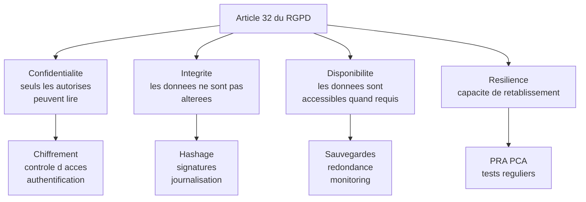
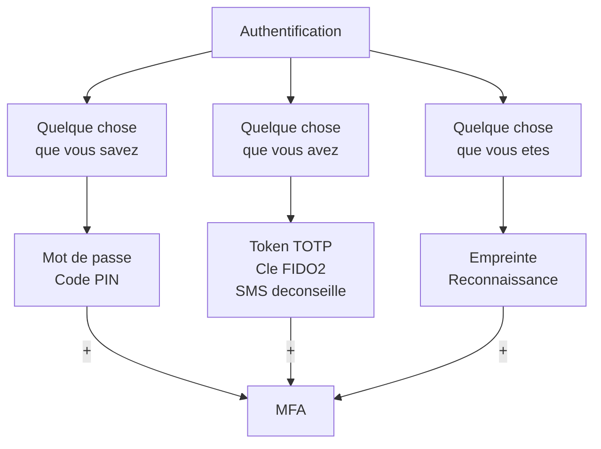
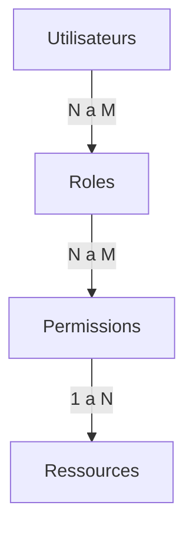
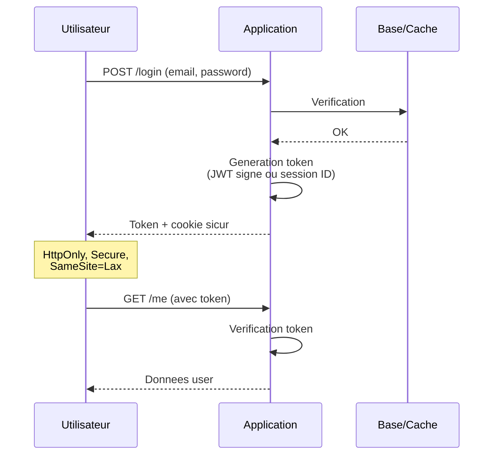

# Article 32 et contrôle d'accès

## Introduction

Si vous achetez un coffre-fort pour protéger vos biens, vous
poserez naturellement trois questions au vendeur : « personne ne
peut l'ouvrir sans la clé ? », « personne ne peut modifier son
contenu sans l'ouvrir ? », « je peux accéder au contenu quand j'en
ai besoin ? ». Sans le savoir, vous venez d'énoncer les trois
piliers de la sécurité informatique : confidentialité, intégrité,
disponibilité. Le triptyque CIA (de l'anglais Confidentiality,
Integrity, Availability) est la grille universelle pour penser la
sécurité, et c'est exactement ce que l'article 32 du RGPD vous
demande de garantir.

Cette partie pose les bases conceptuelles et juridiques de la
sécurité, puis plonge dans le premier domaine opérationnel : le
**contrôle d'accès**. Qui peut faire quoi, comment vérifier que la
personne est bien celle qu'elle prétend être, et comment limiter
les dégâts en cas de compromission. Vous allez voir que l'essentiel
des fuites de données récentes ne sont pas dues à des attaques
sophistiquées, mais à des erreurs de contrôle d'accès basiques.

### L'article 32 et le triptyque CIA

Avez-vous déjà laissé la porte d'entrée de chez vous ouverte parce
que vous étiez « juste un moment dans le jardin » ? Tout va bien
jusqu'à ce qu'un cambriolage opportuniste survienne. Le RGPD a
adopté une logique très pragmatique : il ne dit pas exactement quoi
faire, mais il vous tient pour responsable des mesures que vous
n'avez pas prises au regard de risques que vous connaissiez. C'est
toute la philosophie de l'article 32.

L'article 32 du RGPD prévoit que le responsable de traitement et le
sous-traitant mettent en œuvre les **mesures techniques et
organisationnelles appropriées** afin de garantir un niveau de
sécurité adapté au risque. Cinq éléments doivent être pris en
compte :

1. l'**état de l'art** : les techniques disponibles dans la
   profession à un moment donné ;
2. les **coûts de mise en œuvre** : proportionnalité acceptée ;
3. la **nature, la portée, le contexte et les finalités** du
   traitement ;
4. les **risques** pour les droits et libertés des personnes ;
5. les **conséquences** d'une violation éventuelle.

Le texte cite explicitement, à titre d'exemples, plusieurs mesures
recommandées :

- la **pseudonymisation** et le **chiffrement** des données ;
- les moyens permettant de garantir la **confidentialité,
  l'intégrité, la disponibilité** et la résilience constantes des
  systèmes ;
- les moyens permettant de **rétablir** la disponibilité des
  données en cas d'incident ;
- une procédure visant à **tester, analyser et évaluer
  régulièrement** l'efficacité des mesures.



**Confidentialité** : seules les personnes autorisées peuvent accéder
aux données. Les mesures principales : authentification, contrôle
d'accès, chiffrement, journalisation.

**Intégrité** : les données ne peuvent pas être modifiées ou
détruites de manière non autorisée. Les mesures principales :
hachage, signatures cryptographiques, contrôle d'accès en écriture,
journalisation des modifications.

**Disponibilité** : les données sont accessibles aux personnes
autorisées quand elles en ont besoin. Les mesures principales :
sauvegardes, redondance, monitoring, plan de continuité d'activité.

**Résilience** : capacité à rétablir rapidement un service en cas
d'incident. Mesures : tests réguliers des sauvegardes, exercices de
crise, documentation des procédures.

L'approche par les risques est centrale. On ne demande pas la même
chose à une PME qui gère un site vitrine et à une banque qui gère
des millions de comptes. Mais on attend de chacun qu'il mesure ses
risques et adopte les mesures proportionnées. La CNIL publie
régulièrement des **guides** qui définissent un niveau minimal
acceptable selon le contexte.

#### Exemple pratique {id="exemple-pratique-cia-1"}

Voici une matrice d'évaluation typique pour mesurer les risques
d'un traitement et choisir les mesures appropriées :

| Critère | Score 1 | Score 2 | Score 3 | Score 4 |
|---------|---------|---------|---------|---------|
| Sensibilité données | Standard | Personnelle | Particulière | Article 9 |
| Volume | < 1k personnes | < 100k | < 1M | > 1M |
| Conséquences | Négligeable | Limitée | Sérieuse | Critique |
| Profil utilisateurs | Public général | Clients pros | Vulnérables | Mineurs |
| Exposition | Interne | Restreint | Web public | API publique |

Score total : 5 à 20. Plus le score est élevé, plus les mesures
doivent être renforcées. C'est typiquement le type d'exercice
qu'une AIPD formalise.

#### Exercice 1

Pour chacun des traitements suivants, évaluez le niveau de risque
selon la matrice et indiquez les principales mesures de sécurité à
prioriser :

a) Site vitrine d'une PME (formulaire de contact, ~100 messages par
mois).
b) Plateforme RH d'une ETI (5 000 salariés, fiches de paie, données
médicales du médecin du travail).
c) Application mobile de suivi de glycémie pour diabétiques
(50 000 utilisateurs).
d) API publique de réservation de billets de train (100 millions de
transactions/an).

##### Correction exercice 1 {collapsible="true"}

**a) Site vitrine PME**

- Score estimé : 5-7. Risque faible.
- Mesures prioritaires : TLS, mot de passe robuste pour
  l'administration, sauvegardes régulières, mise à jour du CMS,
  protection contre les attaques basiques (CAPTCHA pour le
  formulaire).
- Pas besoin de mesures sophistiquées (HSM, SIEM), un hébergement
  professionnel avec les options standards de sécurité suffit.

**b) Plateforme RH ETI**

- Score estimé : 14-16. Risque élevé.
- Mesures prioritaires : MFA obligatoire pour les RH et managers,
  chiffrement applicatif des données salariales et bancaires,
  séparation stricte des données médicales (vault dédié,
  conformité au secret médical), journalisation détaillée des
  accès, sauvegardes chiffrées avec rotation, audit annuel, AIPD
  obligatoire.

**c) Application de suivi de glycémie**

- Score estimé : 17-19. Risque très élevé.
- Mesures prioritaires : hébergement HDS obligatoire (données de
  santé), chiffrement applicatif systématique, MFA fortement
  recommandé, AIPD obligatoire, monitoring de sécurité continu,
  notification CNIL préparée à l'avance, formation continue de
  l'équipe technique. Sécurité de l'application mobile (anti-
  reverse engineering, pinning de certificats).

**d) API publique de réservation**

- Score estimé : 15-17. Risque élevé en raison du volume.
- Mesures prioritaires : authentification API par tokens (OAuth 2),
  rate limiting agressif, monitoring temps réel, chiffrement
  partout, WAF en frontal, audit régulier par tiers, plan
  d'incident testé, équipe sécurité dédiée 24/7, redondance multi-
  régions pour la disponibilité.

### L'authentification : prouver qui on est

Vous est-il déjà arrivé d'oublier un mot de passe que vous
utilisiez depuis longtemps ? Vous étiez bloqué dehors malgré toute
votre légitimité. À l'inverse, vous a-t-on déjà demandé un mot de
passe que vous trouviez trop facile à deviner ? Vous étiez chez
vous mais quelqu'un d'autre pouvait l'être aussi. L'authentification
navigue entre ces deux écueils : trop stricte, elle bloque les
légitimes ; trop permissive, elle laisse entrer les illégitimes.
Trouver le juste équilibre est tout l'art du sujet.

L'authentification repose sur la vérification d'un ou plusieurs
**facteurs** parmi trois catégories :

- **Ce que vous savez** : mot de passe, code PIN, question secrète ;
- **Ce que vous avez** : téléphone, clé physique, badge, carte ;
- **Ce que vous êtes** : empreinte, reconnaissance faciale, voix.

L'**authentification simple** repose sur un seul facteur (en
général le mot de passe). L'**authentification forte** (ou MFA pour
*Multi-Factor Authentication*) combine au moins deux facteurs de
catégories différentes. Aujourd'hui, la MFA n'est plus une option
mais une nécessité pour tout accès sensible.



Les méthodes MFA ne sont pas équivalentes. Par ordre de robustesse
croissante :

- **SMS** : déconseillé. Vulnérable au SIM swapping, à
  l'interception réseau, et à la perte du téléphone.
- **Email** : très faible. Si la boîte email est compromise, tout
  l'écosystème s'effondre.
- **TOTP** (Time-based One-Time Password) : applications comme
  Google Authenticator, Authy, Bitwarden. Bon compromis entre
  sécurité et expérience utilisateur.
- **Notification push** : application dédiée qui valide la
  connexion. Pratique et raisonnablement sûr.
- **Clé physique FIDO2/Webauthn** : meilleur niveau de sécurité.
  Résistant aux attaques de phishing par conception.
- **Biométrie** : à utiliser avec précaution. Une empreinte volée
  ne se change pas. Préférer la biométrie locale (qui valide une
  clé stockée sur l'appareil) à la biométrie distante.

#### Exemple pratique {id="exemple-pratique-mfa-1"}

Voici une implémentation simple de la MFA TOTP côté serveur,
utilisant le standard RFC 6238 :

```javascript
const speakeasy = require('speakeasy');
const QRCode = require('qrcode');

// Etape 1 : generation du secret a l activation MFA
async function setupMfa(userId) {
    // Generation d un secret de 32 caracteres en base32
    const secret = speakeasy.generateSecret({
        length: 32,
        name: `MyApp (${userEmail})`,
        issuer: 'MyApp'
    });

    // Stockage temporaire du secret en attendant la
    // confirmation par l utilisateur (premier code valide)
    await db.users.update(userId, {
        mfa_secret_pending: secret.base32
    });

    // QR code a afficher dans l app authenticator
    const qrCodeUrl = await QRCode.toDataURL(secret.otpauth_url);

    return { qr_code: qrCodeUrl, secret: secret.base32 };
}

// Etape 2 : confirmation du MFA par le premier code valide
async function confirmMfaSetup(userId, code) {
    const user = await db.users.findById(userId);

    const verified = speakeasy.totp.verify({
        secret: user.mfa_secret_pending,
        encoding: 'base32',
        token: code,
        window: 1
    });

    if (!verified) {
        throw new Error('Code MFA invalide');
    }

    // Activation effective du MFA
    await db.users.update(userId, {
        mfa_secret: user.mfa_secret_pending,
        mfa_secret_pending: null,
        mfa_enabled: true
    });

    // Generation de codes de recuperation a usage unique
    const recoveryCodes = generateRecoveryCodes(10);
    await db.users.storeRecoveryCodes(userId, recoveryCodes);

    return { success: true, recovery_codes: recoveryCodes };
}

// Etape 3 : verification a la connexion
async function verifyMfa(userId, code) {
    const user = await db.users.findById(userId);

    if (!user.mfa_enabled) return true;

    return speakeasy.totp.verify({
        secret: user.mfa_secret,
        encoding: 'base32',
        token: code,
        window: 1
    });
}
```

> **Note** : les **codes de récupération** sont essentiels. Si
> l'utilisateur perd son téléphone, il doit pouvoir se reconnecter
> via ces codes à usage unique. Sans cela, il sera bloqué hors de
> son compte, et le support sera submergé.

#### Exercice 2

Une application bancaire impose actuellement à ses utilisateurs un
mot de passe simple (8 caractères minimum) sans MFA. La direction
hésite entre trois solutions de renforcement : (a) durcir les
exigences de mot de passe à 16 caractères avec caractères spéciaux
obligatoires, (b) ajouter une MFA par SMS, (c) imposer une MFA via
application authenticator avec codes de récupération. Comparez les
trois approches en termes de sécurité, expérience utilisateur, coût
d'implémentation, et recommandez la meilleure.

##### Correction exercice 2 {collapsible="true"}

**(a) Durcir les mots de passe à 16 caractères + spéciaux**

- *Sécurité* : amélioration marginale. Un mot de passe long mais
  réutilisé d'un autre service compromis n'est pas mieux qu'un
  mot de passe court unique. La principale menace (réutilisation
  des mots de passe et phishing) n'est pas adressée.
- *Expérience utilisateur* : dégradée. Les utilisateurs vont
  écrire les mots de passe sur des post-its, les stocker dans des
  fichiers texte, ou utiliser des variations prévisibles.
- *Coût* : faible (configuration applicative simple).
- *Verdict* : effet limité sans MFA, et impact négatif possible.

**(b) MFA par SMS**

- *Sécurité* : amélioration importante par rapport à mot de passe
  seul. Mais le SMS reste vulnérable au SIM swapping
  (transfert frauduleux du numéro), à l'interception SS7, et à
  la perte du téléphone. Pour de la banque, c'est insuffisant.
- *Expérience utilisateur* : familière, peu de friction.
- *Coût* : moyen (coût des SMS facturés à l'envoi). Pour une
  banque avec millions de clients, cela représente un budget
  conséquent.
- *Verdict* : amélioration mais insuffisant en banque.

**(c) MFA via application authenticator + codes de récupération**

- *Sécurité* : excellente. TOTP est résistant aux attaques
  classiques. Les codes de récupération couvrent la perte de
  l'appareil.
- *Expérience utilisateur* : courbe d'apprentissage initiale, mais
  fluide ensuite. Compatible avec les gestionnaires de mots de
  passe modernes.
- *Coût* : faible en exploitation (pas de SMS), mais effort de
  pédagogie initial (support clients).
- *Verdict* : recommandation principale. Idéalement complétée par
  l'option d'utiliser une clé physique FIDO2 pour les utilisateurs
  les plus avancés ou les transactions à haut montant.

**Recommandation finale** : déployer la solution (c), avec
accompagnement pédagogique (tutoriels, support renforcé pendant
3 mois), et offrir progressivement la possibilité d'utiliser une
clé FIDO2 pour les comptes professionnels ou à fort solde.

### Le contrôle d'accès basé sur les rôles (RBAC)

Avez-vous déjà été frustré par un site qui vous donne soit l'accès
à tout, soit l'accès à rien ? Le problème est généralement
l'absence d'une gestion fine des droits. À l'inverse, avez-vous
déjà vu une application où un stagiaire pouvait exporter la base
clients entière ? Le problème est inverse : trop de droits accordés
sans réflexion. Le RBAC est la solution structurée à ces deux
écueils.

Le **RBAC** (Role-Based Access Control) consiste à définir des
**rôles** auxquels on attache des **permissions**, puis à attribuer
ces rôles aux utilisateurs. Plutôt que de gérer les droits
utilisateur par utilisateur (ce qui ne passe pas l'échelle), on
gère les droits rôle par rôle, et on assigne les rôles selon les
profils.



Le RBAC s'accompagne du **principe du moindre privilège** : chaque
utilisateur (ou service) doit avoir le **minimum** de droits
nécessaires pour accomplir sa fonction. Pas plus, pas moins. Ce
principe vaut pour les humains (employés, prestataires) et pour les
machines (services applicatifs, scripts, bots).

Quelques bonnes pratiques RBAC :

- **Granularité fine** : préférer plusieurs petits rôles à un seul
  gros rôle « administrateur » ;
- **Séparation des pouvoirs** : ne pas concentrer toutes les
  capacités critiques dans un seul rôle (par exemple, distinguer
  qui peut consulter et qui peut exporter) ;
- **Délégation temporaire** : pour les besoins ponctuels, utiliser
  des élévations de droits temporaires plutôt que des droits
  permanents ;
- **Revue périodique** : auditer régulièrement les rôles attribués
  (les besoins évoluent, les personnes changent de poste).

#### Exemple pratique {id="exemple-pratique-rbac-1"}

Voici un schéma SQL RBAC compatible MySQL et PostgreSQL :

```sql
-- Table des roles
CREATE TABLE roles (
    id BIGINT PRIMARY KEY,
    name VARCHAR(100) NOT NULL UNIQUE,
    description VARCHAR(500),
    created_at TIMESTAMP NOT NULL DEFAULT CURRENT_TIMESTAMP
);

-- Table des permissions atomiques
CREATE TABLE permissions (
    id BIGINT PRIMARY KEY,
    code VARCHAR(100) NOT NULL UNIQUE,
    -- Exemples : 'users.read', 'users.export',
    --           'orders.refund', 'admin.access'
    description VARCHAR(500),
    created_at TIMESTAMP NOT NULL DEFAULT CURRENT_TIMESTAMP
);

-- Association roles <-> permissions
CREATE TABLE role_permissions (
    role_id BIGINT NOT NULL REFERENCES roles(id),
    permission_id BIGINT NOT NULL REFERENCES permissions(id),
    PRIMARY KEY (role_id, permission_id)
);

-- Association utilisateurs <-> roles
CREATE TABLE user_roles (
    user_id BIGINT NOT NULL REFERENCES users(id),
    role_id BIGINT NOT NULL REFERENCES roles(id),
    granted_by BIGINT REFERENCES users(id),
    granted_at TIMESTAMP NOT NULL DEFAULT CURRENT_TIMESTAMP,
    expires_at TIMESTAMP,
    PRIMARY KEY (user_id, role_id)
);

-- Index pour requetes frequentes
CREATE INDEX idx_user_roles_user ON user_roles(user_id);
CREATE INDEX idx_role_permissions_role
    ON role_permissions(role_id);
```

Côté applicatif, le middleware d'autorisation peut vérifier les
permissions efficacement :

```javascript
// Middleware : verifie qu un utilisateur a une permission
function requirePermission(permissionCode) {
    return async (req, res, next) => {
        const userId = req.user.id;

        const has = await db.query(`
            SELECT 1
            FROM user_roles ur
            JOIN role_permissions rp
                ON rp.role_id = ur.role_id
            JOIN permissions p
                ON p.id = rp.permission_id
            WHERE ur.user_id = $1
                AND p.code = $2
                AND (ur.expires_at IS NULL
                     OR ur.expires_at > CURRENT_TIMESTAMP)
            LIMIT 1
        `, [userId, permissionCode]);

        if (!has.length) {
            // Journalisation des tentatives d acces
            await logAccessDenied(userId, permissionCode);
            return res.status(403).json({
                error: 'Permission refusee'
            });
        }

        next();
    };
}

// Utilisation sur les routes
app.get('/api/users',
    requirePermission('users.read'),
    handleListUsers);

app.post('/api/users/:id/export',
    requirePermission('users.export'),
    handleUserExport);
```

> **Note** : il existe d'autres modèles plus avancés que le RBAC :
> l'**ABAC** (Attribute-Based Access Control) gère les droits selon
> des attributs dynamiques (heure, lieu, IP), et le **ReBAC**
> (Relationship-Based Access Control) selon les relations entre
> entités. Pour la grande majorité des applications, le RBAC bien
> conçu suffit.

### Sessions et tokens

Une fois authentifié, comment l'application sait-elle que c'est
toujours vous qui faites les requêtes suivantes ? Le serveur ne va
pas demander votre mot de passe à chaque clic. C'est le rôle des
**sessions** et des **tokens** : maintenir l'identité de
l'utilisateur entre les requêtes, tout en restant sécurisé.

Deux grandes approches coexistent :

**Sessions serveur** : l'identifiant de session est un token opaque
envoyé dans un cookie. Le serveur conserve l'état de la session en
base de données ou en cache (Redis). Avantages : révocation
instantanée possible (suppression côté serveur). Inconvénients :
état centralisé, scalabilité plus complexe.

**Tokens JWT** : le token contient lui-même les informations
nécessaires, signé par le serveur. Avantages : *stateless*,
scalable. Inconvénients : révocation difficile (le token reste
valide jusqu'à expiration), ne pas y placer de données sensibles
sans les chiffrer.



Quelques règles incontournables pour les sessions :

- **HttpOnly** : le cookie ne doit pas être accessible en JavaScript
  (protection contre les XSS) ;
- **Secure** : le cookie ne doit transiter qu'en HTTPS ;
- **SameSite=Lax ou Strict** : protection contre les attaques CSRF ;
- **Durée raisonnable** : courte session pour les opérations
  sensibles, prolongation par refresh token pour le confort ;
- **Rotation au login** : générer un nouvel identifiant de session
  à chaque connexion pour prévenir la fixation de session.

## Exercice final

Vous êtes développeur principal chez *VitaCare*, une startup
française qui prépare le lancement d'une plateforme de prise de
rendez-vous médicaux en ligne. La plateforme accueillera trois
types d'utilisateurs : les patients, les secrétaires médicales, et
les médecins. Chaque type aura des besoins d'accès très différents.

Rédigez un **document de spécification du contrôle d'accès** qui
couvre :

1. La politique d'authentification : facteurs requis selon le type
   d'utilisateur, modalités de la MFA, gestion des codes de
   récupération, durée des sessions.
2. La cartographie RBAC : liste des rôles, liste des permissions
   atomiques, matrice de correspondance.
3. Les règles particulières : élévation de droits, accès urgence,
   audit des connexions, suspension de compte.
4. Les mesures complémentaires : gestion des tentatives échouées,
   politique de mot de passe, sécurité des cookies/tokens.

### Correction exercice final {collapsible="true"}

**Document de spécification du contrôle d'accès — VitaCare**

**1. Politique d'authentification**

*Patients* :
- Authentification simple par email + mot de passe au démarrage.
- MFA optionnelle (TOTP recommandée, codes de récupération).
- MFA obligatoire pour les actions sensibles : modification du
  numéro de téléphone, suppression du compte, téléchargement du
  dossier médical.
- Session courte (4 heures), prolongeable par refresh token sur
  appareil de confiance.

*Secrétaires médicales* :
- MFA obligatoire dès la connexion (TOTP ou notification push).
- Sessions de 8 heures maximum (durée d'une journée de travail).
- Renouvellement obligatoire en début de journée.

*Médecins* :
- MFA obligatoire via TOTP, idéalement complétée par clé physique
  FIDO2 ou carte CPS (Carte de Professionnel de Santé).
- Sessions courtes (2 heures) avec re-authentification fréquente
  pour les actions médicales sensibles.
- Possibilité d'authentification renforcée pour la signature
  électronique d'ordonnances.

*Codes de récupération* : 10 codes générés à l'activation MFA, à
imprimer ou stocker dans un gestionnaire de mots de passe. Codes
à usage unique. Renouvelables sur demande.

**2. Cartographie RBAC**

Rôles :

| Rôle | Cible | Description |
|------|-------|-------------|
| `patient` | Patients | Accès à son propre dossier |
| `secretaire` | Secrétaires | Gestion agenda et patients d'un cabinet |
| `medecin` | Médecins | Consultations et dossiers patients |
| `medecin_admin` | Médecin chef cabinet | Toutes les fonctions du cabinet |
| `support_admin` | Équipe interne | Support technique limité |
| `dpo` | DPO interne | Lecture des journaux d'accès, audit |
| `system_admin` | Tech interne | Admin technique sans accès données |

Permissions atomiques (extrait) :

| Code | Description |
|------|-------------|
| `appointments.read.own` | Lire ses rendez-vous |
| `appointments.read.cabinet` | Lire les rendez-vous du cabinet |
| `appointments.create` | Créer un rendez-vous |
| `medical_record.read.own` | Lire son dossier médical |
| `medical_record.read.patient` | Lire le dossier d'un patient |
| `medical_record.write` | Modifier un dossier (médecin) |
| `prescription.create` | Émettre une ordonnance |
| `prescription.sign` | Signer électroniquement |
| `users.list.cabinet` | Lister les patients du cabinet |
| `users.export` | Exporter des données utilisateurs |
| `audit.read` | Lire les journaux d'audit |

Matrice rôle / permission (extrait) :

| Permission | Patient | Secrétaire | Médecin | Méd. admin | DPO |
|------------|---------|------------|---------|------------|-----|
| appointments.read.own | ✓ | | ✓ | ✓ | |
| appointments.read.cabinet | | ✓ | ✓ | ✓ | |
| medical_record.read.patient | | | ✓ | ✓ | |
| prescription.sign | | | ✓ | ✓ | |
| audit.read | | | | | ✓ |
| users.export | | | | ✓ | ✓ |

**3. Règles particulières**

*Élévation de droits* : un médecin peut demander temporairement
l'accès à un dossier d'un patient hors de sa patientèle (urgence,
remplaçant). Demande motivée, validation par notification, durée
limitée à 24 heures, journalisation systématique.

*Accès en urgence* : procédure « bris de glace » pour les SAMU et
urgences hospitalières connectés. Accès en lecture seule, alerte
automatique au DPO, traçabilité renforcée.

*Audit des connexions* : journal des connexions consultable par
l'utilisateur (date, IP, appareil), alerte par email pour les
connexions inhabituelles, possibilité de révoquer toutes les
sessions actives.

*Suspension de compte* : suspension automatique après 5 échecs
consécutifs (temporaire 15 minutes), suspension manuelle par
support en cas de suspicion (avec procédure de réactivation), gel
définitif sur demande utilisateur ou sur ordre judiciaire.

**4. Mesures complémentaires**

*Mots de passe* :
- Longueur minimale 12 caractères ;
- Pas d'exigence de complexité forcée (recommandation NIST récente) ;
- Comparaison contre une liste de mots de passe compromis
  (HaveIBeenPwned ou équivalent local) ;
- Hash via Argon2id (paramètres : 64 Mio de mémoire, 3 itérations,
  parallélisme 4) ;
- Pas d'expiration forcée (recommandation NIST récente sauf
  compromission) ;
- Gestion des oublis par email à usage unique, expirant en 30
  minutes.

*Sécurité des cookies/tokens* :
- HttpOnly + Secure + SameSite=Strict pour les cookies de session ;
- JWT signés en RS256 (clé privée jamais exposée) ;
- Durée d'accès courte (15 min), refresh token long (7 jours) ;
- Révocation des refresh tokens en base ;
- Pas de données sensibles dans les claims JWT.

*Limitation des tentatives* :
- Maximum 5 tentatives en 15 minutes par IP ;
- Maximum 10 tentatives en 1 heure par compte ;
- Captcha activable après 3 échecs ;
- Blocage temporaire avec backoff exponentiel.

Ce document constitue le socle de l'identité numérique de
*VitaCare*. Il sera intégré au registre des activités de
traitement, à l'AIPD, et à la politique de sécurité globale.

## Conclusion de la partie

Vous disposez désormais d'une compréhension structurée des
obligations de sécurité posées par l'article 32 du RGPD, et d'une
vraie maîtrise du domaine fondamental : le contrôle d'accès. Vous
savez articuler authentification (qui est l'utilisateur ?) et
autorisation (que peut-il faire ?), choisir la bonne méthode MFA
selon le contexte, et concevoir un modèle RBAC à la fois sécurisé
et maintenable.

Retenez ces réflexes essentiels :

- la **MFA n'est plus optionnelle** pour les accès sensibles ;
- le **principe du moindre privilège** doit guider toutes les
  décisions d'attribution de droits ;
- les **sessions et cookies** doivent suivre les bonnes pratiques
  modernes (HttpOnly, Secure, SameSite) ;
- la **journalisation** des accès est indispensable, à la fois pour
  l'audit et pour la détection d'anomalies.

La partie suivante plongera dans la cryptographie appliquée :
chiffrement en transit, chiffrement au repos, hachage robuste des
mots de passe, et gestion des secrets en production.
