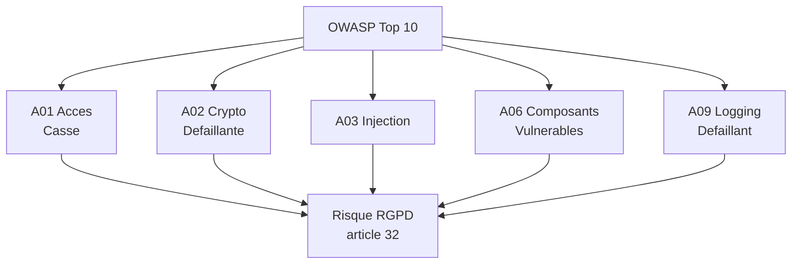
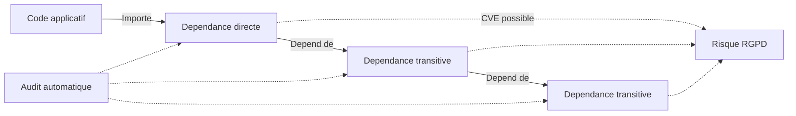
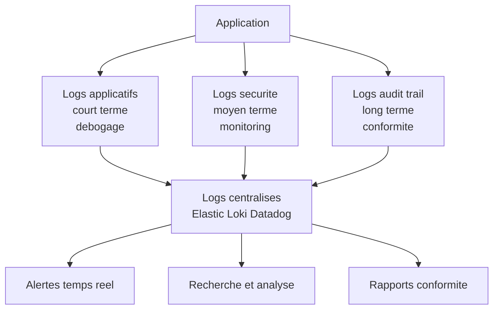
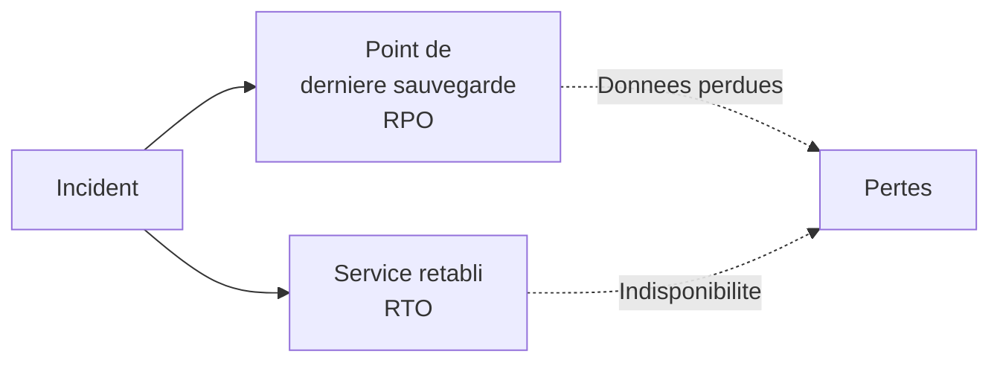
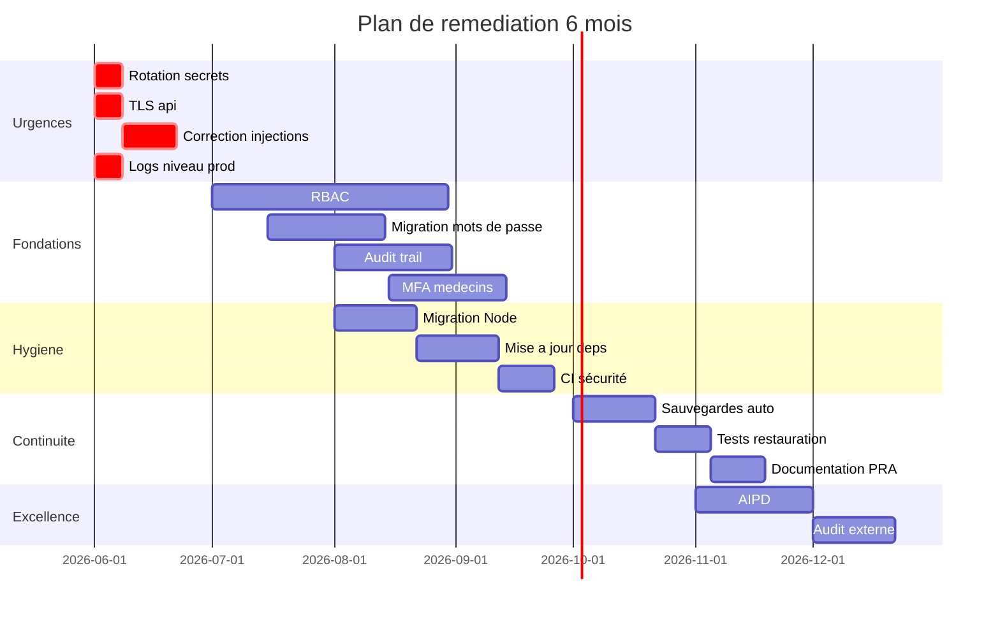

# Sécurité du code, journalisation et sauvegardes

## Introduction

Vous est-il déjà arrivé d'installer un meuble en kit en ignorant la
notice et de découvrir, à la fin, qu'une étape avait été sautée ?
Le meuble tient debout, mais il branle dangereusement. Pareil pour
le code : une application peut sembler fonctionner parfaitement
tout en étant fragile à plusieurs endroits non visibles. Les
vulnérabilités du code, les dépendances obsolètes, l'absence de
journalisation, ou des sauvegardes mal configurées sont autant de
failles silencieuses qui se révéleront un jour, au pire moment.

Cette partie aborde trois sujets souvent traités séparément mais
profondément liés : la **sécurité du code applicatif** (vulnérabilités
classiques, gestion des dépendances, secrets dans Git), la
**journalisation et l'audit trail** (savoir ce qui s'est passé,
quand, et par qui), et les **sauvegardes** (savoir restaurer en cas
de problème). Ces trois domaines forment le filet de sécurité qui
rattrape ce que les autres mesures n'ont pas su prévenir.

### Les vulnérabilités classiques du code : lecture RGPD de l'OWASP Top 10

Connaissez-vous l'OWASP Top 10 ? C'est la liste des dix
vulnérabilités web les plus critiques, publiée régulièrement par
la fondation OWASP (Open Web Application Security Project). Cette
liste est devenue la référence mondiale pour les développeurs et
les auditeurs. Pour un développeur RGPD, elle se lit comme une
liste de risques juridiques autant que techniques : chacune de ces
vulnérabilités, exploitée, peut provoquer une violation de données
au sens de l'article 33.

Nous allons revisiter les principales catégories de l'OWASP Top 10
sous l'angle des conséquences RGPD, et donner les principes de
protection pour chacune. Cette grille de lecture, vous allez la
réutiliser à chaque revue de code.

**Broken Access Control (A01)** - Contrôle d'accès défaillant.
Conséquence RGPD : exposition de données personnelles à des
utilisateurs non autorisés. Exemple courant : un utilisateur peut
consulter le profil d'un autre en modifiant un ID dans l'URL.
**Protection** : RBAC strict, contrôle d'accès sur **toutes** les
ressources (pas seulement sur les pages, aussi sur les API),
tests automatisés des permissions.

**Cryptographic Failures (A02)** - Échecs cryptographiques.
Conséquence RGPD : données personnelles transmises ou stockées en
clair. Exemples : absence de TLS, mots de passe en MD5, données
sensibles non chiffrées. **Protection** : cf. partie 2 du module.

**Injection (A03)** - Injection (SQL, NoSQL, OS, LDAP).
Conséquence RGPD : exfiltration potentielle de toute la base de
données. **Protection** : requêtes paramétrées **systématiques**,
ORM utilisé correctement, validation et échappement des entrées,
principe du moindre privilège sur le compte de base.

**Insecure Design (A04)** - Conception non sécurisée. Conséquence
RGPD : failles structurelles qui ne se corrigent qu'avec une
refonte. **Protection** : Privacy by Design (cf. module 4), threat
modeling en amont, revues d'architecture.

**Security Misconfiguration (A05)** - Mauvaise configuration de
sécurité. Conséquence RGPD : fuites par erreur de paramétrage
(headers manquants, ports ouverts, comptes par défaut).
**Protection** : configuration durcie par défaut, scans
automatiques (gestion de configuration as code).

**Vulnerable Components (A06)** - Composants vulnérables.
Conséquence RGPD : exploitation via une bibliothèque tierce
obsolète. **Protection** : voir section dépendances ci-dessous.

**Authentication Failures (A07)** - Échecs d'authentification.
Conséquence RGPD : prise de contrôle de comptes utilisateurs.
**Protection** : cf. partie 1 du module.

**Software and Data Integrity Failures (A08)** - Manque d'intégrité.
Conséquence RGPD : altération de données, déploiement de code
malveillant. **Protection** : signature des artefacts, CI/CD
sécurisée, vérification des sources.

**Security Logging and Monitoring Failures (A09)** - Échecs de
journalisation et monitoring. Conséquence RGPD : violations non
détectées, impossibilité de notifier la CNIL dans les délais.
**Protection** : journalisation centralisée (cf. section suivante),
monitoring temps réel, alertes.

**Server-Side Request Forgery (A10)** - SSRF. Conséquence RGPD :
accès depuis le serveur à des ressources internes normalement
inaccessibles. **Protection** : validation stricte des URLs
manipulées côté serveur, listes blanches d'hôtes autorisés.



#### Exemple pratique {id="exemple-pratique-owasp-1"}

Voyons concrètement l'illustration de la vulnérabilité d'injection
SQL, et sa correction :

```javascript
// MAUVAIS : concatenation de chaines, vulnerable
async function findUserByEmail(email) {
    // Si email contient "' OR '1'='1", c est un desastre
    const query = `SELECT * FROM users WHERE email = '${email}'`;
    return await db.raw(query);
}

// BON : requete parametree, l ORM gere l echappement
async function findUserByEmail(email) {
    return await db.users.findOne({ where: { email } });
}

// EQUIVALENT en SQL direct avec parametres
async function findUserByEmail(email) {
    const result = await db.query(
        'SELECT * FROM users WHERE email = $1',
        [email]
    );
    return result.rows[0];
}
```

Voici aussi l'illustration d'un défaut de contrôle d'accès courant :

```javascript
// MAUVAIS : pas de verification que l utilisateur connecte
// est bien le proprietaire de la ressource demandee
app.get('/api/orders/:id', async (req, res) => {
    const order = await db.orders.findById(req.params.id);
    res.json(order);
});

// BON : verification du proprietaire
app.get('/api/orders/:id', async (req, res) => {
    const order = await db.orders.findById(req.params.id);

    if (!order) {
        return res.status(404).json({ error: 'Non trouve' });
    }

    if (order.user_id !== req.user.id && !isAdmin(req.user)) {
        // Journaliser la tentative
        await logUnauthorizedAccess(req.user.id, order.id);
        return res.status(403).json({ error: 'Acces refuse' });
    }

    res.json(order);
});
```

Ces exemples paraissent triviaux, mais ils représentent encore une
majorité des incidents en production. La discipline consiste à
**toujours** appliquer ces patterns, sans exception, même pour les
endpoints internes ou les prototypes.

### La gestion des dépendances

Avez-vous déjà cuisiné un plat avec un ingrédient périmé ? Le
résultat peut être catastrophique. Pour le code, c'est pareil :
utiliser une bibliothèque obsolète, c'est intégrer dans votre
application des vulnérabilités connues que des attaquants
exploitent quotidiennement. Une étude récente montre que **plus de
70 % des applications** contiennent au moins une vulnérabilité
provenant d'une dépendance tierce.

Plusieurs sources de risque liées aux dépendances :

- **Vulnérabilités connues (CVE)** : failles publiquement
  documentées dans des versions précises ;
- **Bibliothèques abandonnées** : plus de mise à jour, mais encore
  utilisées dans les projets ;
- **Supply chain attacks** : attaques où le code malveillant est
  injecté dans une bibliothèque légitime ;
- **Typosquatting** : packages malveillants nommés à proximité de
  packages légitimes (`react-dom` vs `react-doms`).



**Bonnes pratiques pour gérer les dépendances** :

1. **Auditer régulièrement** : `npm audit`, `pip-audit`,
   `cargo audit` selon la pile technologique. À intégrer dans le
   CI/CD pour échouer les builds si des vulnérabilités critiques
   sont détectées.

2. **Mettre à jour systématiquement** : ne pas accumuler les
   retards de version. Plus on attend, plus la mise à jour devient
   risquée et lourde. Adopter un rythme régulier (mensuel par
   exemple).

3. **Verrouiller les versions** : utiliser des fichiers de lock
   (`package-lock.json`, `poetry.lock`, `Cargo.lock`) committés
   dans le dépôt. Permet la reproductibilité des builds et la
   maîtrise des dépendances transitives.

4. **Vérifier les bibliothèques avant adoption** : popularité,
   maintenance active, équipe identifiable, dernière mise à jour
   récente, nombre de mainteneurs. Préférer les bibliothèques
   matures et bien maintenues.

5. **Scanner via outils dédiés** : Snyk, Dependabot (GitHub),
   Renovate, OWASP Dependency Check. Ces outils détectent les CVE
   et proposent automatiquement des pull requests de mise à jour.

6. **Limiter le nombre de dépendances** : chaque dépendance est un
   risque. Ne pas ajouter une bibliothèque pour une fonctionnalité
   trivialement implémentable en quelques lignes.

#### Exemple pratique {id="exemple-pratique-deps-1"}

Voici une configuration type pour automatiser la gestion des
dépendances dans un projet Node.js sur GitHub :

```yaml
# .github/dependabot.yml
# Mises a jour automatiques des dependances

version: 2
updates:
  - package-ecosystem: 'npm'
    directory: '/'
    schedule:
      interval: 'weekly'
    open-pull-requests-limit: 10
    reviewers:
      - 'security-team'
    labels:
      - 'dependencies'
      - 'security'
    # Grouper les patchs pour reduire le bruit
    groups:
      patch-updates:
        update-types:
          - 'patch'

  - package-ecosystem: 'docker'
    directory: '/'
    schedule:
      interval: 'monthly'
```

```yaml
# .github/workflows/security.yml
# Pipeline de securite automatise

name: Security Scan

on:
  push:
    branches: [main]
  pull_request:
  schedule:
    - cron: '0 6 * * 1'

jobs:
  audit:
    runs-on: ubuntu-latest
    steps:
      - uses: actions/checkout@v4

      - name: Setup Node
        uses: actions/setup-node@v4
        with:
          node-version: 'lts/*'

      - name: Install dependencies
        run: npm ci

      - name: Audit dependencies
        run: npm audit --audit-level=high

      - name: Scan for secrets
        uses: gitleaks/gitleaks-action@v2

      - name: SAST scan
        uses: github/codeql-action/analyze@v3
```

> **Note** : la chaîne de sécurité automatisée (CI/CD) n'élimine
> pas le jugement humain. Elle attrape la majorité des problèmes
> connus, mais les vulnérabilités logiques (mauvaise conception)
> échappent à ces outils. Les revues de code restent essentielles.

### La journalisation et l'audit trail

Que se passe-t-il quand vous ne savez pas exactement ce qui s'est
passé dans votre application ? Vous êtes incapable de comprendre
un incident, de répondre à une demande de la CNIL, de prouver votre
diligence en cas de litige. La **journalisation** (logging) est
l'œil sur le passé : sans elle, l'application devient une boîte
noire. Avec elle, vous pouvez reconstituer les événements, détecter
les anomalies, et démontrer votre conformité.

Plusieurs types de journaux à distinguer :

**Logs applicatifs** : traces de fonctionnement de l'application
(requêtes, erreurs, événements métier). Servent au débogage et au
monitoring.

**Logs de sécurité** : événements significatifs pour la sécurité
(authentifications, accès aux données sensibles, modifications de
droits, suppression de données).

**Logs d'audit** (audit trail) : sous-ensemble des logs de sécurité,
spécifiquement conçus pour la conformité réglementaire. Ne sont
jamais modifiables, conservés longtemps, et auditables.

**Logs système** : événements de l'infrastructure (démarrage,
arrêt, charge, erreurs réseau).



**Quoi journaliser** (à minima) :

- toutes les **authentifications** (réussies et échouées) ;
- tous les **changements de droits** (RBAC) ;
- tous les **accès à des données sensibles** (qui, quoi, quand) ;
- toutes les **opérations administratives** (création/suppression
  de comptes, exports massifs, modifications de configuration) ;
- toutes les **erreurs critiques** (5xx, exceptions non capturées) ;
- toutes les **opérations RGPD** (demandes des personnes,
  consentements, oppositions).

**Quoi NE PAS journaliser** :

- les **mots de passe** ou tokens en clair ;
- les **données sensibles** (santé, opinions) non strictement
  nécessaires ;
- les **données de carte bancaire** (interdiction PCI-DSS) ;
- toute **donnée personnelle** au-delà du nécessaire (principe de
  minimisation des logs).

#### Exemple pratique {id="exemple-pratique-logs-1"}

Voici une implémentation type d'audit trail pour les opérations
sensibles :

```sql
-- Table d audit trail
CREATE TABLE audit_log (
    id BIGINT PRIMARY KEY,

    -- Acteur
    user_id BIGINT,
    user_email VARCHAR(255),
    ip_address VARCHAR(45),
    user_agent VARCHAR(500),

    -- Action
    action_type VARCHAR(100) NOT NULL,
    -- Exemples : 'LOGIN_SUCCESS', 'LOGIN_FAILURE',
    --           'DATA_ACCESS', 'DATA_EXPORT',
    --           'PERMISSION_CHANGE', 'USER_DELETION'

    resource_type VARCHAR(100),
    -- 'user', 'order', 'medical_record', ...

    resource_id VARCHAR(100),

    -- Resultat
    result VARCHAR(20) NOT NULL,
    -- 'success', 'failure', 'denied'

    details JSON,
    -- Donnees structurees complementaires

    -- Horodatage immuable
    occurred_at TIMESTAMP NOT NULL DEFAULT CURRENT_TIMESTAMP
);

-- Index pour les requetes frequentes
CREATE INDEX idx_audit_user ON audit_log(user_id, occurred_at);
CREATE INDEX idx_audit_action ON audit_log(action_type, occurred_at);
CREATE INDEX idx_audit_resource
    ON audit_log(resource_type, resource_id);

-- Empecher les modifications (audit trail immuable)
-- Sur PostgreSQL : revoquer les permissions UPDATE/DELETE
-- au compte applicatif principal
```

```javascript
// Helper centralise pour la journalisation d audit
class AuditLogger {
    async log({
        actor, action, resource, result, details, request
    }) {
        await db.auditLog.insert({
            user_id: actor?.id,
            user_email: actor?.email,
            ip_address: this.extractIp(request),
            user_agent: request?.headers['user-agent'],
            action_type: action,
            resource_type: resource?.type,
            resource_id: resource?.id?.toString(),
            result: result,
            details: this.sanitize(details),
            occurred_at: new Date()
        });

        // Si erreur critique, envoi immediat aux alertes
        if (result === 'failure' && this.isCritical(action)) {
            await this.alertOps(action, actor, details);
        }
    }

    extractIp(request) {
        // Recuperation IP avec proxies
        return request?.headers['x-forwarded-for']
            || request?.socket?.remoteAddress;
    }

    sanitize(details) {
        // Suppression des champs sensibles potentiellement
        // presents dans les details
        const cleaned = { ...details };
        delete cleaned.password;
        delete cleaned.token;
        delete cleaned.secret;
        delete cleaned.credit_card;
        return cleaned;
    }

    isCritical(action) {
        return [
            'PERMISSION_CHANGE',
            'MASS_DATA_EXPORT',
            'ADMIN_LOGIN',
            'DATA_DELETION_BULK'
        ].includes(action);
    }
}

// Utilisation lors d une connexion
async function handleLogin(req, res) {
    const { email, password } = req.body;
    const user = await db.users.findByEmail(email);

    if (!user || !await verifyPassword(user.hash, password)) {
        await auditLogger.log({
            actor: { email },
            action: 'LOGIN_FAILURE',
            result: 'failure',
            details: { reason: 'invalid_credentials' },
            request: req
        });
        return res.status(401).json({ error: 'Invalid' });
    }

    await auditLogger.log({
        actor: user,
        action: 'LOGIN_SUCCESS',
        result: 'success',
        request: req
    });

    // ... suite du processus de login
}
```

**Durée de conservation des logs** :

- logs techniques : 6 mois à 1 an typiquement ;
- logs de sécurité : 1 an minimum ;
- audit trail RGPD : 3 à 6 ans selon la sensibilité ;
- au-delà : pseudonymisation puis effacement.

> **Note** : la CNIL recommande **1 an** pour les logs de
> connexion en l'état actuel du droit. Cette durée est souvent
> dépassée par des considérations sectorielles (banque, santé).
> Documenter la justification dans le registre.

### Sauvegardes et plan de reprise

Avez-vous déjà perdu un document important parce que vous n'aviez
pas de sauvegarde ? La même mésaventure peut arriver à une
entreprise, à une échelle catastrophique. Les sauvegardes ne sont
pas seulement une bonne pratique technique : elles sont une
**obligation RGPD** au titre du principe de disponibilité de
l'article 32. Une entreprise qui perd les données de ses
utilisateurs est responsable, même si la cause est un incident
technique.

Une bonne stratégie de sauvegarde répond à plusieurs questions :

- **Quoi sauvegarder** : bases de données, fichiers utilisateurs,
  configuration, certificats, secrets ;
- **À quelle fréquence** : selon le RPO (Recovery Point Objective),
  c'est-à-dire la quantité de données qu'on accepte de perdre ;
- **Où stocker** : règle du 3-2-1 (3 copies, 2 supports différents,
  1 hors site) ;
- **Combien de temps conserver** : rotation, archivage long terme ;
- **Comment restaurer** : procédure documentée, tests réguliers.

Le **RPO** et le **RTO** sont deux indicateurs clés :

- **RPO** (Recovery Point Objective) : quantité de données qu'on
  accepte de perdre. Un RPO de 1 heure suppose des sauvegardes
  horaires.
- **RTO** (Recovery Time Objective) : temps maximal acceptable pour
  rétablir le service après un incident. Un RTO de 4 heures suppose
  une procédure de restauration éprouvée et rapide.



**Règles essentielles pour les sauvegardes RGPD** :

1. **Chiffrement systématique** : toute sauvegarde contient des
   données personnelles, donc doit être chiffrée. Clés stockées
   séparément des données.

2. **Test de restauration régulier** : une sauvegarde non testée
   n'est pas une sauvegarde. Tester chaque mois en environnement
   d'intégration.

3. **Politique de rotation claire** : conservation 30 jours,
   90 jours, 1 an selon le contexte. Au-delà, suppression
   automatique.

4. **Rejeu des effacements** : si l'utilisateur a exercé son droit
   à l'effacement, l'effacement doit être **rejoué** sur une
   éventuelle base restaurée. Registre des effacements conservé
   séparément.

5. **Localisation maîtrisée** : sauvegardes hébergées en UE de
   préférence. Si transfert hors UE, contractualisation et
   garanties (CCT).

6. **Accès journalisé** : toute opération sur les sauvegardes
   (lecture, restauration) est tracée et auditée.

#### Exemple pratique {id="exemple-pratique-backup-1"}

Voici un schéma type de politique de sauvegarde pour une
application e-commerce :

| Élément | Fréquence | Rétention | Stockage |
|---------|-----------|-----------|----------|
| BDD production | Toutes les heures | 24h | Snapshot SGBD |
| BDD production | Quotidien | 30 jours | Stockage chiffré |
| BDD production | Mensuel | 1 an | Stockage longue durée |
| Fichiers utilisateurs | Quotidien | 30 jours | Object storage |
| Configuration | Sur modification | 1 an | Git versionné |
| Audit trail | Quotidien | 6 ans | Stockage immuable |
| Logs applicatifs | Continu | 6 mois | Système centralisé |

**Tests trimestriels** : restauration complète en environnement
isolé, vérification de l'intégrité des données, mesure du RTO réel,
mise à jour de la procédure si nécessaire.

#### Exercice 1

Vous devez concevoir la stratégie de sauvegarde pour une
plateforme française de visioconférence professionnelle (B2B). La
plateforme stocke : comptes utilisateurs, enregistrements de
réunions (avec consentement), fichiers partagés en réunion, logs
de connexion. La direction veut un RPO de 1 heure et un RTO de
4 heures. Établissez la stratégie complète, incluant les coûts
estimés.

##### Correction exercice 1 {collapsible="true"}

**Stratégie de sauvegarde**

| Élément | Stratégie | Outil |
|---------|-----------|-------|
| Comptes utilisateurs (BDD) | Snapshot horaire + dump quotidien chiffré | PostgreSQL + Restic |
| Enregistrements de réunions | Réplication continue inter-régions | S3 cross-region |
| Fichiers partagés | Réplication continue + sauvegarde quotidienne | Object storage |
| Logs de connexion | Centralisation temps réel + archivage 1 an | ELK ou Loki |
| Configuration | Git + Vault sauvegardé quotidiennement | Vault snapshot |

**Architecture multi-régions UE** :

- production en France (Paris) ;
- réplication asynchrone vers une seconde région UE (Allemagne) ;
- sauvegardes froides chez un autre hébergeur souverain (OVH par
  exemple) pour la règle du 3-2-1.

**Chiffrement** :

- toutes les sauvegardes chiffrées en AES-256 avant transfert ;
- clés gérées via le KMS, distinctes des clés de production ;
- rotation annuelle des clés de sauvegarde.

**Procédure de restauration documentée** :

1. Détection de l'incident et activation de la cellule de crise
   (max 15 minutes).
2. Décision de bascule sur région secondaire ou de restauration
   (max 30 minutes).
3. Restauration et tests d'intégrité (max 2 heures).
4. Validation et remise en production (max 1 heure).
5. Total : RTO de 4 heures respecté.

**Tests trimestriels** :

- restauration complète en environnement isolé ;
- validation de chaque source de données ;
- mesure du RTO réel et écart avec l'objectif ;
- post-mortem et amélioration de la procédure.

**Coûts estimés** (ordre de grandeur, à affiner selon volumes) :

- stockage primaire et réplication : 800 à 2 000 €/mois ;
- sauvegardes froides (cold storage) : 200 à 500 €/mois ;
- outils de sauvegarde (licences) : 100 à 500 €/mois ;
- temps d'équipe pour exploitation et tests : 1 ETP partiel.

**Total** : entre 1 500 et 4 000 € par mois selon le volume, plus
les coûts humains. Investissement clairement justifié au regard du
coût d'une indisponibilité majeure ou d'une perte de données.

## Exercice final

Vous reprenez la maintenance d'une application web de prise de
rendez-vous médicaux développée il y a quatre ans par une autre
équipe. Lors de votre audit initial, vous identifiez de nombreuses
faiblesses :

- code Node.js sur version obsolète (16.x), nombreuses dépendances
  périmées ;
- pas de configuration Dependabot ni d'audit automatique ;
- logs applicatifs en niveau DEBUG en production, mêlant infos
  techniques et données sensibles ;
- mots de passe stockés en SHA-256 sans sel ;
- aucun audit trail des accès aux dossiers médicaux ;
- sauvegardes manuelles, jamais testées en restauration ;
- fichier `.env.production` versionné dans Git ;
- pas de TLS sur le sous-domaine `api.example.com` (HTTP simple) ;
- vulnérabilités SQL injection sur certains endpoints d'admin ;
- pas de RBAC, tous les médecins voient tous les patients.

Rédigez un **plan de remédiation priorisé** sur six mois, avec
pour chaque mesure : la priorité, la complexité, le risque RGPD,
et le délai cible.

### Correction exercice final {collapsible="true"}

**Plan de remédiation — Application de prise de rendez-vous
médicaux**

**Phase 1 : Urgences critiques (Mois 1)**

| Mesure | Priorité | Complexité | Risque RGPD |
|--------|----------|------------|-------------|
| Retirer `.env.production` de Git, rotation des secrets | P0 | Faible | Critique |
| Activer TLS sur api.example.com | P0 | Faible | Critique |
| Corriger les injections SQL connues | P0 | Moyenne | Critique |
| Désactiver le niveau DEBUG en production | P0 | Faible | Élevé |

Ces mesures sont à appliquer **immédiatement**. Les expositions
identifiées correspondent à des manquements graves susceptibles de
constituer une violation au sens de l'article 33 si elles sont
exploitées. Documenter la chronologie en interne au cas où.

**Phase 2 : Renforcement fondamental (Mois 2-3)**

| Mesure | Priorité | Complexité | Risque RGPD |
|--------|----------|------------|-------------|
| Implémenter le RBAC patient/médecin | P1 | Élevée | Critique |
| Migrer les mots de passe vers Argon2id | P1 | Moyenne | Élevé |
| Mettre en place l'audit trail | P1 | Moyenne | Élevé |
| Imposer la MFA pour les médecins | P1 | Moyenne | Élevé |

Le RBAC est probablement le sujet le plus complexe. Il impose une
refonte des contrôles d'accès, des tests rigoureux, et une
migration progressive avec validation par un médecin référent.
L'audit trail conditionne la capacité à détecter les anomalies.

**Phase 3 : Hygiène technique (Mois 3-4)**

| Mesure | Priorité | Complexité | Risque RGPD |
|--------|----------|------------|-------------|
| Migrer Node.js vers version LTS | P2 | Moyenne | Moyen |
| Mettre à jour toutes les dépendances | P2 | Moyenne | Moyen |
| Activer Dependabot et audit CI/CD | P2 | Faible | Moyen |
| Pre-commit hook anti-secrets | P2 | Faible | Moyen |

Ces mesures bouchent les vulnérabilités résiduelles et créent les
conditions pour que les régressions futures soient détectées
rapidement.

**Phase 4 : Continuité d'activité (Mois 4-5)**

| Mesure | Priorité | Complexité | Risque RGPD |
|--------|----------|------------|-------------|
| Automatiser les sauvegardes | P2 | Moyenne | Élevé |
| Chiffrer les sauvegardes | P2 | Faible | Élevé |
| Tester la procédure de restauration | P2 | Moyenne | Moyen |
| Documenter le PRA | P2 | Faible | Moyen |

La disponibilité (article 32) est aussi importante que la
confidentialité. Des sauvegardes non testées n'apportent aucune
garantie réelle.

**Phase 5 : Excellence opérationnelle (Mois 5-6)**

| Mesure | Priorité | Complexité | Risque RGPD |
|--------|----------|------------|-------------|
| Conduire une AIPD complète | P3 | Élevée | Conformité |
| Audit externe de sécurité | P3 | Moyenne | Conformité |
| Formation de l'équipe | P3 | Faible | Conformité |
| Documentation utilisateur RGPD | P3 | Faible | Conformité |

Ces mesures structurent la conformité pour l'avenir et démontrent
la responsabilité (article 5.2).

**Tableau de bord de suivi** :



**Notification éventuelle à la CNIL** :

Si les vulnérabilités identifiées ont déjà conduit à une violation
de données (exfiltration, accès non autorisé), une notification est
obligatoire dans les 72 heures de la prise de conscience. Faire ce
diagnostic en parallèle de la phase 1, avec le DPO.

**Information du COMEX** :

Ce plan implique des arbitrages (capacité d'équipe, budgets, délais
de livraison de nouvelles fonctionnalités). Une note de cadrage
doit être présentée au COMEX pour validation et soutien
hiérarchique.

## Conclusion de la partie

Vous disposez désormais d'une vision globale de la sécurité du code
applicatif et des mesures opérationnelles essentielles. Vous savez
lire l'OWASP Top 10 avec un regard RGPD, vous comprenez l'importance
critique de la gestion des dépendances, vous maîtrisez les
fondamentaux de la journalisation et de l'audit trail, et vous
savez concevoir une politique de sauvegardes conforme au principe
de disponibilité.

Retenez ces principes pratiques :

- la sécurité du code est une **discipline quotidienne**, pas un
  audit ponctuel ;
- les **dépendances obsolètes** sont l'une des causes principales
  de violations ; automatiser leur surveillance ;
- la **journalisation** est aussi importante pour la sécurité que
  pour la conformité ; sans logs, pas de preuve de diligence ;
- les **sauvegardes** ne valent que par leurs tests de
  restauration ; tester régulièrement ou ne pas en avoir.

La partie suivante abordera le sujet le plus stressant du métier :
**la gestion d'une violation de données**, avec ses procédures
précises, ses délais courts, et ses enjeux considérables.
