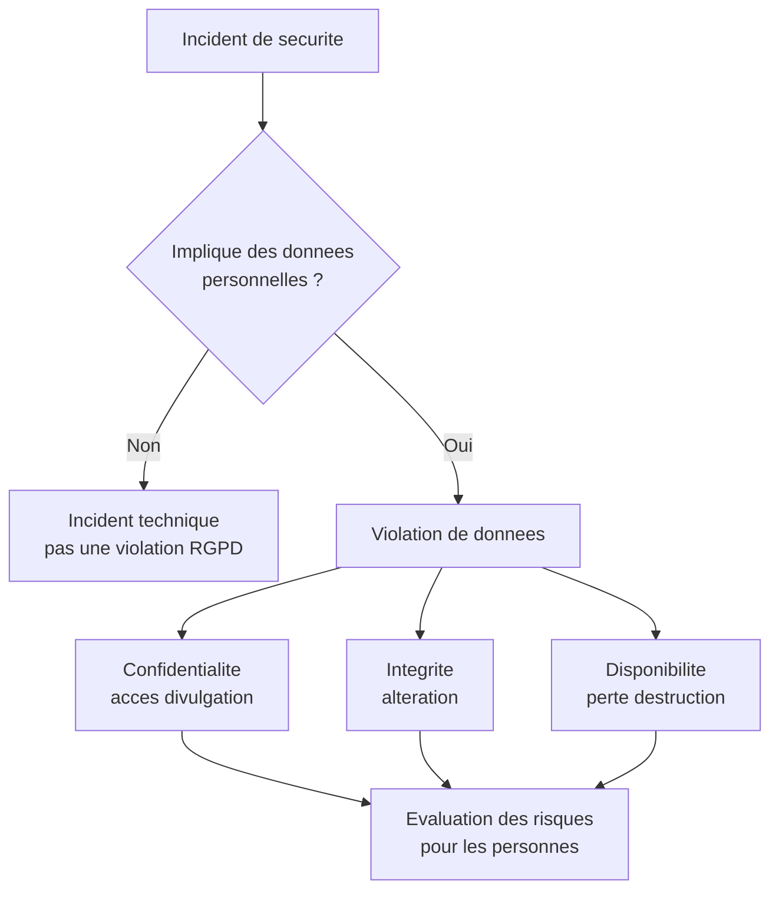
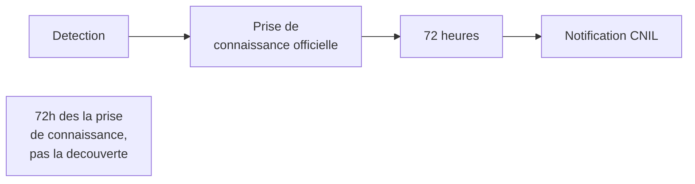
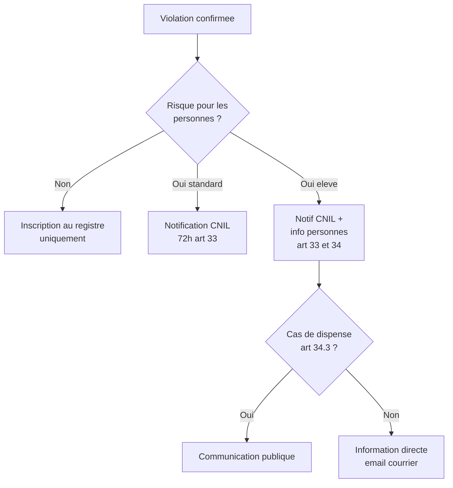
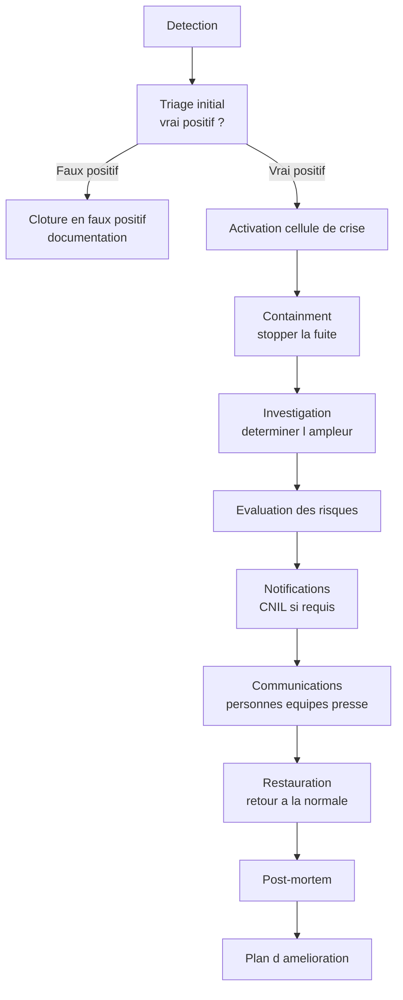

# La gestion d'une violation de données

## Introduction

Imaginez la scène. Il est 23h, un samedi. Votre téléphone vibre :
c'est l'astreinte technique. Un développeur a remarqué une activité
inhabituelle dans les logs : des requêtes provenant d'une IP
étrangère ont téléchargé en masse, pendant la nuit, des données
utilisateurs. La fuite est-elle réelle ? Quelle est son ampleur ?
Que faire dans l'heure qui vient ? Et dans les 72 heures qui
suivent ? Chaque minute compte, chaque décision a des conséquences
juridiques, économiques, et humaines. Si vous n'êtes pas préparé,
vous improviserez ; si vous improvisez, vous ferez des erreurs.

Cette partie aborde le sujet le plus stressant du métier : la
**gestion d'une violation de données**. Elle est encadrée par les
articles 33 et 34 du RGPD, qui imposent des obligations strictes
au responsable de traitement : notifier la CNIL sous 72 heures,
informer les personnes concernées si nécessaire, documenter
l'incident. Mais bien au-delà des obligations juridiques, c'est
une question de **survie réputationnelle** : une violation bien
gérée peut être absorbée, une violation mal gérée peut détruire
une entreprise.

### Qu'est-ce qu'une violation de données ?

Toute anomalie technique n'est pas une violation de données. Le
RGPD donne une définition précise. L'article 4.12 définit la
violation comme « une violation de la sécurité entraînant, de
manière accidentelle ou illicite, la destruction, la perte,
l'altération, la divulgation non autorisée de données à caractère
personnel transmises, conservées ou traitées d'une autre manière,
ou l'accès non autorisé à de telles données ».

Cette définition couvre trois grandes catégories d'événements
selon le type d'impact :

- **Violations de confidentialité** : accès ou divulgation non
  autorisés de données personnelles ;
- **Violations d'intégrité** : altération non autorisée de données
  personnelles ;
- **Violations de disponibilité** : perte d'accès ou destruction
  non prévue de données personnelles.



**Exemples concrets de violations** :

- *Confidentialité* : intrusion dans une base, email envoyé à la
  mauvaise liste, perte d'un ordinateur portable contenant des
  données client, publication accidentelle d'une URL contenant
  des données personnelles, secret dans Git public ;
- *Intégrité* : modification non autorisée des dossiers médicaux,
  corruption de données suite à une erreur de migration,
  remplacement frauduleux de coordonnées bancaires ;
- *Disponibilité* : rançongiciel chiffrant la base, perte de
  sauvegardes critiques, suppression accidentelle massive de
  comptes.

Certains incidents peuvent **cumuler** plusieurs catégories : un
rançongiciel attaque à la fois la disponibilité (données
inaccessibles) et potentiellement la confidentialité (si les
attaquants ont exfiltré une copie).

### Les obligations de l'article 33 : notification à la CNIL

L'article 33 prévoit que le responsable de traitement notifie à
l'autorité de contrôle compétente toute violation de données à
caractère personnel, **dans les meilleurs délais et, si possible,
72 heures au plus tard après en avoir pris connaissance**, à
moins que la violation ne soit pas susceptible d'engendrer un
risque pour les droits et libertés des personnes physiques.

Si la notification n'a pas lieu dans les 72 heures, elle doit être
accompagnée des **motifs du retard**.



Plusieurs notions juridiques sont importantes :

**Prise de connaissance** : le compteur des 72 heures démarre quand
le responsable de traitement a une certitude raisonnable qu'une
violation est survenue. Une simple suspicion technique sans
confirmation n'est pas une prise de connaissance.

**Risque pour les droits et libertés** : la notification n'est
obligatoire que si la violation présente un risque. L'analyse de
ce risque doit être documentée, même si on conclut à l'absence de
risque.

**Notification au sous-traitant** : si vous êtes sous-traitant et
que vous détectez une violation, vous devez en informer le
responsable de traitement dans les meilleurs délais. C'est ensuite
au responsable de notifier la CNIL.

**Contenu de la notification** : l'article 33.3 énumère les
informations à fournir :

- la **nature** de la violation, y compris si possible les
  catégories et le nombre approximatif de personnes concernées,
  ainsi que les catégories et le nombre approximatif
  d'enregistrements ;
- le **nom et les coordonnées** du DPO ou d'un autre point de
  contact ;
- les **conséquences probables** de la violation ;
- les **mesures prises** ou envisagées pour remédier et atténuer
  les effets ;
- l'**autorité de contrôle** concernée.

La notification peut être effectuée par phases si toutes les
informations ne sont pas disponibles dans les 72 heures. Une
notification initiale partielle suivie de mises à jour est
acceptable.

#### Exemple pratique {id="exemple-pratique-notif-1"}

Voici un modèle de notification CNIL utilisable comme base de
travail. La CNIL met à disposition un téléservice dédié sur son
site (cnil.fr/fr/notifier-une-violation-de-donnees-personnelles)
qui structure cette information.

```markdown
# Notification de violation de données personnelles

## 1. Identification du responsable de traitement

Nom : [Raison sociale]
Adresse : [Siège social]
DPO : [Nom, email, téléphone]

## 2. Nature de la violation

Type de violation :
- [ ] Confidentialité (accès non autorisé)
- [ ] Intégrité (altération)
- [ ] Disponibilité (perte, destruction)

Date de survenance estimée : [JJ/MM/AAAA]
Date de prise de connaissance : [JJ/MM/AAAA HH:MM]
Délai depuis prise de connaissance : [XX heures]

Description factuelle :
[Décrire ce qui s'est passé, les circonstances, le mode opératoire
si connu]

## 3. Données concernées

Catégories de données touchées :
- [ ] Identité (nom, prénom, email)
- [ ] Coordonnées (adresse, téléphone)
- [ ] Données économiques (paiement, RIB)
- [ ] Données de connexion (logs, IP)
- [ ] Données sensibles (santé, opinions)
- [ ] Autres : [préciser]

Nombre approximatif de personnes concernées : [chiffre]
Nombre approximatif d'enregistrements concernés : [chiffre]
Catégories de personnes : [clients, employés, prospects...]

## 4. Conséquences probables

Évaluation du risque pour les personnes :
- Risque d'usurpation d'identité : [élevé/moyen/faible]
- Risque financier : [élevé/moyen/faible]
- Risque réputationnel : [élevé/moyen/faible]
- Risque discriminatoire : [élevé/moyen/faible]
- Autres risques identifiés : [préciser]

## 5. Mesures prises et envisagées

Mesures correctives immédiates :
- [Action 1 : description et date]
- [Action 2 : description et date]

Mesures préventives engagées :
- [Action 3 : description et date]

Information des personnes concernées :
- [ ] Effectuée le : [JJ/MM/AAAA]
- [ ] En cours
- [ ] Non requise (justifier)

## 6. Documentation

Pièces jointes :
- Chronologie détaillée de l'incident
- Analyse d'impact
- Procès-verbal de la cellule de crise
- Captures d'écran ou logs significatifs
```

### Les obligations de l'article 34 : information des personnes

L'article 34 prévoit que, lorsqu'une violation est susceptible
d'engendrer un **risque élevé** pour les droits et libertés des
personnes, le responsable de traitement la communique à la
personne concernée, dans les meilleurs délais. Cette communication
est distincte de la notification CNIL.

Trois cas de **dispense** d'information directe (article 34.3) :

1. les données concernées sont **incompréhensibles** par les
   attaquants (chiffrement effectif, par exemple) ;
2. le responsable a pris ultérieurement des **mesures** qui
   rendent improbable la matérialisation du risque ;
3. la communication exigerait des **efforts disproportionnés** ;
   dans ce cas, une communication publique ou similaire est
   effectuée.

L'information directe doit être :

- **claire et simple** : adaptée à un grand public, sans jargon ;
- **personnalisée** : envoyée individuellement, pas via un
  bandeau générique ;
- **utile** : indiquer les actions concrètes à entreprendre
  (changer de mot de passe, surveiller les comptes bancaires, etc.).



**Évaluer le « risque élevé »** : la CNIL propose une grille
d'analyse multifactorielle :

- nature des données (santé, paiement, identité officielle = risque
  élevé par nature) ;
- volume (perte massive = aggravation) ;
- public concerné (mineurs, personnes vulnérables = aggravation) ;
- caractère identifiant et chiffré ou non (chiffrement effectif =
  atténuation forte) ;
- conséquences pratiques (usurpation, fraude, discrimination,
  préjudice moral).

#### Exemple pratique {id="exemple-pratique-info-1"}

Voici un modèle d'email d'information aux personnes concernées,
applicable à une violation moyenne (accès non autorisé à des
adresses email et noms) :

```markdown
Objet : Information importante concernant vos données personnelles

Madame, Monsieur,

Nous vous écrivons pour vous informer d'un incident de sécurité
survenu sur notre plateforme et concernant certaines de vos
données personnelles. Cette information vous est adressée en
application de l'article 34 du Règlement général sur la protection
des données.

## Ce qui s'est passé

Le [date], nous avons détecté un accès non autorisé à une partie
de notre base de données. Notre enquête interne a permis de
conclure qu'environ [nombre] de nos utilisateurs étaient concernés,
dont vous-même.

## Quelles données sont concernées

Les données suivantes ont été exposées :
- votre nom et prénom ;
- votre adresse email ;
- la date de création de votre compte.

Les données suivantes ne sont pas concernées :
- votre mot de passe (stocké de manière chiffrée et non exposé) ;
- vos données de paiement ;
- vos historiques d'achat.

## Mesures que nous avons prises

Dès la détection :
- l'accès non autorisé a été coupé en moins de [délai] ;
- l'autorité de contrôle (CNIL) a été notifiée le [date] ;
- les vulnérabilités à l'origine de l'incident ont été corrigées ;
- un audit de sécurité externe a été commandé.

## Ce que nous vous recommandons

Bien que les mots de passe ne soient pas concernés, nous vous
recommandons par précaution :
1. de **changer votre mot de passe** sur notre service ;
2. d'**activer la double authentification** dans vos paramètres ;
3. d'être **vigilant** sur les emails suspects (phishing) qui
   pourraient utiliser vos coordonnées exposées.

Notre service client se tient à votre disposition pour répondre
à vos questions : [coordonnées].

Vous disposez du droit d'introduire une réclamation auprès de la
CNIL (cnil.fr) si vous l'estimez nécessaire.

Nous vous prions de bien vouloir nous excuser pour cet incident
et la gêne occasionnée. La protection de vos données est notre
priorité absolue, et nous ferons tout pour qu'un tel événement ne
se reproduise pas.

Cordialement,
[Nom du DPO]
Délégué à la protection des données
```

> **Note** : la **transparence** est votre meilleur allié. Une
> communication claire, honnête, et orientée action est mieux
> perçue par les personnes concernées qu'une communication
> juridique évasive. La confiance détruite par un incident peut
> être partiellement reconstruite par la qualité de la réponse.

### Le registre des violations

L'article 33.5 prévoit que le responsable de traitement documente
**toute violation**, qu'elle ait été notifiée ou non, y compris
les faits, les effets, et les mesures prises. Cette documentation
constitue le **registre des violations**, distinct du registre des
activités de traitement.

Pourquoi documenter même les violations non notifiées ? Plusieurs
raisons :

- **Démontrer la diligence** : en cas de contrôle, prouver que les
  décisions ont été motivées et documentées ;
- **Détecter les patterns** : un incident isolé peut paraître
  bénin, mais une série d'incidents similaires révèle peut-être
  un problème systémique ;
- **Améliorer continuellement** : chaque incident est une leçon ;
- **Préparer les audits** : la CNIL peut demander à consulter ce
  registre lors d'un contrôle.

#### Exemple pratique {id="exemple-pratique-registre-1"}

Voici un schéma type de registre des violations :

```sql
-- Registre des violations de donnees
CREATE TABLE data_breach_log (
    id BIGINT PRIMARY KEY,

    -- Identification
    incident_ref VARCHAR(50) NOT NULL UNIQUE,
    incident_title VARCHAR(255) NOT NULL,

    -- Chronologie
    occurred_at TIMESTAMP NOT NULL,
    detected_at TIMESTAMP NOT NULL,
    confirmed_at TIMESTAMP,
    contained_at TIMESTAMP,
    resolved_at TIMESTAMP,

    -- Nature
    breach_type VARCHAR(50) NOT NULL,
    -- 'confidentiality', 'integrity', 'availability'
    data_categories TEXT,
    -- JSON avec liste des categories touchees

    persons_count_estimated INT,
    persons_count_confirmed INT,

    -- Impact
    risk_assessment VARCHAR(50) NOT NULL,
    -- 'low', 'medium', 'high'
    risk_details TEXT,

    -- Actions
    cnil_notification_required BOOLEAN NOT NULL,
    cnil_notified_at TIMESTAMP,
    cnil_notification_ref VARCHAR(100),
    persons_notification_required BOOLEAN NOT NULL,
    persons_notified_at TIMESTAMP,

    -- Mesures
    corrective_actions TEXT,
    preventive_actions TEXT,
    lessons_learned TEXT,

    -- Documentation
    incident_owner VARCHAR(100) NOT NULL,
    closed_by VARCHAR(100),
    created_at TIMESTAMP NOT NULL DEFAULT CURRENT_TIMESTAMP,
    updated_at TIMESTAMP NOT NULL DEFAULT CURRENT_TIMESTAMP
);
```

### Le plan de réponse aux incidents

Avez-vous déjà vu une équipe se précipiter pour éteindre un
incendie sans plan ? Beaucoup d'efforts, peu de résultats, et
souvent des dégâts collatéraux. Pour les violations de données,
c'est pareil : sans **plan de réponse aux incidents** préparé en
amont, la gestion en temps réel devient chaotique. Vous découvrez
les bons interlocuteurs trop tard, vous oubliez des étapes
critiques, vous perdez du temps précieux.

Un plan de réponse aux incidents efficace définit :

1. **L'équipe de réponse** : qui fait quoi, contacts d'astreinte,
   suppléants ;
2. **Le seuil de déclenchement** : quand active-t-on le plan ?
3. **Les procédures par type d'incident** : exfiltration,
   rançongiciel, fuite accidentelle, perte de matériel ;
4. **Les communications** : interne, externe, presse ;
5. **L'aspect juridique** : DPO, avocat, CNIL ;
6. **L'aspect technique** : containment, forensics, restauration ;
7. **La phase de retour d'expérience** : post-mortem, leçons.



**Rôles type dans une cellule de crise** :

- **Incident commander** : coordonne l'ensemble, décide des
  arbitrages ;
- **Lead technique** : pilote les actions techniques (containment,
  investigation, restauration) ;
- **DPO** : pilote les aspects juridiques RGPD, notification CNIL ;
- **Communication** : pilote les messages internes et externes ;
- **Direction** : valide les décisions sensibles, débloque les
  ressources ;
- **Juridique** : conseille sur les implications légales,
  contractuelles, contentieuses.

#### Exercice 1

Vous travaillez chez *FastShop*, e-commerçant français de
2 millions d'utilisateurs. Un samedi soir à 22h, un de vos
développeurs en astreinte remarque dans les logs que plusieurs
milliers de comptes ont reçu, dans la dernière heure, des emails
de réinitialisation de mot de passe alors qu'aucun utilisateur n'a
fait la demande. L'enquête initiale suggère qu'un attaquant
exploite une faille pour déclencher massivement la procédure de
récupération. Décrivez votre plan d'action heure par heure pour
les 24 premières heures.

##### Correction exercice 1 {collapsible="true"}

**Heure 0 (22h00) - Détection et alerte**

- Le développeur d'astreinte confirme l'anomalie via plusieurs
  indices (volumétrie inhabituelle, IPs sources concentrées).
- Application immédiate de la procédure d'alerte : déclenchement
  de la cellule de crise.

**Heure 0 à 1 (22h00 - 23h00) - Containment**

- Cellule de crise réunie en visio (incident commander, lead
  technique, DPO, communication, direction).
- Désactivation immédiate de la fonction de réinitialisation de mot
  de passe par mesure conservatoire.
- Blocage des IPs identifiées.
- Vérification de l'absence de connexions effectives via les
  tokens de réinitialisation (consultation des logs).

**Heure 1 à 4 (23h00 - 02h00) - Investigation**

- Analyse approfondie : combien de comptes touchés ? combien de
  tokens utilisés ? quelles connexions effectives suspectes ?
- Identification précise de la vulnérabilité exploitée.
- Évaluation du risque : si les tokens n'ont pas été utilisés, le
  risque pour les personnes est faible ; si des connexions ont eu
  lieu, le risque s'élève.
- Première décision : qualification de l'incident en violation ou
  en tentative.

**Heure 4 à 8 (02h00 - 06h00) - Mesures correctives**

- Correction de la vulnérabilité.
- Invalidation de tous les tokens de réinitialisation non utilisés.
- Forçage de la déconnexion des comptes potentiellement compromis.
- Pour les comptes confirmés compromis : reset forcé du mot de
  passe avec procédure renforcée.
- Préparation de l'astreinte support pour la matinée.

**Heure 8 à 12 (06h00 - 10h00) - Préparation des communications**

- Documentation de l'incident : chronologie, données concernées,
  mesures prises.
- Rédaction de la notification CNIL si confirmation que des accès
  effectifs ont eu lieu.
- Rédaction de l'email aux utilisateurs concernés.
- Briefing du support client pour gérer les appels du dimanche
  matin.
- Communication interne aux équipes (transparence et alignement).

**Heure 12 à 24 (10h00 - 22h00) - Notifications**

- Si violation confirmée : envoi des emails aux utilisateurs
  affectés.
- Notification CNIL via le téléservice cnil.fr.
- Préparation d'une éventuelle communication presse en cas de
  fuite externe.
- Mise en place d'un FAQ public.
- Monitoring renforcé pour détecter d'éventuels rebonds.

**Au-delà - Suivi**

- Post-mortem détaillé en équipe le lundi.
- Plan d'action préventif : revue de toutes les fonctions
  similaires (recover password, magic links, etc.).
- Audit externe de sécurité.
- Mise à jour du plan de réponse aux incidents pour intégrer les
  leçons.
- Suivi avec la CNIL si questions complémentaires.

**Points clés** :

- les **72 heures** courent à partir de la prise de connaissance
  confirmée, soit ici probablement vers 02h00 le dimanche. La
  notification CNIL doit donc intervenir au plus tard le mercredi
  02h00 ;
- la **transparence** envers les utilisateurs est essentielle :
  une réinitialisation involontaire de mot de passe est inquiétante,
  une explication claire et rassurante limite le préjudice
  réputationnel ;
- la **documentation** complète de l'incident est cruciale pour la
  CNIL et pour les éventuels recours.

## Exercice final

Vous êtes le DPO d'une plateforme française de réservation
hôtelière, *BookEasy*, comptant 3 millions d'utilisateurs.
Un mardi à 14h, votre équipe technique vous prévient : un
collaborateur du service marketing a envoyé par erreur, à l'ensemble
de la base clients (par fichier CSV joint à une newsletter), un
extract contenant pour chaque utilisateur : email, nom, prénom,
date de naissance, et historique des 5 derniers séjours
(établissements, dates, montants). L'email a été envoyé à 12h45.
Vers 13h30, plusieurs destinataires ont signalé l'incident au
service client.

Préparez :

1. La **chronologie** détaillée des 72 prochaines heures avec
   actions, responsables, et délais.
2. La **notification CNIL** complète à envoyer.
3. L'**email d'information** aux personnes concernées.
4. Le **plan de communication** interne et externe (presse).
5. Les **mesures préventives** pour éviter la récidive.

### Correction exercice final {collapsible="true"}

**Chronologie 72h - Incident BookEasy**

**Mardi 14h00 - Activation de la cellule de crise**

Cellule réunie en présentiel : DPO, CTO, lead marketing,
directeur communication, juriste, direction générale.

**14h00 - 15h00 - Containment et analyse**

Mesures immédiates :

- contact urgent de l'ESP (Brevo / Mailjet) pour supprimer le
  fichier des serveurs encore non délivrés (effort limité, la
  majorité est déjà arrivée) ;
- envoi immédiat d'un email de rappel demandant la suppression
  du précédent message et du fichier (action de bonne foi qui
  réduit mais ne supprime pas la diffusion) ;
- gel temporaire des communications marketing en attendant
  validation des process ;
- recensement précis du nombre de destinataires : 3 millions.

Analyse :

- nature des données : email, nom, date de naissance, historique
  séjours ;
- volume : 3 millions de personnes ;
- mode de diffusion : email avec pièce jointe CSV, donc
  potentiellement téléchargé et conservé par les destinataires.

**15h00 - 17h00 - Évaluation du risque**

Grille d'analyse :

- *Identité* : oui (nom + email + DDN) - risque d'usurpation
  d'identité limité (DDN seule = insuffisant), mais matériel
  d'aide au phishing ciblé ;
- *Historique de séjours* : risque modéré (révèle des
  déplacements, habitudes, milieux fréquentés) ;
- *Volume* : critique (3M de personnes).

Conclusion : **risque élevé** par effet de volume et nature
révélatrice des données. Information directe des personnes
obligatoire (article 34).

**17h00 - 20h00 - Préparation documentaire**

- Rédaction de la notification CNIL.
- Rédaction de l'email aux utilisateurs concernés.
- Briefing du support client en prévision du flux d'appels.
- Préparation d'une FAQ publique.

**Mercredi 09h00 - Notifications**

- Envoi de la notification CNIL via le téléservice.
- Lancement de l'envoi de l'email aux 3M d'utilisateurs (par
  vagues pour ne pas saturer l'ESP).

**Mercredi - Vendredi - Communication et suivi**

- Communiqué de presse préparé, publié si médias relayent.
- Renforcement du support client (équipe étendue).
- Monitoring des signalements de phishing (vérifier si exploitation
  effective de la fuite).

**Notification CNIL**

```
NOTIFICATION DE VIOLATION DE DONNÉES

Responsable de traitement : BookEasy SAS, [adresse]
DPO : [nom, email, téléphone]

NATURE DE LA VIOLATION
Type : violation de confidentialité (divulgation accidentelle)
Date de survenance : 12h45, mardi [JJ/MM/AAAA]
Date de prise de connaissance : 14h00, mardi [JJ/MM/AAAA]

Circonstances :
Un collaborateur du service marketing a, lors de l'envoi d'une
newsletter promotionnelle, attaché par erreur un fichier d'export
CSV contenant des données de l'ensemble des utilisateurs au lieu
du fichier de visuels prévu. L'email a été envoyé à l'intégralité
de la base, soit 3 millions d'utilisateurs.

DONNÉES CONCERNÉES
- Identité : email, nom, prénom, date de naissance
- Historique : 5 derniers séjours (établissement, dates, montants)

Catégories de personnes : clients particuliers
Nombre de personnes concernées : 3 millions
Nombre d'enregistrements : 3 millions

CONSÉQUENCES PROBABLES
Risque identifié : élevé en raison du volume et de la nature
révélatrice des données :
- aide au phishing ciblé (les attaquants connaissent désormais
  les habitudes de voyage des personnes) ;
- atteinte à la vie privée (révélation des déplacements) ;
- risque marginal d'usurpation d'identité (DDN exposée).

MESURES PRISES
- Demande immédiate de suppression auprès de l'ESP (effet partiel) ;
- Envoi d'un email de rappel demandant la suppression du message ;
- Gel des communications marketing pendant la durée de l'enquête ;
- Activation de la cellule de crise ;
- Préparation de l'information aux personnes concernées.

MESURES PRÉVENTIVES ENGAGÉES
- Mise en place d'un double contrôle obligatoire avant tout envoi
  de masse ;
- Refonte du processus d'envoi : interdiction des pièces jointes
  pour les newsletters, contenus uniquement par lien ;
- Formation obligatoire de l'équipe marketing aux risques RGPD ;
- Audit complet des process de communication.

INFORMATION DES PERSONNES
- Décision : information directe par email
- Date prévue : mercredi [JJ/MM/AAAA], envoi par vagues

DOCUMENTATION
Pièces jointes : chronologie détaillée, analyse d'impact, PV de la
cellule de crise, copies anonymisées des échanges concernés.
```

**Email aux utilisateurs**

```
Objet : Important : information concernant vos données personnelles

Madame, Monsieur,

Nous vous écrivons pour vous informer d'un incident concernant
vos données personnelles, survenu mardi [JJ/MM/AAAA] à 12h45.

CE QUI S'EST PASSÉ
Lors de l'envoi de notre newsletter habituelle, un fichier
contenant les données de nos utilisateurs a été par erreur
attaché à cet email. Vous avez donc reçu, en pièce jointe, un
document contenant les données de nos clients, dont vous-mêmes.

QUELLES SONT VOS DONNÉES CONCERNÉES
- Votre nom, prénom et adresse email
- Votre date de naissance
- L'historique de vos 5 derniers séjours réservés via notre
  plateforme (établissements, dates, montants)

Ne sont PAS concernés :
- vos mots de passe (toujours stockés de manière chiffrée)
- vos données bancaires (toujours tokenisées via notre prestataire
  de paiement)
- vos correspondances avec les hôteliers

CE QUE NOUS VOUS DEMANDONS
- Supprimer l'email du [JJ/MM/AAAA] de 12h45 et la pièce jointe
  qu'il contenait, sans l'ouvrir si possible ;
- Vider votre corbeille pour éliminer définitivement la pièce
  jointe ;
- Ne pas transférer ce message à des tiers.

CE QUE NOUS VOUS RECOMMANDONS
- Être vigilant à d'éventuels emails de phishing ciblés qui
  pourraient utiliser ces informations pour vous tromper ;
- Ne jamais cliquer sur des liens suspects dans les emails reçus
  les prochaines semaines, même semblant venir de nous ou
  d'hôtels ;
- Activer la double authentification sur votre compte BookEasy.

CE QUE NOUS AVONS FAIT
- L'incident a été détecté en moins de 2 heures et la cellule de
  crise activée immédiatement ;
- L'autorité de protection des données (CNIL) a été notifiée ;
- Nous avons demandé la suppression du message à tous les
  destinataires ;
- Nous avons immédiatement gelé les communications marketing ;
- Nous avons refondu nos process pour empêcher toute récidive.

NOS EXCUSES
Nous mesurons l'inquiétude que cet incident peut générer et vous
prions de bien vouloir nous en excuser. La protection de vos
données est notre engagement le plus important, et nous avons
manqué à cet engagement dans ce cas précis. Nous prenons toutes
les mesures pour que cet incident reste isolé.

CONTACTS
Notre équipe dédiée se tient à votre disposition au [numéro
gratuit] ou à dpo@bookeasy.fr.

Vous disposez du droit d'introduire une réclamation auprès de la
CNIL (cnil.fr) si vous l'estimez nécessaire.

Cordialement,
[Nom du DPO]
Délégué à la protection des données — BookEasy
```

**Plan de communication**

*Interne* :
- communication immédiate au COMEX dès la cellule de crise ;
- briefing aux managers (J+1 matin) ;
- communication transparente à l'ensemble des collaborateurs
  (J+1 après-midi) : ce qui s'est passé, ce qui est en cours, ce
  qui va changer ;
- rappel des bonnes pratiques RGPD à toutes les équipes.

*Support client* :
- équipe support étendue temporairement ;
- script de réponse prêt, FAQ interne ;
- ligne dédiée pour les questions liées à l'incident ;
- escalade vers le DPO pour les cas complexes.

*Externe / presse* :
- communiqué de presse préparé, publié si reprise médiatique ;
- porte-parole identifié (CEO ou DPO) ;
- ton : transparent, factuel, mesures concrètes annoncées ;
- éviter l'évitement défensif qui aggrave toujours.

*Réseaux sociaux* :
- monitoring continu des mentions ;
- équipe communautaire formée à répondre, réorientation vers le
  service client pour les questions précises.

**Mesures préventives**

| Mesure | Échéance |
|--------|----------|
| Double contrôle obligatoire avant envois de masse | Immédiat |
| Suppression des pièces jointes dans newsletters | Immédiat |
| Audit complet des process de communication | Mois 1 |
| Formation RGPD obligatoire équipe marketing | Mois 1 |
| Mise en place d'un workflow d'approbation | Mois 2 |
| Solution technique anti-fuites (DLP) | Mois 3 |
| Exercice de crise simulé | Mois 6 |
| Audit externe annuel | Mois 12 |

Cette correction démontre une gestion mature d'un incident
particulièrement délicat. L'essentiel n'est pas d'éviter les
erreurs (l'erreur humaine est inévitable), mais de gérer
correctement les conséquences en mobilisant la transparence, la
rigueur procédurale et l'amélioration continue.

## Conclusion de la partie

Vous savez désormais gérer une violation de données de bout en
bout, depuis la détection initiale jusqu'à la documentation
post-incident. Vous maîtrisez les obligations de l'article 33
(notification CNIL en 72 heures) et de l'article 34 (information
des personnes en cas de risque élevé), et vous comprenez
l'importance d'avoir un plan de réponse aux incidents préparé
**avant** que l'incident ne survienne.

Retenez ces principes clés :

- une violation **n'est pas une honte**, elle est statistiquement
  inévitable ; ce qui distingue les bons des mauvais, c'est la
  qualité de la gestion ;
- la **transparence** est votre meilleur allié, l'évitement
  défensif aggrave toujours la situation ;
- la **préparation** en amont (plan de réponse, exercices,
  documentation) divise par dix le temps de réaction réel ;
- la **documentation** complète de chaque incident est obligatoire
  même pour les non-notifiés, et constitue votre preuve de
  diligence.

Vous êtes maintenant prêt pour le TP final, qui mettra à
l'épreuve l'ensemble de vos compétences sécurité dans un cas
combiné : audit de code + simulation d'incident.
