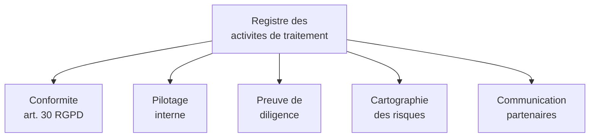
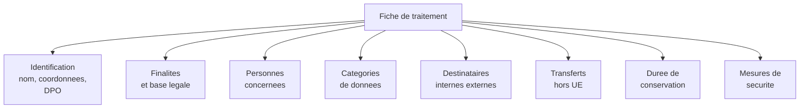
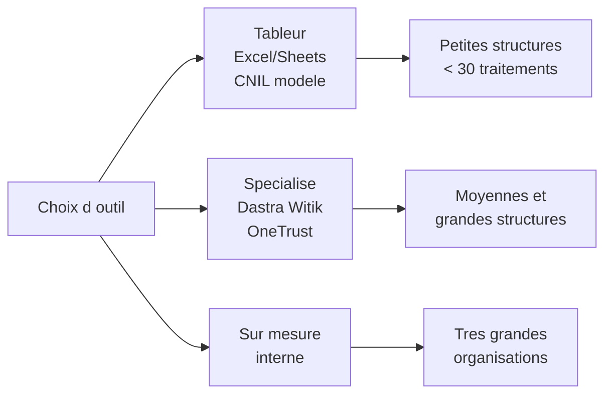
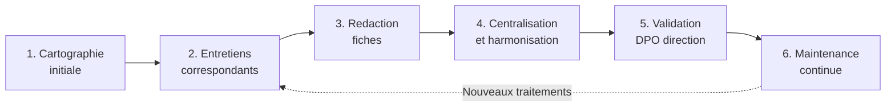

# Le registre des activités de traitement

## Introduction

Avez-vous déjà essayé de ranger un grenier resté en désordre depuis
vingt ans ? Le problème n'est pas qu'il manque d'objets : c'est
qu'on ne sait plus ce qu'il y a, où c'est, et à quoi ça sert.
Cette situation, qui rend la moindre recherche désespérante, est
exactement celle dans laquelle se trouvent la plupart des
entreprises qui n'ont jamais sérieusement inventorié leurs
traitements de données. Elles savent qu'il se passe « beaucoup de
choses », mais elles seraient incapables d'en faire la liste
complète. Le registre des activités de traitement vient résoudre
ce problème : c'est l'inventaire structuré et tenu à jour de tous
les traitements de l'organisation.

Cette partie présente le registre dans le détail : sa base
juridique (article 30 du RGPD), son contenu obligatoire, ses
formats possibles, et la méthodologie pour le constituer et le
maintenir. Vous allez voir que la mise en place d'un registre est
une excellente occasion de **prendre la mesure** de ce que fait
réellement votre organisation, et que sa tenue régulière est un
outil de pilotage précieux pour le DPO et la direction.

### À quoi sert le registre ?

Connaissez-vous la différence entre une bibliothèque rangée et une
pile de livres ? Les deux contiennent les mêmes ouvrages, mais
l'une permet de retrouver ce qu'on cherche, l'autre non. Le
registre, c'est la bibliothèque de vos traitements. Il vous permet
de **savoir** ce qui se passe dans votre organisation, et de le
**démontrer** à un tiers (CNIL, partenaire, auditeur).

Plusieurs finalités complémentaires :

- **Conformité juridique** : l'article 30 du RGPD en fait une
  obligation pour la quasi-totalité des organisations.
- **Pilotage interne** : le registre donne une vision panoramique
  des activités de traitement, indispensable au DPO et à la
  direction.
- **Preuve de diligence** : en cas de contrôle CNIL, c'est l'un
  des premiers documents demandés. Son absence ou sa mauvaise
  qualité est un signal très négatif.
- **Cartographie des risques** : la vue d'ensemble permet
  d'identifier les traitements à risque et de prioriser les
  AIPD.
- **Communication externe** : avec les partenaires
  (sous-traitants, clients institutionnels) qui peuvent demander
  à le consulter pour évaluer leur propre conformité en cascade.



### Qui doit tenir un registre ?

L'article 30 du RGPD impose à **tout responsable de traitement**
et à **tout sous-traitant** de tenir un registre. Une exemption
existe pour les organisations de moins de 250 salariés, mais elle
est très limitée : elle ne s'applique pas si le traitement est
**susceptible de comporter un risque** pour les droits et
libertés, s'il est **non occasionnel**, ou s'il porte sur des
**données sensibles ou pénales**.

En pratique, la quasi-totalité des organisations qui développent
ou exploitent une application web doivent tenir un registre :
gérer des clients, des employés, des prospects, des newsletters,
de la téléphonie, de la facturation, c'est déjà du traitement de
données personnelles non occasionnel. L'exemption ne profite
vraiment qu'aux toutes petites structures dont l'activité ne
mobilise que très peu de données personnelles.

Deux registres distincts cohabitent souvent dans une même
organisation :

- **Registre du responsable de traitement** (article 30.1) :
  inventaire des traitements pour lesquels vous décidez des
  finalités et des moyens (votre CRM, votre application, votre
  système RH).
- **Registre du sous-traitant** (article 30.2) : inventaire des
  traitements que vous effectuez pour le compte de vos clients
  (typique pour les éditeurs de SaaS, les agences web, les
  hébergeurs).

Un éditeur de logiciel SaaS tient typiquement les **deux** : un
registre pour ses traitements internes (RH, marketing, facturation)
et un registre des traitements effectués pour ses clients.

### Le contenu obligatoire

Avez-vous déjà rempli un formulaire administratif où chaque case
semblait conçue pour vous bloquer ? Le registre RGPD a ses cases,
mais elles sont parfaitement logiques quand on comprend leur
utilité. L'article 30 énumère précisément les informations à
inscrire.

**Pour le responsable de traitement (article 30.1)** :

1. **Nom et coordonnées** du responsable, et le cas échéant du
   co-responsable, du représentant, et du DPO ;
2. **Finalités** du traitement ;
3. **Catégories de personnes concernées** et **catégories de
   données** traitées ;
4. **Catégories de destinataires** auxquels les données sont ou
   seront communiquées ;
5. Le cas échéant, les **transferts de données vers un pays
   tiers** ou une organisation internationale, et la documentation
   des garanties appropriées ;
6. Dans la mesure du possible, les **délais prévus pour l'effacement**
   des différentes catégories de données ;
7. Dans la mesure du possible, une **description générale des
   mesures de sécurité** techniques et organisationnelles.

**Pour le sous-traitant (article 30.2)** :

1. Nom et coordonnées du sous-traitant, des responsables de
   traitement pour le compte desquels il agit, et du DPO ;
2. Catégories de traitements effectués pour le compte de chaque
   responsable ;
3. Transferts hors UE le cas échéant ;
4. Description générale des mesures de sécurité.



### Format et outils

Avez-vous déjà vu deux entreprises faire la même chose de deux
manières différentes ? Pour le registre, il n'y a pas de format
officiel imposé. Vous pouvez choisir le support qui vous convient,
à condition qu'il respecte les exigences de l'article 30. Plusieurs
options possibles :

**Tableur (Excel, Google Sheets)** : le plus simple, le plus
répandu. La CNIL propose un modèle gratuit à télécharger. Avantages :
faible coût, rapidité de mise en place. Inconvénients : versionnage
difficile, pas de workflow, vite illisible quand le nombre de
fiches grossit.

**Outils spécialisés** : Dastra, Witik, OneTrust, TrustArc, Data
Legal Drive. Avantages : interfaces dédiées, workflow d'approbation,
liens avec les AIPD, suivi des sous-traitants. Inconvénients :
coût annuel, courbe d'apprentissage.

**Outil interne sur mesure** : pour les grandes organisations qui
ont des besoins spécifiques (intégration au SI, automatisation
poussée). Demande développement et maintenance.

**Outil CNIL** : la CNIL propose un outil gratuit en ligne pour
les TPE/PME, qui guide la rédaction. Bonne porte d'entrée si vous
débutez.



#### Exemple pratique {id="exemple-pratique-reg-1"}

Voici une fiche de traitement type, illustrant un cas concret :

```markdown
# Fiche de traitement n°007

## Identification

- **Nom du traitement** : Gestion des candidatures emploi
- **Date de création** : 15/03/2025
- **Dernière mise à jour** : 12/04/2026
- **Responsable de traitement** : ACME SAS
- **DPO** : Marie Durand, dpo@acme.fr, 01.23.45.67.89

## Finalités et base légale

- **Finalité principale** : permettre aux candidats de postuler
  aux offres d'emploi de l'entreprise.
- **Finalités secondaires** :
  - constituer un vivier de candidatures pour besoins futurs ;
  - répondre aux obligations légales (non-discrimination).
- **Base légale principale** : intérêt légitime (article 6.1.f),
  équilibre démontré par documentation interne.
- **Base légale secondaire (vivier)** : consentement (article
  6.1.a).

## Personnes concernées

- Candidats à un poste, qu'il soit pourvu ou non.
- Volume estimé : environ 2 000 candidatures par an.

## Catégories de données

- **Identité** : nom, prénom, date de naissance, nationalité
  (pour vérification des autorisations de travail).
- **Coordonnées** : email, téléphone, adresse postale.
- **Parcours** : CV, lettre de motivation, diplômes, expérience
  professionnelle.
- **Évaluation** : notes des recruteurs, comptes-rendus
  d'entretien.
- **NON COLLECTÉES** : opinions politiques, religieuses, syndicales,
  orientation sexuelle, état de santé, casier judiciaire (sauf
  cas légaux).

## Destinataires

- **En interne** : équipe RH, managers concernés par le poste,
  direction pour validation finale.
- **En externe** : aucun. Le traitement reste totalement interne
  à l'entreprise.

## Transferts hors UE

Aucun. L'outil utilisé (Welcome to the Jungle) héberge les données
en UE selon le DPA signé en mars 2025.

## Durée de conservation

- Candidatures pour le poste actif : pendant la durée du
  processus de recrutement (4 mois maximum).
- Candidatures non retenues, conservées dans le vivier sur
  consentement : 2 ans à compter du dernier contact.
- Au-delà : suppression automatique via cron job nocturne.

## Mesures de sécurité

- **Techniques** : application HTTPS (TLS 1.3), chiffrement BDD
  (TDE), MFA pour les comptes RH et managers, journalisation des
  consultations.
- **Organisationnelles** : politique de sécurité signée par
  chaque collaborateur ayant accès, formation annuelle RGPD pour
  l'équipe RH, contrôle d'accès strict.

## Sous-traitants

- Welcome to the Jungle (hébergement candidatures, France) - DPA
  signé en mars 2025.
- Brevo (envoi d'emails de confirmation, France) - DPA inclus
  dans CGS.

## Risque évalué

- Niveau : modéré.
- AIPD réalisée : non requise selon analyse préliminaire (volumes
  modérés, pas de données sensibles, durée limitée).
- Réévaluation prévue : annuelle.

## Évolutions

- 15/03/2025 : création de la fiche.
- 12/04/2026 : ajout de la fonctionnalité de matching IA,
  ré-évaluation des risques, mise à jour de la base légale.
```

> **Note** : la CNIL met à disposition gratuitement sur son site
> un **modèle de registre simplifié** (au format Excel ou OpenDocument),
> ainsi qu'un outil en ligne pour les TPE/PME. C'est un excellent
> point de départ pour débuter.

### Méthodologie de constitution

Avez-vous déjà essayé d'inventorier le contenu d'une maison entière
en une seule fois ? L'opération est décourageante. Mieux vaut
procéder pièce par pièce, en plusieurs étapes. La constitution
d'un registre suit la même logique : on procède par approche
méthodique, pas par grand effort isolé.

**Étape 1 - Cartographie initiale** : identifier toutes les
**directions, services, ou équipes** qui manipulent des données
personnelles. Pour chacun, un correspondant désigné.

**Étape 2 - Entretiens** : avec chaque correspondant, conduire
un entretien structuré (1 à 2 heures) pour identifier les
traitements de son périmètre. Bonne pratique : préparer une grille
de questions, prendre des notes structurées.

**Étape 3 - Rédaction des fiches** : pour chaque traitement
identifié, produire une fiche complète. Itérer avec les
correspondants pour valider l'exactitude.

**Étape 4 - Centralisation et harmonisation** : regrouper toutes
les fiches dans un outil unique. Harmoniser le vocabulaire, les
formats, les niveaux de détail.

**Étape 5 - Validation** : revue par le DPO, validation par la
direction. Identification des traitements à risque nécessitant
une AIPD.

**Étape 6 - Maintenance** : mise à jour à chaque évolution
(nouveau traitement, modification, suppression). Revue annuelle
systématique.



#### Exercice 1

Vous travaillez chez *EduTech*, une startup française de 25
salariés qui édite une plateforme d'apprentissage en ligne pour
les entreprises. Vous êtes chargé d'initier le registre des
activités de traitement. Listez au moins **dix traitements
distincts** que vous vous attendez à trouver, en précisant pour
chacun : le périmètre métier concerné, et si vous agissez comme
responsable de traitement ou sous-traitant.

##### Correction exercice 1 {collapsible="true"}

**Traitements en tant que responsable de traitement** :

1. **Gestion des candidatures à l'emploi** - service RH. *EduTech*
   collecte les candidatures pour ses propres recrutements.

2. **Gestion des employés** - service RH. Contrats, paie, fiches
   de poste, évaluations annuelles.

3. **Gestion comptable et facturation** - service finance.
   Factures, RIB, échanges commerciaux avec les clients.

4. **Marketing et prospection commerciale** - service marketing.
   Prospects identifiés, campagnes d'emailing, événements.

5. **Newsletter et communication produit** - service marketing.
   Abonnés à la newsletter, communication de produit.

6. **Site web vitrine et formulaires de contact** - service
   marketing. Visiteurs identifiés, demandes de démos, contacts.

7. **Support client / gestion des tickets** - service customer
   success. Échanges avec les administrateurs des entreprises
   clientes.

8. **Sécurité et journaux d'accès internes** - service IT.
   Connexions des employés aux outils internes, traçabilité.

9. **Vidéosurveillance des locaux** - service moyens généraux.
   Si applicable.

**Traitements en tant que sous-traitant (pour le compte des
clients)** :

10. **Hébergement de la plateforme d'apprentissage** - service
    technique. *EduTech* stocke et traite, pour le compte de chaque
    entreprise cliente, les données de ses apprenants (identités,
    progressions, contenus produits, évaluations).

11. **Envoi de notifications aux apprenants** - service technique.
    Pour le compte des clients.

12. **Support technique aux apprenants** - service customer
    success. Pour le compte des clients (selon le contrat).

**Notes complémentaires** :

- Pour les traitements 1 à 9, *EduTech* est responsable : elle
  décide des finalités et des moyens.
- Pour les traitements 10 à 12, *EduTech* est sous-traitant : ce
  sont ses clients qui sont responsables des données de leurs
  apprenants. *EduTech* agit selon les instructions documentées
  du client.
- Cette distinction est cruciale : elle conditionne les obligations
  réciproques, les DPA à signer, et les responsabilités en cas de
  problème.
- Le périmètre RH (1 et 2) peut être enrichi de plusieurs
  sous-traitements (RTT, déclarations sociales, mutuelle).
- Si *EduTech* utilise un cabinet comptable externe ou un
  prestataire de paie, ces relations doivent être documentées
  dans la liste des sous-traitants.

### Maintenance du registre

Un registre figé est rapidement un registre mort, puis un registre
faux. Comme une base de données qu'on n'alimente plus, il devient
progressivement non représentatif de la réalité. Sa **maintenance
continue** est donc aussi importante que sa création initiale.

Plusieurs occasions de mise à jour :

- **Nouveau traitement** : création d'une fiche, revue par le DPO
  et le métier concerné.
- **Modification substantielle** : changement de finalité, de base
  légale, de sous-traitant, de durée de conservation. Mise à
  jour de la fiche concernée.
- **Suppression** : un traitement cesse (fin de produit,
  réorganisation). Archivage de la fiche (pas suppression) avec
  date de fin.
- **Revue annuelle** : tour complet de l'ensemble des fiches, par
  le DPO et chaque correspondant.
- **Avant un contrôle** : ultime revue pour s'assurer que le
  registre reflète la réalité.

Une bonne pratique consiste à **intégrer la mise à jour du
registre dans les workflows de l'entreprise** : tout nouveau
projet, toute nouvelle campagne, toute nouvelle intégration tierce
déclenche une vérification du registre. Cette intégration au flux
de travail est ce qui rend la maintenance soutenable dans le
temps.

#### Exercice 2

Votre DPO vient de constater que le registre de votre entreprise
n'a pas été mis à jour depuis 18 mois. Il vous demande de
proposer un **plan de remise à niveau** sur trois mois, avec des
actions concrètes, des responsabilités, et des indicateurs de
suivi.

##### Correction exercice 2 {collapsible="true"}

**Plan de remise à niveau du registre sur 3 mois**

**Mois 1 - Cartographie et audit**

| Action | Responsable | Délai |
|--------|-------------|-------|
| Identification des correspondants RGPD | DPO | Semaine 1 |
| Réunion de lancement avec les correspondants | DPO | Semaine 2 |
| Audit du registre actuel : exhaustivité, fraîcheur | DPO | Semaine 2-3 |
| Liste des traitements probablement non documentés | Corresp. | Semaine 3-4 |

Objectif : disposer d'une **vision claire** de l'écart entre le
registre actuel et la réalité.

**Mois 2 - Entretiens et collecte**

| Action | Responsable | Délai |
|--------|-------------|-------|
| Entretiens individuels avec chaque correspondant | DPO + dev | 5-6 |
| Rédaction des fiches manquantes | Corresp. + DPO | 6-7 |
| Mise à jour des fiches existantes | Corresp. + DPO | 7-8 |
| Identification des traitements à risque | DPO | Continue |

Objectif : **collecter et structurer** l'information complète.

**Mois 3 - Validation et déploiement**

| Action | Responsable | Délai |
|--------|-------------|-------|
| Revue de qualité par le DPO | DPO | Semaine 9 |
| Validation par les responsables métier | Métiers | Semaine 10 |
| Présentation au COMEX | DPO | Semaine 11 |
| Mise en place du processus de maintenance | DPO | Semaine 12 |
| Communication interne et formation | DPO | Semaine 12 |

Objectif : **finaliser** et **pérenniser** le registre.

**Indicateurs de suivi** :

- Nombre de fiches dans le registre au début et à la fin (mesure
  de l'exhaustivité retrouvée).
- Nombre de fiches à risque identifié (orientation des AIPD à
  prioriser).
- Nombre de sous-traitants identifiés et DPA en place (mesure de
  la maîtrise de la chaîne).
- Pourcentage des traitements avec base légale documentée.
- Pourcentage des traitements avec durée de conservation définie.

**Processus de maintenance continue mis en place** :

- Tout nouveau projet déclenche une fiche.
- Toute évolution significative (sous-traitant, finalité, données)
  déclenche une mise à jour.
- Revue trimestrielle légère, revue annuelle complète.
- Outil collaboratif permettant aux correspondants de mettre à
  jour les fiches (avec validation DPO).
- Tableau de bord de l'état du registre, mensuel, partagé en
  COMEX.

## Exercice final

Vous êtes développeur principal chez *MoodSpace*, une jeune
plateforme française de méditation et bien-être en ligne, qui
prépare son lancement. La startup compte 8 personnes et envisage
de traiter : comptes utilisateurs (gratuit + premium payant),
profils détaillés (humeurs quotidiennes, contenus suivis, durée
d'utilisation), paiements par abonnement, support client par
chat, newsletter, données analytiques anonymisées, partenariats
avec des coachs externes (vidéos exclusives), envoi de
notifications push, et tentative d'intégrer une IA pour
recommander des séances.

Rédigez le **registre initial** complet, avec au moins **six fiches
de traitement** détaillées. Chaque fiche doit comporter les
informations exigées par l'article 30. Identifiez également les
traitements pour lesquels une AIPD pourrait être requise.

### Correction exercice final {collapsible="true"}

**Registre des activités de traitement — MoodSpace**

*Version 1.0, [date]. Responsable : Camille Martin, DPO externe.*

**Fiche n°1 - Gestion des comptes utilisateurs (gratuit et premium)**

- *Finalité* : permettre l'accès au service et son administration
  par l'utilisateur.
- *Base légale* : exécution du contrat (article 6.1.b).
- *Personnes concernées* : utilisateurs inscrits, environ
  attendu : 50 000 la première année.
- *Données* : identité (nom, prénom, email), authentification
  (mot de passe haché Argon2id), préférences générales.
- *Destinataires* : équipe support pour assistance.
- *Transferts hors UE* : aucun.
- *Durée de conservation* : pendant la vie du compte, soft-delete
  30 jours après demande de suppression, anonymisation après
  3 ans d'inactivité.
- *Mesures de sécurité* : HTTPS, MFA disponible, Argon2id, BDD
  chiffrée, journalisation des accès.

**Fiche n°2 - Suivi des humeurs et progressions**

- *Finalité* : permettre le suivi personnalisé du parcours bien-être.
- *Base légale* : consentement (article 6.1.a) + données spéciales
  (humeurs proches de la santé mentale, article 9.2.a).
- *Personnes concernées* : utilisateurs ayant activé le suivi.
- *Données* : humeurs quotidiennes, contenus suivis, durée de
  séances, notes éventuelles. **Données sensibles** au sens
  large (proches de la santé mentale).
- *Destinataires* : aucun, utilisateur uniquement (sauf coach
  externe désigné, voir fiche n°5).
- *Transferts hors UE* : aucun.
- *Durée de conservation* : pendant la vie du compte ; suppression
  totale à la résiliation.
- *Mesures de sécurité* : chiffrement applicatif (AES-256-GCM),
  séparation logique des données identifiantes et des données
  sensibles.
- **AIPD requise** : oui, données sensibles + profilage potentiel.

**Fiche n°3 - Paiements par abonnement premium**

- *Finalité* : encaisser les abonnements premium et gérer le
  cycle de vie.
- *Base légale* : exécution du contrat (article 6.1.b) ;
  obligation légale pour la conservation comptable.
- *Personnes concernées* : utilisateurs ayant souscrit au
  premium.
- *Données* : identité, coordonnées de facturation, montants,
  fréquence. **Pas de stockage de carte** chez nous (tokenisé
  via Stripe).
- *Destinataires* : Stripe (sous-traitant paiement), expert-comptable
  externe.
- *Transferts hors UE* : Stripe gère via entité européenne (Stripe
  Payments Europe Ltd, Irlande). DPA signé.
- *Durée de conservation* : pendant l'abonnement + 10 ans
  (obligation comptable).
- *Mesures de sécurité* : tokenisation Stripe, jamais de PAN en
  base, journalisation des transactions.

**Fiche n°4 - Support client par chat**

- *Finalité* : assister les utilisateurs sur les questions
  techniques et fonctionnelles.
- *Base légale* : exécution du contrat (article 6.1.b) ; intérêt
  légitime pour l'amélioration du service.
- *Personnes concernées* : utilisateurs ayant contacté le
  support.
- *Données* : identité, contenu des échanges, capture d'écran le
  cas échéant.
- *Destinataires* : équipe support interne.
- *Transferts hors UE* : aucun (outil utilisé : Crisp, français).
- *Durée de conservation* : 2 ans après le dernier échange pour
  l'historique support, puis suppression.
- *Mesures de sécurité* : HTTPS, accès restreint aux comptes
  support.

**Fiche n°5 - Partenariats avec coachs externes**

- *Finalité* : permettre la diffusion de contenus exclusifs et
  un suivi personnalisé optionnel.
- *Base légale* : consentement explicite de l'utilisateur
  (article 6.1.a) pour la mise en relation, contrat avec le
  coach.
- *Personnes concernées* : utilisateurs ayant opté pour un suivi
  coach, et coachs partenaires.
- *Données* : identité, échanges avec le coach, contenu des
  séances éventuelles.
- *Destinataires* : coach concerné (responsable de traitement
  distinct pour ses propres données métier).
- *Transferts hors UE* : selon la localisation des coachs (à
  documenter au cas par cas).
- *Durée de conservation* : durée de la relation + 2 ans pour
  les échanges.
- *Mesures de sécurité* : chiffrement des communications,
  séparation des espaces de travail par coach, journalisation.
- **Co-responsabilité** : à étudier selon les contrats avec les
  coachs.

**Fiche n°6 - Newsletter marketing**

- *Finalité* : informer les abonnés des nouveautés du service et
  d'offres commerciales.
- *Base légale* : consentement (article 6.1.a) avec opt-in
  explicite.
- *Personnes concernées* : abonnés à la newsletter (utilisateurs
  + prospects).
- *Données* : email, prénom, centres d'intérêt déclarés.
- *Destinataires* : prestataire d'emailing (Brevo, France).
- *Transferts hors UE* : aucun.
- *Durée de conservation* : tant que l'abonnement est actif,
  3 ans après désabonnement (preuves de consentement passé).
- *Mesures de sécurité* : lien de désabonnement systématique,
  journalisation des consentements.

**Fiche n°7 - Recommandations IA personnalisées**

- *Finalité* : suggérer des séances de méditation adaptées au
  profil de l'utilisateur.
- *Base légale* : consentement explicite (article 6.1.a et
  9.2.a).
- *Personnes concernées* : utilisateurs ayant opté.
- *Données* : humeurs, historique des séances, durée
  d'utilisation.
- *Destinataires* : système IA interne ou Mistral AI (à
  trancher).
- *Transferts hors UE* : aucun si Mistral AI choisi.
- *Durée de conservation* : pendant la vie du compte.
- *Mesures de sécurité* : pseudonymisation avant envoi au moteur
  IA, données identifiantes jamais transmises.
- **AIPD requise** : oui (profilage + données sensibles).

**Fiche n°8 - Notifications push**

- *Finalité* : rappeler les séances, suggérer des contenus.
- *Base légale* : consentement (acceptation explicite dans l'app).
- *Personnes concernées* : utilisateurs ayant activé les
  notifications.
- *Données* : token de notification, préférences de fréquence.
- *Destinataires* : Apple (APNs) et Google (FCM).
- *Transferts hors UE* : oui, Apple et Google (USA). DPF + CCT
  applicables.
- *Durée de conservation* : pendant l'activation des notifications.
- *Mesures de sécurité* : tokens opaques, pas de contenu sensible
  dans les notifications.

**Synthèse des AIPD à mener** :

| Fiche | Justification | Priorité |
|-------|---------------|----------|
| n°2 (humeurs) | Données sensibles | Haute |
| n°7 (IA) | Profilage + sensibles | Haute |
| n°5 (coachs) | Données sensibles partagées | Moyenne |

**Sous-traitants identifiés** : Stripe, Brevo, Crisp, Mistral AI
(ou alternative), Apple/Google (notifications). Chacun doit faire
l'objet d'un DPA signé et conservé.

**Information complémentaire** : ce registre constitue la
version 1.0. Une revue trimestrielle est planifiée par le DPO,
avec des mises à jour ad hoc à chaque nouveau traitement ou
modification substantielle.

## Conclusion de la partie

Vous savez désormais établir et maintenir un registre des activités
de traitement conforme à l'article 30 du RGPD. Vous comprenez la
distinction entre responsable de traitement et sous-traitant, et
vous savez décliner les fiches selon ce rôle. Vous maîtrisez la
méthodologie de constitution et de maintenance, et vous avez vu
des exemples concrets de fiches type.

Retenez ces principes pratiques :

- le registre n'est pas un document de plus, c'est l'**outil de
  pilotage** principal de la conformité ;
- il doit être **vivant** : un registre figé devient rapidement
  faux et inutilisable ;
- la **distinction RT/ST** détermine les obligations applicables
  et les contrats associés ;
- son existence et sa qualité sont l'un des **premiers signaux**
  envoyés à un contrôleur CNIL.

La partie suivante abordera le second grand livrable du module :
l'**analyse d'impact relative à la protection des données** (AIPD),
indispensable pour les traitements à risque élevé.
