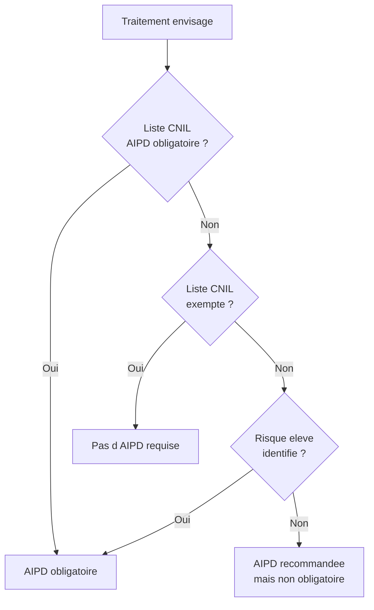
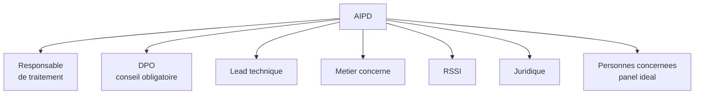
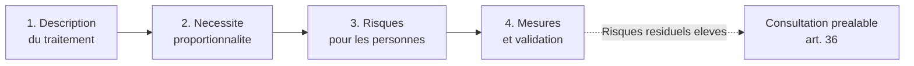

# L'analyse d'impact relative à la protection des données

## Introduction

Avez-vous déjà fait une étude d'impact environnemental avant de
lancer un grand projet de construction ? L'objectif n'est pas de
freiner le projet, mais de **comprendre ses conséquences** sur
l'environnement, d'identifier les risques, et de prévoir des
mesures pour les atténuer. Une route prévue peut traverser une
zone humide ; on cherche alors un tracé alternatif, ou des
mesures compensatoires. L'analyse d'impact relative à la protection
des données (AIPD), aussi appelée DPIA en anglais, suit la même
logique : anticiper les conséquences d'un traitement sur les
personnes concernées, et adapter le projet en amont.

L'AIPD est probablement le document le plus structurant de la
conformité RGPD. C'est aussi le plus craint des développeurs et
des chefs de projet, qui imaginent une procédure lourde et
formelle. La réalité est plus nuancée : une AIPD bien menée est
avant tout un **outil de réflexion collective** qui mobilise
techniciens, juristes et opérationnels. Elle force à prendre du
recul, à confronter les points de vue, à mesurer les risques.
Cette partie va démystifier l'AIPD et vous donner les clés pour
en mener une, du début à la fin.

### Pourquoi et quand faire une AIPD ?

Connaissez-vous la différence entre prudence et excès de prudence ?
Le RGPD a tranché : on ne fait pas une AIPD pour chaque traitement
(ce serait disproportionné), mais pour ceux qui présentent un
**risque élevé** pour les droits et libertés des personnes.
L'article 35 énumère les critères qui rendent l'AIPD obligatoire.

L'article 35.1 prévoit que, lorsqu'un type de traitement, en
particulier par le recours à de nouvelles technologies, est
susceptible d'engendrer un risque élevé pour les droits et libertés
des personnes physiques, le responsable du traitement effectue,
avant le traitement, une analyse de l'impact des opérations de
traitement envisagées sur la protection des données à caractère
personnel.

L'article 35.3 cite trois cas où l'AIPD est **explicitement
obligatoire** :

1. **Évaluation systématique et approfondie d'aspects personnels**
   (profilage), produisant des effets juridiques ou affectant
   significativement les personnes (notation crédit, recrutement
   automatisé, ciblage publicitaire avancé) ;
2. **Traitement à grande échelle de données sensibles** (article 9)
   ou de données pénales (article 10) (dossiers médicaux,
   plateformes d'opinions politiques, casiers judiciaires) ;
3. **Surveillance systématique à grande échelle d'une zone
   accessible au public** (vidéosurveillance étendue, reconnaissance
   faciale en lieu public).

La **CNIL a publié une liste complémentaire** de traitements pour
lesquels l'AIPD est obligatoire en France :

- traitements à des fins de surveillance des salariés ;
- traitements concernant des personnes vulnérables (mineurs,
  personnes âgées, malades, demandeurs d'asile) ;
- traitements de données biométriques aux fins d'identification ;
- traitements génétiques ;
- traitements de localisation précise à grande échelle ;
- traitements innovants utilisant des technologies nouvelles
  (IA, IoT, blockchain).

À l'inverse, la CNIL a aussi publié une **liste de traitements
exemptés** d'AIPD (gestion du personnel pour les TPE/PME,
traitements comptables, etc.). En cas de doute, l'analyse
préliminaire des risques permet de trancher.

**Critères d'évaluation du risque élevé** (lignes directrices
WP248 du G29, repris par la CNIL) :

- **profilage** ou évaluation, particulièrement automatisé ;
- **décision automatisée** avec effet juridique ou significatif ;
- **surveillance systématique** ;
- **données sensibles** ou hautement personnelles ;
- **traitement à grande échelle** ;
- **croisement de données** ;
- **personnes vulnérables** ;
- **usage innovant** ou nouvelles solutions technologiques ;
- **traitement empêchant l'exercice d'un droit** ou l'utilisation
  d'un service.

Au moins **deux critères** combinés indiquent généralement la
nécessité d'une AIPD.

### Qui fait l'AIPD et qui valide ?

Avez-vous déjà été dans une réunion où chacun pensait que c'était à
quelqu'un d'autre de prendre une décision ? L'AIPD a ses acteurs
définis, ce qui évite ce flou. L'article 35.2 prévoit que le
responsable de traitement demande conseil au DPO lorsqu'il
effectue une AIPD.

**Acteurs et rôles** :

- **Responsable de traitement** : décide de mener l'AIPD, en porte
  la responsabilité juridique, valide les conclusions.
- **DPO** : conseille obligatoirement, supervise la méthodologie,
  valide la qualité du travail.
- **Lead technique** : décrit le traitement dans le détail (flux
  de données, architectures, mesures techniques).
- **Métier concerné** : décrit les besoins, les finalités, les
  utilisations attendues.
- **RSSI** : conseille sur les mesures de sécurité.
- **Juridique** : valide les bases légales, les contrats, les
  formulations.
- **Représentants des personnes concernées** (idéal) : leur
  point de vue est demandé, le cas échéant via une consultation
  ou un panel.

L'AIPD est un **travail collectif** : aucune personne seule ne la
mène. Le DPO orchestre, mais ne se substitue pas aux experts
métiers et techniques.

### La méthodologie CNIL en quatre étapes

Avez-vous déjà voulu faire un voyage compliqué sans étape, en y
allant directement ? Vous risquez l'épuisement et les détours
inutiles. La CNIL a publié une méthodologie structurée en quatre
étapes, qui décompose le travail et clarifie chaque livrable.

**Étape 1 - Description du traitement**

Vous décrivez factuellement le traitement, comme si vous
l'expliquiez à quelqu'un qui ne le connaît pas. Cette étape
mobilise principalement le métier et la technique.

Contenu attendu :

- **finalités** principales et secondaires ;
- **enjeux** du traitement pour l'organisation ;
- **données** traitées (catégories, exemples, volume) ;
- **flux de données** : qui les collecte, qui les traite, qui les
  reçoit, où elles sont stockées ;
- **acteurs** impliqués (en interne et en externe) ;
- **support** : infrastructures matérielles et logicielles ;
- **durées de conservation** envisagées ;
- **base légale** retenue ;
- **mesures déjà prévues** : sécurité technique et organisationnelle,
  informations aux personnes, droits exerçables.

**Étape 2 - Étude de la nécessité et de la proportionnalité**

Vous évaluez si le traitement est juridiquement défendable et
proportionné à son but. Cette étape mobilise principalement le
juridique et le DPO.

Contenu attendu :

- **finalités** : explicites, légitimes, déterminées ;
- **base légale** : choix motivé et adapté ;
- **minimisation** : les données collectées sont-elles strictement
  nécessaires ?
- **qualité** : les données collectées sont-elles exactes et à
  jour ?
- **durées** : justifiées et proportionnées ?
- **information** des personnes : claire et complète ?
- **consentement** (si base légale retenue) : libre, spécifique,
  éclairé, univoque ?
- **droits des personnes** : tous exerçables ?
- **sous-traitants** : encadrés contractuellement ?
- **transferts** : hors UE le cas échéant, conformes ?

**Étape 3 - Étude des risques pour les personnes**

Vous évaluez les risques que le traitement fait peser sur les
personnes concernées. Cette étape mobilise toutes les compétences.

Trois grands risques sont évalués :

- **accès illégitime** aux données : intrusion, fuite, vol ;
- **modification non désirée** des données : altération
  malveillante ou accidentelle ;
- **disparition** des données : destruction, perte, indisponibilité.

Pour chaque risque, on évalue :

- la **vraisemblance** : faible, modérée, élevée, maximale ;
- la **gravité** : faible, modérée, élevée, maximale ;
- les **mesures existantes** ou prévues pour réduire le risque ;
- le **risque résiduel** après mesures.

**Étape 4 - Mesures et validation**

Vous identifiez les **mesures supplémentaires** à mettre en place
pour ramener les risques à un niveau acceptable. Cette étape se
conclut par une **validation** du responsable de traitement, sur
conseil du DPO.

Si les risques résiduels restent élevés malgré toutes les
mesures envisageables, l'article 36 impose une **consultation
préalable** de la CNIL.

### L'outil PIA de la CNIL

Avez-vous déjà préféré un outil dédié à un tableur générique ? La
CNIL met à disposition gratuitement un **logiciel PIA** (Privacy
Impact Assessment), qui guide la rédaction de l'AIPD pas à pas.
C'est un excellent point de départ, particulièrement pour les
PME et les développeurs qui débutent.

Caractéristiques de l'outil PIA :

- **Gratuit et open source** ;
- Disponible en **plusieurs langues** ;
- Utilisable en **local** (pas d'envoi de données sur des serveurs
  externes) ;
- Suit la **méthodologie officielle CNIL** ;
- Génère un **rapport complet** au format PDF ;
- Inclut une **base de connaissances** avec exemples ;
- Permet de partager une AIPD entre plusieurs intervenants.

Pour le télécharger : `cnil.fr/fr/outil-pia-telechargez-et-installez-le-logiciel-de-la-cnil`.

Des alternatives existent : OneTrust DPIA, Dastra, Witik, et
d'autres outils intégrés aux suites GRC. Mais l'outil CNIL reste
la référence en France et le point de comparaison à connaître.

#### Exemple pratique {id="exemple-pratique-aipd-1"}

Voici une AIPD synthétique pour un projet réaliste : une
**application de partage de covoiturage** entre salariés d'une
même entreprise.

**Étape 1 - Description du traitement**

- *Finalité* : faciliter le covoiturage domicile-travail entre
  salariés volontaires d'une même entreprise.
- *Enjeux* : RSE, réduction empreinte carbone, lien social.
- *Données* : identité (nom, prénom, email pro), adresse
  domicile (avec consentement explicite), trajets habituels,
  horaires, photo de profil (facultative), évaluations entre
  utilisateurs.
- *Flux* : saisie par l'utilisateur, stockage en BDD interne,
  recherche par les autres salariés, communication par messagerie
  intégrée. Pas de partage externe.
- *Acteurs* : salariés volontaires (utilisateurs), équipe RH
  (administration), prestataire technique (sous-traitant
  hébergement).
- *Support* : application web et mobile, hébergée chez OVH France.
- *Durée de conservation* : pendant la vie du compte ; suppression
  à la sortie du salarié des effectifs ou sur demande.
- *Base légale* : consentement (article 6.1.a), avec opt-in
  explicite à la création de compte.
- *Mesures déjà prévues* : HTTPS, authentification SSO d'entreprise,
  séparation des adresses domicile (vault), pas de localisation
  temps réel.

**Étape 2 - Nécessité et proportionnalité**

- *Finalité légitime* : oui, démarche RSE encouragée par les
  pouvoirs publics.
- *Base légale appropriée* : consentement adapté pour un service
  facultatif fourni au salarié.
- *Minimisation* : adresse domicile nécessaire pour proposer des
  trajets pertinents, mais protégée. Photo facultative.
- *Information* : politique de confidentialité dédiée + mention
  dans la charte interne.
- *Droits* : tous exerçables via l'application + procédure
  classique.
- *Sous-traitants* : OVH (DPA signé), aucun autre.
- *Transferts* : aucun hors UE.

Conclusion : la nécessité et la proportionnalité sont satisfaites.

**Étape 3 - Risques pour les personnes**

| Risque | Vraisemblance | Gravité | Mesures existantes |
|--------|----------------|---------|---------------------|
| Accès illégitime à l'adresse domicile | Modérée | Élevée | Vault, chiffrement, journalisation |
| Profilage par les pairs (déductions sur le mode de vie) | Modérée | Modérée | Granularité de partage, opt-in |
| Harcèlement entre utilisateurs | Faible | Élevée | Système de signalement, modération |
| Perte des données | Faible | Modérée | Sauvegardes, redondance |
| Modification des évaluations par malveillance | Faible | Modérée | RBAC, journalisation |

**Étape 4 - Mesures supplémentaires et validation**

Mesures retenues en plus :

- floutage initial des adresses domicile : affichage par
  quartier, l'adresse exacte n'est partagée qu'avec l'utilisateur
  matché et après acceptation mutuelle ;
- mode pseudo : l'utilisateur peut choisir un pseudo public et
  ne révéler son identité réelle qu'aux personnes acceptées ;
- bouton « bloquer cet utilisateur » et procédure de modération
  par RH ;
- déconnexion automatique après 24 heures d'inactivité ;
- supervision périodique des évaluations entre utilisateurs.

**Conclusion** : AIPD validée par le DPO. Risques résiduels
acceptables. Réévaluation prévue à 12 mois.

> **Note** : cette synthèse est volontairement condensée. Une
> vraie AIPD fait typiquement 15 à 40 pages, avec des annexes
> techniques (schémas de flux, matrice détaillée des risques,
> liste exhaustive des mesures, plan d'action).

#### Exercice 1

Pour chacun des projets suivants, indiquez si une AIPD est
obligatoire, recommandée, ou non requise. Justifiez en mobilisant
les critères de l'article 35 et de la liste CNIL.

a) Site vitrine d'une PME avec formulaire de contact (nom,
email, message libre).
b) Application interne de notation des performances des
commerciaux par leur manager.
c) Plateforme de mise en relation médecin-patient pour
téléconsultations.
d) Outil SaaS de RH pour une ETI : congés, paie, évaluations
annuelles.
e) Application mobile de jeu pour enfants de 8 à 12 ans avec
chat interne entre joueurs.
f) Site marchand vendant des chaussures de sport, paiement par
carte bancaire.

##### Correction exercice 1 {collapsible="true"}

**a) Site vitrine PME avec formulaire**

- *AIPD* : non requise.
- *Justification* : pas de profilage, pas de données sensibles,
  pas de volume significatif, pas de surveillance. Le traitement
  est très classique et à faible risque.

**b) Application interne de notation des commerciaux**

- *AIPD* : recommandée, voire obligatoire.
- *Justification* : il s'agit d'**évaluation systématique de
  salariés** (critère de la liste CNIL), avec impact direct sur
  leur carrière (primes, promotions). Mêmes si les volumes sont
  modestes, la nature du traitement justifie une AIPD pour
  protéger les droits des salariés.

**c) Plateforme téléconsultations**

- *AIPD* : obligatoire.
- *Justification* : cumul de plusieurs critères : données de
  santé (article 9), grande échelle (vocation à servir un large
  public), potentiel profilage médical. Cas typique d'AIPD
  obligatoire.

**d) SaaS RH pour ETI**

- *AIPD* : obligatoire.
- *Justification* : traitement à grande échelle de données RH,
  surveillance potentielle des salariés (évaluations), parfois
  données médicales (arrêts maladie, médecine du travail). La
  CNIL recommande l'AIPD pour les SIRH dépassant une certaine
  taille.

**e) Jeu pour enfants 8-12 ans avec chat**

- *AIPD* : obligatoire.
- *Justification* : **mineurs** (personnes vulnérables, critère
  CNIL), potentiel **profilage** marketing, **surveillance** des
  interactions, risque de **cyberharcèlement**. Cumul de
  critères suffisant.

**f) Site marchand de chaussures avec CB**

- *AIPD* : non requise dans le cas standard.
- *Justification* : traitement classique de commerce
  électronique, paiement tokenisé via un PSP, pas de profilage
  marketing avancé (si simple historique de commandes). Mais si
  recommandations IA poussées, ciblage publicitaire externe,
  ou intégration de scoring crédit : réévaluer.

### Maintien et réévaluation

Avez-vous déjà eu un compte bancaire que vous n'avez pas surveillé
pendant un an, et qui se révèle complètement décalé de vos vraies
habitudes ? Les AIPD subissent le même phénomène : elles
deviennent obsolètes avec le temps si elles ne sont pas
réévaluées. Le RGPD prévoit (article 35.11) une **réévaluation
nécessaire** quand le risque évolue.

Occasions de réévaluation :

- **modification significative** du traitement (nouvelle finalité,
  nouvelle catégorie de données, nouveau sous-traitant
  majeur) ;
- **évolution technique** importante (intégration d'IA,
  changement d'architecture, ajout de fonctionnalités
  sensibles) ;
- **incident** ayant impacté la sécurité ;
- **évolution juridique** (nouvelle jurisprudence, nouvelle
  position CNIL, nouveau règlement) ;
- **revue périodique** : 1 à 3 ans selon le contexte.

Une AIPD réévaluée n'est pas une AIPD totalement refaite. On
**réutilise** la description initiale, on **actualise** les
sections impactées, on **documente** les changements. Cette
approche progressive est soutenable dans le temps.

## Exercice final

Vous êtes développeur principal chez *PoliticHub*, plateforme
française de débat politique en ligne. La plateforme permet aux
utilisateurs de discuter de sujets politiques, de signer des
pétitions, et d'évaluer leur affinité avec des partis et des
candidats via un système de questions-réponses. Une nouvelle
fonctionnalité est envisagée : un **moteur de recommandation IA**
qui suggérera aux utilisateurs des contenus, des pétitions, et
des candidats correspondant à leur profil politique déduit de
leur activité sur la plateforme. La direction vous demande de
conduire l'AIPD préliminaire.

Produisez une **AIPD complète et structurée** suivant la
méthodologie CNIL en quatre étapes :

1. Description détaillée du traitement.
2. Analyse de la nécessité et de la proportionnalité.
3. Étude des risques pour les personnes.
4. Mesures retenues et conclusion (avec décision sur la
   nécessité d'une consultation préalable de la CNIL).

### Correction exercice final {collapsible="true"}

**AIPD - Moteur de recommandation IA politique sur PoliticHub**

**Avertissement** : ce projet présente d'emblée un risque élevé
manifeste. L'AIPD doit donc être conduite avec la plus grande
rigueur. Le DPO doit être pleinement impliqué dès le démarrage.

**Étape 1 - Description du traitement**

*Finalités* :

- recommander aux utilisateurs des contenus, pétitions et
  candidats susceptibles de les intéresser ;
- accroître l'engagement et la fidélisation ;
- aider les utilisateurs à se positionner politiquement.

*Enjeux pour PoliticHub* :

- amélioration de l'expérience utilisateur ;
- accroissement des sessions et du temps passé ;
- monétisation possible (sans publicité ciblée sur les opinions,
  voir étape 2).

*Données traitées* :

- identité (pseudo, éventuellement nom selon configuration) ;
- réponses aux questionnaires politiques ;
- contenus consultés, partagés, commentés ;
- pétitions signées ;
- évaluations exprimées (boutons « d'accord », « pas d'accord ») ;
- localisation grossière (par code postal, optionnelle) ;
- âge déclaré (tranche).

**Ces données relèvent de l'article 9 (opinions politiques) et
constituent des données sensibles au sens strict.**

*Flux de données* :

- saisie par l'utilisateur (consentement explicite à chaque
  étape) ;
- stockage dans la BDD applicative (PostgreSQL chiffré, hébergement
  OVH France) ;
- envoi à un moteur IA pour scoring (à choisir : Mistral AI
  France, ou modèle interne entraîné, à étudier en étape 4) ;
- restitution des recommandations dans l'interface utilisateur.

*Acteurs* :

- responsable de traitement : PoliticHub SAS ;
- utilisateurs : grand public majeur français ;
- DPO : externe, mandaté.

*Volume estimé* : 200 000 utilisateurs actifs à 12 mois.

*Base légale envisagée* : consentement explicite (article 9.2.a)
pour l'utilisation des opinions politiques à des fins de
recommandation. L'utilisateur peut refuser la fonctionnalité tout
en utilisant le reste du service.

**Étape 2 - Nécessité et proportionnalité**

*Finalité légitime* : oui dans son principe (aider à se
positionner politiquement est légal et utile en démocratie),
mais le **profilage politique** est exceptionnellement sensible.

*Base légale* : le consentement explicite est l'unique base
légale envisageable. Doit être :

- **éclairé** : explication claire de ce qui sera traité et de
  ce qu'on en déduira ;
- **spécifique** : opt-in distinct de l'inscription au service ;
- **libre** : possibilité d'utiliser le reste du service sans
  cette fonctionnalité ;
- **univoque** : action positive de l'utilisateur, jamais case
  pré-cochée ;
- **révocable** : retrait facile à tout moment.

*Minimisation* :

- ne pas collecter de données identifiantes pour le profilage IA
  (pseudonymisation) ;
- ne pas conserver l'historique brut au-delà de 12 mois (analyse
  glissante) ;
- ne pas chercher à identifier des opinions au-delà de ce que
  l'utilisateur a volontairement exprimé.

*Information des personnes* :

- politique de confidentialité dédiée au moteur IA ;
- explication accessible de la logique de recommandation ;
- mention claire que le profilage politique est utilisé.

*Droits exerçables* :

- droit d'opposition immédiat (révocation du consentement) ;
- droit d'accès aux données utilisées par l'IA ;
- droit d'effacement complet ;
- droit d'opposition à la décision automatisée (article 22) à
  garantir : possibilité de recevoir des recommandations
  « éditoriales » humaines en alternative.

*Sous-traitants* : si Mistral AI ou autre est retenu, DPA
spécifique avec clauses sur les données politiques. Pas de
transferts hors UE.

**Conclusion étape 2** : le traitement peut être proportionné à
condition que toutes les conditions ci-dessus soient strictement
respectées. La rigueur du consentement et de l'information est
absolument cruciale.

**Étape 3 - Risques pour les personnes**

| Risque | Vraisemblance | Gravité | Justification |
|--------|----------------|---------|---------------|
| Fuite d'opinions politiques | Modérée | Maximale | Conséquences possibles : discrimination, ostracisme, voire violences politiques selon contexte |
| Réutilisation à des fins de ciblage publicitaire | Faible | Élevée | Risque de manipulation politique |
| Influence ou manipulation par l'algorithme | Élevée | Élevée | Bulles de filtre, polarisation, radicalisation |
| Modification de l'évaluation par un tiers | Faible | Modérée | Atteinte à l'image numérique |
| Perte de l'historique | Faible | Faible | Pas d'impact majeur |

Trois risques principaux à approfondir :

**Risque 1 - Fuite d'opinions politiques** :

- une fuite serait dramatique (article 9, données pénales par
  proximité) ;
- conséquences : discrimination à l'emploi, dans la sphère
  privée, voire violences ;
- vraisemblance : modérée (toute base est attaquable) ;
- gravité : maximale.

**Risque 2 - Manipulation politique** :

- le profilage permettrait potentiellement à des annonceurs
  politiques de cibler les utilisateurs ;
- même sans fuite directe, le moteur IA pourrait fausser le débat
  démocratique en enfermant les utilisateurs dans des bulles ;
- vraisemblance : élevée si la fonctionnalité n'est pas
  rigoureusement encadrée ;
- gravité : élevée.

**Risque 3 - Bulles de filtre et polarisation** :

- la recommandation tend à amplifier les positions existantes ;
- effet sociétal négatif documenté (radicalisation,
  désinformation) ;
- vraisemblance : élevée ;
- gravité : élevée.

**Étape 4 - Mesures retenues**

*Mesures techniques* :

- **chiffrement applicatif** des données d'opinions politiques
  (AES-256-GCM via KMS) ;
- **pseudonymisation systématique** avant envoi au moteur IA :
  aucune donnée identifiante transmise ;
- **séparation des bases** : identités d'un côté (vault),
  opinions de l'autre (chiffrées) ;
- **journalisation complète** de tous les accès aux données
  politiques ;
- **MFA obligatoire** pour tout accès administrateur ;
- **monitoring de sécurité** continu ;
- **conservation limitée** : 12 mois glissants pour les
  données d'opinion, 6 mois pour les recommandations.

*Mesures algorithmiques* :

- **diversité forcée** dans les recommandations : minimum 30 % de
  contenus en dehors du profil identifié, pour éviter l'effet
  bulle ;
- **explicabilité** : chaque recommandation est accompagnée d'une
  explication courte (« recommandé parce que vous avez signé X
  pétitions sur le sujet Y ») ;
- **désactivation facile** : bouton « pourquoi cette
  recommandation » + bouton « moins de contenus comme celui-ci ».

*Mesures organisationnelles* :

- **interdiction stricte** de toute monétisation publicitaire
  basée sur les opinions politiques (politique commerciale
  claire) ;
- **revue éthique trimestrielle** par un comité externe
  pluraliste ;
- **rapport annuel public** de transparence ;
- **engagement public** sur l'absence de ciblage politique en
  campagne électorale.

*Mesures contractuelles* :

- **DPA renforcé** avec le fournisseur IA si externe ;
- **interdiction contractuelle** de toute réutilisation des
  données par le fournisseur IA pour d'autres clients ou pour
  l'entraînement de modèles tiers.

*Mesures à destination des personnes* :

- **politique de confidentialité dédiée** à la fonctionnalité ;
- **didacticiel** lors de l'activation expliquant le fonctionnement
  et les risques ;
- **interface de gestion** des opinions politiques accessible à
  tout moment ;
- **export et effacement** instantanés via interface.

**Risques résiduels** :

- *Risque 1* (fuite) : réduit grâce au chiffrement, à la
  séparation, et à la pseudonymisation. Vraisemblance résiduelle
  faible, gravité élevée si malgré tout fuite. Acceptable.
- *Risque 2* (manipulation) : largement réduit par
  l'interdiction commerciale. Vraisemblance faible, gravité
  modérée. Acceptable.
- *Risque 3* (polarisation) : réduit par la diversité forcée et
  l'explicabilité. Vraisemblance modérée, gravité modérée.
  Acceptable, à surveiller.

**Décision** :

Compte tenu de la sensibilité du traitement (opinions politiques,
grande échelle, profilage), et bien que les risques résiduels
soient ramenés à un niveau acceptable, la prudence recommande
une **consultation préalable de la CNIL au titre de l'article 36**
avant déploiement à grande échelle. Cette démarche permettra
d'obtenir les remarques et conseils de l'autorité, et de sécuriser
juridiquement le projet.

**Calendrier proposé** :

- Mois 1-2 : finalisation de l'AIPD, validation interne ;
- Mois 3 : consultation préalable CNIL (délai légal 8 semaines,
  prolongeable de 6) ;
- Mois 4-5 : prise en compte des recommandations CNIL ;
- Mois 6 : déploiement progressif (panel limité d'utilisateurs
  test) ;
- Mois 7+ : déploiement large avec monitoring renforcé ;
- À 6 mois et 12 mois : réévaluation de l'AIPD.

Cette correction démontre une maîtrise mature de l'exercice. Elle
illustre que l'AIPD n'est pas une formalité, mais un véritable
outil de réflexion et de structuration des projets sensibles.
Dans certains cas, elle peut conduire à **renoncer** ou à
**reformater profondément** un projet : c'est sa vraie utilité.

## Conclusion de la partie

Vous savez désormais conduire une AIPD selon la méthodologie CNIL
en quatre étapes. Vous comprenez quand elle est obligatoire, quels
sont les acteurs impliqués, et comment articuler la réflexion
technique, juridique et organisationnelle. Vous avez aussi vu que
l'AIPD est un outil de **décision** : elle peut amener à modifier,
à reporter, voire à renoncer à un projet.

Retenez ces principes pratiques :

- une AIPD est obligatoire pour les traitements à risque élevé,
  et la CNIL publie des listes pour aider à la décision ;
- la **méthodologie en quatre étapes** structure la réflexion et
  garantit la complétude ;
- l'**outil PIA de la CNIL** est gratuit, open source, et
  parfaitement adapté pour démarrer ;
- l'AIPD est un **travail collectif** orchestré par le DPO mais
  alimenté par tous les experts (techniques, métier, juridique) ;
- la **réévaluation périodique** est essentielle pour éviter
  l'obsolescence.

La partie suivante abordera les **documents externes** de
conformité : politique de confidentialité, DPA avec les
sous-traitants, et gestion des cookies.
