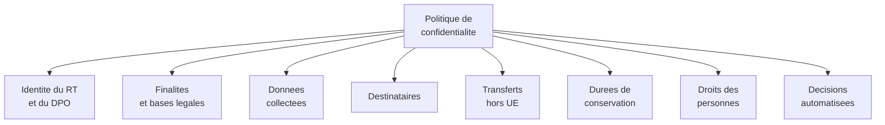
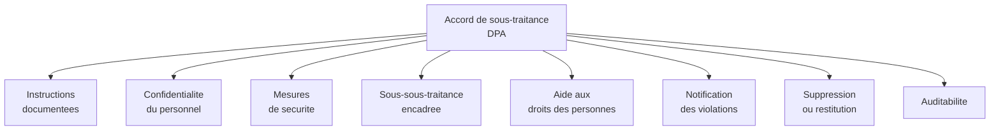
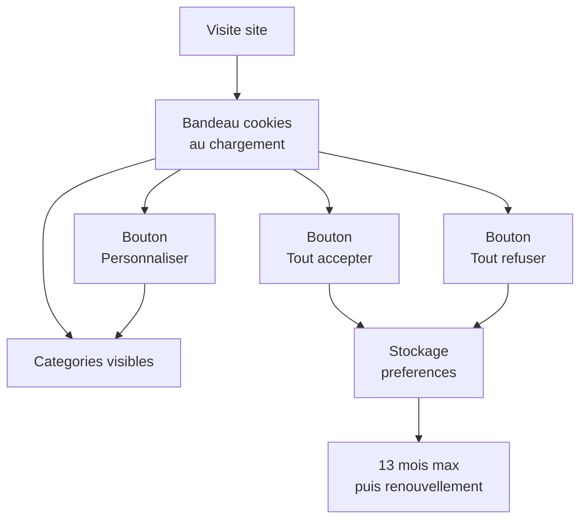
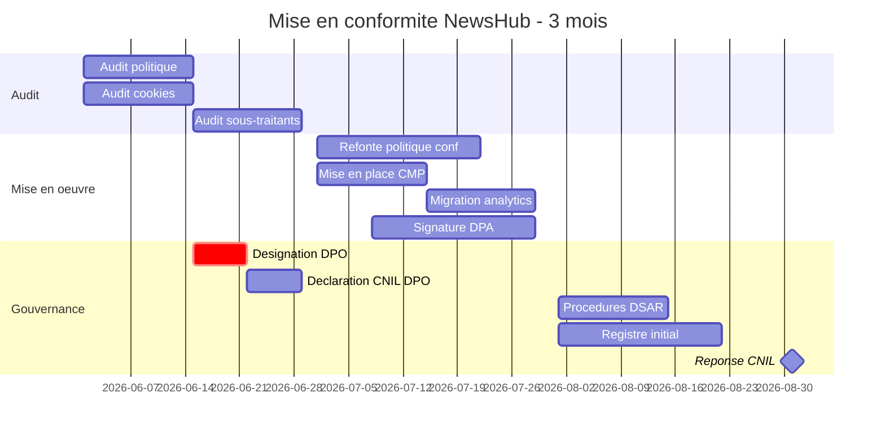

# Politique de confidentialité, DPA et cookies

## Introduction

Avez-vous déjà acheté un produit dont l'emballage promettait monts
et merveilles, et qui n'avait rien à voir avec son contenu ? La
politique de confidentialité d'un site, c'est l'emballage qui
décrit la promesse faite aux utilisateurs. Si elle est claire,
honnête, accessible, elle construit la confiance. Si elle est
floue, juridique, illisible, elle érode la relation et expose
l'entreprise. Le RGPD a transformé l'exercice de la politique de
confidentialité en obligation juridique stricte, avec des
exigences précises sur le contenu et la forme.

Cette partie aborde les **documents externes** de conformité,
ceux qui sont visibles par les personnes concernées et par les
partenaires : la politique de confidentialité et les mentions
d'information (articles 13 et 14), les accords de sous-traitance
(DPA, article 28), et l'épineux sujet des cookies (encadré par la
directive ePrivacy et la loi française). Ces documents sont la
face visible de votre démarche de conformité. Leur qualité reflète
votre maturité globale, et leur défaut expose à des sanctions
spécifiques fréquemment prononcées par la CNIL.

### La politique de confidentialité

Connaissez-vous ces longues pages de petits caractères auxquelles
personne ne consent vraiment, mais sur lesquelles tout le monde
clique ? La politique de confidentialité est devenue un genre
littéraire à part entière, souvent caricatural. Le RGPD a voulu
casser ce modèle en imposant des exigences de **clarté**, de
**transparence**, et de **lisibilité**.

L'article 12 prévoit que les informations destinées aux personnes
concernées doivent être fournies « d'une façon concise,
transparente, compréhensible et aisément accessible, en des
termes clairs et simples, en particulier pour toute information
destinée spécifiquement à un enfant ».

Les articles 13 (collecte directe) et 14 (collecte indirecte)
listent les informations à fournir aux personnes.

**Informations obligatoires (article 13)** :

- **identité et coordonnées** du responsable de traitement ;
- **coordonnées du DPO**, le cas échéant ;
- **finalités** du traitement et **base légale** ;
- **intérêts légitimes** poursuivis, si la base légale est
  l'intérêt légitime ;
- **destinataires** ou catégories de destinataires des données ;
- **transferts hors UE** : pays concerné et garanties
  appliquées ;
- **durée de conservation** ou critères pour la déterminer ;
- **droits des personnes** : accès, rectification, effacement,
  limitation, opposition, portabilité ;
- **droit de retrait du consentement** (si base légale =
  consentement) ;
- **droit d'introduire une réclamation** auprès d'une autorité
  de contrôle (CNIL en France) ;
- **caractère obligatoire ou facultatif** de la fourniture des
  données ;
- **existence d'une prise de décision automatisée**, y compris
  un profilage, et informations utiles sur la logique sous-jacente
  et les conséquences.

L'article 14 ajoute, pour les collectes indirectes, l'obligation
d'indiquer la **source** des données.



**Critères de qualité d'une bonne politique** :

- **claire et accessible** : rédigée pour le public visé (grand
  public, enfants, professionnels), sans jargon juridique inutile ;
- **structurée** : table des matières, sections distinctes,
  navigation facile ;
- **visuelle** : icônes, tableaux, encadrés pour aérer ;
- **complète** : couvrant tous les traitements visibles par
  l'utilisateur ;
- **honnête** : reflétant fidèlement la réalité, pas une version
  édulcorée ;
- **versionnée** : avec date de mise à jour visible et historique
  accessible ;
- **multilingue** si le public le justifie.

#### Exemple pratique {id="exemple-pratique-pc-1"}

Voici un plan-type pour structurer une politique de confidentialité
moderne :

```markdown
# Politique de confidentialité de [Nom du service]

**Date de la dernière mise à jour :** [JJ/MM/AAAA]
**Version :** 2.3 ([lien vers historique])

## En résumé (1 minute de lecture)

[Synthèse en 5 à 7 puces des points clés : qui nous sommes, ce
qu'on collecte, à quoi ça sert, qui y a accès, vos droits]

## 1. Qui sommes-nous ?

[Identité du responsable de traitement, adresse, coordonnées
du DPO]

## 2. Quelles données collectons-nous et pourquoi ?

[Tableau présentant pour chaque finalité : les données
concernées, la base légale, la durée]

| Finalité | Données | Base légale | Durée |
|----------|---------|-------------|-------|
| Création de compte | Email, mot de passe | Contrat | Vie compte |
| Newsletter | Email | Consentement | Jusqu'au retrait |
| Mesure d'audience | Cookies analytics | Consentement | 13 mois |

## 3. Qui a accès à vos données ?

[Liste des destinataires internes et des sous-traitants, avec
leur rôle et leur localisation]

## 4. Transferts hors Union européenne

[Détail des transferts éventuels, garanties appliquées, pays
concerné]

## 5. Vos droits

[Description claire des droits exerçables et procédure pour en
faire usage : email à dpo@..., formulaire en ligne, délai de
réponse]

## 6. Cookies et traceurs

[Renvoi à la politique cookies dédiée + lien vers le module de
gestion des préférences]

## 7. Sécurité

[Description générale des mesures techniques et organisationnelles]

## 8. Mineurs

[Position spécifique sur les mineurs, si applicable]

## 9. Modifications

[Mécanisme de notification en cas de modification substantielle]

## 10. Comment nous contacter ?

[Email DPO, adresse postale, formulaire dédié]

## Historique des versions

[Lien vers les versions précédentes]
```

> **Note** : la politique de confidentialité ne doit pas
> remplacer les **mentions d'information contextuelles**
> (article 13), qui doivent être présentes au moment de la
> collecte (lors de l'inscription, lors de l'envoi d'un
> formulaire). Une politique générale ne dispense pas de ces
> mentions ciblées.

#### Les mentions d'information contextuelles

À chaque collecte de données, une **mention d'information courte
et contextuelle** doit accompagner le formulaire. Elle peut être
plus concise que la politique générale, et renvoyer à celle-ci
pour les détails.

Exemple sous un formulaire d'inscription :

```markdown
Les informations recueillies vous concernant font l'objet d'un
traitement destiné à créer et gérer votre compte. Le destinataire
des données est [Nom du service]. La durée de conservation est
[durée]. Vous pouvez accéder, rectifier, effacer ou demander la
portabilité de vos données, vous opposer au traitement, et
introduire une réclamation auprès de la CNIL. Pour plus de
détails, consultez notre politique de confidentialité [lien].
```

Cette mention concise, présente au moment de la collecte, satisfait
l'obligation d'information préalable. La politique de
confidentialité complète reste accessible en parallèle.

#### Exercice 1

Vous travaillez chez *FitTrack*, application mobile française de
suivi sportif. La politique de confidentialité actuelle est
ancienne et présente plusieurs défauts identifiés :

- 30 pages au format PDF, sans table des matières ;
- rédigée en langage juridique formel ;
- ne mentionne pas le DPO ni la CNIL ;
- indique « les données peuvent être partagées avec nos
  partenaires » sans préciser lesquels ;
- aucune mention sur les transferts vers les États-Unis (alors
  que Google Analytics est utilisé) ;
- ne fait pas de distinction entre les différents traitements
  (compte, géolocalisation, partage social, etc.) ;
- jamais mise à jour depuis 3 ans.

Listez les manquements RGPD identifiés et proposez un plan de
refonte sur deux mois, avec actions concrètes et livrables.

##### Correction exercice 1 {collapsible="true"}

**Manquements RGPD identifiés**

1. **Manquement à l'article 12** : la politique n'est pas claire
   ni accessible (30 pages PDF, langage juridique). Les utilisateurs
   ne peuvent pas la comprendre.

2. **Manquement à l'article 13** :
   - pas de coordonnées du DPO mentionnées ;
   - destinataires des données non précisés (« nos partenaires »
     est insuffisant) ;
   - transferts hors UE non documentés alors qu'ils existent
     (Google Analytics) ;
   - pas de mention du droit d'introduire une réclamation auprès
     de la CNIL ;
   - durées de conservation absentes ou imprécises.

3. **Manquement à l'article 5.1.a (transparence)** : la
   politique ne reflète plus la réalité (jamais mise à jour) et
   n'est pas honnête sur les transferts.

4. **Manquement à l'article 5.2 (responsabilité)** : pas de
   versionnage, pas d'historique, pas de date de mise à jour
   visible.

**Plan de refonte sur deux mois**

*Semaines 1-2 - Cartographie et audit*

- Analyse complète du registre des traitements pour identifier
  toutes les finalités à couvrir ;
- Audit de l'ensemble des sous-traitants et de leur localisation ;
- Identification des transferts hors UE et de leur cadre
  juridique (DPF, CCT) ;
- Recensement des durées de conservation par catégorie.

*Semaines 3-4 - Rédaction*

- Rédaction d'une nouvelle politique structurée selon le
  plan-type (synthèse + sections dédiées) ;
- Vulgarisation du contenu juridique en langage accessible
  (relecture par une personne extérieure à l'équipe) ;
- Création des mentions d'information contextuelles pour chaque
  point de collecte ;
- Maquettage de l'interface web (en plus du PDF) avec navigation
  facilitée.

*Semaines 5-6 - Validation et conformité*

- Revue juridique par le DPO et idéalement par un cabinet
  d'avocats spécialisé ;
- Validation par la direction ;
- Création d'un système de versionnage et d'historique en ligne ;
- Implémentation des mentions d'information dans l'application.

*Semaines 7-8 - Communication et déploiement*

- Email à tous les utilisateurs annonçant la mise à jour, avec
  résumé des changements significatifs ;
- Bandeau dans l'application lors de la première connexion
  post-mise à jour ;
- Renouvellement éventuel du consentement pour les traitements
  basés sur le consentement (si la finalité a évolué) ;
- Documentation interne pour le support client.

*Livrables produits* :

- Politique de confidentialité version 3.0 (PDF + version web
  interactive) ;
- Mentions d'information courtes pour chaque point de collecte ;
- Page d'historique des versions ;
- Email type pour la communication ;
- Procédure de mise à jour pérenne.

*Bénéfices attendus* :

- conformité RGPD assurée ;
- confiance utilisateur renforcée ;
- diminution des sollicitations support liées à
  l'incompréhension ;
- réduction du risque de sanction CNIL.

### Les accords de sous-traitance (DPA)

Avez-vous déjà loué un appartement sans signer de bail ? Vous
imagineriez ne pas le faire. Pour la sous-traitance de données,
c'est pareil : signer un contrat de sous-traitance est une
obligation absolue. L'article 28 du RGPD encadre cette relation
par un **accord écrit obligatoire** : le DPA (Data Processing
Agreement, ou accord de sous-traitance).

L'article 28.3 énumère les **clauses obligatoires** d'un DPA. Le
contrat doit prévoir notamment que le sous-traitant :

1. ne traite les données que sur **instruction documentée** du
   responsable, y compris en ce qui concerne les transferts hors
   UE ;
2. veille à ce que les personnes autorisées à traiter les
   données s'engagent à respecter la **confidentialité** ;
3. prend toutes les **mesures de sécurité** requises par
   l'article 32 ;
4. respecte les conditions pour **recruter un autre sous-traitant**
   (sous-sous-traitance) ;
5. aide le responsable à respecter les **droits des personnes** ;
6. aide le responsable à respecter ses obligations en matière de
   **sécurité, de notification de violations, d'AIPD** ;
7. supprime ou restitue les données à la **fin du contrat** ;
8. met à disposition toutes les **informations nécessaires** pour
   démontrer la conformité, et permet la réalisation **d'audits**.



**Distinguer DPA et CCT** : le DPA encadre la relation responsable-
sous-traitant au sens du RGPD. Les Clauses Contractuelles Types
(CCT, ou SCC en anglais) encadrent les transferts hors UE. Quand
un transfert hors UE existe, les CCT sont **incorporées** au DPA,
elles ne le remplacent pas.

**Modèles de DPA** :

- la **CNIL** propose des modèles gratuits sur son site, adaptés
  aux relations courantes ;
- la **Commission européenne** a publié des modèles types de DPA
  en juin 2021 ;
- de nombreux **éditeurs de SaaS** mettent leur propre DPA à
  disposition (à examiner critiquement avant signature).

#### Exemple pratique {id="exemple-pratique-dpa-1"}

Voici un plan-type d'un DPA opérationnel :

```markdown
# Accord de sous-traitance (DPA)

## Entre

**Le Responsable de traitement** : [Nom, adresse, représenté par]
**Le Sous-traitant** : [Nom, adresse, représenté par]

## Article 1 - Objet

Le présent accord a pour objet d'encadrer le traitement de
données personnelles confié au Sous-traitant dans le cadre du
contrat principal du [date], et conformément au RGPD.

## Article 2 - Description du traitement

| Élément | Description |
|---------|-------------|
| Nature | [Stockage, hébergement, traitement applicatif...] |
| Finalité | [Pour quel objectif] |
| Durée | [Durée du contrat principal + restitution] |
| Type de données | [Catégories : identité, contacts, paiement...] |
| Catégories de personnes | [Clients, salariés, prospects...] |

## Article 3 - Obligations du Sous-traitant

Le Sous-traitant s'engage à :

3.1. Traiter les données **uniquement sur instruction documentée**
du Responsable de traitement.

3.2. Garantir la **confidentialité** des personnes autorisées.

3.3. Mettre en œuvre des **mesures techniques et organisationnelles
appropriées** (cf. annexe 1) conformément à l'article 32 RGPD.

3.4. Respecter les conditions pour recruter un autre sous-traitant
(cf. article 4).

3.5. Aider le Responsable à répondre aux **demandes d'exercice des
droits** des personnes concernées (article 12 à 23 RGPD).

3.6. Aider le Responsable à respecter ses obligations de
**sécurité (art. 32)**, **notification des violations (art. 33-34)**,
**AIPD (art. 35)** et **consultation préalable (art. 36)**.

3.7. À la fin du contrat, **supprimer ou restituer** toutes les
données personnelles, selon le choix du Responsable.

3.8. Mettre à disposition toutes les **informations nécessaires**
pour démontrer la conformité, et se soumettre à des audits (cf.
article 8).

## Article 4 - Sous-sous-traitance

4.1. Le Sous-traitant peut recourir à des sous-sous-traitants
listés en annexe 2.

4.2. Toute modification de cette liste fait l'objet d'une
information préalable de 30 jours, et le Responsable peut s'y
opposer pour motif légitime.

4.3. Les sous-sous-traitants sont soumis aux mêmes obligations
(transmission du DPA en cascade).

## Article 5 - Transferts hors Union européenne

5.1. Aucun transfert hors UE n'est autorisé sans accord exprès
du Responsable.

5.2. Les transferts autorisés font l'objet de Clauses
Contractuelles Types signées et annexées (annexe 3).

## Article 6 - Notification de violation

6.1. Le Sous-traitant notifie au Responsable toute violation de
sécurité dans les **24 heures** suivant sa prise de connaissance.

6.2. La notification contient toutes les informations utiles à la
qualification de la violation et à la notification éventuelle à
la CNIL.

## Article 7 - Droits des personnes

Le Sous-traitant met à disposition du Responsable les outils et
procédures permettant l'exercice des droits :

- accès et portabilité (export des données) ;
- rectification (mise à jour applicative) ;
- effacement (procédure documentée) ;
- limitation et opposition (selon configuration).

## Article 8 - Audit

8.1. Le Responsable peut auditer le Sous-traitant, par lui-même
ou par un tiers mandaté, sur préavis raisonnable.

8.2. Le Sous-traitant met à disposition les **rapports de
certification** (ISO 27001, SOC 2, HDS...) qui peuvent satisfaire
les besoins d'audit.

## Article 9 - Durée et fin du contrat

Le présent accord est conclu pour la durée du contrat principal.
À sa fin, le Sous-traitant procède selon le choix du
Responsable à :

- la restitution complète des données (format documenté) ;
- ou leur suppression définitive, avec attestation écrite.

## Annexes

- Annexe 1 : Mesures techniques et organisationnelles
- Annexe 2 : Liste des sous-sous-traitants autorisés
- Annexe 3 : Clauses contractuelles types (si transferts hors UE)
- Annexe 4 : Procédures d'exercice des droits
```

#### Exercice 2

Vous démarrez l'utilisation d'un nouveau service SaaS américain
de chatbot IA pour le support client. Le fournisseur vous propose
son DPA standard. À la lecture, vous identifiez plusieurs points
problématiques :

- pas de notification de violation prévue ;
- liste des sous-sous-traitants modifiable sans préavis ;
- audit limité aux rapports de certification, sans possibilité
  d'audit direct ;
- restitution des données seulement sur demande dans les 90
  jours suivant la fin du contrat ;
- transferts vers les États-Unis sans CCT annexées.

Identifiez les manquements aux articles 28 et suivants, et
proposez les négociations à mener avant signature.

##### Correction exercice 2 {collapsible="true"}

**Analyse des manquements**

1. **Absence de notification de violation** : viole l'article
   28.3.f. Le DPA doit prévoir l'obligation pour le sous-traitant
   de notifier au responsable toute violation. **Inacceptable en
   l'état**.

2. **Sous-sous-traitants modifiables sans préavis** : viole
   l'article 28.2 qui exige une **autorisation préalable** du
   responsable. La modification doit faire l'objet d'un préavis
   et d'un droit d'opposition pour motif légitime.

3. **Audit limité aux rapports de certification** : conforme à
   l'esprit de l'article 28.3.h dans une certaine mesure, mais
   le responsable doit conserver un **droit d'audit direct** ou
   par un tiers mandaté, même si en pratique il s'appuie sur les
   certifications. La clause doit prévoir ce droit, même peu
   utilisé.

4. **Restitution sous 90 jours après fin de contrat** : trop
   long et flou. L'article 28.3.g prévoit la suppression ou la
   restitution **à la fin du contrat**, sur choix du responsable.
   30 jours maximum, et selon une procédure documentée.

5. **Transferts vers les USA sans CCT** : grave manquement aux
   articles 44 à 49. Depuis Schrems II, toute transmission de
   données vers les USA exige des garanties documentées : CCT
   signées, certification DPF du sous-traitant, et idéalement un
   TIA. **Bloquant**.

**Négociations à mener**

1. **Notification de violation** : exiger une clause type prévoyant
   notification sous 24 à 48 heures, contenu détaillé, processus
   d'escalade. Non négociable.

2. **Sous-sous-traitants** : exiger un préavis de 30 jours
   minimum avant toute modification, avec droit d'opposition
   motivé. Liste initiale annexée au DPA.

3. **Audit** : maintenir le principe de l'audit basé sur les
   certifications dans le cas standard, mais prévoir un droit
   d'audit direct dans des cas exceptionnels (post-incident,
   doute documenté).

4. **Restitution** : ramener à 30 jours maximum, formats
   documentés (CSV, JSON), attestation de destruction signée.

5. **Transferts USA** :
   - exiger la signature de CCT à jour (juin 2021) annexées au
     DPA ;
   - vérifier la certification DPF du sous-traitant (sinon
     bloquant) ;
   - conduire un TIA documenté en interne ;
   - obtenir des engagements techniques complémentaires
     (chiffrement, pseudonymisation côté responsable).

**Si le sous-traitant refuse** :

- s'il refuse les points 1, 2 et 5 (les plus structurants), **ne
  pas signer** et chercher une alternative européenne ;
- documenter la décision dans le registre des sous-traitants
  envisagés et écartés ;
- choisir un fournisseur européen équivalent (par exemple Mistral
  AI pour l'IA, alternatives françaises de chatbot comme Crisp
  AI).

**Conclusion** : ce DPA n'est pas signable en l'état. Une
négociation est obligatoire ; si elle échoue, l'alternative
européenne est la voie raisonnable.

### Les cookies et traceurs

Connaissez-vous ces bandeaux cookies qui vous submergent à
chaque visite, avec un « Accepter tout » bien visible et un
« Personnaliser » caché à droite ? Cette pratique, longtemps
tolérée, est désormais **explicitement sanctionnée** par la CNIL.
Les cookies sont l'un des sujets sur lesquels la CNIL est la plus
active : sanctions Google, Amazon, Facebook, TikTok, et bien
d'autres.

Le cadre juridique des cookies est particulier. Il combine :

- la **directive ePrivacy** (2002, modifiée 2009), transposée en
  France par l'article 82 de la loi Informatique et Libertés ;
- les **lignes directrices CNIL** de 2020 et 2021, qui clarifient
  les obligations ;
- le **RGPD** pour le cadre général.

**Règles essentielles** :

1. **Consentement préalable obligatoire** pour les cookies non
   essentiels (publicité, mesure d'audience non exemptée,
   réseaux sociaux, etc.).

2. **Cookies exemptés de consentement** : strictement nécessaires
   au fonctionnement du service (panier d'achat, session,
   préférences linguistiques), et certains cookies de mesure
   d'audience strictement encadrés (Matomo configuré
   conformément à la CNIL, par exemple).

3. **Refus aussi facile que l'acceptation** : un bouton « Tout
   refuser » doit être présent à côté de « Tout accepter », au
   même niveau, avec la même mise en forme.

4. **Granularité** : possibilité de choisir finement par catégorie
   (essentiels, mesure d'audience, marketing, etc.).

5. **Pas de cookies déposés avant le consentement** (sauf
   exemptés).

6. **Information claire** sur l'identité du responsable, les
   finalités, les destinataires (au moins par catégorie), la
   durée de conservation, et les conséquences du refus.

7. **Durée de vie limitée** : 13 mois maximum pour le consentement
   (et le refus). Au-delà, demande à renouveler.

8. **Mémorisation du choix** : le système doit se souvenir du
   choix de l'utilisateur d'une visite à l'autre.



**Outils de gestion du consentement (CMP)** :

- **Axeptio** (France) ;
- **Didomi** (France) ;
- **Cookiebot** (Danemark, UE) ;
- **OneTrust** (USA, attention transferts) ;
- solutions open source : **Tarteaucitron**, **Klaro**.

Une CMP bien configurée bloque techniquement les scripts tiers
tant que le consentement n'a pas été donné. C'est essentiel : un
bandeau qui dit « Acceptez ! » alors que les cookies sont déjà
posés est nul juridiquement.

**Cas particulier de la mesure d'audience exemptée** : la CNIL
admet que certaines solutions de mesure d'audience (notamment
**Matomo** configuré conformément à ses recommandations) peuvent
être déployées sans consentement, à condition que :

- les finalités soient strictement limitées (mesure d'audience,
  débogage, ergonomie) ;
- les données ne soient pas recoupées avec d'autres traitements ;
- les durées soient courtes (13 mois max) ;
- les IP soient anonymisées ;
- les données ne soient pas transférées hors UE.

**Google Analytics** ne remplit **pas** ces critères dans sa
version classique. Plusieurs sanctions CNIL ont visé son usage
sans consentement et sans encadrement des transferts.

#### Exemple pratique {id="exemple-pratique-cookies-1"}

Voici un exemple de bandeau cookies conforme :

```html
<div class="cookie-banner" role="dialog"
     aria-labelledby="cookie-title">
    <h2 id="cookie-title">Vos donnees, vos choix</h2>

    <p>
        Nous utilisons des cookies pour le fonctionnement du site,
        et avec votre consentement, pour mesurer l'audience et
        personnaliser nos contenus. Vous pouvez accepter, refuser
        ou personnaliser vos choix.
    </p>

    <p>
        Pour en savoir plus, consultez notre
        <a href="/cookies">politique cookies</a>.
    </p>

    <div class="cookie-buttons">
        <button onclick="acceptAll()">Tout accepter</button>
        <button onclick="refuseAll()">Tout refuser</button>
        <button onclick="openSettings()">Personnaliser</button>
    </div>
</div>
```

```javascript
// Gestion du consentement
const COOKIE_NAME = 'cookie_consent_v2';
const MAX_AGE_DAYS = 390; // 13 mois

function setConsent(choices) {
    const data = {
        version: 2,
        timestamp: Date.now(),
        choices: choices
    };

    document.cookie = `${COOKIE_NAME}=${
        encodeURIComponent(JSON.stringify(data))
    }; max-age=${MAX_AGE_DAYS * 86400}; path=/; secure; samesite=lax`;

    applyChoices(choices);
}

function acceptAll() {
    setConsent({
        essential: true,
        analytics: true,
        marketing: true
    });
    hideBanner();
}

function refuseAll() {
    setConsent({
        essential: true,
        analytics: false,
        marketing: false
    });
    hideBanner();
}

function applyChoices(choices) {
    // Charger Matomo seulement si analytics accepte
    if (choices.analytics) {
        loadMatomo();
    }

    // Charger les pixels marketing seulement si marketing accepte
    if (choices.marketing) {
        loadMarketingPixels();
    }
}
```

> **Note** : ce code est volontairement simplifié pour illustrer
> les principes. En production, utiliser une CMP éprouvée
> apporte plus de fiabilité et de fonctionnalités (gestion des
> finalités fines, multilingue, journalisation des consentements
> pour preuve, intégration TCF de l'IAB).

## Exercice final

Vous êtes développeur principal chez *NewsHub*, jeune média
français en ligne lancé il y a 6 mois. Le site comptabilise déjà
50 000 visiteurs uniques mensuels. La direction a reçu une mise
en demeure de la CNIL concernant la conformité du site, avec
notamment :

- politique de confidentialité incomplète (article 13) ;
- bandeau cookies non conforme (bouton refuser caché) ;
- utilisation de Google Analytics sans encadrement adéquat ;
- DPA non signés avec plusieurs sous-traitants ;
- absence d'information sur les transferts hors UE ;
- aucune mention du DPO ni de la CNIL.

Préparez un **plan de mise en conformité complet** sur trois mois,
incluant :

1. La refonte de la politique de confidentialité (plan, contenu,
   forme).
2. La refonte du dispositif cookies (CMP, configuration,
   transferts).
3. La régularisation des sous-traitants (cartographie, DPA à
   signer).
4. La gestion des transferts internationaux (audit, CCT, TIA).
5. La gouvernance (DPO, processus, documentation).
6. Le calendrier détaillé.

### Correction exercice final {collapsible="true"}

**Plan de mise en conformité — NewsHub**

**Phase 1 - Audit complet (Mois 1)**

*Audit politique de confidentialité* :

- inventaire de tous les traitements actuels et planifiés ;
- analyse des manquements article par article (13.1 et 13.2) ;
- identification des sous-traitants utilisés ;
- recensement des transferts hors UE ;
- documentation des bases légales utilisées par finalité.

*Audit dispositif cookies* :

- inventaire complet des cookies et traceurs déposés
  (outil : EditThisCookie, Cookie-Editor) ;
- classification par finalité (essentiel, mesure d'audience,
  marketing) ;
- identification des cookies tiers et de leur origine ;
- évaluation de la conformité du bandeau actuel ;
- analyse de l'utilisation de Google Analytics.

*Audit sous-traitants* :

- liste exhaustive des prestataires manipulant des données ;
- identification des DPA existants et manquants ;
- vérification des localisations et des transferts ;
- évaluation de chaque sous-traitant (alternatives européennes
  possibles ?).

**Phase 2 - Mise en œuvre (Mois 2)**

*Refonte de la politique de confidentialité* :

Plan retenu :

- Synthèse en 1 minute de lecture ;
- Qui sommes-nous (responsable + DPO) ;
- Tableau des traitements par finalité ;
- Sous-traitants et destinataires ;
- Transferts hors UE ;
- Vos droits ;
- Cookies et traceurs (renvoi page dédiée) ;
- Sécurité ;
- Modifications et contact.

Forme : version web responsive en plus du PDF, navigation par
ancres, tableaux, encadrés.

*Refonte cookies* :

- choix d'une CMP française : Axeptio ou Didomi (plutôt
  qu'OneTrust pour éviter les transferts US) ;
- configuration : bandeau avec trois boutons équivalents
  visuellement (Tout accepter / Tout refuser / Personnaliser) ;
- 4 catégories de cookies : essentiels (toujours actifs), mesure
  d'audience, contenus enrichis, marketing ;
- blocage technique de tous les scripts tiers tant que le
  consentement n'est pas explicite ;
- migration de Google Analytics vers une solution conforme :
  Matomo auto-hébergé en France OU Plausible (Allemagne) OU
  Piwik PRO (Pologne).

*Régularisation sous-traitants* :

- DPA à négocier ou signer avec : hébergeur, ESP, CMP,
  service analytics, CDN, outil de modération de
  commentaires ;
- modèle de DPA conforme préparé sur base CNIL ;
- audit des CCT pour tous les sous-traitants hors UE ;
- documentation dans le registre.

*Transferts internationaux* :

- arrêt définitif de Google Analytics standard ;
- migration vers solution UE ;
- pour les sous-traitants américains restants : vérification DPF,
  CCT à jour, TIA documenté ;
- mention dans la politique de confidentialité.

**Phase 3 - Gouvernance (Mois 3)**

*DPO* :

- désignation officielle d'un DPO (interne ou externe) ;
- déclaration à la CNIL via le téléservice ;
- mention dans la politique de confidentialité.

*Processus* :

- mise en place d'une procédure DSAR (demande des personnes) ;
- mise en place d'une procédure de gestion des violations ;
- registre des activités de traitement initial ;
- politique de conservation par finalité ;
- politique de sécurité documentée.

*Documentation* :

- ensemble des documents structurés et versionnés ;
- partage interne pour appropriation ;
- formation rapide de l'équipe.

*Réponse à la CNIL* :

- envoi d'un dossier complet de réponse à la mise en demeure ;
- présentation des actions réalisées et des preuves ;
- engagement formel sur les actions à terminer ;
- demande de prolongation si nécessaire (motivée).

**Calendrier détaillé**



**Coûts estimés** (ordre de grandeur) :

- CMP (Axeptio/Didomi) : 50 à 200 €/mois ;
- DPO externe : 300 à 1 500 €/mois ;
- Solution analytics conforme : 0 à 100 €/mois (selon volumes) ;
- Accompagnement juridique ponctuel : 3 000 à 8 000 € ;
- Total : 6 000 à 15 000 € sur trois mois + récurrent.

Coût clairement justifié au regard du risque d'amende CNIL (qui
peut atteindre 20 M€ ou 4 % du CA mondial).

**Bénéfices au-delà de la conformité** :

- amélioration de la confiance utilisateur ;
- réduction du taux de rebond grâce à un meilleur bandeau ;
- crédibilité accrue auprès des annonceurs sérieux ;
- préparation à une éventuelle revente ou ouverture de capital.

## Conclusion de la partie

Vous savez désormais produire les documents externes de conformité :
politique de confidentialité, mentions d'information contextuelles,
accords de sous-traitance (DPA), et dispositif cookies conforme.
Vous comprenez les exigences précises du RGPD sur le contenu et la
forme de ces documents, et vous avez vu des exemples opérationnels.

Retenez ces principes pratiques :

- la **clarté et la lisibilité** sont des obligations
  juridiques, pas des options ; une politique illisible est une
  politique non conforme ;
- les **DPA sont obligatoires** avec **tous** les sous-traitants
  manipulant des données personnelles, sans exception ;
- le **dispositif cookies** est l'un des sujets les plus contrôlés
  par la CNIL : la conformité technique (blocage avant
  consentement) compte autant que la conformité visuelle
  (équivalence des boutons) ;
- la **CMP française ou européenne** est préférable, à la fois
  pour la souveraineté et pour la simplicité juridique.

Vous êtes maintenant prêt pour le TP final, qui mettra à
l'épreuve l'ensemble de vos compétences documentaires sur un cas
complet : produire l'intégralité du dossier de conformité d'une
nouvelle application.
