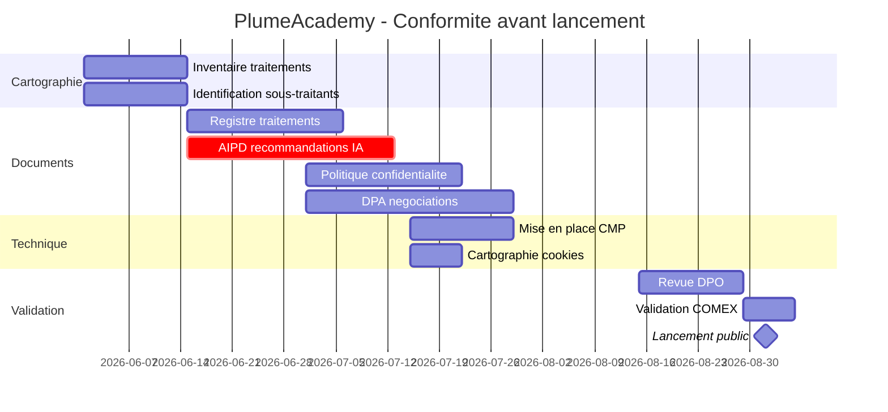

# TP : Constitution complète d'un dossier de conformité RGPD

## Introduction

### Contexte du TP

Vous êtes développeur principal chez *PlumeAcademy*, une startup
française qui prépare le lancement d'une plateforme de
**mentorat professionnel en ligne**. La plateforme mettra en
relation des professionnels souhaitant développer leurs
compétences (les *mentorés*) et des experts expérimentés
(les *mentors*). Les utilisateurs pourront :

- créer un profil détaillé (parcours, compétences, objectifs) ;
- échanger par messagerie texte et visio ;
- planifier et gérer des séances ;
- payer les séances (modèle freemium + premium) ;
- recevoir des recommandations de mentors par IA ;
- évaluer leurs sessions ;
- importer leur profil LinkedIn pour gagner du temps.

Le lancement public est prévu dans **trois mois**. La CNIL n'a
pas (encore) été informée, le DPO vient d'être désigné, et la
direction vous demande de **constituer l'intégralité du dossier
de conformité RGPD** avant l'ouverture publique. Vous travaillerez
en binôme avec le DPO.

### Objectifs du TP

À l'issue de ce TP, vous serez capable de :

1. Constituer un registre des activités de traitement complet et
   conforme à l'article 30.
2. Identifier les traitements nécessitant une AIPD et conduire
   l'analyse pour le traitement le plus sensible.
3. Rédiger une politique de confidentialité claire et complète,
   conforme à l'article 13.
4. Négocier et formaliser les DPA avec les principaux
   sous-traitants.
5. Mettre en œuvre un dispositif cookies conforme aux
   recommandations CNIL.
6. Présenter l'ensemble dans un dossier structuré et défendable.

### Durée estimée

Environ **6 heures**, extensible à 8 heures avec une restitution
orale sous forme de soutenance de validation par un DPO simulé.

### Prérequis techniques

- Avoir lu intégralement les parties 1 à 3 du module.
- Maîtriser les notions des modules précédents (responsabilité
  des acteurs, droits des personnes, Privacy by Design,
  sécurité).
- Disposer d'un outil de rédaction (Markdown, Word) et idéalement
  de l'outil PIA de la CNIL pour l'AIPD.

## Étape 1 : Cartographie initiale

### 1.1 Inventaire des traitements

Identifiez **tous les traitements** que *PlumeAcademy* va
réaliser, en distinguant ceux où elle est responsable de
traitement et ceux où elle est sous-traitant. Présentez sous
forme de tableau synthétique.

Au minimum, vous devriez identifier 8 à 12 traitements distincts
en tant que responsable. La plateforme étant à destination des
particuliers (mentorés et mentors), il n'y a pas de relation de
sous-traitance B2B typique au sens strict.

### 1.2 Identification des sous-traitants

Pour faire fonctionner la plateforme, *PlumeAcademy* aura besoin
de plusieurs sous-traitants. Identifiez-les par catégorie
fonctionnelle, et pour chacun, recommandez un prestataire en
indiquant son rôle exact, sa localisation, et les éventuels
transferts hors UE.

Catégories à couvrir : hébergement, base de données, envoi
d'emails, visioconférence, paiement, analytique, CMP, support
client, IA pour les recommandations, monitoring/logs.

### 1.3 Identification des traitements à risque

Sur la base de votre inventaire, identifiez les traitements qui
nécessiteront une AIPD obligatoire ou recommandée. Justifiez
votre analyse en mobilisant les critères de l'article 35 et de
la liste CNIL.

## Étape 2 : Registre des activités de traitement

### 2.1 Production du registre complet

Rédigez le registre complet de *PlumeAcademy*. Chaque fiche
comportera les informations exigées par l'article 30.1. Vous
pouvez utiliser le format Markdown ou tableur.

Pour gagner en réalisme, faites varier les durées de
conservation, les bases légales, et les destinataires selon la
nature de chaque traitement.

### 2.2 Processus de maintenance

Définissez le **processus de maintenance** du registre :

- qui peut le mettre à jour ?
- selon quel workflow (validation, signatures) ?
- à quelle fréquence est-il revu ?
- comment archive-t-on les traitements supprimés ?
- quel outil sera utilisé (tableur, Dastra, Witik, autre) ?

## Étape 3 : AIPD pour le traitement le plus sensible

### 3.1 Sélection du traitement à analyser

Parmi les traitements identifiés à l'étape 1.3, sélectionnez
celui qui présente le **risque le plus élevé** et conduisez son
AIPD complète. Justifiez votre choix.

### 3.2 AIPD selon la méthodologie CNIL

Produisez l'AIPD complète en suivant les quatre étapes :

1. **Description du traitement** : finalités, données, flux,
   acteurs, supports, durées, base légale, mesures déjà
   prévues.
2. **Nécessité et proportionnalité** : examen de chaque principe
   du RGPD.
3. **Étude des risques** : matrice avec vraisemblance et gravité
   pour chaque risque (accès illégitime, modification, perte).
4. **Mesures retenues et validation** : mesures supplémentaires
   pour ramener les risques à un niveau acceptable, conclusion.

Si vous identifiez des risques résiduels élevés malgré toutes
les mesures, expliquez si une consultation préalable de la CNIL
(article 36) est nécessaire.

## Étape 4 : Politique de confidentialité

### 4.1 Politique complète

Rédigez la **politique de confidentialité** complète de
*PlumeAcademy*, à destination des utilisateurs (mentorés et
mentors). Elle doit :

- suivre le plan-type vu en partie 3 ;
- couvrir tous les traitements identifiés ;
- être rédigée dans un langage clair et accessible ;
- inclure une synthèse de 1 minute de lecture ;
- mentionner explicitement le DPO et la CNIL ;
- documenter les transferts hors UE le cas échéant ;
- être versionnée.

### 4.2 Mentions d'information contextuelles

Rédigez les **mentions d'information courtes** à afficher au
moment de chaque collecte :

- inscription comme mentoré ;
- inscription comme mentor ;
- import du profil LinkedIn ;
- activation de la recommandation IA ;
- inscription à la newsletter ;
- formulaire de contact / support.

Ces mentions doivent être brèves (3 à 5 lignes) et renvoyer à la
politique complète.

## Étape 5 : Accords de sous-traitance

### 5.1 Matrice des DPA à conclure

Établissez la **matrice des DPA** à signer avec chaque
sous-traitant identifié à l'étape 1.2. Pour chacun :

- statut actuel (DPA disponible chez le prestataire ? négocier ?
  écrire de zéro ?) ;
- points d'attention spécifiques (transferts, certifications,
  durée) ;
- échéance de signature.

### 5.2 DPA type

Rédigez un **DPA type** complet, utilisable comme base de
négociation avec un sous-traitant. Le DPA doit couvrir
l'ensemble des clauses de l'article 28.3.

## Étape 6 : Dispositif cookies

### 6.1 Cartographie des cookies

Établissez la **cartographie complète** des cookies que
*PlumeAcademy* va déposer (en tant qu'éditeur du site) ou
laisser déposer (par les sous-traitants). Pour chaque cookie :

- finalité (essentiel, mesure d'audience, marketing, autre) ;
- éditeur (premier ou tiers) ;
- durée de vie ;
- consentement requis (oui/non).

### 6.2 Maquette du bandeau

Maquettez (en pseudo-code HTML/CSS ou par capture descriptive)
le **bandeau cookies conforme** à afficher au premier passage.
Il doit respecter les recommandations CNIL.

### 6.3 Choix d'une CMP

Recommandez une **CMP** pour *PlumeAcademy*, en justifiant le
choix par rapport aux concurrentes (Axeptio, Didomi, Cookiebot,
Tarteaucitron...).

## Étape 7 : Synthèse et présentation

Compilez l'ensemble du travail en un **dossier de conformité
RGPD** structuré, prêt à être présenté à la direction et, en cas
de contrôle, à la CNIL. Le dossier comportera :

1. Synthèse exécutive (1 à 2 pages).
2. Registre des activités de traitement.
3. AIPD pour le traitement à risque élevé.
4. Politique de confidentialité.
5. Mentions d'information contextuelles.
6. Matrice des DPA et DPA type.
7. Dispositif cookies.
8. Plan de maintenance pérenne.
9. Calendrier de mise en œuvre avant lancement.

## Correction du TP {collapsible="true"}

Cette correction présente une réponse type. D'autres choix sont
légitimes ; ce qui compte est la **cohérence d'ensemble** et la
**rigueur méthodologique**.

### Étape 1 : Cartographie

**Inventaire des traitements** (PlumeAcademy en tant que
responsable de traitement) :

| N° | Traitement | Finalité | Base légale |
|----|------------|----------|-------------|
| 1 | Comptes utilisateurs | Accès au service | Contrat |
| 2 | Profils détaillés | Mise en relation | Consentement |
| 3 | Messagerie privée | Communication mentor-mentoré | Contrat |
| 4 | Visioconférences | Séances de mentorat | Contrat |
| 5 | Évaluations sessions | Qualité du service | Contrat |
| 6 | Paiements premium | Gestion abonnements | Contrat + obligation légale |
| 7 | Recommandations IA | Suggérer des mentors | Consentement |
| 8 | Import LinkedIn | Pré-remplissage profil | Consentement |
| 9 | Newsletter | Communication produit | Consentement |
| 10 | Support client | Assistance | Contrat |
| 11 | Cookies marketing | Acquisition | Consentement |
| 12 | Cookies mesure audience | Amélioration UX | Consentement (ou exemption Matomo) |
| 13 | Logs sécurité | Détection anomalies | Intérêt légitime |
| 14 | RH internes | Gestion salariés | Contrat |
| 15 | Comptabilité interne | Obligations | Obligation légale |

**Sous-traitants** :

| Catégorie | Prestataire | Localisation | Transferts hors UE |
|-----------|-------------|--------------|---------------------|
| Hébergement | OVHcloud / Scaleway | France | Non |
| BDD managée | OVH PostgreSQL / Scaleway | France | Non |
| Emails | Brevo / Mailjet | France | Non |
| Visioconférence | Whaller / Jitsi auto-hébergé | France | Non |
| Paiement | Stripe Europe | Irlande/USA | Oui (CCT + DPF) |
| Analytique | Plausible / Matomo auto | UE | Non |
| CMP | Axeptio | France | Non |
| Support client | Crisp | France | Non |
| IA recommandations | Mistral AI | France | Non |
| Monitoring/logs | Datadog → alternative UE | À évaluer | À évaluer |

**Traitements nécessitant une AIPD** :

- *Recommandations IA* (n°7) : profilage à grande échelle, prise
  de décision automatisée → **AIPD obligatoire**.
- *Messagerie privée + visio* (n°3 et 4) : ensemble cumulé avec
  données sensibles potentielles (orientation professionnelle,
  situations personnelles) → **AIPD recommandée**.
- *Import LinkedIn* (n°8) : collecte massive de données via API
  tierce → **AIPD recommandée** pour documenter les flux.

### Étape 2 : Registre

**Extrait de fiche - Traitement n°7 (Recommandations IA)**

- *Finalité* : proposer aux mentorés les mentors les plus
  pertinents en fonction de leur profil et de leurs objectifs.
- *Base légale* : consentement (article 6.1.a).
- *Personnes concernées* : mentorés ayant activé la
  fonctionnalité.
- *Données* : compétences déclarées, objectifs, parcours
  professionnel, historique des interactions sur la plateforme,
  pseudonymisées avant envoi au moteur IA.
- *Destinataires* : Mistral AI (sous-traitant).
- *Transferts hors UE* : aucun (Mistral AI hébergé en France).
- *Durée de conservation* : 12 mois glissants pour les données
  servant au modèle, suppression à la fermeture du compte.
- *Mesures de sécurité* : pseudonymisation avant envoi, DPA
  avec Mistral AI interdisant la réutilisation, opt-in
  explicite, possibilité de désactiver et obtenir des
  recommandations éditoriales humaines à la place.

**Processus de maintenance** :

- outil retenu : Dastra (français, intuitif, pricing PME) ;
- correspondants désignés dans chaque équipe (tech, produit,
  marketing, RH, finance) ;
- validation par le DPO de chaque nouvelle fiche ou modification ;
- revue trimestrielle légère, revue annuelle complète ;
- archivage des fiches obsolètes (jamais suppression) avec
  date de fin.

### Étape 3 : AIPD

*Traitement sélectionné* : Recommandations IA (n°7).

**Étape 1 - Description** :

Le moteur IA analyse les profils et les objectifs déclarés des
mentorés, ainsi que leurs interactions passées sur la plateforme,
pour suggérer les 5 à 10 mentors les plus pertinents. Le mentoré
peut consulter et solliciter les mentors recommandés. Le
fonctionnement est documenté dans une note pédagogique
accessible à l'utilisateur.

**Étape 2 - Nécessité et proportionnalité** :

- finalité légitime (apparier offre et demande de mentorat),
  proportionnée ;
- base légale appropriée (consentement explicite, opt-in) ;
- minimisation : seules les données pertinentes pour le matching
  sont envoyées au moteur ;
- droit d'opposition garanti par alternative humaine ;
- transparence sur la logique : note pédagogique en langage
  simple.

**Étape 3 - Risques** :

| Risque | Vrais. | Grav. | Mesures actuelles |
|--------|--------|-------|--------------------|
| Fuite de profils détaillés | Faible | Élevée | Pseudonymisation, chiffrement |
| Biais algorithmique (genre, origine) | Modérée | Élevée | Audit régulier, équipe diverse |
| Recommandations enfermantes | Modérée | Modérée | Diversité forcée, alternative humaine |
| Réutilisation par sous-traitant | Faible | Élevée | DPA interdisant explicitement |

**Étape 4 - Mesures et validation** :

Mesures retenues :

- pseudonymisation systématique avant envoi au moteur (pas de
  nom, pas d'email) ;
- audit régulier des recommandations pour détecter les biais
  (déséquilibres de genre, d'âge, d'origine professionnelle) ;
- diversité forcée : 30 % des recommandations en dehors du
  cluster du profil ;
- alternative éditoriale humaine permanente ;
- DPA renforcé avec Mistral AI ;
- transparence : note pédagogique + bouton « pourquoi cette
  recommandation » à chaque suggestion.

**Conclusion** : risques résiduels acceptables. Pas de
consultation préalable CNIL requise. Réévaluation à 6 mois après
le lancement, puis annuelle.

### Étape 4 : Politique de confidentialité {id="tape-4-politique-de-confidentialit_1"}

Le candidat doit produire un document complet d'environ 8 à 12
pages, organisé selon le plan-type, couvrant tous les traitements
identifiés.

**Points clés à vérifier dans la production** :

- synthèse de 1 minute en tête ;
- tableau des traitements clair et lisible ;
- mention explicite du DPO (avec coordonnées) et de la CNIL
  (avec lien) ;
- transferts hors UE documentés (Stripe) ;
- durées de conservation par finalité ;
- mécanisme d'exercice des droits clair ;
- date de version visible ;
- lien vers historique des versions.

**Mentions contextuelles** : chacune doit faire 3 à 5 lignes,
mentionner la finalité spécifique, renvoyer à la politique
complète. Six mentions correspondant aux six points de
collecte cités.

### Étape 5 : DPA

*Matrice des DPA* :

| Sous-traitant | Statut | Action | Échéance |
|----------------|--------|--------|----------|
| OVHcloud | DPA standard OVH | Signer | Sem. 1 |
| Brevo | DPA standard Brevo | Signer | Sem. 1 |
| Whaller / Jitsi | DPA Whaller / DPA non requis | Signer / NA | Sem. 1 |
| Stripe Europe | DPA Stripe standard | Vérifier CCT + DPF | Sem. 2 |
| Plausible | DPA standard | Signer | Sem. 1 |
| Axeptio | DPA standard | Signer | Sem. 1 |
| Crisp | DPA standard | Signer | Sem. 1 |
| Mistral AI | DPA spécifique IA | Négocier | Sem. 2-3 |

**DPA type** : le candidat doit produire un document complet
suivant la structure de la partie 3 (10 articles, plus annexes).

### Étape 6 : Cookies

**Cartographie** :

| Cookie | Finalité | Éditeur | Durée | Consentement |
|--------|----------|---------|-------|--------------|
| `session_id` | Authentification | PlumeAcademy | Session | Non (exempté) |
| `consent_v2` | Mémoire des choix cookies | PlumeAcademy | 13 mois | Non (essentiel) |
| `csrf_token` | Sécurité | PlumeAcademy | Session | Non (essentiel) |
| `plausible_id` | Mesure d'audience | Plausible | 24h | Selon config |
| `axeptio_authorized_vendors` | CMP | Axeptio | 13 mois | Non (CMP) |
| `__stripe_mid` | Anti-fraude Stripe | Stripe | 1 an | Non (légitime) |

**Bandeau** : suivre le modèle de la partie 3, avec trois
boutons équivalents visuellement, et un lien vers la politique.

**CMP recommandée** : **Axeptio** (français, conforme aux
recommandations CNIL, simple à intégrer, journalisation des
consentements en preuve, prix raisonnable pour une PME). Didomi
serait également un excellent choix pour une structure plus
grande.

### Étape 7 : Synthèse

Le dossier complet doit être présentable au COMEX et défendable
face à un contrôle CNIL. Il démontre une démarche structurée,
responsable, et soutenable dans le temps.

**Calendrier de mise en œuvre** :

**Indicateurs de succès** :

- 100 % des traitements documentés dans le registre avant
  lancement ;
- AIPD validée par le DPO ;
- 100 % des DPA signés avec les sous-traitants ;
- bandeau cookies conforme et testé ;
- politique de confidentialité accessible et claire ;
- procédure de gestion des demandes des personnes opérationnelle.

Le TP est considéré comme réussi si l'apprenant démontre une
**maîtrise complète de la documentation RGPD** : capacité à
inventorier, structurer, rédiger, négocier, et présenter
l'ensemble du dossier de conformité. C'est cette maîtrise qui le
distinguera dans la suite de sa carrière : peu de développeurs
sont capables d'aller au-delà du code et d'embrasser la
dimension documentaire et organisationnelle de la conformité.
Ceux qui savent le faire prennent naturellement des
responsabilités de lead, d'architecte, ou de consultant.
